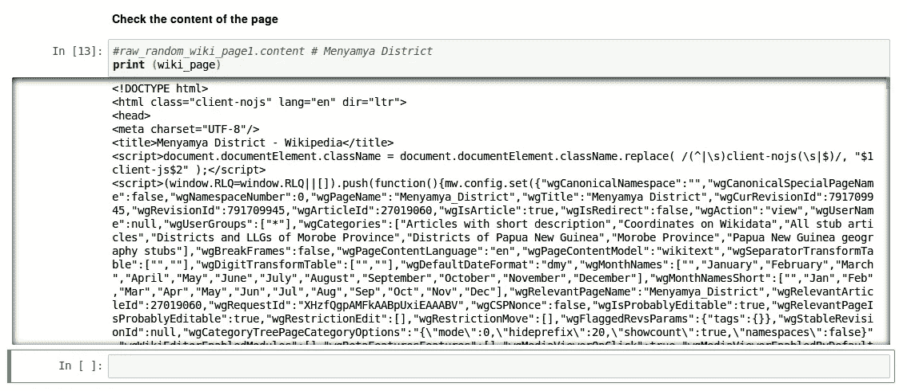
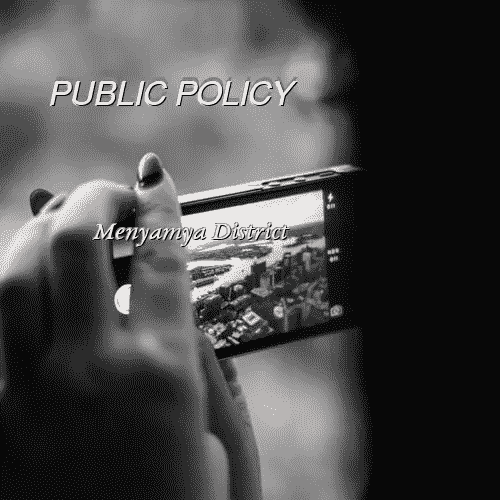

# 从假专辑封面游戏中学习 Python

> 原文：<https://towardsdatascience.com/learn-python-from-the-fake-album-covers-game-b8459e83c268?source=collection_archive---------19----------------------->

## 网页抓取、字符串处理、图像处理


Web Scraping with Python ([Source](https://pixabay.com/photos/books-door-entrance-culture-1655783/))

在这篇文章中，我们将学习如何使用 python 进行基本的网页抓取、图像处理和字符串处理，同时玩一个名为“[假专辑封面](https://fakealbumcovers.com/)”的游戏。这个游戏的想法是按照下面的步骤为你自己乐队的 CD 制作一个假封面

1.  从 [Lorem Picsum](https://picsum.photos/) 中获得任意一张图片，作为封面专辑。
2.  封面上的乐队名称将使用任何随机维基页面标题中的标题生成。
3.  专辑名将是[语录页](http://www.quotationspage.com/)中任意一页中最后一句语录的最后四个单词。随机链接不再起作用了，我查看了 reddit，发现设计师们现在使用 wikiquote 页面。所以在这篇文章中，我使用了随机生成的维基百科页面的标题。

为了开始游戏，我们需要从上面提到的网站获取图像，这里我们需要非常简单的 python 网页抓取技术。*简而言之，网页抓取的思想是，代替人类浏览和复制粘贴文档中的相关信息，计算机程序做同样的事情，更快更正确，以节省时间和精力。*尽管我们在这里没有使用 web 抓取来进行数据分析，但是记住这些网站大部分是使用 HTML 编写的，并且这些是结构化文档，不像我们熟悉的 CSV 或 JSON 格式，可以直接使用数据框库来处理，就像使用`pandas`一样。

首先，第一个问题是什么库可以帮助我们使用 Python 进行 web 抓取？最常用的三个库是 [*BeautifulSoup、*](https://www.crummy.com/software/BeautifulSoup/bs4/doc/)*[Requests、](http://docs.python-requests.org/en/master/)和 [Scrapy](http://doc.scrapy.org/en/latest/intro/install.html) 。在这里，我们将学习使用*请求和*请求，这将允许我们发送 HTTP 请求来获取 HTML 文件。*

*首先，我们可以从 Lorem Picsum 网站获取一张随机图片开始*

```
*import requests response_obj = requests.get('[https://picsum.photos/g/500/?random'](https://picsum.photos/g/500/?random'))* 
```

*这里我们通过使用`requests.get`创建了一个响应对象‘raw _ pic’。现在要从这个对象中获取信息，我们需要访问响应体，为此我们将使用`content`。下面是一个将响应对象保存为. png 图像的示例—*

```
*name = 'first_pic.png'with open(name1,'wb') as raw_file: 
*# 'wb': write binary, binary is necessary because it is a png file*
       raw_file.write(response_obj.content)*
```

*我得到了一个随机图像如下*

**

*Scraping images with Python from [Lorem Picsum](https://picsum.photos/).*

*现在作为游戏规则，我们需要把专辑名和乐队名放在这张图片上，为此我们将使用 [python 图像库](https://pillow.readthedocs.io/en/3.0.x/index.html) *(PIL)。**

```
*from PIL import Image*
```

*首先使用`Image.open`打开并识别图像文件*

```
*img = Image.open("first_pic.png")*
```

*由于我们想在这张图片上绘制(书写)文字来完成封面，我们将使用 PIL 图书馆的`ImageDraw`模块。*

```
*from PIL import ImageDraw
draw = ImageDraw.Draw(img)*
```

*这个对象`'draw’`以后可以用来插入文本。*

*下一个目标是指定我们将用来写乐队名称和专辑的字体的字体目录路径，我要求你发挥字体风格和创造性。为了加载一个字体文件并创建一个字体对象，我们将再次使用 PIL 库的`ImageFont`模块。*

```
*from PIL import ImageFontband_name_font = ImageFont.truetype("path_to_font/font1.ttf", 25)album_name_font = ImageFont.truetype("path_to_font/font2.ttf", 20)*
```

*在我们放置文本并使用这些字体书写之前，我们需要再次使用 web 抓取来从网站中提取文本，这些文本是使用 HTML 编写的。*

*像之前的图片一样，我们为随机维基页面创建了一个响应对象*

```
*wikipedia_link='[https://en.wikipedia.org/wiki/Special:Random'](https://en.wikipedia.org/wiki/Special:Random')r_wiki = requests.get(wikipedia_link)*
```

*要阅读响应的内容，可以使用下面的`text`*

```
*wiki_page  = r_wiki.text*
```

**请求*库将自动解码来自服务器的内容。当我们发出请求时， *Requests* 库将根据 HTTP 头对响应的编码进行有根据的猜测，我们可以在这里使用`r_wiki.headers`看到这一点。当我们运行`r_wiki.text`时，使用由*请求*猜测的测试编码。让我们检查编码类型*

```
*print "encoding type", r_wiki.encoding>>> encoding type UTF-8print type(wiki_page)>>> <type 'unicode'>*
```

*让我们看看解码后的内容是什么样的*

```
*print (wiki_page)*
```

*我得到如下所示的输出*

**

*我们的想法是用维基页面的标题作为乐队的标题。在上面的输出中可以看到，文章的标题被 XML 节点包围，如下所示*<title>Menyamya District—Wikipedia</title>。这是任何维基页面 *<标题>标题——维基百科</标题>，*的通常格式，如果我们考虑文章的标题。我们提取标题的第一项工作，是找到 XML 节点 *< title >* 和 *< /title >。*我们将使用 [string.find()](https://docs.python.org/2/library/string.html#string.find) 函数来查找这些节点，但在此之前，由于我使用了 python 2.7，我需要将 unicode 转换为字符串，如下所示**

```
*wiki_page = wiki_page.encode("ascii", errors='ignore')print type(wiki_page)>>> <type 'str'>*
```

*在这之后，我们准备好使用 [string.find()](https://docs.python.org/2/library/string.html#string.find) ，并最终选择 XML 的特定部分，如下所示*

```
*xml_e = wiki_page.find('</title>')
xml_b = wiki_page.find('<title>')
title_b_len = len('</title>')
total_len = xml_e + title_b_lentitle_wiki = wiki_page[xml_b:total_len]
print "title including wiki: ", title_wiki>>> title including wiki:  <title>Menyamya District - Wikipedia</title>*
```

*剩下的任务是去掉不必要的部分，我们将只剩下标题。你可以把这当成用 python 进行字符串操作的一个小任务，因为有很多方法可以做到这一点，稍后查看 github 页面比较解决方案。对于 wikiquote 页面，我们遵循相同的过程，提取标题，这将是我们的相册名称。*

*最后，一旦我们从网络搜集中获得了乐队名和专辑名，我们将把它们作为文本写入(绘制)到图像文件中。为此，我们将在之前定义的 draw 对象上使用`text`。因为我只处理灰度图像，所以我可以用文字颜色来玩，但是如果你想用彩色图像作为假封面，那么最好的选择是用某种方式来写文字，这样它在任何颜色的背景下都是可见的。这样的格式是由亚历克·班尼特提供的，你可以遵循它并随机应变。一旦完成，我们准备检查我们的假 CD 封面，并记住图像，乐队名称和专辑名称都可能在每次运行时发生变化。所以玩得开心点！下面是我在一次这样的跑步中得到的*

**

*Fake CD Cover !*

*在玩这个有趣的游戏时，我们学到了什么*

1.  *网页抓取使用*请求*模块。*
2.  *字符串处理；基本操作，如替换，剥离等(为您分配)。*
3.  *使用 PIL 图书馆的图像处理。*

*相当多，不是吗？完整的笔记本可以在我的 github 页面上找到。这整个游戏是 Coursera 应用数据科学课程 [Python 期末作业的一部分，和往常一样，这些课程包含一些精彩的实验环节，可以用 Python 进行游戏和学习。然而，为了生成专辑和乐队名，我们两次使用了维基百科页面，而不是维基百科页面。](https://www.coursera.org/learn/python-for-applied-data-science)*

*敬请关注更多内容！*

**关于我:我参与了*[*CALET*](https://calet.jp/)*电子光谱的科学分析，寻找暗物质签名。在*[*Linkedin*](https://www.linkedin.com/in/saptashwa/)*找我。**