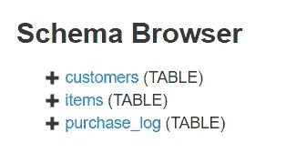
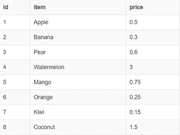

# 以 Excel 为桥梁学习 SQL

> 原文：<https://towardsdatascience.com/learn-sql-by-using-excel-as-a-bridge-30cea4d314e0?source=collection_archive---------14----------------------->

## 比你想象的要容易得多的转变


Photo by [Mika Baumeister](https://unsplash.com/@mbaumi?utm_source=medium&utm_medium=referral) on [Unsplash](https://unsplash.com?utm_source=medium&utm_medium=referral)

作为一名前会计师转行的分析师，微软 Excel 一直是，并且直到今天仍然是我最喜欢的工具之一。我曾经傻到以为在未来的某一天，Excel 会被认为是无关紧要的。事实是，相反的事情正在发生。总的来说，Excel 和电子表格比以往任何时候都更加重要。

我经常遇到需要一些基本分析和/或报告的人。他们完全在 Excel 中处理这个问题。

问题是，当数据存在于数据库中时，大多数情况下，必须使用数据进行分析或报告的人与知道如何提取数据的人是不同的。这给每个公司都带来了一个问题，因为公司的分析师数量有限，必须不断地切换环境。

这就产生了对非数据分析师职位的员工的需求，他们需要了解基本的查询和数据库的基础知识。

主要的问题是很多人不知道从哪里以及如何开始。

幸运的是，作为一个经历了从电子表格到数据库的旅程的人，我可以并且想要成为你的向导。现实地说，电子表格和数据库是一样的东西，但是我们只需要学习一种新的简单的语言来浏览它们。

# Excel 和数据库基础

## 擅长

我有一个 Excel 工作簿，我将用它作为我解释的基础。在本工作簿中，我有多个工作表，其外观和功能就像您的 web 浏览器中的选项卡。这些表中的每一个都存储不同的数据。

我将使用的工作簿包含我的水果店的运营数据。如您所见，有客户、项目和 purchase_log 的表。


A preview of my fruit store’s data tables

这些选项卡都包含尚未格式化的原始数据。数据被组织成每个字段的列和每个记录的行。


customers table


fruits available for sale


a list of transactions that happened in my store

如您所见，该表由 id 组成，后面是其他详细信息。传统上，在 Excel 中，如果我想将更多的商品和客户信息附加到购买日志中，我会使用索引匹配或 vlookup 来实现，如下所示。


using index match to combine data from different tables


combining first and last name fields into a full name in the purchase log table

这就是我们要做的——在我们的电子表格数据库中组合来自不同表格的信息非常简单。我们现在的分析可能非常危险。

## 让我们在 SQL 中做同样的事情

在 Excel 中，我们有工作簿，其中有工作表。在数据库中，我们可以称工作簿为模式，称工作表为表格。他们以同样的方式工作。这些表还包含格式完全相同的信息——表格形式，字段作为列，行作为记录。

现在的区别是，我们只需编写快速查询，而不是点击一下按钮就能获得数据。

我们现在有一个包含 3 个表的模式:



using sqlfiddle.com

如果我们想查看每个表中的所有数据，我们只需编写以下代码:

```
select * from customers
```


或者，如果我们想从项目表中选择:

```
select * from items
```



或购买日志:

```
select * from purchase_log
```


如果我们想创建购买日志，记录客户的全名以及他们购买的水果的名称，比如

```
select purchase_log.id, time, concat(firstname,' ' ,lastname) as 'customer full name', item as fruit
from purchase_log
inner join customers on purchase_log.customer_id = customers.id
inner join items on purchase_log.item_id = items.id
order by id asc
```


# SQL 语法的简单分解

SQL 非常深入，我们有很多方法可以调整查询，但是我上面给你展示的已经排除了大部分。

阅读我之前写的查询非常容易。 **Select** 表示选择， ***** 表示所有字段，【T4 from】表示我要选择所有的表。

例如，我想从 customers 表中选择所有字段/列，所以我要写:

```
**select** * **from** **customers**
```

在上面的最后一个表中，我将其他表中的数据拖到购买日志中，并重命名了这些字段。该查询比使用“全选”来查看表稍微复杂一些。不用担心，我会用一种容易理解的方式来分解它。

我们的疑问:

```
**select** purchase_log.id, time, **concat**(firstname,' ' ,lastname) **as** 'customer full name', item **as** fruit
**from** purchase_log
**inner join** customers **on** purchase_log.customer_id = customers.id
**inner join** items **on** purchase_log.item_id = items.id
**order by** id **asc**
```

*   我们有一个 **select** 子句，和以前一样，但是这次增加了一些晦涩难懂的内容。
*   有一个 **from** 子句，保持不变。
*   两个**内连接**子句和一个 **order by。**嗯？

## [表格]。[字段]

在我们之前的查询中，因为我们使用了*，所以我们只是选择了所有的字段。如果我们的查询被隔离到一个表中，我们可以通过写出并使用逗号分隔来选择我们想要的字段。

```
select item, price from items
```

这将只给我们一个包含商品及其价格的表，没有它们的 id。

但是，该查询从不同的表中提取数据，有时该表中的字段被命名为相同的名称，例如“id”。因此我们必须指定*哪个* id 是我们想要的。

```
purchase_log.id, customer.id, purchase_log.customer_id
```

以上内容如下—

**id** 字段来自 **purchase_log** 表，

**id** 字段来自**客户**表，

**客户 id** 字段来自**购买日志**表

## 内部连接是索引匹配中的匹配

这允许我们使用具有匹配值的列将两个不同的表粘合在一起。

```
**inner join** customers **on** purchase_log.customer_id = customers.id
```

用简单的英语解释:我想在我的当前表( **purchase_log** )中使用来自 **customers** 表的数据，我可以这样做，因为这个表中的 **customer_id** 存在于 customers 表中的 **id** 中。

您希望从连接表中使用的实际数据将被添加到 select 语句中。

有了它，您就可以从数据库中取出任何想要的东西，并保存到一个表中。

## 在表格内进行调整

我的查询中包含的常用语句和函数，用于修改标记数据的方式:

*   **order by** 是它自己的语句，相当于 excel 中的排序。
    **order by** 【字段】**=排序 Z 到 A
    **order by** 【字段】 **asc** =排序 A 到 Z**
*   ****as** 是一种将列命名为其他名称的简单方法。
    选择【字段】**作为**【您想要给出的名称】**
*   ****concat** 与 excel 中的 concat()功能相同。如果想在 select 语句中组合多个列，只需编写:
    **select concat**([字段]，[i]，[want]，[组合]) **作为**[名称]**

**我们找到了。现在，您可以从数据库中随意提取数据，并对其标注方式进行修改！**

**虽然我是 Excel 的忠实粉丝，因为它帮助我度过了早期的职业生涯，但从那以后，我的工具库中增加了很多东西。SQL 的“兔子洞”要深入得多，我希望这篇介绍能激发您去探索它。**