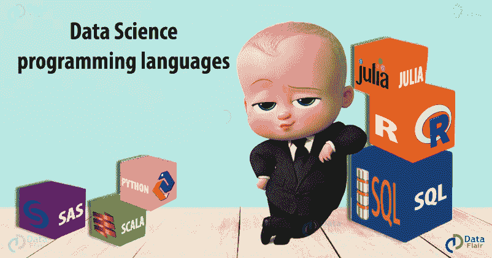
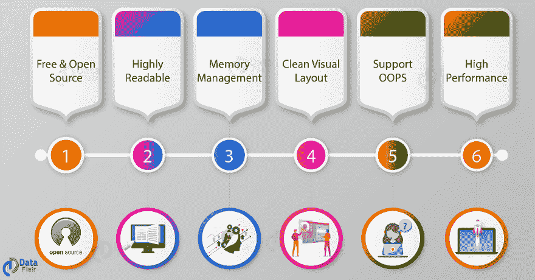
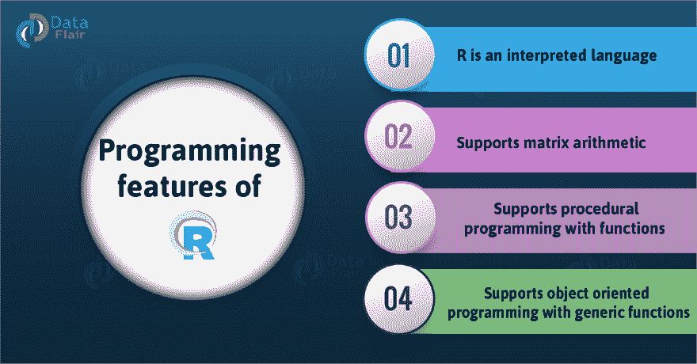
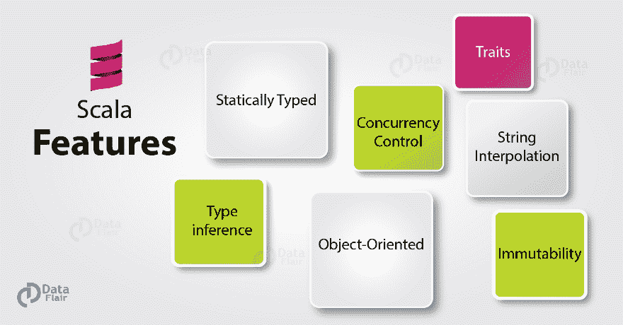
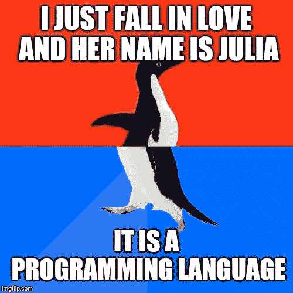
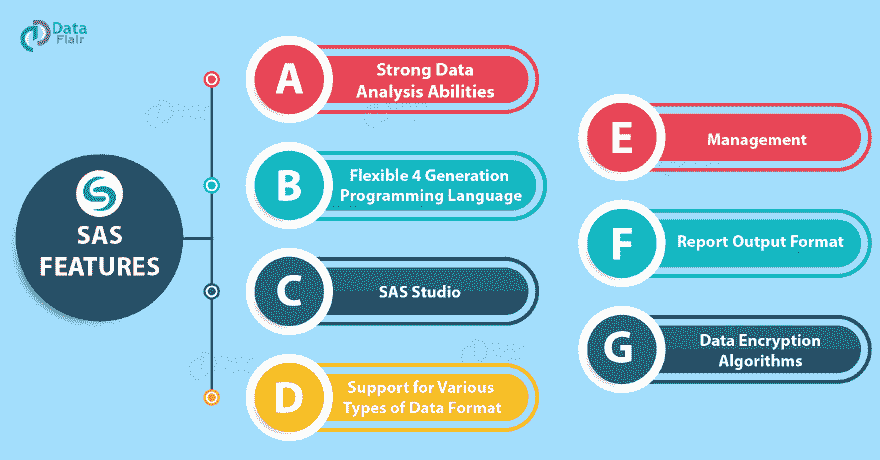

# 学习数据科学的艺术；十年编程语言。

> 原文：<https://towardsdatascience.com/learn-the-art-of-data-science-programming-languages-of-the-decade-a2850830ab76?source=collection_archive---------23----------------------->

从童年开始，我们的大脑就被周围的环境所束缚。我们的社会、环境、文化、信仰和背景对我们的成长起着重要作用。但是，这并没有什么坏处，因为至少它有助于我们区分善与恶、对与错、正义与非正义、邪恶与美德。我同意不同意，但这可能是我爱机器胜过爱人类的原因。此外，人类不可能像机器学习一样具有人工智能和不朽。

谈到机器学习，这让我想到了数据科学，因为机器学习是**数据科学**的一部分，而数据科学是一切的主宰。

简而言之，数据科学是一门存储、清理和组织数据的艺术，将数据转化为有价值的资源，帮助制定业务战略。与其说它是一门科学，不如说它是一门艺术，因为它是关于从原始数据中发现模式和洞察力的。

它需要拥有所需技能的人来精通这一领域。除了数学技能，还需要编程技能。但是在获得专业知识之前，一个有抱负的数据科学家必须能够对工作所需的编程语言类型做出正确的决定。在本文中，我们将介绍数据科学编程语言，这是当前的需要，以及如何让 [***成为一名精通数据的科学家***](https://data-flair.training/blogs/skills-needed-to-become-a-data-scientist/) ***。***

**那么，让我们来学习这十年的语言吧！**

## 1.计算机编程语言

它易于使用，是一种基于解释器的高级编程语言。 [***Python 是一种多功能的语言***](https://data-flair.training/blogs/python-tutorial/)*它拥有大量的用于多种角色的库。更容易的学习曲线和有用的库使它成为数据科学最受欢迎的选择。另外，代码可读性的特性使得 Python 成为数据科学最受欢迎的选择。这是一个很大的好处，因为数据科学家处理复杂的问题，因此，拥有一种更容易理解的语言是理想的。*

*它还使用户在遵循所需算法标准的同时更容易实现解决方案。*

**

*它  支持各种各样的库。此外，数据科学中解决问题的各个阶段都使用自定义库。**解决数据科学问题涉及数据预处理、分析、可视化、预测和数据保存。**为了执行这些步骤，Python 有专门的库，如 Pandas、Numpy、Matplotlib、SciPy、scikit-learn 等。此外，Tensorflow、Keras 和 Pytorch 等高级 Python 库为数据科学家提供了深度学习工具。*

## *2.稀有*

*[***R 是一种实质性的语言***](https://data-flair.training/blogs/r-tutorials-home/) 因为它有助于让工作面向统计的任务。与 Python 相比，有抱负的数据科学家可能不得不面对陡峭的学习曲线。 **R 专门用于统计分析。因此，它在统计学家中很受欢迎。**深入研究数据分析和统计很有帮助。R 的唯一缺点是它不是一种通用编程语言，这意味着它不能用于统计编程以外的任务..*

**

***CRAN 的开源存储库中有超过 10，000 个软件包，R 可以满足所有统计应用的需求。**还具有处理复杂线性代数的能力。R 的另一个重要特性是它的可视化库‘gg plot 2’。还有其他工作室包，如 tidyverse 和 Sparklyr，它们为 R. R 提供了 Apache Spark 接口，r studio 等基于 R 的环境使连接数据库变得更加容易。它有一个名为“RMySQL”的内置包，并提供 R 与 MySQL 的本地连接。所有这些特性使 R 成为核心数据科学家的理想选择。*

## *3.结构化查询语言*

*SQL 被称为“数据科学的基础”，是数据科学家必须掌握的最重要的技能**。** [**SQL 或‘结构化查询语言’**](https://data-flair.training/blogs/sql-tutorial/)**是用于从称为关系数据库的有组织的数据源中检索数据的数据库语言。SQL 在数据科学中起着至关重要的作用，因为它有助于更新、查询和操作数据库。除此之外，知道如何检索数据是数据科学家工作中最重要的部分。它是数据科学家的“随身武器”，这意味着它提供有限的功能，但对特定的角色至关重要。它有多种实现，如 MySQL、SQLite、PostgreSQL 等。***

**

*SQL 知识是必须的，因为从数据库中提取和处理数据是通过 SQL 完成的。由于它的声明性语法，它也是一种可读性很高的语言。例如，从薪金> 20000 的用户中选择姓名非常直观。*

## *4.斯卡拉*

***Scala 是运行在 JVM 上的 Java 编程语言的扩展。**它是一种通用编程语言。它既有面向对象技术的特点，也有函数式编程语言的特点。可以配合大数据平台 Spark 使用。*

**

*Scala 提供了与 Java 的完全互操作性，同时保持了与数据的紧密联系。它也有助于将数据塑造成任何需要的形式，因此它是一种专门为这个角色设计的高效语言。**Scala 最重要的一个特性是它能够促进大规模的并行处理。**然而，它的学习曲线很陡，我们不推荐初学者使用。最后，如果你作为数据科学家的偏好是处理大量数据，那么 Scala + Spark 是你的最佳选择。*

*因此，这使得它成为处理大量数据时的理想编程语言。*

## *5.朱莉娅*

*Julia 是科学计算的最佳编程语言。这是一种最近发展起来的语言。**它因像 Python 一样简单而广受欢迎，并拥有 C 语言闪电般的性能。这些特性使它成为需要复杂数学运算的领域的理想语言。数据科学家，研究需要复杂数学的问题。朱莉娅能够以很高的速度解决如此复杂的问题。***

**

*由于最近的发展，这种语言在其稳定版本中面临一些问题。但终成眷属的是，这种语言现在被公认为是一种语言****。*** Flux，是机器学习架构，是 Julia 用于高级 AI 进程的一部分。许多银行和咨询服务机构都在使用 Julia 进行风险分析。**

## **6.斯堪的纳维亚航空公司**

**和 R 一样，可以使用 SAS 进行统计分析。唯一的区别是，SAS 不像 r 一样是开源的。然而，它是为统计设计的最古老的语言之一。SAS 语言的开发者开发了他们自己的软件套件，用于高级分析、预测建模和商业智能。  **SAS 可靠性高，得到了专业人士和分析师的高度认可。**寻求稳定安全平台的公司使用 SAS 来满足其分析需求。虽然 SAS 可能是一个闭源软件，但它提供了大量用于统计分析和 [***机器学习***](https://data-flair.training/blogs/machine-learning-tutorial/) ***的库和包。*****

****

**SAS 有一个优秀的支持系统，这意味着您的组织可以毫无疑问地依赖这个工具。然而，随着先进的开源软件的出现，它落后了。其原因是，这是一个有点困难，非常昂贵的语言纳入。现代编程语言提供的更高级的工具和特性。**

## **结论:**

**对于数据科学家来说，这些是一些重要的编程语言。虽然每种语言都有其重要性，但这 6 种语言应该保持优先地位，因为掌握好这 6 种语言会让你在各自的领域更上一层楼。**

**最后，你将不得不最终确定你的语言并开始学习。你需要在这方面培养自己的直觉，并获得超越他人的实践经验。那么，你还在等什么？人工智能！**