# 学会关注！细胞神经网络中可训练的视觉注意

> 原文：<https://towardsdatascience.com/learn-to-pay-attention-trainable-visual-attention-in-cnns-87e2869f89f1?source=collection_archive---------5----------------------->

在训练图像模型时，我们希望模型能够关注图像的重要部分。实现这一点的方法之一是通过可训练的注意力机制。在这篇文章中，我们将首先讨论事后注意力和可训练注意力以及软注意力和硬注意力之间的区别。然后，我们将深入研究 2018 年 ICLR 的一篇论文“学会关注”的细节，该论文描述了一种用于图像分类的可训练软注意力的方法。

## **关键论文参考**

这里是我们在这篇文章中要研究的关键论文:[杰特莱 S，洛德纳，李 N，托尔 PH. *学会注意。*2018 年 ICLR 奥运会。](https://arxiv.org/abs/1804.02391)

这里还有一个很好的 Pytorch 实现:[SaoYan/LearnToPayAttention](https://github.com/SaoYan/LearnToPayAttention)

注意:注意力也广泛用于自然语言处理。这篇文章的重点是计算机视觉任务中的注意力。

# 什么是注意力？

## **可训练与事后注意机制**

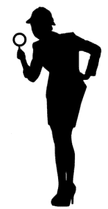

让我们先从[这个词的英文定义](https://www.google.com/search?ei=2dNNXfX0DKu3ggfPqqDgAg&q=definitoin+of+attention&oq=definitoin+of+attention&gs_l=psy-ab.3..35i304i39l2j0i13l8.1862.2606..2812...0.0..0.100.348.4j1......0....1..gws-wiz.......0i71j0i22i30j0i13i30.2xI6Auq8_X0&ved=0ahUKEwi1xbTuzPbjAhWrm-AKHU8VCCwQ4dUDCAo&uact=5):

> 注意*:对某人或某事的注意；认为某人或某事有趣或重要*

同样，在机器学习中，“注意力”指的是:

> *定义(1):* 可训练的注意力*:帮助“训练中的模型”更有效地注意重要事物的一组技术*

和

> *定义(2):* 事后注意力*:一组帮助人类可视化已经训练好的模型认为重要的东西的技术*

当人们想到注意力时，他们通常会想到定义(1)，即可训练的注意力。一种可训练的注意力机制在网络被训练的同时被训练，并且应该帮助网络聚焦于图像的关键元素。

令人困惑的是，事后[热图可视化技术](https://glassboxmedicine.com/2019/06/11/cnn-heat-maps-class-activation-mapping-cam/)有时也被称为“注意力”,这就是我包含定义(2)的原因。这些事后注意机制根据已经训练好的网络创建热图，包括:

*   [通过遮挡的热图](https://arxiv.org/abs/1311.2901)(泽勒，2013 年)
*   [显著图](http://glassboxmedicine.com/2019/06/21/cnn-heat-maps-saliency-backpropagation/)(西蒙扬 2013)
*   【凸轮】(周 2016)
*   [Grad-CAM](https://arxiv.org/abs/1610.02391) (塞尔瓦拉茹 2017)
*   修复了 Grad-CAM 的一个问题

我强调，这些事后技术不是为了改变模型学习的方式，或者改变模型学习的内容。它们被应用于已经训练好的具有固定权重的模型，并且仅用于提供对模型决策的洞察。

最后，让我们看看 Jetley 等人对“注意力地图”的定义:

> 注意图*:标量矩阵，表示在不同 2D 空间位置的层激活相对于目标任务*的相对重要性

即，注意力地图是指示什么 2D 位置对于任务是重要的数字网格。重要位置对应更大的数字，通常在热图中用红色表示。在以下示例中，显示了“边境牧羊犬”的注意力地图，强调了边境牧羊犬在原始蒙太奇中的位置:

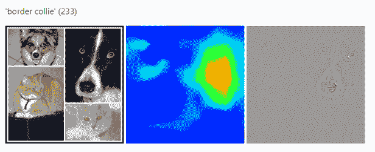

**Image Source:** [**ramprs/grad-cam**](https://github.com/ramprs/grad-cam)

**软关注与硬关注**

你可能听说过“软注意”和“硬注意”这两个术语。它们之间的区别如下:

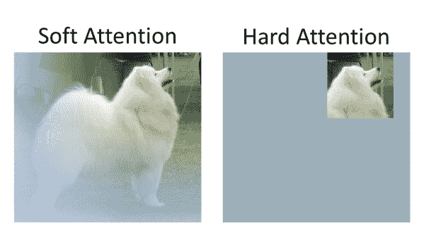

Modified from [Image Source](https://en.wikipedia.org/wiki/Samoyed_dog#/media/File:Samoyed-sweetjedysamoyeds.jpg)

*   *柔和关注*使用“柔和阴影”来关注区域。可以使用[传统的反向传播/梯度下降](https://glassboxmedicine.com/2019/01/17/introduction-to-neural-networks/)来学习软注意力(用于学习神经网络模型的权重的相同方法)。)软注意力地图通常包含 0 到 1 之间的小数。
*   *硬关注*使用图像裁剪来关注区域。它不能使用梯度下降来训练，因为没有“在这里裁剪图像”过程的导数像[强化](/an-intuitive-explanation-of-policy-gradient-part-1-reinforce-aa4392cbfd3c)这样的技术可以用来训练严格的注意力机制。完全符合 0 或 1 的硬注意图，没有介于两者之间的东西；1 对应于保留的像素，0 对应于裁剪掉的像素。

关于软注意力和硬注意力的更深入的讨论，请看[这篇文章](http://akosiorek.github.io/ml/2017/10/14/visual-attention.html)(小节“什么是注意力？”、“硬注意”和“软注意”)以及[这篇文章](https://lilianweng.github.io/lil-log/2018/06/24/attention-attention.html)(子部分“软与硬注意”)。

# 学会集中注意力

论文[“学会集中注意力”](https://arxiv.org/pdf/1804.02391.pdf)在 CNN 模型中展示了一种软可训练视觉注意力的方法。他们考虑的主要任务是[多类分类](https://glassboxmedicine.com/2019/05/26/classification-sigmoid-vs-softmax/)，其中的目标是将输入图像分配给单个输出类，例如将一张熊的照片分配给“bear”类作者证明了软可训练注意力在 [CIFAR-100](https://www.cs.toronto.edu/~kriz/cifar.html) 上提高了 7%的多类分类性能，他们展示了示例热图，强调了注意力如何帮助模型专注于与正确的类标签最相关的图像部分。

## **型号概述**

这是他们的模型图，根据论文中的图 2 修改而来:

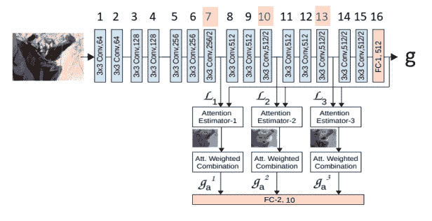

该模型基于 [VGG 卷积神经网络](https://neurohive.io/en/popular-networks/vgg16/)。VGG 网络有不同的配置，如[图 2 所示](https://neurohive.io/en/popular-networks/vgg16/)。(如果你好奇的话,“学会集中注意力”这篇论文似乎使用了介于配置 D 和 d E 之间的 VGG 配置；具体来说，有三个类似配置 D 的 256 通道层，但有八个类似配置 e 的 512 通道层。)

该图的要点是作者对基本的 VGG 设置做了两个关键的改变:

1.  他们在第 7 层、第 10 层和第 13 层(我用黄色突出显示的层数)后插入了注意力评估器。)第 7 层之后的注意力估计器获取第 7 层的输出，并计算 0 和 1 之间的数字的“注意力屏蔽”，然后将其与第 7 层的原始输出相乘，以产生“g_a”(如上图所示。)对于层 10 和 13 之后的注意力估计器发生相同的过程，以分别产生 g_a 和 g_a。
2.  下一个大的变化是，作者去掉了通常位于 VGG 末尾的全连接层来产生预测(通常在编号为“16”的 FC 层之后还有另一个 FC 层，但他们已经去掉了它。)相反，分类现在通过一个新的全连接层进行，该层从三个注意力估计器接收输入。

## **符号**

在我们深入研究他们的注意力机制是如何工作的之前，这里有一个在这篇文章中使用的符号的总结，我们将在这篇文章的剩余部分使用它:

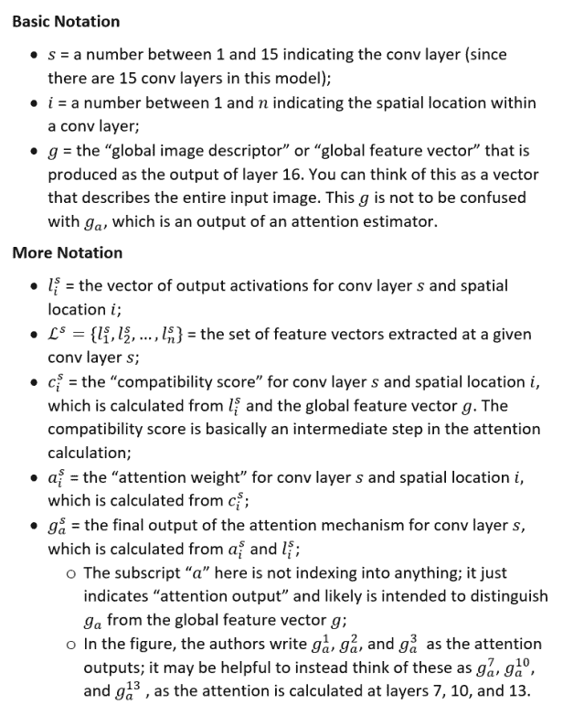

# 注意力是如何工作的

## **第一步:计算兼容性得分。**

使用局部特征 *l* 和全局特征向量*g*来计算“兼容性得分”

作者解释说，当由局部特征描述的图像块“包含主导图像类别的部分”时，兼容性得分旨在具有高值

例如，如果图像中有一只猫，我们假设整只猫是由全局特征向量 *g* 描述的，此外，我们期望一个特别“像猫”的补丁(例如，猫脸上的一个补丁)将产生局部特征 *l* ，当与*g*组合时，这些局部特征产生高的兼容性分数

作者提出了从局部特征 *l* 和全局特征向量 *g* 计算兼容性得分 *c* 的两种不同方法:

*方法 1* :“参数化兼容性”或“pc”:

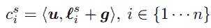

*方法 2* :“点积”或“dp”:

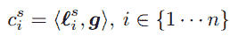

(剧透警告:“参数化兼容性”在他们的结果中表现更好。)

在“参数化兼容性”中，我们首先将局部特征添加到全局特征中， *l+g* ，然后我们用学习向量 *u* 进行点积。直觉上， *l* 和 *g* 的连接可能比加法更有意义，但作者指出，“给定局部和全局图像描述符之间现有的自由参数[……]我们可以将连接[……]简化为加法运算”，以便“限制关注单元的参数。”(其中一位审稿人还问为什么做加法而不做串联；参见[打开查看](https://openreview.net/forum?id=HyzbhfWRW)。)

在“点积”方法中，我们简单地取局部特征 *l* 和全局特征向量*g*的点积。注意，对于我们应用关注的每个 conv 层(层 7、10 和 13)，局部特征 *l* 对于该层将是唯一的，但是全局特征向量 *g* 是相同的。

## **如果 *l* 和 *g* 大小不一样怎么办？**

事实证明，conv 第 7 层的 *l* 有 256 个通道，但是 *g* 有 512 个通道。为了将两个向量相加(pc 方法)或进行点积(dp 方法)，向量必须大小相同。

作者说如果 *l* 和 *g* 大小不一样，那么他们先把 *g* 投影到 *l* 的低维空间。他们不将 l 投影到 g 的高维空间的原因是为了限制参数的数量。(他们所说的“项目”是指应用神经网络层，使 *l* 与 *g* 大小相同。)

请注意，将 *l* 投影到 *g* 仍然是一个可接受的解决方案；你只是让 *l* 变大，而不是让 *g* 变小。[“学会集中注意力”的 Pytorch 实现](https://github.com/SaoYan/LearnToPayAttention/blob/master/model1.py)使用“c1，G1 = self . Attn 1(self.projector(L1)，g)”行投射 *l* 到 *g* ，其中 self . projector 是一个单卷积层，它采用 *l* 作为 256 个通道的输入，并创建 512 个通道的输出，以匹配 *g* 的 512 个通道。

## **步骤 2:根据相容性分数 c 计算注意力权重** a

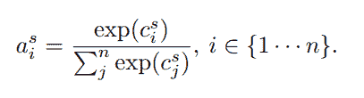

我们在这里所做的就是使用一个 softmax 将兼容性得分 *c* 压缩到范围(0，1)内，我们将输出*称为*。有关 softmax 操作的回顾，请参见[这篇文章](https://glassboxmedicine.com/2019/05/26/classification-sigmoid-vs-softmax/)。

## **第三步:计算每层 *s* 的注意机制的最终输出。**

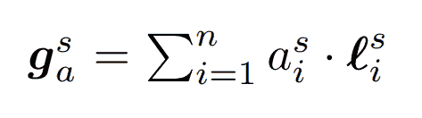

这里，我们通过对该层的 *l* 进行加权组合来计算特定层 *s* 的注意机制 *g_a* 的最终输出(回想一下，l 只是该层的输出)。)我们使用的权重是我们刚刚计算的注意力权重 *a* 。

## **步骤 4:基于关注度最终输出进行分类预测**

现在我们想要使用我们刚刚为第 7、10 和 13 层计算的注意力输出 *g_a* 来做出分类决定。作者研究了两种选择:

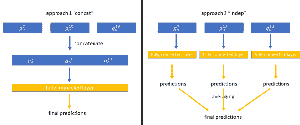

*方法 1:* “串联”:首先串联注意力输出，然后将它们一起馈入单个全连接层，以获得最终的预测。

*方法二:*“indep”:将每个注意力输出馈入一个独立的全连接层，得到中间预测，然后将那些中间预测平均，得到最终预测。

(剧透警告:“concat”在他们的结果中表现更好。)

# 结果

## **可训练的注意力提高表现**

作者评估了他们在各种任务中的注意机制，包括用 CIFAR-10、CIFAR-100 和 SVHN 进行多类分类。他们发现，使用他们的可训练注意力机制提高了“无注意力”基线的性能，相比之下，事后注意力机制( [CAM](https://glassboxmedicine.com/2019/06/11/cnn-heat-maps-class-activation-mapping-cam/) )会导致性能下降(由于 CAM 方法施加的架构限制)。)

他们的方法的以下变体执行得最好:“参数化兼容性”(通过将 *l* 和 *g* 相加，然后与学习向量 *u* 和“concat”(在将注意力输出 *g_a* 送入 fc 层进行预测之前，将它们连接起来)来计算兼容性得分。)

这是他们论文中图 3 的一部分，展示了一些关注相关物体的注意力地图示例:

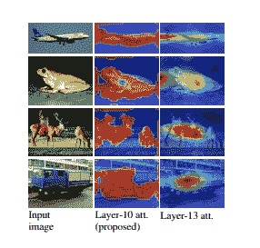

## **全局特征向量 *g* 有多大用处？**

他们论文的附录包含了一个有趣的讨论，关于全局特征向量 *g* 在注意力计算中的效用。回想一下，获得兼容性得分的“pc”和“dp”方法都利用了全局特征向量 *g* 。作者进行了实验，他们交换了使用的 g，发现:

*   对于基于点积的注意机制[dp，表现较差]:“全局向量在引导注意方面起着突出的作用”
*   对于参数化的兼容性函数[pc，性能更好]:“全局特征向量似乎是多余的。全局特征向量的任何变化都不会转移到结果注意力图。事实上，数值观察表明，全局特征的数量级通常比相应的局部特征的数量级小几个数量级。因此，全局特征向量的变化对预测的注意力得分几乎没有影响。然而，注意力地图本身能够始终如一地突出物体相关的图像区域。因此，似乎在基于参数化兼容性的注意力的情况下，以对象为中心的高阶特征被学习为权重向量 *u* 的一部分。

换句话说，我们也许可以像这样计算兼容性得分:

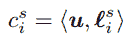

根本不用 *g* ！

不管 *g* 扮演的确切角色是什么，这种“学会集中注意力”的方法确实改善了结果，也确实产生了不错的注意力地图——因此，可训练的注意力显然在做一些有用的事情，即使它没有按照作者最初打算的方式使用 *g* 。

# 摘要

*   可训练的注意力机制具有在训练期间学习的注意力权重，这有助于模型聚焦于对任务重要的图像的关键部分；
*   事后注意机制是在模型完成训练后应用的技术，旨在提供模型在进行预测时观察哪里的洞察力；
*   注意力集中是图像裁剪，可以通过强化来训练。软注意产生“模糊”的焦点区域，可以使用常规的反向传播来训练。
*   “学会关注”是一篇有趣的论文，展示了软可训练的注意力如何提高图像分类性能并突出图像的关键部分。

## 额外资源

*   [神经网络中的注意力以及如何使用它](http://akosiorek.github.io/ml/2017/10/14/visual-attention.html)亚当·科西奥雷克著。这是一篇关于计算机视觉中注意力的伟大文章。它讨论了为什么注意是有用的，软与硬注意，高斯注意(代码)，空间转换器(代码)。
*   [注意？立正！](https://lilianweng.github.io/lil-log/2018/06/24/attention-attention.html)作者莉莲·翁。这是另一篇很棒的文章，关注自然语言处理中的注意力。它讨论了 seq2seq，自我注意，软与硬注意，全局与局部注意，神经图灵机，指针网络，变形金刚，蜗牛和自我注意甘。
*   [变形金刚:注意力是你所需要的全部](https://glassboxmedicine.com/2019/08/15/the-transformer-attention-is-all-you-need/):解释变形金刚，包括它的多头可训练自我注意力机制。
*   [CNN 热图:显著性/反向传播](https://glassboxmedicine.com/2019/06/21/cnn-heat-maps-saliency-backpropagation/):解释事后注意力技术显著性映射。
*   [CNN 热图:梯度 vs .去卷积 vs .引导反向传播](https://glassboxmedicine.com/2019/10/06/cnn-heat-maps-gradients-vs-deconvnets-vs-guided-backpropagation/):解释这三种事后注意力方法实际上是相同的，除了对非线性的处理。
*   [CNN 热点图:类激活映射(CAM)](https://glassboxmedicine.com/2019/06/11/cnn-heat-maps-class-activation-mapping-cam/) :解释了类激活映射架构和注意机制，[和 HiResCAM 一起被证明可以保证显示模型在看哪里。](https://arxiv.org/abs/2011.08891)
*   [制导摄像机坏了！显著图的健全性检查](https://glassboxmedicine.com/2019/10/12/guided-grad-cam-is-broken-sanity-checks-for-saliency-maps/):解释 NeurIPS 的一篇论文，该论文揭示了几种流行的注意力机制的问题。
*   [Grad-CAM:来自深度网络的视觉解释](https://glassboxmedicine.com/2020/05/29/grad-cam-visual-explanations-from-deep-networks/):解释事后注意机制 Grad-CAM。注意:尽管 Grad-CAM 的论文被引用了几千次，[最近的工作证明了 Grad-CAM 的一个严重问题](https://arxiv.org/abs/2011.08891)，即它有时会突出显示模型实际上没有使用的无关区域。

## 关于特色图片

图片来源:[表演者带火 poi](https://en.wikipedia.org/wiki/Poi_(performance_art)#/media/File:Flammenjongleur.jpg) 。 [Poi](https://en.wikipedia.org/wiki/Poi_(performance_art)) 是一种专注于摆动系留重物的表演艺术。它起源于新西兰。

*原载于 2019 年 8 月 10 日*[*http://glassboxmedicine.com*](https://glassboxmedicine.com/2019/08/10/learn-to-pay-attention-trainable-visual-attention-in-cnns/)*。*