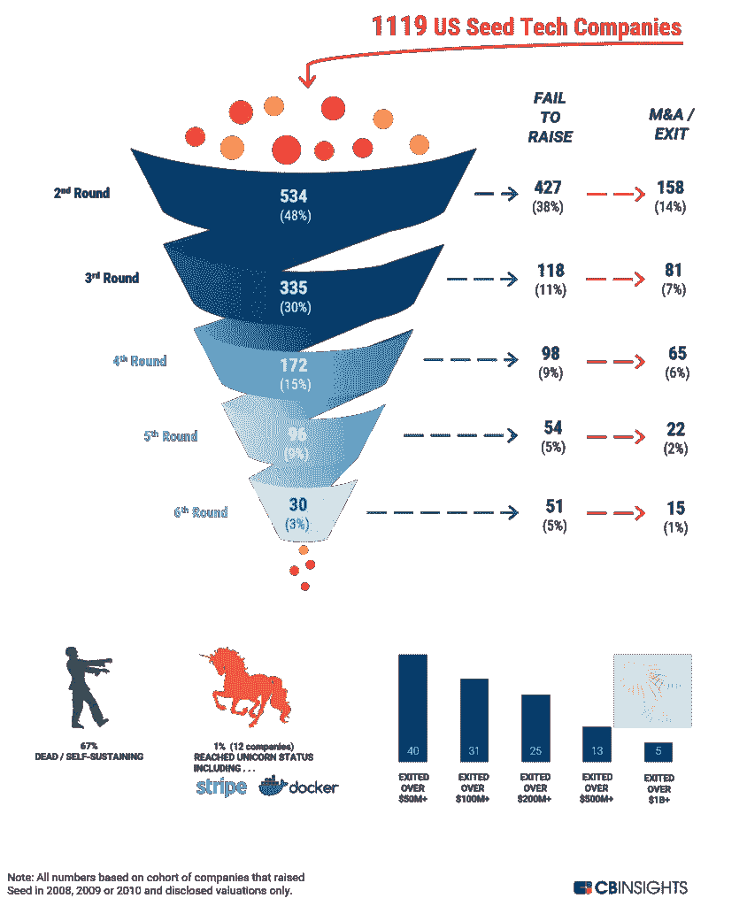
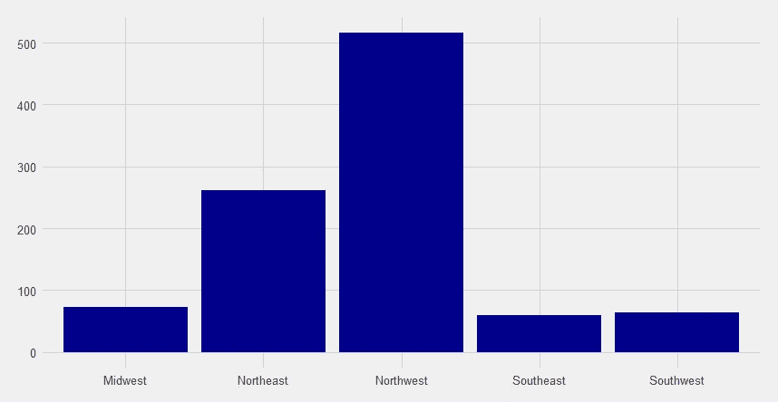

# 学习型企业家

> 原文：<https://towardsdatascience.com/learned-entrepreneurship-5f4d47561ead?source=collection_archive---------27----------------------->

## *获得资金最多的创业公司有什么共同点？*


(Source: Salesforce)

# ||简介||

创业公司的世界是一个动态的地方——对于创业者来说，一旦他们开始运作，很少会有既得利益或回报的承诺。私募股权和风险投资公司享受着丰厚的利润，因为他们理应擅长于识别哪些初创公司炙手可热，哪些失败了，但有没有一种方法可以自动化这一过程？我的目标是建立一个模型来回答这个问题:

> 计算机能模拟一家初创公司**应该得到多少资金吗？**

注意:本文中的表格是用来在计算机上查看的！

# ||数据||

本文使用的数据是通过 PitchBook 获得的，pitch book 是关于创业公司和私人投资领域的研究和财务信息的最佳来源之一。PitchBook 向我提供了以下信息:

1.  最近估值(百万)
2.  上次融资规模(百万)
3.  上一轮融资(A 轮、B 轮等。)
4.  最后融资阶段(种子轮、早期 VC 等。)
5.  总部位置
6.  雇员人数
7.  行业领域(医疗保健、消费品等。)
8.  行业集团(医疗保健服务、制药、软件等。)
9.  筹集总额
10.  活跃投资者数量

该实验中使用的总样本量由过去两年中获得资金的 973 家初创公司组成。

# ||探索性数据分析||

[AngelList](https://angel.co/valuations) 对与创业文化相关的几个变量进行了统计演示，但更让我感兴趣的是实际的创业过程。下图(摘自 CBInsights)详细描述了“风险资本漏斗”，即大多数初创公司如何遵循特定的可预测生命周期。



The Venture Capital Funnel (Source: CBInsights)

下图展示了一家初创公司位于西北部(华盛顿州、加利福尼亚州、俄勒冈州)或东北部(纽约州、马萨诸塞州、宾夕法尼亚州)的可能性——我很想知道地理位置是否真的在预测支票金额方面发挥了作用！



Distribution of startups by region

# ||方法||

根据下面定义的规则，给定的初创公司被组织成不同的类别(其中 *x* 是资助金额):

```
 x ≤ $5M   -->  Class 1(SMALL) $5M < x ≤ $25M  -->  Class 2(MEDIUM) $25M < x ≤ $45M -->  Class 3(LARGE) x > $45  -->  Class 4(GIANT)
```

我这样做是为了改变我试图从一个回归问题中解决的问题(创业公司将获得的资金的确切价值是多少？)变成一个分类问题(资助会落在哪个区间？).这里精度的损失并不是一个大问题，因为没有必要去尝试和预测精确值！

使用 R 包“mice”，数据集中的缺失值通过一个神经网络进行近似，该网络使用“总募集额”和“活跃投资者数量”等变量(仅举几例)。这些变量被删除是因为，例如，模型**可能在一轮融资结束之前无法访问**活跃投资者的数量。

以下模型针对一组有限的功能进行了训练，并在测试期间根据它们在训练期间的表现进行了适当的加权:

*   随机森林
*   线性 XGBoost
*   树 XGBoost
*   极限学习机
*   条件推理树
*   袋装分类和回归树(CART)
*   神经网络
*   k-最近邻

# ||结果||

我对从我相当复杂的模型中得到的结果印象深刻！在我执行动态加权后，我得到了以下结果。第一个表是我计算的分类分数汇总，第二个表是混淆矩阵。

```
 ╔════════════**═**╦══════════════╗
                   ║   accuracy  ║    kappa     ║
                   ╠═════════════╬══════════════╣
                   ║   0.70696   ║   0.51984    ║
                   ╚═════════════╩══════════════╝ **Predicted**
                  **Observed**     **1**   **2**   **3**   **4**
                          **1** | 71  13   0   2
                          **2** | 27 110   6   4
                          **3** |  1  12  11  15
                          **4** |  0   0   0   1
```

这些结果表明，我的模型能够以 70.6%的准确率进行预测，并且具有中等程度的一致性。这些模型在估算“大”类资金规模时确实有些困难，但总体表现相当不错。

现在，更有趣的部分。模型最关心的变量是什么？R 中的‘caret’库提供了一种测量变量相关性的简单方法。

```
 **Class 1  Class 2  Class 3**  **Class 4  Average  Rank**
**Funding Round**   | 100.00   73.286   58.538   100.00   82.956    2
**Employees** |  83.11   98.774   53.270    98.77   83.481    1
**Funding Stage** |  73.62   72.776   60.768    73.62   70.196    3
**HQ Location** |  17.79   21.155   17.786    21.15   19.470    4
**Industry Group** |  12.54    0.000   13.984    12.54    9.766    5
**Industry Sector** |  10.48    5.845    5.972    10.48    8.194    6
```

从这张表来看，它看起来像是“融资轮”(A 轮、B 轮等。)和雇员人数是最重要的变量。这是有意义的，因为随着初创企业进入更多的融资轮或变得更大(即拥有更多员工)，支票金额也会增加。然而，更有趣的是,**“行业组”和“行业部门”变量对模型**的贡献很小——这意味着初创企业的行业(软件、制药等)。)没什么区别！有趣的是，我们看到投资领域并不仅仅偏向于软件初创公司。最后，看起来公司总部的位置确实给出了某种迹象，表明这家初创公司是否会获得更高的支票金额！

> 然而，从本质上来说，理想的“启动条件”被掩盖了，因为有**大量的其他变量**在决定支票金额时起着更大的作用。

这种现象的一些现实例子包括 [Dwolla](https://dwolla.com) 和 [AgCode](https://agcode.com) ，这两个非常成功的初创公司分别在伊利诺伊州的得梅因和明尼苏达州的格伦伍德开始了他们的旅程。他们成功的真正预测因素不是他们的行业(金融服务和农业技术)，一个只在当地受过训练的天真模型会使他们失去信誉(看看他们是如何立足于美国中西部地区的)。我的模型强调初创企业能够成长和扩张的方式是一个更好的预测因素，引用员工总数和相应的融资轮数作为更强的输入。换句话说，能以更少的融资轮数更快成长(更多员工)的创业公司是健康的。

创业和私人投资市场是极其复杂的领域。我邀请你进行你自己的与这个主题相关的实验，并希望听到任何发现或进展！**如果你喜欢这篇文章，请给它一些掌声**和**关注 [TDS 团队](https://medium.com/u/7e12c71dfa81?source=post_page-----5f4d47561ead--------------------------------)和我( [Abhinav Raghunathan](https://medium.com/u/33c10dfa56bf?source=post_page-----5f4d47561ead--------------------------------) )，继续关注**更多数据驱动的想法探索！你可以在这里找到这个项目[的代码](https://github.com/ar59854/VC-PE-Engine)！感谢阅读！

# ||引文||

数据提供者:[手册](http://www.pitchbook.com)

图片: [CBInsights](https://www.cbinsights.com/research/venture-capital-funnel-2/) 和 [Salesforce](https://www.salesforce.com/ca/blog/2017/11/important-factors-startup-success.html)

请参见文章的代码[资源库](https://github.com/ar59854/VC-PE-Engine)获取完整的引用。