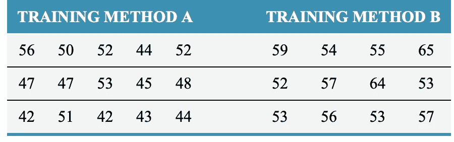
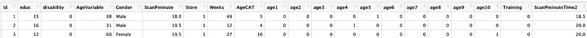
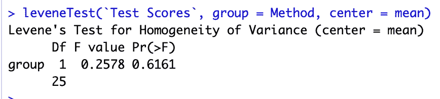
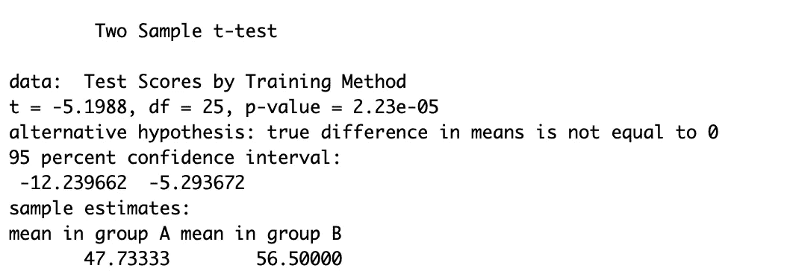
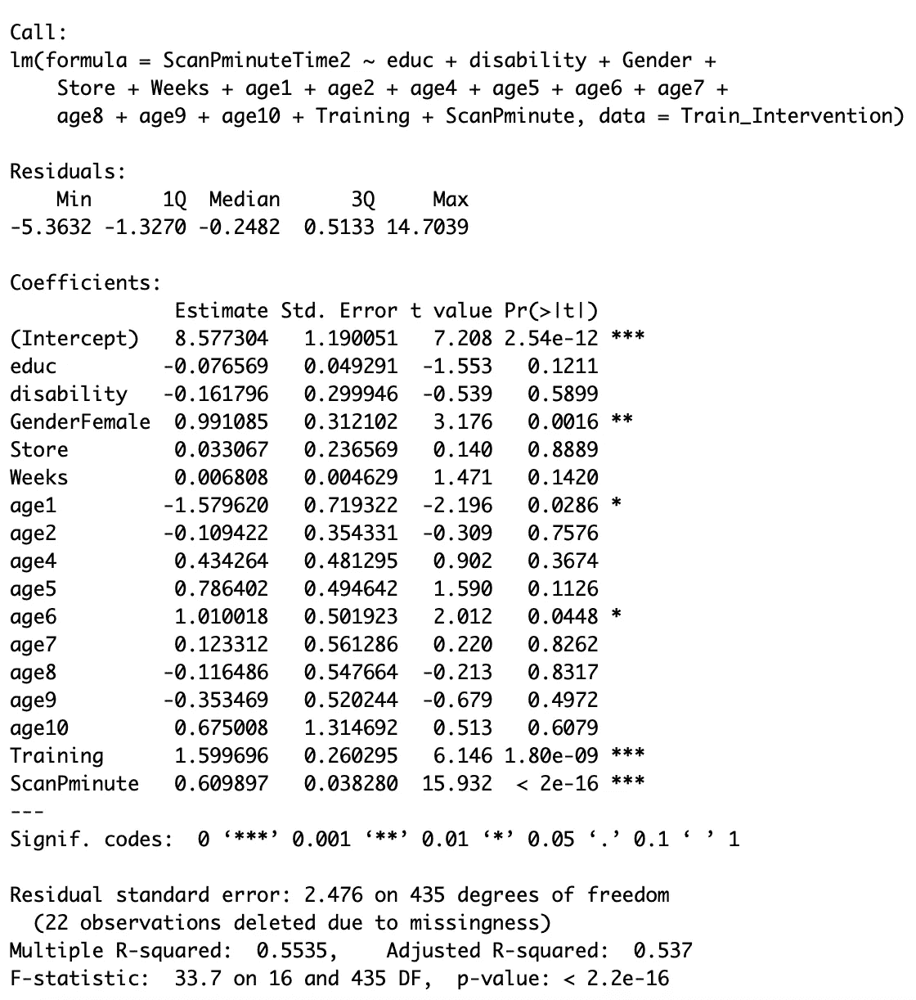
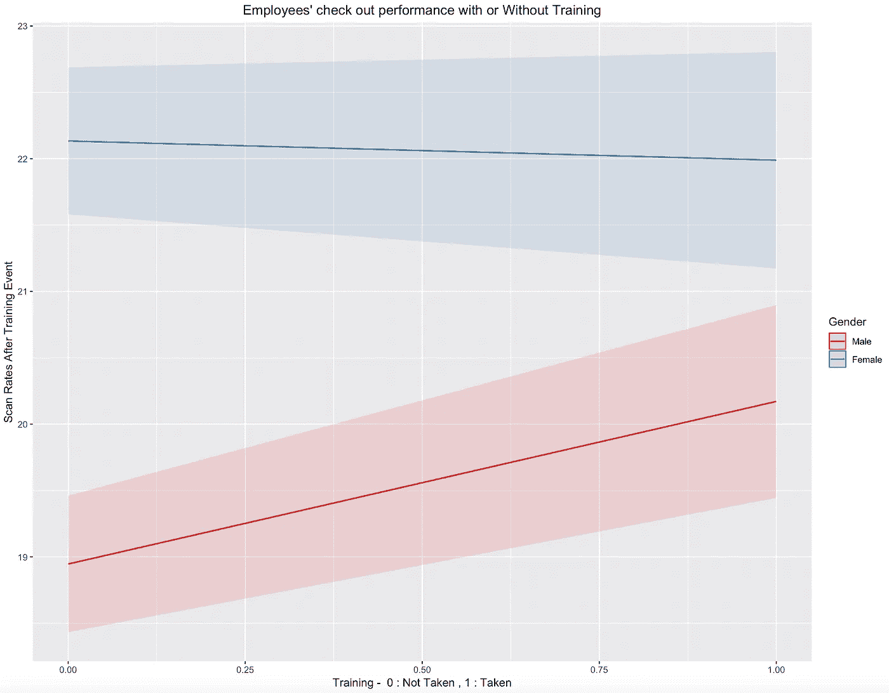

# 学习分析

> 原文：<https://towardsdatascience.com/learning-analytics-13a409156d7c?source=collection_archive---------10----------------------->

哇哦。这是一个值得深入研究的有趣话题。

使用 Nigel Geuenole、Jonathan Ferrar 和 Sheri Feinzig 在他们的书《人的力量》中提出的劳动力分析八步方法，我将在本文中探讨两个案例研究。

# **第一步:框定业务问题**

ColesX 是一家虚构的澳大利亚超市、零售和消费服务连锁店，总部设在墨尔本。

新员工需要参加为期三天的研讨会，了解公司及其在工作场所健康和安全、工作场所欺凌和骚扰、伙伴计划、IT 政策、数据隐私法规等方面的政策。在研讨会结束时，他们将接受测试，以衡量他们对公司及其政策的了解程度。新员工培训的传统方法是现场讲座和问答。管理层决定为新员工试验一种新的基于电子学习的培训，可能需要 1 天时间才能完成。如果这个实验成功，它可以在几年内为公司节省数千美元。然而，在全球实施之前，高级管理层渴望确定新的电子学习培训计划是否比 2 天面对面的方法更有效。

ColesX 有很多在收银台工作的员工。该公司定期将其员工的扫描速度与目标扫描速度目标进行对比。扫描率基本上是一名员工一周内每分钟扫描的平均项目数。管理层最近决定引入一项特殊的培训计划，以分享提高扫描率的最佳实践。在第一阶段，员工可以选择参加这项培训。ColesX 非常清楚，稍微提高员工的平均扫描率将会显著提高月销售额。该组织热衷于研究新培训对扫描速度性能的影响。

基于这些事件，我们将 ColesX 的业务问题框定为:

1.  与传统的 2 天面对面计划相比，1 天新入门计划的效果如何
2.  新的特殊扫描速率改进培训计划的效果如何？哪些因素影响着扫描速率的性能

# **第二步:建立假设**

为了测试这两种培训方法的差异，经理们选择了一组 15 名新员工参加为期 2 天的研讨会(方法 A)，另一组 12 名新员工参加为期 1 天的电子学习(方法 B)。从所有新员工那里收集了每种培训方法的测试分数，这些分数将构成进一步分析的一部分

为了测试新的特殊扫描率培训计划的有效性，在提供培训之前和之后测量了所有员工的扫描率。

假设是有根据的、可测试的解释或预测，用于解决业务问题并支持数据收集和分析。在我们的案例研究中，确定了以下假设:

1.  新开始训练方法 A 和 B 的平均测试分数没有区别。
2.  特殊培训计划前后员工的扫描率没有差异。

下面进行的分析工作将试图反驳上述假设。如果我们成功地做到了这一点，我们将证明变革正在起作用。

在此阶段，业务负责人应审核并签署业务问题和假设，以便数据科学团队开始分析工作。

# 步骤 3:收集数据

对于我们新的初学者培训案例研究，从培训方法 A (2 天的研讨会)和 B(1 天的电子学习)中收集的测试分数如下所示:

对于我们的扫描速率训练计划案例研究，已经捕获了几个数据点。数据项包括工人 ID、edu(接受教育的年数)、残疾(0 表示无残疾，1 表示某种形式的相关残疾)、性别、扫描分钟数(本周每分钟扫描的平均项目数)、培训(0 =员工未接受培训)。1 =员工接受了培训)、ScanPminuteTime2(培训后一周内每分钟的平均项目数)。年龄字段与员工的特定年龄类别相关(如年龄 1 = 16–19 岁，年龄 2(20–24 岁)等)。

# 步骤 4:进行分析

1.  **新启动计划有效性分析**

该分析包括测试数据集中的平均分数，以比较分数是否因训练方法而不同。这就是统计学的应用在引入独立样本 T 检验时发挥作用的地方。

独立性:因为每种训练方法的两组测试成绩没有依赖性。新员工被分成不同的小组

t 检验:用于检验不同组之间的平均值，并确定这些平均值在统计上是否不同。然而，T 检验假设每组的方差相等，这意味着训练方法 A 和训练方法 B 的两个样本组的测试分数的变化**在**内大致相同。

让我们通过使用 Levene 的测试来测试数据集中方差的相等性。基于显著性结果(P 值大于 0.5)，我们可以假设这两个样本组的测试分数没有差异。

现在让我们运行所有重要的 T 检验来检验我们的第一个假设:两种训练方法之间的测试分数没有显著变化。

哇:A 组和 B 组的平均测试分数相差至少 8 分。培训方法 B (1 天 E 学习)的平均得分明显更高，为 56.5。T 检验结果也具有小于 0.05 的显著 P 值结果，这意味着可以拒绝两个培训计划的平均测试分数相同的假设。

***换句话说，这种 1 天 E 学的训练方法被证明是非常有效的。***

**2。新扫描率培训效果分析**

这里的分析处理的是确定什么因素在驱动训练后进行的新的扫描速率测量。在这里，我们试图确定可变培训(员工参加过培训课程)是否对新的扫描率有任何影响。

我们可以通过开发多元线性回归模型来开发这样一个变化模型。使用 NewScanrate 分数作为响应变量，使用数据集中的所有其他变量作为独立预测变量，开发回归模型。让我们看看分析显示了什么。

多元线性回归结果产生了一些有趣的结果(参见每个变量最右侧的*标记，以确定驱动扫描速率的重要因素)

*   随着时间的推移，女性的扫描速度越来越快。
*   年龄在 1 岁(16-19 岁)和 6 岁(40-44 岁)的员工的扫描速度表现随着时间的推移逐渐提高
*   正如所料，现有扫描率较高的员工在培训活动后会产生较高的扫描率分数
*   最重要的是:**培训领域非常重要，证明参加新的扫描率培训计划有可能提高扫描率**

# **第五步:展现洞察力**

酷毙了。所以我们的分析成功地消除了这两种假设。根据分析，可以得出以下结论

1.  为期 1 天的电子学习新手培训比为期 2 天的面对面培训更有效
2.  新的扫描速度培训在提高员工培训后的扫描速度表现方面是有效的

但是，等等，关于第二个观点，我们的研究表明，随着时间的推移，女性群体已经表现出更高的扫描速度。为了确定新培训对扫描率的有效性，让我们控制性别和培训的交互变量，以评估扫描率的表现如何在培训后得到改善。

我们这样做是通过开发一个交互作用图的扫描率测量后，培训与交互变量的培训(采取:是或否)和性别。

我们发现，参加培训的男性群体的扫描速度从 18 提高到了 22。无论有没有训练，女性的扫描率几乎保持不变。

因此，这里发现了第三个洞见。

3.新扫描率培训的引入使男性雇员比女性雇员受益更多(女性雇员已经表现得更好)

# 步骤 6:确定建议

根据我们的发现，可以提出一些非常有针对性的建议，例如:

1.  将为期 2 天的面对面新入门培训替换为为期 1 天的在线学习。这一举措将为公司节省数千美元，同时提高流程的效率。此处可以开发一个成本模型来评估 2 天培训与 1 天培训的成本，以便将来进行跟踪和评估
2.  为所有员工推出新的扫描速率性能培训。跟踪课程的出席情况，尤其是男性，鼓励他们在商场参加培训。引入采用计划，如奖金计划，以推动更多人参与培训，并提高目标扫描率，以推动整体绩效的提高

# **第七步:表达你的观点**

本节讨论如何将建议转化为公司的行动。这就需要一个强有力的项目发起人来支持分析事业，并确保建议得到适当的实施和沟通。

变革管理、培训、沟通都是推动公司采纳建议的一部分。

# 步骤 8:实施和评估

比方说，在每 6 个月的实施期内，会定期根据开始时设定的 KPI 对为期 1 天的新入门培训计划的测试分数、成本节约、绩效扫描率和销售绩效进行审查，以衡量计划的持续有效性。财务效益衡量是此类项目评估的关键部分。

报告分析项目的节约是为组织内更多基于分析的项目开发业务案例的关键。

# 参考

预测人力资源分析:马丁爱德华兹和柯尔斯顿爱德华兹。

《人民的力量》:奈杰尔·古诺尔、乔纳森·费拉和谢里·费恩齐格

第二个案例研究的数据集来自 Martin R Edwards 和 Kirsten Edwards 所著的《人力资源预测分析》一书

我开发的 r 代码和数据集都在我的 github 帐户中:

[https://github . com/sambit 78/People-Analytics-Project/tree/master/06% 20-% 20 training % 20 Analytics](https://github.com/Sambit78/People-Analytics-Project/tree/master/06%20-%20Training%20Analytics)