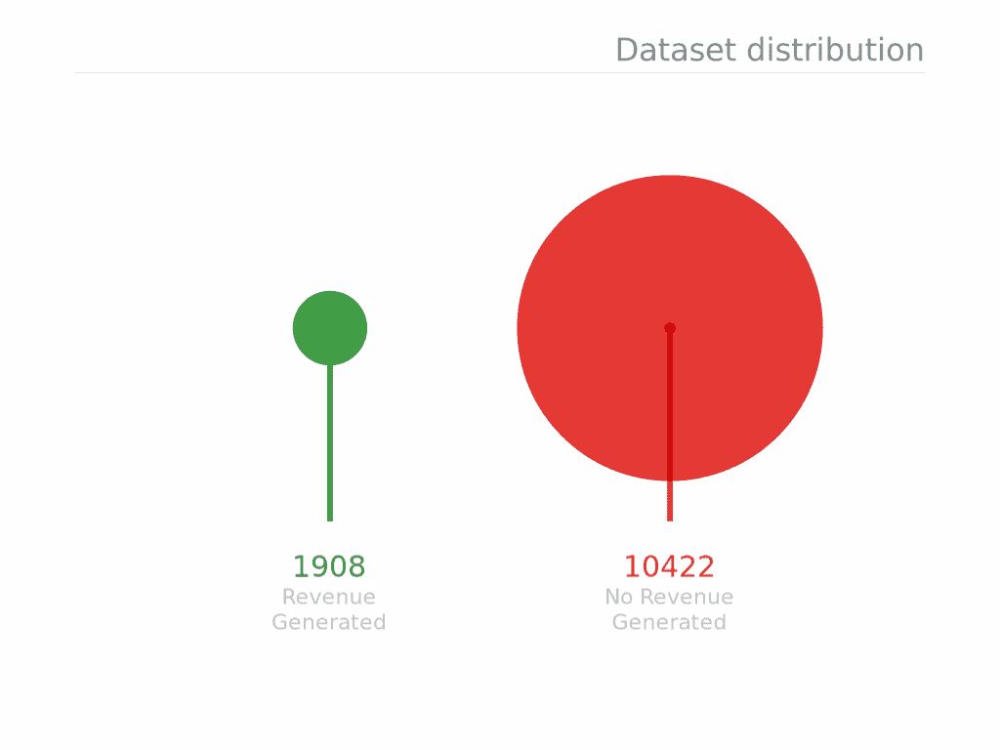
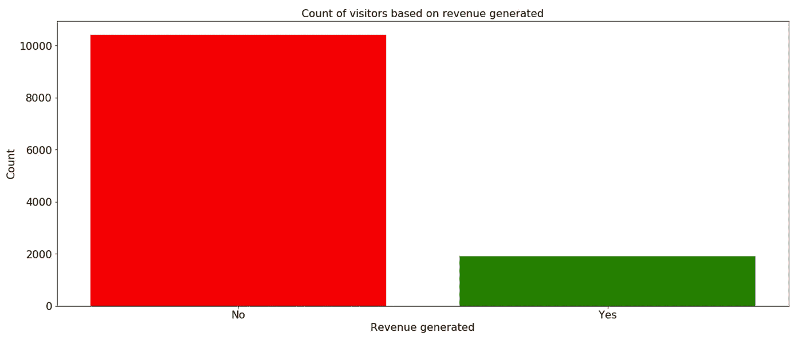
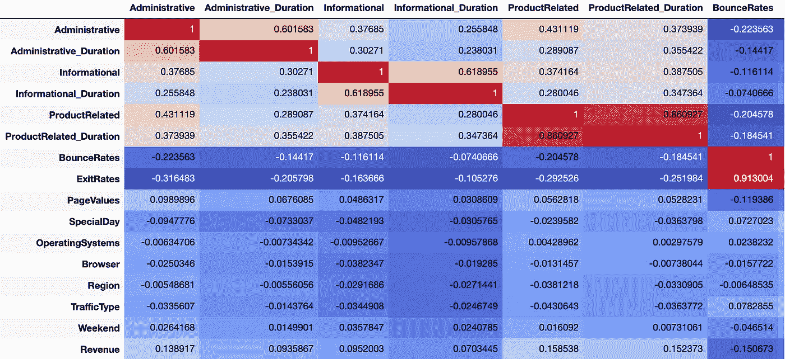
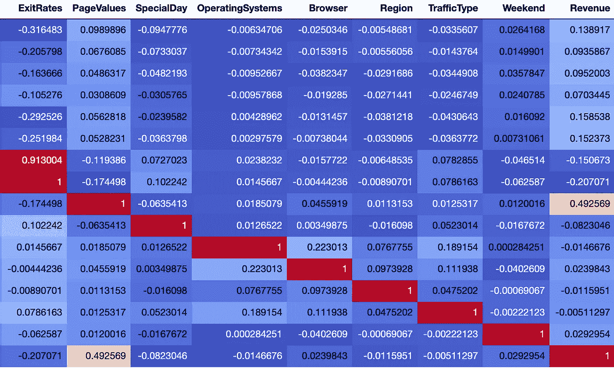
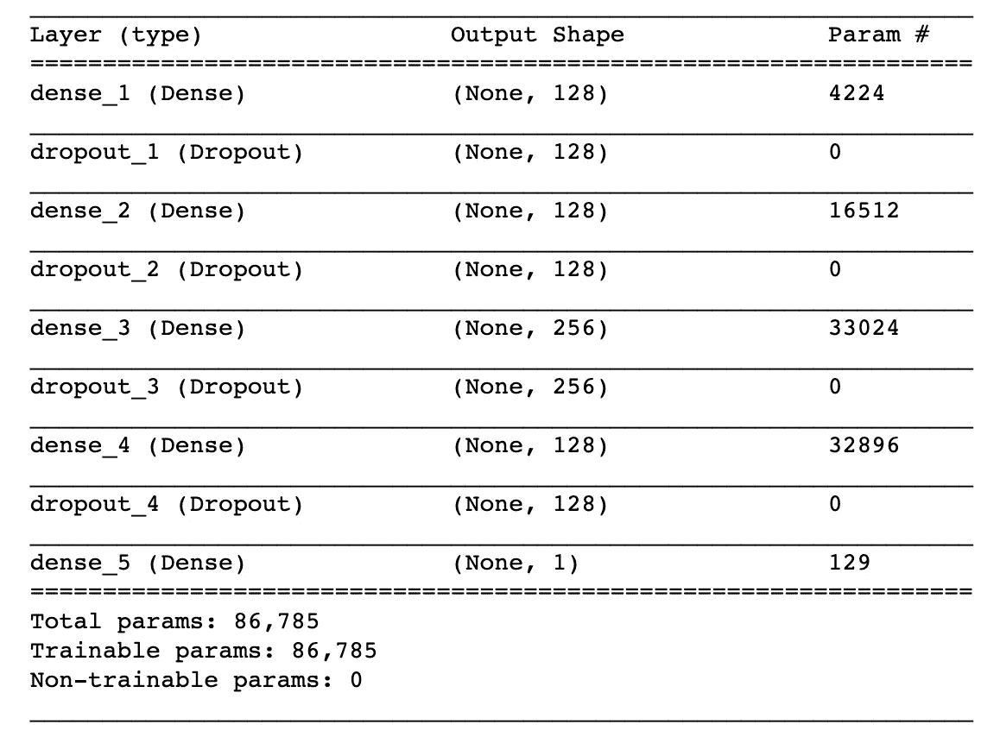
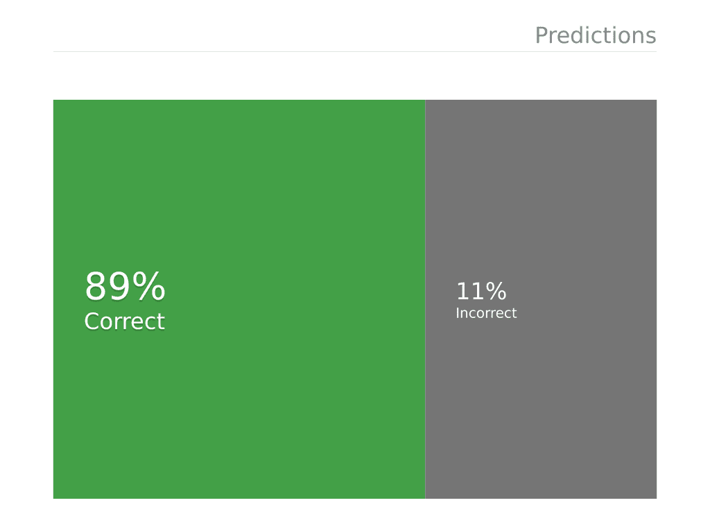

# 通过预测游客购买意向学习人工神经网络

> 原文：<https://towardsdatascience.com/learning-artificial-neural-networks-by-predicting-visitor-purchase-intention-724ba2be7c29?source=collection_archive---------21----------------------->

## 使用 Keras 和 Tensorflow 构建人工神经网络

当我在 Udemy 上学习关于深度学习的课程时，我决定利用我的知识，尝试预测一个访问者是否会购买(产生收入)。数据集取自 [UCI 机器学习库](https://archive.ics.uci.edu/ml/datasets/Online+Shoppers+Purchasing+Intention+Dataset)。您可以在下面的回购协议中找到完整的代码:

 [## kb22/购买意向预测

### 该项目包括预测游客是否会购物。-kb22/购买意向预测

github.com](https://github.com/kb22/Purchasing-Intention-Prediction) 

# 导入库

第一步是导入必要的库。除了常规的数据科学库包括`numpy`、`pandas`、`matplotlib`之外，我导入了机器学习库`sklearn`和深度学习库`keras`。我会用`keras`开发我的以`tensorflow`为后端的人工神经网络。

# 导入数据集

我将导入数据集并获得数据的基本概述。有 1，908 名访客带来了收入，而 10，422 名访客没有。

有 18 列、17 个特性和 1 个目标变量(收入)。没有丢失的值。我也跑了`dataset.describe()`。每一列的`mean`各不相同，因此，缩放应该有所帮助。

考虑到`Revenue`是目标列，我将把数据集分成测试集和训练集。我将数据集分成 80%的训练数据和 20%的测试数据。

# 数据分析和可视化

## 目标列

我首先在产生收入的访问者和没有产生收入的访问者之间创建了一个条形图。

Target column bar chart

从上面的柱状图中可以清楚地看出，数据集包含了大多数没有产生收入的要素值。数据集是高度不平衡的，这是我们必须创建一个有效的模型，仍然可以准确地在两个类之间进行分类。

## 相关矩阵

我创建了相关矩阵，然后根据相关程度给它着色。

Correlation Matrix (Part 1)

Correlation Matrix (Part 2)

看来`PageValues`与我们的目标值线性相关最大。另外，像`OperatingSystems`、`Region`和`TrafficType`这样的特性的相关性小于`0.02`或大于`-0.02`，所以我将删除这些列。

从相关矩阵中可以看出，`Administrative`和`Administrative_Duration`、`Informational`和`Informational_Duration`以及`ProductRelated`和`ProductRelated_Duration`之间的关系似乎具有非常高的相关性。这是意料之中的，因为在一种类型的页面上花费的时间肯定会受到该类型页面的访问量的影响。因此，我们可以删除每种类型访问的页面数量。

# 数据工程

## 移除列

我现在将删除所有不需要的列，包括`Administrative`、`Informational`、`ProductRelated`、`OperatingSystems`、`Region`和`TrafficType`。

## 编码分类列

我将使用`LabelEncoder`对分类列进行编码。我将使用`OneHotEncoder`对列类进行编码，然后将它们追加到数据集中。

## 缩放数据

接下来，我将重新调整数据，使每一列的平均值都在 0 左右。

# 模型生成

我将使用 Keras 和 Tensorflow 作为后端来生成一个人工神经网络。有 32 个输入节点，接着是 4 个隐藏层和 1 个输出层。该模型体系结构被设计为增加验证集的准确性以及防止在训练集上过度拟合。

Artificial Neural Network

我为人工神经网络开发了一个序列模型。这些层或者是致密层或者是脱落层。每个密集层表示中子数为`units`，激活函数为`relu`，第一层还包括输入的`input_dim`。输出层的激活是`sigmoid`。退出确保训练数据不会过度拟合。

# 训练和评估模型

我训练了总共 50 个时期的模型，其中 90%是训练，10%是验证分割。我达到了 90.44%的训练准确率和 89.06%的验证准确率。

最后，对试验数据进行了预测。然后，我使用预测值和实际值创建混淆矩阵，计算出 88.77%的测试准确率。

# 结果分析

混淆矩阵显示，我们能够识别两种类型的访问者，将产生收入的访问者和不会产生收入的访问者。我们可以如下使用这些信息:

1.  一旦我们能够确定某人将产生收入，我们不需要提供任何优惠券，而是我们可以给访问者特殊的奖励积分，他们可以在下次访问时使用。
2.  不太可能进行购买的访问者可以被提供折扣券，使得他们更有可能进行购买。

感谢阅读。请分享你的想法、观点和建议。你也可以通过 LinkedIn 联系我。您可能还会喜欢以下内容:

 [## 在 Kaggle 上使用 CNN 进行深度学习以识别疟疾细胞

### 医学领域的深度学习

towardsdatascience.com](/deep-learning-to-identify-malaria-cells-using-cnn-on-kaggle-b9a987f55ea5)  [## 利用 OpenCV 人脸检测神经网络提取人脸

### 使用预先训练的人脸检测系统

towardsdatascience.com](/extracting-faces-using-opencv-face-detection-neural-network-475c5cd0c260)  [## 使用机器学习预测心脏病的存在

### 机器学习在医疗保健中的应用

towardsdatascience.com](/predicting-presence-of-heart-diseases-using-machine-learning-36f00f3edb2c)  [## 使用 React 和 Flask 创建一个完整的机器学习 web 应用程序

### 用 UI 和后端构建完整的 ML 应用程序

towardsdatascience.com](/create-a-complete-machine-learning-web-application-using-react-and-flask-859340bddb33)