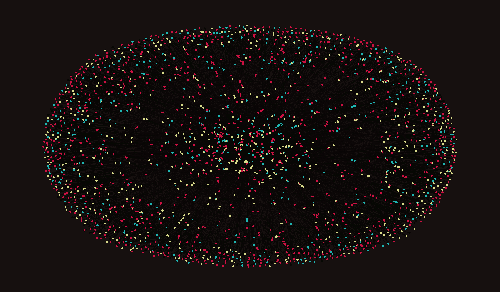
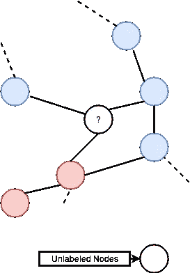
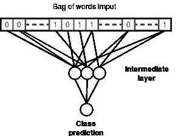
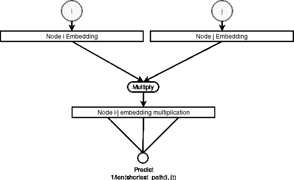
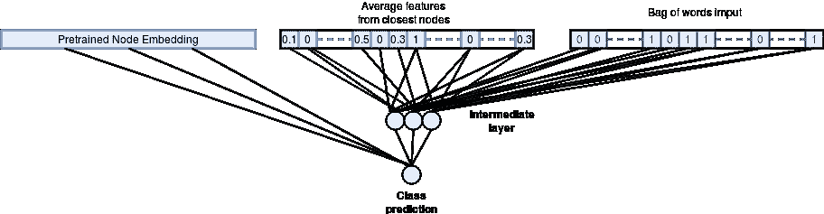
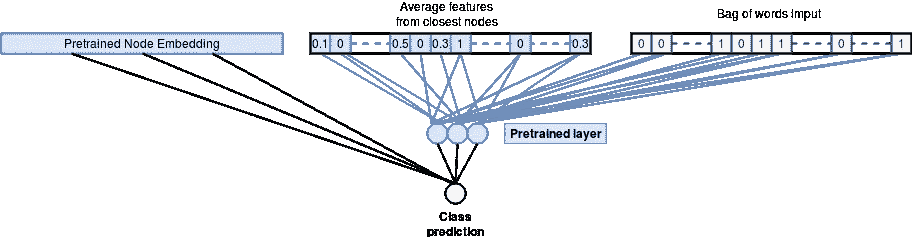

# 使用 Keras 和 Tensorflow 从图形数据中学习

> 原文：<https://towardsdatascience.com/learning-from-graph-data-using-keras-and-tensorflow-5b54e3ddffbf?source=collection_archive---------12----------------------->

Cora Data set Citation Graph

# 动机:

在引用网络、社交网络(关注者图、朋友网络……)、生物网络或电信等现实应用中，有许多数据可以用图表的形式表示。
使用图提取的特征可以通过依赖相邻节点之间的信息流来提高预测模型的性能。然而，表示图形数据并不简单，尤其是如果我们不打算实现手工制作的特性，因为大多数 ML 模型期望固定大小或线性的输入，而图形数据并非如此。
在本帖中，我们将探索一些处理一般图形的方法，以便根据直接从数据中学习到的图形表示进行节点分类。

# 数据集:

[Cora](https://linqs-data.soe.ucsc.edu/public/lbc/cora.tgz) 引文网络数据集将作为贯穿本文的实现和实验的基础。每个节点代表一篇科学论文，节点之间的边代表两篇论文之间的引用关系。
每个节点由一组二元特征(单词袋)以及一组将它与其他节点链接起来的边来表示。
数据集具有被分类为七个类之一的 ***2708*** 节点。网络有 ***5429*** 个链接。每个节点也由指示相应单词存在的二进制单词特征来表示。总的来说，每个节点有 ***1433*** 个二元(稀疏)特征。下面我们*只*使用 ***140*** 样本进行训练，其余用于验证/测试。

# 问题设置:

**问题**:在训练样本很少的情况下，给图中的节点分配类别标签。
**直觉** / **假设**:图中距离较近的节点更有可能有相似的标签。
**解决方案**:想办法从图中提取特征，帮助分类新节点。

# 提议的方法:

**基线模型:**

Simple Baseline Model

我们首先用最简单的模型进行实验，该模型学习仅使用二元特征并丢弃所有图信息来预测节点类。
该模型是一个全连接的神经网络，将二元特征作为输入，输出每个节点的分类概率。

## **基线模型准确率: *53.28%***

这是初始精度，我们将通过添加基于图形的功能来提高它。

**添加图形特征:**

一种自动学习图形特征的方法是将每个节点嵌入到向量中，方法是在预测两个输入节点之间最短路径长度倒数的辅助任务上训练网络，如下图和代码片段所示:

Learning an embedding vector for each node

下一步是使用预训练的节点嵌入作为分类模型的输入。我们还添加了一个额外的输入，它是使用学习嵌入向量的距离的相邻节点的平均二进制特征。

下图描述了生成的分类网络:

Using pretrained embeddings to do node classification

## **图嵌入分类模型准确率:*73.06%***

我们可以看到，与基线模型相比，将学习到的图特征作为输入添加到分类模型有助于显著提高分类精度，从 ***53.28%*** *到* ***73.06%*** 😄。

**改进图形特征学习:**

我们可以通过进一步推动预训练并在节点嵌入网络中使用二进制特征，然后除了节点嵌入向量之外，再使用来自二进制特征的预训练权重，来进一步改进先前的模型。这导致模型依赖于从图结构中学习的二进制特征的更有用的表示。

## 改进的图嵌入分类模型准确率: *76.35* %

与以前的方法相比，这种额外的改进增加了几个百分点的准确性。

# 结论:

在这篇文章中，我们看到，我们可以从图结构数据中学习有用的表示，然后使用这些表示来提高节点分类模型的泛化性能，从**的 53.28%提高到* **的 76.35%** 😎。*

*复制结果的代码可从这里获得:[https://github.com/CVxTz/graph_classification](https://github.com/CVxTz/graph_classification)*

*如果您有任何建议或者您需要一些在您的机器上运行代码的指示，请随意评论😉*