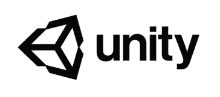
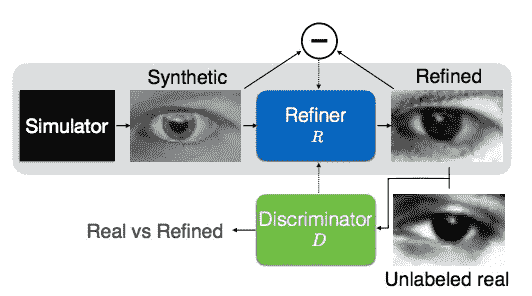
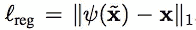
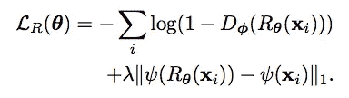

# 从模拟数据中学习

> 原文：<https://towardsdatascience.com/learning-from-simulated-data-ff4be63ac89c?source=collection_archive---------19----------------------->

困扰深度神经网络的最大问题之一是，训练它们需要大量的标记数据集。一些研究人员试图通过对元学习和少量学习等领域的研究来克服这一限制。然而，就目前而言，在诸如对象检测的任务中，需要大量的数据集才能成功。

This article discusses combining Graphics Engines such as Unity with GANs to build big datasets

用于驱动视频游戏(如 Unity)的图形引擎能够产生大量带标签的数据集。深度学习智能体可以在视频游戏环境中接受训练，以执行自主导航等任务。然而，它们仍然是模拟和真实数据集之间的鸿沟，这是深度卷积神经网络自身无法克服的。

解决这个问题的方法是生成性对抗网络。GANs 可以使用“真实”对“虚假”的损失函数来推动模拟数据更接近真实图像。这使得深度学习模型能够利用图形引擎，这些引擎可以产生巨大的标记数据集。本文将解释苹果公司研究人员提出的 SimGAN 模型的细节。本文着重于将来自 Unity 引擎的模拟眼睛图像移动到来自 MPIIGaze 数据集的真实图像，用于眼睛注视估计的任务。

High Level Overview of the SimGAN model

以下是这篇论文的链接:

 [## 通过对抗训练从模拟和无监督图像中学习

### 随着图形学的最新进展，在合成图像上训练模型已经变得更加容易处理，有可能…

arxiv.org](https://arxiv.org/abs/1612.07828) 

# 导言和结果

在深入研究这个模型是如何实现的细节之前，这里有一些实验结果来激发你的兴趣。一项结果评估是用视觉图灵测试进行的。这需要使用人工标记来确定哪些图像是“真实的”或“虚假的”。原始模拟数据由人类标记器正确标记，正确率为 162 / 200 (81%)。在应用 SimGAN 后，人类标记器的表现与随机猜测一样好(最大熵)，比率为 517 / 1000 (51.7%)。

此外，仅在合成数据上训练的模型对真实数据集上的眼睛凝视的分类率为 64.9%。一旦使用 SimGAN 进行了细化，根据细化数据训练的模型对真实数据集的分类率为 87.2%。使用 GAN 改进数据导致了 22.3%的分类性能！

下面介绍了使 SimGAN 工作得如此出色的主要技术:

# 自我调整的对抗性损失

在这个 GAN 公式中，发生器将改进模拟眼睛图像，使得鉴别器不能分辨改进的和真实的图像之间的差异。然而，GAN 训练可能是不稳定的，并且在没有额外的正则化的情况下，不能保证生成器将以保留原始图像的标签的方式来细化图像。注意，这样做的全部目的是模拟图像都被标记。因此，图像的增强必须保留这个标签。直接引用论文，

> "习得的转换不应该改变凝视的方向."

在 SimGAN 中使用的自正则化损失对于产生与原始图像大相径庭的图像的生成器是不利的。这是在以下损失的情况下完成的:

Regularization Loss Term

上述损失增加了一个额外的损失项，即细化图像和原始图像之间的 L1 距离。请注意，这是每个像素的损失，这意味着细化图像中的每个像素都要与原始图像进行比较。将这种损失与对抗性损失相加，生成者的目标如下:

Generator Loss for the SimGAN model, top component: adversarial loss with respect to the discriminator, bottom component: self-regularization term which ensures the generator does not dramatically alter the original image.

phi(x)(抱歉，不知道如何将希腊符号添加到中等文章中)，术语指的是修改细化图像和原始图像的函数。这可以是标识符映射，使得 phi(x) = x 或者图像导数、颜色通道平均值或者学习的变换。本文简单地使用了恒等式映射 phi(x) = x。

# 局部对抗性损失

一般来说，GANs 的一个最大问题是，生成器往往会产生诸如三条腿的狗或两个头的青蛙之类的人工产物。对此的一个解决方案是让鉴别器批评局部图像碎片，而不是整个图像。SimGAN 模型中的实现类似于另一种称为 PatchGAN 的鉴频器，但在鉴频器的输出维度上有很大不同。

这种损失的目的是让鉴别器将每个局部小块分类为真的或假的。SimGAN 通过让鉴别器输出大小为(w x h)的概率图来实现这一点，其中(w x h)是要分类的局部小块的数量。通过在每个局部小块概率输出上取交叉熵损失，该信号被传播回生成器。

# 使用细化图像的历史更新鉴别器

GANs 的另一个大问题是深度神经网络难以在线/持续学习。这指的是从不断变化的分布中学习的任务。在这种情况下，由发生器产生的图像的分布是不断变化的，因此鉴别器受到诸如“灾难性遗忘”的持续学习问题的影响。

SimGAN 模型通过保留前一次迭代生成的图像的缓冲区来应对从非平稳分布中学习的挑战。该缓冲区包含先前生成的图像。如果 b 是由生成器创建的图像的批量大小，则鉴别器显示 b/2 个当前生成的图像以及 b/2 个从缓冲区采样的图像。

# 讨论

SimGAN 的一个有趣的组成部分是，生成器从模拟图像开始，而不是从随机向量开始。我无法从论文中找出鉴别器是否额外以先前的图像为条件，尽管考虑到局部对抗损失的细节，我认为情况并非如此。看看这种额外的调节是否能改善这个模型将会很有趣。

局部对抗性损失是 SimGAN 模型中另一个非常有趣的概念。我想知道作者会如何看待使用自我关注模块。自关注模块似乎非常适合于对抗由发生器引入的伪像，并且它具有模拟局部损失不会捕捉到的长程相关性的额外好处。然而，在这种情况下，以及在超分辨率等应用中，长程相关性并不是 GAN 模型的主要挑战。在这种情况下，真正区分模拟图像和真实图像的是局部统计。

这是一篇非常有趣的论文，我对使用 GANs 建立深度学习模型的潜力感到非常兴奋，这些模型是在来自 Unity 等图形引擎的模拟数据上训练的！感谢您的阅读！