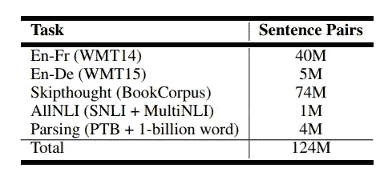

# 通过各种自然语言处理任务学习一般句子表征

> 原文：<https://towardsdatascience.com/learning-generic-sentence-representation-by-various-nlp-tasks-df39ce4e81d7?source=collection_archive---------13----------------------->

## 通用句导论

Photo by [Edward Ma](https://unsplash.com/@makcedward?utm_source=medium&utm_medium=referral) on [Unsplash](https://unsplash.com?utm_source=medium&utm_medium=referral)

有很多论文介绍了计算更好的文本表示的不同方法。从[字嵌入](https://medium.com/@makcedward/besides-word-embedding-why-you-need-to-know-character-embedding-6096a34a3b10)、[词嵌入](/3-silver-bullets-of-word-embedding-in-nlp-10fa8f50cc5a)到[句嵌入](/learning-sentence-embeddings-by-natural-language-inference-a50b4661a0b8)，我介绍了不同的处理方法。但是大部分都是单个数据集或者问题域的训练。Subramania 等人探索了一种简单、有效的句子嵌入多任务学习方法。假设是好的句子表征可以从大量弱相关的任务中学到。

看完这篇文章，你会明白:

*   通用语句表示设计
*   体系结构
*   履行
*   拿走

# 通用语句表示设计

GensSen 由 Subramania 等人于 2018 年推出..他们探索了多任务方法，即在训练期间切换 5 个 NLP 任务来学习下游任务的通用句子表示。选定的任务包括:

*   神经机器翻译(NMT):将英语翻译成法语和德语
*   [跳过思维向量](/transforming-text-to-sentence-embeddings-layer-via-some-thoughts-b77bed60822c):预测上一句和下一句
*   内容分析:识别句子结构
*   自然语言推理 (NLI):分类蕴涵

An approximate number of sentence pairs for each task. (Subramania et al., 2018)

在下表中，我们注意到“我们的模型”(Subramania 等人提出的方法)在添加更多任务时传输性能得到了提高。

Evaluation of sentences representation on 10 tasks. (Subramania et al., 2018)

除了句子表征，我们还注意到单词嵌入的结果比下表中的其他结果要好

Evaluation of word embeddings. (Subramania et al., 2018)

# 体系结构

所有 5 个任务都是序列到序列的问题，但是解决不同的 NLP 问题。序列到序列架构是编码器-解码器模型之一，而输入和输出都是顺序的。编码器将句子转换成固定长度的向量，而解码器试图通过链式规则产生条件概率。

编码器采用双向选通递归单元(GRU ),解码器采用单向递归单元。GRU 有助于消除消失梯度的影响，具有更快的计算速度。

由于我们需要学习一个通用的句子表示，我们必须在任务之间共享编码器，这样它就可以从不同的任务中学习一些东西。编码的句子表示将被发送到不同的解码器(每个任务的委托解码器)以解码向量并分类/预测结果。在训练模型之后，那些解码器将被扔掉，我们只需要在你的特定 NLP 问题中共享编码器。

由于作者建议使用不同的方法来训练编码器，我们必须解决什么时候应该切换任务？作者采用了一种简单的方法，即在每次参数更新后，选取一个任务进行训练。

# 拿走

*   多任务学习有助于概括词向量，从而可以很容易地转移到其他问题领域并获得更好的结果。

# 关于我

我是湾区的数据科学家。专注于数据科学、人工智能，尤其是 NLP 和平台相关领域的最新发展。你可以通过[媒体博客](http://medium.com/@makcedward/)、 [LinkedIn](https://www.linkedin.com/in/edwardma1026) 或 [Github](https://github.com/makcedward) 联系我。

# 参考

Sandeep S .、Adam T .、Yoshua B .、Christopher J . p .，[通过大规模多任务学习学习通用分布式句子表示](https://arxiv.org/pdf/1804.00079.pdf)。2018

[https://github.com/Maluuba/gensen](https://github.com/Maluuba/gensen)