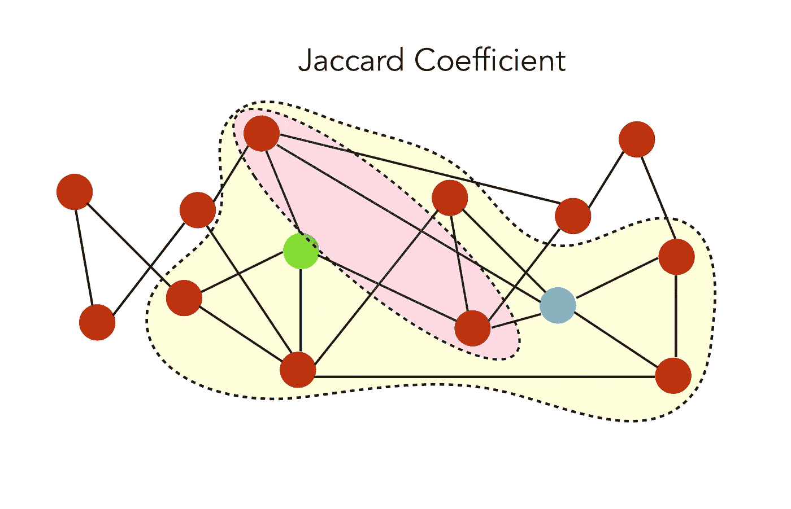

# 用 Python 学习图形(第 3 部分)

> 原文：<https://towardsdatascience.com/learning-in-graphs-with-python-part-3-8d5513eef62d?source=collection_archive---------6----------------------->

## [内线艾](https://medium.com/towards-data-science/inside-ai/home)

## Python 的概念、应用和示例


A wonderful evening in Greenland, back in 2016

G 如今，raphs 正成为机器学习的核心，例如，无论你是想通过预测潜在的联系来了解社交网络的结构，检测欺诈，了解汽车租赁服务的客户行为，还是提出实时建议。

在本文中，我们将讨论:

*   主要的图学习算法
*   Python 中的用例及实现

我在这个资源库上发布我所有的文章和相应的代码:

[](https://github.com/maelfabien/Machine_Learning_Tutorials) [## mael fabien/机器学习教程

### 本报告包含练习、代码、教程和我的个人博客文章

github.com](https://github.com/maelfabien/Machine_Learning_Tutorials) 

这是我的图形系列的最后一篇文章。如果您还没有，请务必阅读本系列的第一篇文章:

[](/introduction-to-graphs-part-1-2de6cda8c5a5) [## 图表介绍(第一部分)

### Python 中的主要概念、属性和应用

towardsdatascience.com](/introduction-to-graphs-part-1-2de6cda8c5a5) [](/graph-algorithms-part-2-dce0b2734a1d) [## 图形算法(第二部分)

### Python 中的主要概念、属性和应用

towardsdatascience.com](/graph-algorithms-part-2-dce0b2734a1d) 

接下来，打开 Jupyter 笔记本，导入以下包:

```
import numpy as np
import random
import networkx as nx
from IPython.display import Image
import matplotlib.pyplot as plt
```

以下文章将使用最新版本的`networkx``2.x`。NetworkX 是一个 Python 包，用于创建、操作和研究复杂网络的结构、动态和功能。

我将尽量保持一种实用的方法，并举例说明大多数概念。

在本文中，我们将讨论图形学习中的三个主要任务:

*   链接预测
*   节点标签预测
*   图形嵌入

先说链接预测！

# I .链接预测

> *在* ***链接预测*** *中，给定一个图 G，我们旨在预测新的边。预测对于* ***预测未来的关系或者缺失的边*** *很有用，例如当图表没有被完全观察到时，或者当新的客户加入一个平台时(例如一个新的 LinkedIn 用户)。*

LinkedIn 新用户的链接预测只是对他可能认识的人的建议。

在链接预测中，我们简单地尝试在成对的节点和**节点之间建立一个相似性度量，链接最相似的** **节点**。现在的问题是识别和计算正确的相似性分数！

为了说明不同的相似性得分，让我们考虑下图:


Initial graph

设 N(i)是节点 I 的一组邻居。在上图中，节点 I 和 j 的邻居可以表示为:


Neighbors of j

和我的邻居:


Neighbors of i

## 1.相似性得分

我们可以基于它们的邻域为这两个节点建立几个相似性分数。

*   **共同邻居:** S(i,j)=∣N(i)∩N(j)∣，即共同邻居的数量。在本例中，分数仅为 12，因为它们只有两个共同的邻居。


Common Neighbors

*   **Jaccard 系数:**一个归一化的共同邻居版本。


交集是共同的邻居，并集是:


Union

因此，Jaccard 系数由粉红色与黄色之比给出:



Jaccard Coefficient

值是 2/7。

*   **Adamic-Adar 索引:**对于节点 I 和 j 的每个共同邻居，我们加 1 除以该节点的邻居总数。其概念是，当预测两个节点之间的连接时，与少量节点之间共享的元素相比，具有非常大的邻域的公共元素不太重要。


*   **优先附件** : S(i,j)=∣N(i,j)∣∗∣N(j)∣
*   我们也可以使用可用的社区信息。

## 2.性能指标

我们如何执行链接预测的评估？我们必须隐藏节点对的子集，并根据上面定义的规则预测它们的链接。这相当于监督学习中的训练-测试-分割。

然后，我们评估密集图形的正确预测比例，或者使用稀疏图形的曲线标准下的面积。

## 3.履行

让我们用 Python 来实现我们在前两篇文章中使用的空手道图！首先，打印关于图形的信息:

```
n = G_karate.number_of_nodes()
m = G_karate.number_of_edges()
print("Number of nodes :", str(n))
print("Number of edges :", str(m))
print("Number of connected components :" str(nx.number_connected_components(G_karate)))
```

然后，绘制图表本身:

```
plt.figure(figsize=(12,8))
nx.draw(G_karate)
```


现在，让我们删除一些连接，例如 25%的节点:

```
# Take a random sample of edges
edge_subset = random.sample(G_karate.edges(), int(0.25 * G_karate.number_of_edges()))# Remove some edges
G_karate_train = G_karate.copy()
G_karate_train.remove_edges_from(edge_subset)
```

并绘制部分观察到的图形:

```
plt.figure(figsize=(12,8))
nx.draw(G_karate_train)
```


Partially observed graph

您可以打印我们删除的边数和剩余的边数:

```
edge_subset_size = len(list(edge_subset))
print("Deleted : ", str(edge_subset_size))
print("Remaining : ", str((m - edge_subset_size)))
```

这个标题是:

```
Deleted : 15
Remaining : 63
```

**雅克卡系数**

我们可以首先使用 Jaccard 系数进行预测:

```
prediction_jaccard = list(nx.jaccard_coefficient(G_karate_train))
score, label = zip(*[(s, (u,v) in edge_subset) for (u,v,s) in prediction_jaccard])
```

预测看起来像这样，第一个节点，第二个节点，和一个 Jaccard 分数(或者直接是一个标签):

```
[(0, 32, 0.15),
(0, 33, 0.125),
(0, 3, 0.21428571428571427),
(0, 9, 0.0),
(0, 14, 0.0),
(0, 15, 0.0),
...
```

我们可以使用 ROC-AUC 标准来比较不同模型的性能，因为我们既有标签又有概率。

**Adamic-Adar**

我们现在可以对 Adamic-Adar 指数重复这一过程:

```
prediction_adamic = list(nx.adamic_adar_index(G_karate_train))
score, label = zip(*[(s, (u,v) in edge_subset) for (u,v,s) in prediction_adamic])
```

**优先附件**

对于优先附件分数:

```
prediction_pref = list(nx.preferential_attachment(G_karate_train))
score, label = zip(*[(s, (u,v) in edge_subset) for (u,v,s) in prediction_pref])
```

然后，我们选择最大化曲线下面积的模型，例如，或您选择的任何其他标准。到目前为止，我们讨论了链接预测最常见的相似性得分。

我们现在将更详细地介绍节点标记算法。

# 二。节点标记

> *给定一个图，其中一些节点没有被标记，我们想要预测它们的标记。这在某种意义上是一个半监督学习问题。*

处理这类问题的一个常见方法是假设图上有某个**平滑度**。*平滑假设*指出，通过数据上高密度区域的路径连接的点*可能具有相似的标签*。这是**标签传播算法**背后的主要假设。

标签传播算法(LPA)是一种快速算法，用于仅使用网络结构作为其向导来在图中发现社区，而不需要任何预定义的目标函数或关于社区的先验信息。


Neo4J Illustration of LPA

单个标签可以在连接密集的节点群中迅速占据主导地位，但在穿越连接稀疏的区域时会遇到困难。

半监督标签传播是如何工作的？

首先我们有一些数据:x1，…，xl，xl+1，…，xn ∈ Rp，前 l 个点的标签:y1，…，yl ∈ 1…C。

我们定义初始标签矩阵 Y ∈ R(n×C ),使得如果 xi 具有标签 yi=j，则 Yij=1，否则为 0。

该算法将生成一个预测矩阵 F∈R(n×C ),我们将在下面详述。然后，我们通过找到最可能的标签来预测节点的标签:


什么是预测矩阵 F？

预测矩阵是最小化平滑度和准确度标准的矩阵 F*。因此，在我们的结果的平滑度和准确性之间有一个折衷。

问题表达比较复杂，就不赘述了。然而，解决方案由下式给出:


如果你想在这个主题上更进一步，检查图函数的光滑性和流形正则化的概念。这部分的实现我就不赘述了，不过如果你感兴趣的话，斯坦福有一组很棒的带标签的图可以下载:[https://snap.stanford.edu/data/](https://snap.stanford.edu/data/)，Networkx 有一个标签传播的直接实现:[https://Networkx . github . io/documentation/latest/reference/algorithms/generated/Networkx . algorithms . community . label _ propagation . label _ propagation _ communities . html](https://networkx.github.io/documentation/latest/reference/algorithms/generated/networkx.algorithms.community.label_propagation.label_propagation_communities.html)

# 三。图形嵌入

当处理 NLP 或计算机视觉问题时，我们习惯于在深度神经网络中嵌入图像或文本。到目前为止，我们所看到的图形的局限性之一是缺少矢量特征。但是，我们可以学习图的一个嵌入！图中有几个嵌入级别:

*   嵌入图形组件(节点、边、特征…) ( [Node2Vec](https://snap.stanford.edu/node2vec/) )
*   嵌入图的子部分或整个图( [Graph2Vec](https://arxiv.org/abs/1707.05005) )

## 1.节点嵌入

我们将首先关注图组件的嵌入。有几种方法可以嵌入节点或边。例如， [DeepWalk](http://www.perozzi.net/projects/deepwalk/) 使用短时间的随机行走来学习图中边的表示。我们会谈到 [Node2Vec](https://snap.stanford.edu/node2vec/) ，一篇由来自斯坦福大学的 Aditya Grover 和 Jure Leskovec 于 2016 年发表的论文。

根据作者的说法:“ **node2vec** 是一个在图上进行表征学习的算法框架。给定任何图形，它都可以学习节点的连续特征表示，然后可以用于各种下游机器学习任务。”

该模型通过使用**随机行走**优化邻域保持目标来学习节点的低维表示。

Node2Vec 的代码在 GitHub 上有:[https://github.com/eliorc/node2vec](https://github.com/eliorc/node2vec)

要安装该软件包，只需运行:

```
pip install node2vec
```

然后，在你的笔记本上，我们会嵌入空手道图:

```
from node2vec import Node2Vec
```

然后，预先计算概率并生成行走:

```
node2vec = Node2Vec(G_karate, dimensions=64, walk_length=30, num_walks=200, workers=4)
```

然后我们可以嵌入节点:

```
model = node2vec.fit(window=10, min_count=1, batch_words=4)
```

要获得一个节点的向量，比如说节点“2”，使用 get_vector:

```
model.wv.get_vector(‘2’)
```

结果具有以下形式:

```
array([-0.03066591,  0.52942747, -0.14170371,  0.5471569 ,  0.07588464, -0.5693364 , -0.3017375 ,  0.21902356,  0.05244258 ...
```

因为我们在上面将维度定义为 64，所以它的长度为 64。我们能用这种嵌入做什么？例如，第一选项之一是识别最相似的节点！

```
model.wv.most_similar(‘2’)
```

它返回最相似节点和相应概率的列表:

```
[('3', 0.6494477391242981),
 ('13', 0.6262941360473633),
 ('7', 0.6137452721595764),
...
```

如果节点有标签，我们可以训练一个基于嵌入的算法并附加一个标签(节点标签，最相似节点…)

## 2.边缘嵌入

边缘也可以被嵌入，并且嵌入可以进一步用于分类。

```
from node2vec.edges import HadamardEmbedder
edges_embs = HadamardEmbedder(keyed_vectors=model.wv)
```

然后，通过指定两个链接节点的名称来检索向量:

```
edges_embs[(‘1’, ‘2’)]
```

哪些标题:

```
array([-8.1781112e-03, -1.8037426e-01,  4.9451444e-02,  2.8731486e-01...
```

同样，我们可以检索最相似的边，这可用于缺失边预测，例如:

```
edges_kv = edges_embs.as_keyed_vectors()
edges_kv.most_similar(str((‘1’, ‘2’)))
```

这个标题是:

```
[("('2', '21')", 0.8726599216461182),
 ("('2', '7')", 0.856759786605835),
 ("('2', '3')", 0.8566413521766663),
...
```

## 3.图形嵌入

也有直接嵌入图或子图的方法。这种方法是在 [Graph2Vec](https://arxiv.org/abs/1707.05005) 论文中开发的，可用于将图形或子图形表示为向量，从而允许图形分类或图形相似性度量。我不会深入研究这种技术，但是可以随意查看这个项目的 Github:

[](https://github.com/benedekrozemberczki/graph2vec) [## benedekrozemberczki/graph2vec

### 《graph2vec:学习图的分布式表示》(MLGWorkshop 2017)的并行实现。…

github.com](https://github.com/benedekrozemberczki/graph2vec) 

要运行嵌入，非常简单:

```
python src/graph2vec.py --input-path data_folder/ --output-path output.csv
```

# 四。更进一步

我们现在已经介绍了图的介绍、图的主要类型、不同的图算法、它们在 Python 和 Networkx 中的实现，以及用于节点标记、链接预测和图嵌入的图学习技术。

不用说，这只是冰山一角。图论正在不断扩展，我认为列出一些资源会有所帮助:

*   图卷积网络:[https://towards data science . com/how-to-do-deep-learning-on-graphs-with-graph-convolutionary-Networks-7d 2250723780](/how-to-do-deep-learning-on-graphs-with-graph-convolutional-networks-7d2250723780)
*   图形和流形上的几何深度学习:【http://www.geometricdeeplearning.com/ T3
*   一个可能有所帮助的 MOOC:[https://www . EDX . org/course/advanced-algorithmics-and-graph-theory-with-python](https://www.edx.org/course/advanced-algorithmics-and-graph-theory-with-python)

如果你有任何你认为有用的资源，不要犹豫留下评论，我会把它添加到列表中！

我希望这一系列的文章是有趣的后续！如果您有任何问题或意见，请随时评论。

注:本文最初发表在我的个人博客:[https://maelfabien.github.io/](https://maelfabien.github.io/ml/#)

## 来源:

*   Neo4j 中的图形算法综合指南
*   网络 x 文档，[https://networkx.github.io/documentation/stable/](https://networkx.github.io/documentation/stable/)
*   巴黎电信的图论课程