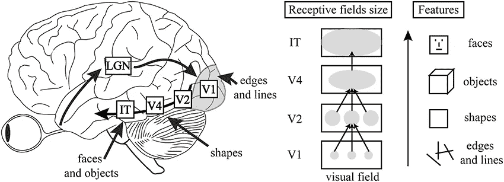
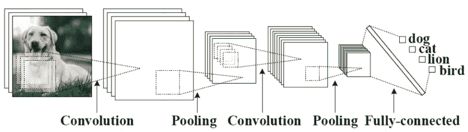
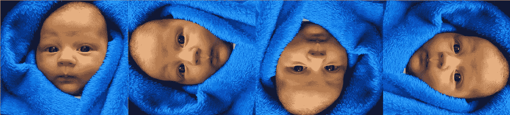
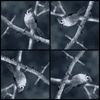
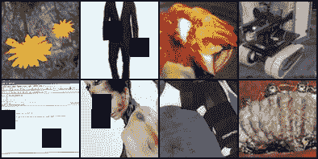
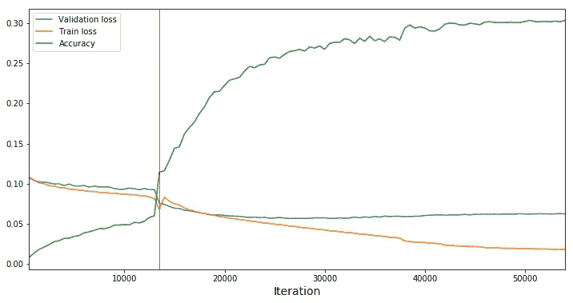
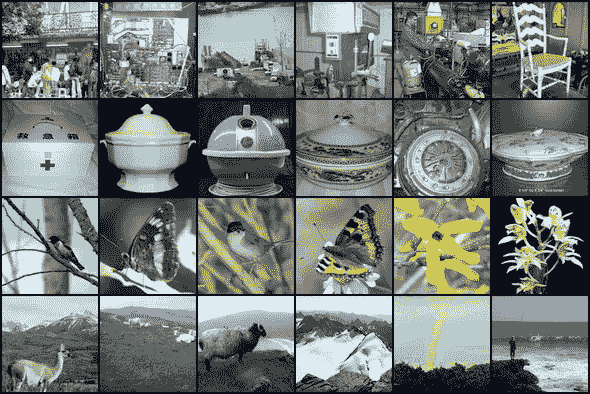
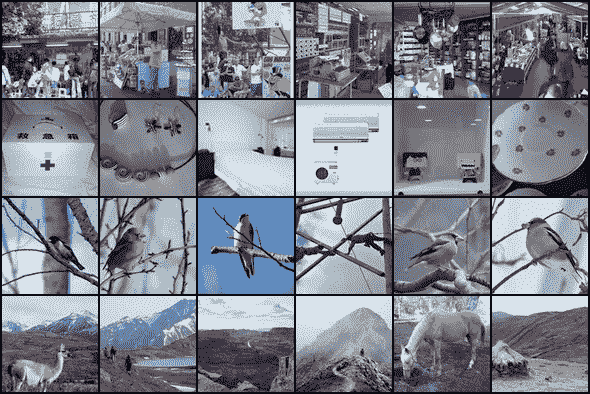
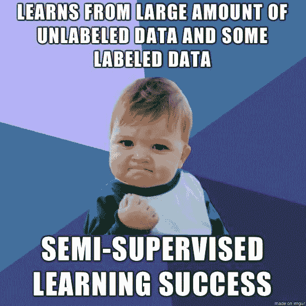

# 像婴儿一样学习

> 原文：<https://towardsdatascience.com/learning-like-babies-image-classification-using-semi-supervised-learning-ccfb5b391d1f?source=collection_archive---------18----------------------->

## [内部 AI](https://medium.com/towards-data-science/inside-ai/home)

## 基于半监督学习的图像分类

*Features of visual hierarchy*

Simple CNN architecture for image classification

[卷积神经网络](https://en.wikipedia.org/wiki/Convolutional_neural_network)(CNN)，一个为图像分类取得最大性能的概念，其灵感来自于**哺乳动物的视觉皮层系统。**尽管自动化计算机视觉系统取得了非凡的进步，但图像分类架构的大部分成功都来自标记数据。问题是现实世界的大部分数据都没有标注。

根据 CNN 之父、NYU 大学教授 Yann LeCun 的说法，人工智能的下一个“大事”是[半监督学习](https://en.wikipedia.org/wiki/Semi-supervised_learning)——一种利用未标记数据进行训练的机器学习任务——通常是少量已标记数据和大量未标记数据。这就是为什么最近大量的研究工作集中在无监督学习上，而没有利用大量昂贵的监督。

> “革命不会被监督”——阿廖沙·埃夫罗斯

受这个概念的启发，我们在 NYU 大学的班级举办了一场比赛，从 ImageNet 的 512k 未标记图像和 64k 标记图像中设计半监督算法。

半监督学习实际上是婴儿最常用的学习方法。当我们出生时，我们不知道世界是如何运作的:我们不区分重力，我们不理解深度，更不认识人类的表情。人脑大多以无监督或半监督的方式吸收数据。

Babies learn orientation unconsciously from a very early age. This can be considered ‘semi-supervised learning’.

# 方法:通过预测图像旋转的半监督表示学习

为了竞争，我们的算法[采用的方法识别应用于输入图像【2】的 2d 旋转](http://arxiv.org/abs/1803.07728)。在某种程度上，这类似于婴儿如何通过经验学习看世界。例如，随着时间的推移，婴儿会习惯于物体如何站立，山脉如何位于天空之下。事实证明，即使是这种简单的图像旋转任务也能让网络学习与监督任务相关的特征。

我们使用 [ResNet 架构](http://arxiv.org/abs/1512.03385)(更具体地说是 ResNet-50)进行最终提交。ResNet 模型在许多分类数据集上实现了一流的性能。此外，ResNet 剩余单元在某些条件下是可逆的，这可能有助于保存作为预训练的[结果而获得的来自网络早期层的信息。我们利用一大组未标记的图像来预训练关于旋转预任务的 ResNet-50 模型。该模型的目标是预测每个输入图像的四个旋转角度(0、90、180、270)之一。作为在这个辅助任务上训练模型的结果，我们期望它学习在主要分类任务中有帮助的特征。](http://arxiv.org/abs/1901.09005)

Semi-supervised learning using image rotation (left) and data augmentation (right)

经过预训练后，我们在这个特征提取器的顶部为主要任务训练了一个线性分类器，并通过从顶部开始逐步解冻各层来微调整个网络。我们还使用了数据扩充。与以前的模型相比，这种策略大大提高了准确性。

# 结果

下图显示了训练和验证损失曲线，以及训练过程中最终模型的准确性。红线表示从仅训练线性分类器切换到微调整个网络的时刻。

Train loss, validation loss and accuracy for the final submission

下图显示了验证数据集中 4 个随机图像的最近邻(第一列)。可以看出，半监督旋转模型清楚地设法学习图像的有意义的表示。

Nearest neighbors in the validation dataset: Semi-supervised model (left) and Supervised model (right). As it can be seen, semi-supervised rotation model (with rotation labels) shown on the left managed to learn meaningful representations of the images.

最终的前 1 名验证准确率为 32.4%。总之，我们可以得出结论，对未标记数据的半监督预训练有助于提高主要分类任务的准确性。然而，与在现有的大型标记数据集(如 ImageNet)上进行预训练相比，半监督训练的益处有多大尚不清楚。

更多信息，你可以参考我们的[论文](https://drive.google.com/file/d/1eWMGgjFpzGgz8Z06cLlQ8gh62YmnuNBX/view?usp=sharing)。

*本项目由叶夫根尼·尼基丁、@sunor.yavuz、* [*曼里克*](https://medium.com/u/3ae9949137f2?source=post_page-----ccfb5b391d1f--------------------------------) 开发

**参考文献**

[1] Carl Doersch、Abhinav Gupta 和 Alexei A. Efros。基于上下文预测的无监督视觉表征学习。参加 2015 年计算机视觉国际会议(ICCV)。[2]斯皮罗斯·吉达里、普拉维尔·辛格和尼科斯·科莫达基斯。通过预测图像旋转的无监督表示学习。CoRR，abs/1803.07728，2018。
[3]艾丹·戈麦斯、叶萌·任、拉克尔·乌尔塔松和罗杰·b·格罗斯。可逆残差网络:不存储激活的反向传播。更正，abs/1707.04585，2017。【四】何、、、任、。用于图像识别的深度残差学习。更正，abs/1512.03385，2015 年。
[5]何、、任、。深剩余网络中的身份映射。更正，abs/1603.05027，2016。
[6]亚历山大·科列斯尼科夫，翟晓华，和卢卡斯·拜尔。重新审视自我监督的视觉表征学习。澳大利亚统计局/1901.09005，2019。
【7】塞巴斯蒂安·鲁德。梯度下降优化算法综述。更正，abs/1609.04747，2016。
【8】谢尔盖·扎戈鲁伊科和尼科斯·科莫达基斯。广泛的剩余网络。更正，abs/1605.07146，2016。