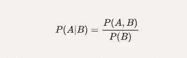
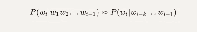
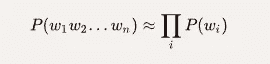
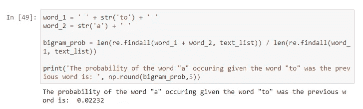
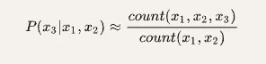
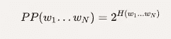
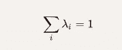

# 用真实数据学习 NLP 语言模型

> 原文：<https://towardsdatascience.com/learning-nlp-language-models-with-real-data-cdff04c51c25?source=collection_archive---------5----------------------->

语言模型(LMs)估计不同短语的相对可能性，并且在许多不同的自然语言处理应用(NLP)中是有用的。例如，它们已经被用于 Twitter 机器人的“机器人”帐户，以形成自己的句子。

在本帖中，我们将首先正式定义 LMs，然后演示如何用真实数据计算它们。下面的 **Kaggle 笔记本**中用代码完整演示了所有显示的方法。

[https://www . ka ggle . com/osbornep/education-learning-language-models-with-real-data](https://www.kaggle.com/osbornep/education-learning-language-models-with-real-data)

Source: [https://www.pexels.com/photo/man-standing-infront-of-white-board-1181345/](https://www.pexels.com/photo/man-standing-infront-of-white-board-1181345/)

# 第 1 部分:定义语言模型

概率语言建模的目标是计算单词序列的句子的概率:

并且可以用于找到序列中下一个单词的概率:

计算其中任何一个的模型被称为**语言模型**。

# 计算概率的初始方法

## 定义:条件概率

设 A 和 B 是 P(B) =/= 0 的两个事件，给定 B 的条件概率为:

## 定义:链式法则

一般情况下，公式如下:

**因此，应用于计算序列中单词的结合概率的链规则是:**

例如:

这需要大量的计算，难道我们不能简单地通过计算和划分结果来估算吗，如下式所示:

总的来说，没有！在这种方法中有许多可能的句子需要计算，我们希望有非常稀疏的数据使结果不可靠。

# 方法采用马尔可夫假设

## 定义:马尔可夫性质

*如果随机过程的未来状态的条件概率分布(取决于过去和当前状态)仅取决于当前状态，而不取决于之前的事件序列，则该随机过程具有马尔可夫性质。具有这种性质的过程称为马尔可夫过程。*(维基百科)

换句话说，仅给定前 *k* 个单词，就可以估计出下一个单词的概率。

例如，如果 *k=1* :

或者如果 *k=2* :

**马尔可夫假设的一般方程， *k=i* :**

# n 元模型

根据马尔可夫假设，我们可以正式定义 N 元模型，其中 *k = n-1* 如下:

其最简单的版本被定义为一元模型(k = 1)和二元模型(k=2)。

## 单字模型(k=1):

## 二元模型(k=2):

这些等式可以扩展到计算三元模型、4 元模型、5 元模型等。总的来说，这是一个不充分的语言模型，因为**句子通常有长距离依存**。例如，一个句子的主题可能在开头，而我们要预测的下一个单词出现在 10 个单词之后。

## 使用最大似然估计来估计二元模型概率；

## 小例子

给定一个包含以下三个句子的语料库，我们希望找到“I”开始该句子的概率。

~~~~~~其中“~~”分别表示句子的开始和结束。~~~~~~~~

~~~~~~因此，我们有:~~~~~~

~~~~~~~~~~~~

~~~~~~换句话说，这个句子在我们的语料库中出现了三次，“I”作为第一个词出现。~~~~~~

# ~~~~~~第 2 部分:将语言模型应用于真实数据~~~~~~

# ~~~~~~数据源和预处理~~~~~~

~~~~~~在这次演示中，我们将使用由斯坦福大学[提供的 IMDB 大型电影评论数据集。该数据包含评审者给出的评级、极性和完整注释。](http://ai.stanford.edu/~amaas/data/sentiment/)~~~~~~

~~~~~~~~~~~~

~~~~~~例如，第一条负面评论全文如下:~~~~~~

~~~~~~~~~~~~

~~~~~~首先，我们将完整的注释转换成单独的句子，为句子的开头和结尾引入符号，并通过删除任何标点符号和小写所有单词来清理文本。~~~~~~

~~~~~~~~~~~~

## ~~~~~~单字模型~~~~~~

~~~~~~因为这是最容易计算的，我们可以找到每个单词出现的概率，用它来估计整个句子出现的概率，如下所示:~~~~~~

~~~~~~~~~~~~

~~~~~~或者，我们可以通过对数规则使用对数来计算，以下情况成立:~~~~~~

~~~~~~~~~~~~

~~~~~~我们这样做是因为加法的计算速度通常比乘法快。~~~~~~

~~~~~~例如，使用 unigram 模型，我们可以计算以下单词的概率。~~~~~~

~~~~~~~~~~~~

## ~~~~~~二元模型~~~~~~

~~~~~~一元模型可能不准确，因此我们引入二元模型估计。应用这个有点复杂，首先我们在单词-单词矩阵中找到每个单词的共现。然后，计数通过前一个字的计数进行归一化，如下式所示:~~~~~~

~~~~~~~~~~~~

~~~~~~因此，举例来说，如果我们想改进前面显示的 P(a|to)的计算，我们首先计算(to，a)的出现次数，然后除以(t0)的出现次数。~~~~~~

~~~~~~~~~~~~

~~~~~~同样地，如果我们把第一个单词改成“has”:~~~~~~

~~~~~~~~~~~~

~~~~~~如前所述，为了正确利用二元模型，我们需要计算所有单词对出现的单词-单词矩阵。有了这个，我们可以找到最有可能跟随当前单词的单词。然而，如果语料库很大，这也需要额外的时间量，因此最好根据需要为单词计算这一点，而不是穷尽地这样做。~~~~~~

~~~~~~~~~~~~

~~~~~~有了这个，我们就可以找到一些跟在给定单词后面的最有可能的单词的例子:~~~~~~

~~~~~~~~~~~~~~~~~~~~~~~~~~~~~~~~~~~~

~~~~~~一些单词后面有许多可能的单词，但是其他的，例如“非自然的”只有一个。这可能是因为这个词很少出现在第一个地方。~~~~~~

## ~~~~~~用概率造句~~~~~~

~~~~~~这些计算可以用来构成基本句子。我们将把句子的开头和结尾固定在各自的符号“~~”上，并将改变从单词-单词矩阵中选择的列，从而使句子变得不同。~~~~~~~~

~~~~~~即使是‘在运行中’计算下一个单词，这样做所需的时间也特别多。例如，即使是我机器上的一个句子也要花将近两个小时来计算:~~~~~~

~~~~~~~~~~~~

~~~~~~手动检查这些概率，我们发现这些词非常有可能，例如:~~~~~~

~~~~~~~~~~~~

## ~~~~~~三克及以上！~~~~~~

~~~~~~如果我们继续估计方程，我们可以形成一个三元模型:~~~~~~

~~~~~~~~~~~~

~~~~~~例如:~~~~~~

~~~~~~~~~~~~

~~~~~~**因此，三字短语“to a movie”比“to a movie”更常用，是我们的算法在造句时会选择的短语。**~~~~~~

# ~~~~~~第 3 部分:训练和测试语言模型~~~~~~

~~~~~~用于训练我们的 LMs 的语料库将影响输出预测。因此，我们需要引入一种方法来评估我们训练有素的 LMs 表现如何。训练最好的 LM 是能够在未知的测试集中正确预测句子的下一个单词的 LM。~~~~~~

~~~~~~这可能非常耗时，构建多个 LMs 进行比较可能需要几个小时的计算时间。因此，我们介绍一下**困惑**的内在评价方法。简而言之，困惑是对概率分布或概率模型预测样本的程度的一种度量。~~~~~~

## ~~~~~~定义:困惑~~~~~~

~~~~~~困惑度是由单词数归一化的测试集的逆概率，更具体地，可以由以下等式定义:~~~~~~

~~~~~~~~~~~~

~~~~~~例如，假设一个句子由随机数字[0–9]组成，通过为每个数字分配相等概率(即 P=1/10)的模型，这个句子的困惑是什么？~~~~~~

~~~~~~~~~~~~

## ~~~~~~力学和信息论中的熵~~~~~~

~~~~~~在力学中，玻尔兹曼定义了一个系统的熵与微观状态数量的自然对数有关:~~~~~~

~~~~~~~~~~~~

~~~~~~w 是微状态的数量，计算公式如下:~~~~~~

~~~~~~~~~~~~

~~~~~~其中 n 是位置的数量，x 是分子的数量。~~~~~~

~~~~~~在信息论中，随机变量 X 的熵(表示为 H(X))是由下式定义的预期对数概率:~~~~~~

~~~~~~~~~~~~

~~~~~~并且是不确定性的量度。~~~~~~

~~~~~~**换句话说，熵就是一个系统可能存在的状态的数量。**~~~~~~

## ~~~~~~例子:有偏向的掷硬币的熵~~~~~~

~~~~~~假设掷硬币时正面和反面的概率定义为:~~~~~~

*   ~~~~~~头=头=头~~~~~~
*   ~~~~~~P(尾部)= 1 P(尾部)= 1 P~~~~~~

~~~~~~那么它的熵就是:~~~~~~

~~~~~~~~~~~~

~~~~~~如果硬币是公平的，即 p = 0.5，那么我们有:~~~~~~

~~~~~~~~~~~~

~~~~~~不同偏倚概率下的全熵分布如下所示。~~~~~~

~~~~~~~~~~~~

# ~~~~~~语言的熵~~~~~~

~~~~~~~~~~~~

## ~~~~~~困惑与熵~~~~~~

~~~~~~~~~~~~

~~~~~~例如:~~~~~~

~~~~~~~~~~~~

# ~~~~~~第 4 部分:拟合语言模型的挑战~~~~~~

~~~~~~由于 LMs 的输出依赖于训练语料库，只有当训练语料库类似于测试数据集并且我们在训练中有过度拟合的风险时，N-grams 才工作良好。~~~~~~

~~~~~~与任何机器学习方法一样，我们希望结果能够概括新信息。~~~~~~

~~~~~~更难的是我们如何处理那些甚至没有出现在训练中但出现在测试数据中的单词。~~~~~~

# ~~~~~~训练中零计数的处理:拉普拉斯+1 平滑~~~~~~

~~~~~~为了处理在训练中看不到的单词，我们可以引入加法平滑。为此，我们只需在每个单词的计数上加 1。~~~~~~

~~~~~~这稍微改变了分布，通常用于文本分类和零的数量不多的领域。然而，这并不经常用于 n-gram，相反，我们使用更复杂的方法。~~~~~~

~~~~~~首先，让我们从原始数据中创建一个虚拟的训练语料库和测试集。在我们的例子中，我们发现小测试集中包含的 25%的单词没有出现在我们有限的语料库中。~~~~~~

~~~~~~因此，我们通过将这些看不见的单词添加到训练集中并对所有计数加 1 来应用拉普拉斯+1 平滑:~~~~~~

~~~~~~~~~~~~

## ~~~~~~进一步的平滑方法~~~~~~

~~~~~~拉普拉斯+1 平滑用于文本分类和零点数量不多的领域。然而，它并不经常用于 n-gramss，一些更好的 n-gram 平滑方法有:~~~~~~

*   ~~~~~~加法-k 拉普拉斯平滑~~~~~~
*   ~~~~~~好图灵~~~~~~
*   ~~~~~~肯泽内伊~~~~~~
*   ~~~~~~威滕-贝尔公司~~~~~~

# ~~~~~~第 5 部分:选择要使用的语言模型~~~~~~

~~~~~~我们已经介绍了前三种最小均方模型(一元模型、二元模型和三元模型),但是哪一种最好用呢？~~~~~~

~~~~~~三元模型通常提供比二元模型更好的输出，二元模型提供比一元模型更好的输出，但是随着我们增加复杂性，计算时间变得越来越长。此外，当我们增加 n 时，可用的数据量减少(即，在 10-gram 中可用的下一个单词将比二元模型少得多)。~~~~~~

# ~~~~~~后退方法~~~~~~

~~~~~~如果有充分的证据，使用三元模型(或更高的 n 元模型)，否则使用二元模型(或其他更简单的 n 元模型)。~~~~~~

# ~~~~~~插入文字~~~~~~

~~~~~~在插值中，我们使用 n 元模型的混合。~~~~~~

## ~~~~~~简单插值:~~~~~~

~~~~~~~~~~~~

~~~~~~在哪里~~~~~~

~~~~~~~~~~~~

~~~~~~为了计算 lambdas，使用语料库的保留子集并尝试参数，直到找到最大化保留数据概率的组合。~~~~~~

## ~~~~~~小例子~~~~~~

~~~~~~假设我们得到以下语料库:~~~~~~

~~~~~~~~~~~~~~~~~~~~~~~~~~~~~~~~~~~~~~~~

## ~~~~~~~~~~IMDB 数据示例~~~~~~~~~~

~~~~~~~~~~我们再次应用公式:~~~~~~~~~~

~~~~~~~~~~~~~~~~~~~~

~~~~~~~~~~使用先前从 IMDB 源定义的语料库，我们将其中的一个小子集(10%)作为“保留”集。~~~~~~~~~~

~~~~~~~~~~测试一系列可能的λ值(注意λ1 + λ2 = 1)，我们发现如下:~~~~~~~~~~

~~~~~~~~~~~~~~~~~~~~

~~~~~~~~~~因此，本例的最佳λ值为:~~~~~~~~~~

~~~~~~~~~~λ1 = 0~~~~~~~~~~

~~~~~~~~~~λ2 = 1~~~~~~~~~~

~~~~~~~~~~我希望这为您提供了一个不错的语言模型介绍，并且代码有助于您的学习。~~~~~~~~~~

~~~~~~~~~~谢谢~~~~~~~~~~

~~~~~~~~~~哲学（philosophy 的缩写）~~~~~~~~~~