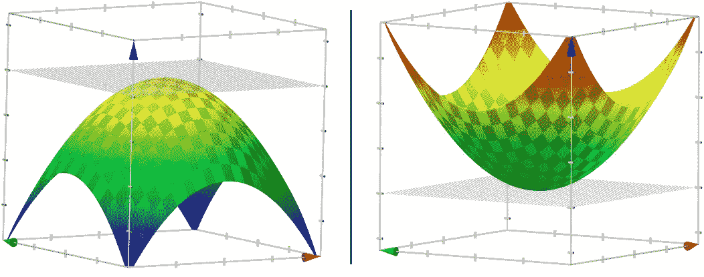

# 学习参数，第 0 部分:基本知识

> 原文：<https://towardsdatascience.com/learning-parameters-part-0-5cfffd647bdc?source=collection_archive---------23----------------------->

## 快速浏览一些对理解参数如何学习至关重要的基本内容。

这是我写的关于学习参数的 5 部分系列的可选读物。在这篇文章中，你会发现一些基本的东西，你需要了解我的其他博客文章，关于深度神经网络如何更好地学习它们的参数。你可以点击这个帖子顶部的踢球者标签查看 ***学习参数*** 系列的所有帖子。

我们将简要了解以下主题:

1.  多元函数
2.  局部最小值与全局最小值
3.  理解梯度
4.  成本或损失函数
5.  等高线地图

# 1.多元函数

多变量函数就是其输入和/或输出由多个数字/变量组成的函数。例如 *f(x，y) = z= x + y .*

Fig1\. z = x² + y² graph by Google. **Image Source:** Google the equation.

具有多个输出的函数也称为多变量函数，但它们在这里无关紧要。

# 3.理解梯度

术语“梯度”只是指多变量函数的导数的一种奇特方式。虽然可以为单变量函数定义导数，但对于多变量函数，梯度取而代之。梯度是向量值函数，而导数是标量值函数。

单变量函数的导数，用***【f’【x】****或****df*/*dx****，*表示，告诉我们一个输入单位变化，函数值变化多少。但是如果一个函数有多个输入 ***x*** 和 ***y*** ，我们需要知道这个函数的值分别相对于 ***x*** 和 ***y*** 变化了多少，即， 当*x***y***保持不变时 ***f(x，y)*** 变化多少，以及当*y*保持不变时 ***x*** 变化多少。 这些被称为函数的*偏导数*通常分别用**∂*f*/*∂x****和****∂f*/∂y**表示当你把这两个无辜的标量放入一个向量中时，用∇ ***f*** 表示！*******

**

## *渐变的属性*

*还有很多属性，但让我们只关注两个必要的属性:*

*   *梯度指向函数增长最大的方向。*
*   *在局部最大值或局部最小值处为零(因为没有单一的增加方向)*

*第一个性质说，如果你想象站在 *f* 的输入空间中的一个点 *(x，y)* ，向量∇ *f* ( *x* ， *y)* 告诉你应该向哪个方向行进才能最快速地增加 *f* 的值。这显然适用于 N 次方。当我第一次在学校了解到这一点时，并不清楚为什么会这样，但请查看 Khan Academy 上的这些[视频](https://www.khanacademy.org/math/multivariable-calculus/multivariable-derivatives#partial-derivative-and-gradient-articles)以了解更多信息。*

*为了理解第二个性质，我们需要直观地知道什么是导数。直线的导数是直线的斜率，曲线在任一点的导数是曲线在该点的切线的斜率。*

**

***y(x)=x²-3x+3** with the tangent line through the point **(3,3)**. **Image Source:** [5]*

*对于两个变量的函数(一个曲面)，在一个给定点有多条线与曲面相切。如果我们有一个足够好的函数，所有这些线形成一个平面，称为曲面在该点的切平面。*

**

*The tangent plane to the surface ***z=-x²-y²*** at the point **(0,2)**. **Image Source:** [5]*

*我相信你可以说服自己，这个平面在表面的最大值，即在表面的尖端，将平行于***XY***-平面，这表明切线的斜率最大为 0。如果不能，看下面。*

**

*The tangent planes to the surfaces **z=-x²-y²** and **z=x²+y²** at their maximum and minimum respectively.*

# *3.成本/损失函数*

*可以说，在训练神经网络时，你最想关心的价值是损失/成本。它衡量模型与数据拟合的“好”或“坏”程度。任何 GD like 算法的主要目标是找到产生最小成本的参数集。围绕参考文献的所有戏剧性事件，如“寻找最小值”、“在误差面上行走”，都只是在谈论以一种我们最终获得最小可能成本函数值的方式来调整参数。您可以将成本函数视为以模型权重为参数的多变量函数。试着不要想超过 2 个参数——你知道为什么！*

*有很多方法可以构建你的损失函数。不同类型的问题(分类和回归)可以有不同类型的损失函数，这些函数最好地代表了模型的性能，这是另一天，另一篇文章。目前，这种直觉足以理解故事的其余部分。你可以看 Siraj Raval 的这个视频[6]来了解更多关于损失函数的知识。*

# *4.局部最小值与全局最小值*

*在图 1 中，你看到了多少个“最小值”？我只看到一个。多好啊！如果你的损失函数看起来像这样，你可以从图上的任何地方开始下降(我的意思是，不断改变你的参数)，旁边有一个可靠的向导(咳咳梯度下降咳咳)，很有可能你会在表面上那个甜美的深绿色点结束。太糟糕了，当优化最小的网络时，你最终会遇到的错误可能会更糟糕，从某种意义上来说，更可怕。*

**

*Fig2\. Not so friendly cost function eh? **Image Source:** [1]*

*在许多实际情况下，你要达到的最小值很大程度上取决于你开始下降的点。如果你在一个山谷附近开始下降，GD 算法肯定会强迫你进入那个山谷(局部最小值)，但真正的最小值(全局最小值)可能在地表的其他地方。*

*看看两个最流行的神经网络的成本函数，VGG-56 和 VGG-110。*

**

*Fig3\. “Bumpier” and “scarier” cost functions of VGG-56 and VGG-110 networks. **Image Source:** [3]*

> *停下来深思！！
> 你怎么可能用 3D 的方式来可视化一个“大”网络的成本函数？大型网络通常有数百万个参数，这怎么可能呢？阅读参考文献中链接的论文来找出答案。*

# *5.轮廓*

*在三维空间中可视化有时会有点麻烦，等值线图是一种方便的替代方法，可以用二维输入和一维输出来表示函数。用图表解释比用文字解释更容易。*

**

*Fig4\. Step Wise Illustration Of Contour Mapping Process. **Images Taken From** [7]*

## *等高线绘制过程*

***第一步:**从函数的图形开始。
**第二步:**用平行于输入平面的不同高度的平面，按规则的间隔将其切片。
**第三步:**在图上标出平面所经过的所有地方。
**第四步:**将标记投影到二维平面上，标注相应的平面高度，并相应地映射。*

## *关键要点*

*   *等高线之间的小距离表示沿该方向的陡坡*
*   *等高线之间的大距离表示沿该方向的缓坡*

**

*Fig5. **Image Source:** Wikipedia*

## *测试你的理解能力*

*如果你仍然不能完全理解等高线地图的概念，那也没关系。您可以通过猜测以下等高线图的三维图(不看图 6 右栏中的解决方案)来测试您的理解。*

**

*Fig6\. Test Your Understanding! **Image Source:** [8]*

*请阅读汗学院的这篇精彩文章[7]以了解更多关于等值线图的信息。*

*查看本系列的下一篇文章:*

*   *[学习参数，第一部分:梯度下降。](/learning-parameters-part-1-eb3e8bb9ffbb)*

# *参考*

1.  *[深度学习的难点](https://math.oregonstate.edu/home/programs/undergrad/CalculusQuestStudyGuides/vcalc/tangent/tangent.html)，[雷扎·扎德](https://www.oreilly.com/people/4a99a-reza-zadeh)。*
2.  *[深度学习中的优化介绍:梯度下降](https://blog.paperspace.com/intro-to-optimization-in-deep-learning-gradient-descent/)， [Ayoosh Kathuria](https://blog.paperspace.com/author/ayoosh/) 。*
3.  *[可视化神经网络的损失景观](https://www.cs.umd.edu/~tomg/projects/landscapes/)，CS-UMD。*
4.  *[梯度下降优化算法概述](http://ruder.io/optimizing-gradient-descent/index.html)，[塞巴斯蒂安·鲁德](http://ruder.io/)。*
5.  *[切面和全微分](https://math.oregonstate.edu/home/programs/undergrad/CalculusQuestStudyGuides/vcalc/tangent/tangent.html)，俄勒冈州立大学。*
6.  *[损失函数解释](https://www.youtube.com/watch?v=IVVVjBSk9N0)，Siraj Raval。*
7.  *[等高线图(篇)](https://www.khanacademy.org/math/multivariable-calculus/thinking-about-multivariable-function/ways-to-represent-multivariable-functions/a/contour-maps)，可汗书院。*
8.  *[CS7015:深度学习，印度理工学院](https://www.cse.iitm.ac.in/~miteshk/CS7015.html)，马德拉斯。*