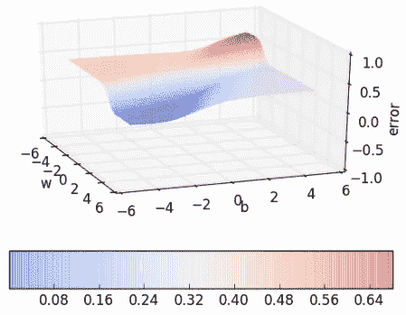
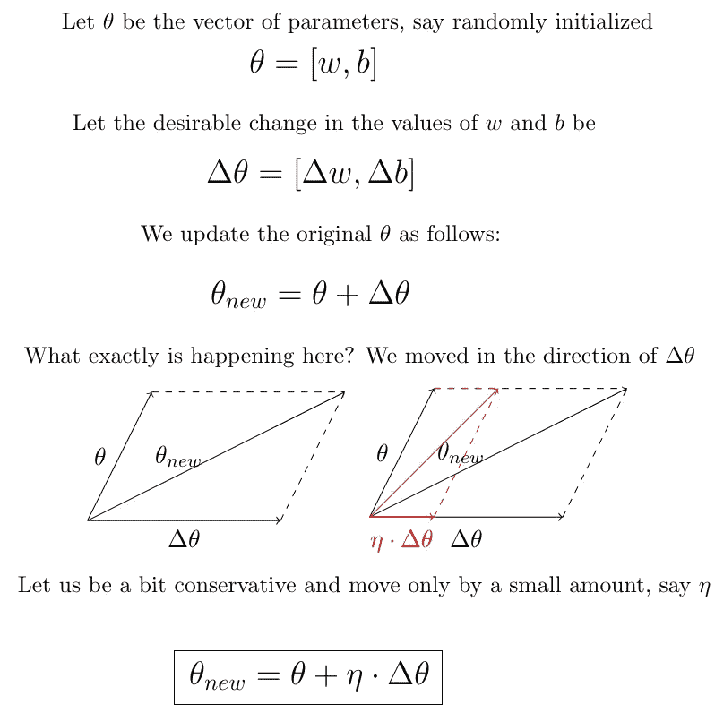

# 学习参数，第 1 部分:梯度下降

> 原文：<https://towardsdatascience.com/learning-parameters-part-1-eb3e8bb9ffbb?source=collection_archive---------14----------------------->

## [学习参数](https://towardsdatascience.com/tagged/learning-parameters)

## 梯度下降是一种迭代优化算法，用于寻找函数的(局部)最小值。

梯度下降是最优化中最流行的技术之一，非常常用于训练神经网络。给定基本微积分的正确背景，它是直观的和可解释的。看一看我的这篇博客文章— [第 0 部分](/learning-parameters-part-0-5cfffd647bdc)，它涵盖了更好地理解这个系列所需的一些先决条件。你可以点击这个帖子顶部的标签查看 ***学习参数*** 系列的所有帖子。

在这篇博文中，我们用一个玩具神经网络来建立梯度下降的动机。我们还从零开始推导梯度下降更新规则，并使用相同的玩具神经网络解释几何发生的事情。

> 引用说明:本博客中的大部分内容和图表直接取自 IIT 马德拉斯大学教授 Mitesh Khapra 提供的深度学习课程第 5 讲。

# 陈腐的比喻

想象你站在一座山上，有很多可能的路径可供你下山。梯度下降(GD)简单来说就是给你一个下山的原则性方法。

全球动力局鼓励你首先找到一个方向，在这个方向上，山有最陡的上升，并要求你去完全相反的方向。你可能会说这个看似简单的想法并不总是有效。你是对的，GD 可以让你走得慢，即使是在平坦的地面上(当你可以跑的时候)，但是我们会在文章的最后解决这个限制。

# 动机

以一个玩具为例，假设我们想要训练一个只有一个神经元的玩具神经网络。前提是:

训练目标是找到使函数***L(w，b)*** 输出其最小值*的**和* ***b*** 的最佳组合。**

**

*现在，训练一个网络意味着什么？假设我们用( *x，y* ) *=* (0.5，0.2) 和(2.5，0.9)训练玩具网络，在训练结束时，我们期望找到*******和 ***b**** 使得 *f* (0.5)输出 0.2 和 *f* (2.5)我们希望看到一个 sigmoid 函数，使得(0.5，0.2)和(2.5，0.9)位于 sigmoid 上。*

## *你永远不会做的暴力行为*

*我们能不能试着手动找到这样一个***w *******b ****？让我们试着随机猜测一下..(假设 w = 0.5，b = 0)*

**

*我们继续猜。我们走吧。*

**

## *你永远不会做的事情的几何解释*

*我们能把猜测形象化吗？我们可以！由于我们只有 2 个点和 2 个参数 ***(w，b)*** ，我们可以很容易地为 ***(w，b)*** 的不同值绘制***【L(w，b)】***，并选择其中***【L(w，b)*** 最小的一个。*

****

*但是当然，一旦有了更多的数据点和更多的参数，这就变得棘手了！此外，这里我们只绘制了来自(6，6)的 ***(w，b)***的小范围误差表面，而不是来自(inf，inf)的误差表面。梯度下降救援！*

# *梯度下降*

*如果还不清楚，手头的任务就是找到使损失函数最小的最佳参数组合。梯度下降为我们提供了一种遍历误差面的原则性方法，这样我们就可以快速达到最小值，而无需诉诸蛮力搜索。*

## *推导梯度下降规则*

*合理的做法是随机初始化 ***w*** 和 ***b*** ，然后以**最佳方式**迭代更新它们，以达到我们最小化损失函数的目标。让我们用数学来定义它。*

**

*但是我们如何找到 *θ* 中最‘想要’的变化呢？什么是正确的**δ***θ*使用？答案来自于 [**泰勒级数**](http://fourier.eng.hmc.edu/e176/lectures/NM/node45.html) 。*

**

*这意味着我们要移动的方向 *u* 或***δ***θ*应该与坡度成 180 度角。在损失面上的给定点，我们的移动方向与该点损失函数的梯度方向相反。这就是黄金梯度下降法则！！**

## **权重/参数更新规则**

****

## **算法**

**既然我们在 ***w-b*** 平面上有了比我们的蛮力算法更有原则的移动方式。让我们根据这个规则创建一个算法…**

****

# **梯度下降在行动**

**为了在实践中看到 GD，我们首先必须为我们的玩具神经网络导出∇ ***w*** 和∇ ***b*** 。如果你算出来，你会看到它们如下:**

****

## **Python 代码**

## **几何解释**

**让我们从误差面上的一个随机点开始，看看更新情况。**

****

# **限制**

**原始形式的梯度下降有一个明显的缺点。让我们看一个示例曲线 *f(x) = x + 1，*如下所示:**

****

*   **当曲线很陡时，梯度(∇y1/∇x1)很大。**
*   **当曲线平缓时(∇y2/∇x2)很小。**

**回想一下，我们的权重更新与梯度 ***w = w — η∇w*** *成正比。*因此，在曲线平缓的区域，更新较小，而在曲线陡峭的区域，更新较大。让我们看看当我们从曲面上的不同点开始时会发生什么。**

****

**不管我们从哪里开始，一旦我们碰到一个缓坡的表面，前进的速度就会减慢。由于这个原因，训练方法可能永远无法收敛。**

# **结论**

**在这篇博文中，我们用一个玩具神经网络来强调梯度下降的必要性。我们还从零开始推导梯度下降更新规则，并使用相同的玩具神经网络以几何方式解释每次更新发生的情况。我们还解决了 GD 的一个重要限制，在平缓区域减速的问题，以曲线图示的原始形式。*基于动量的梯度下降*通过让最近梯度更新的“动量”控制当前步骤中的更新幅度，在一定程度上克服了这个缺点。**

**请阅读本系列的下一篇文章，网址是:**

*   **[学习参数，第 2 部分:基于动量和内斯特罗夫加速梯度下降](/learning-parameters-part-2-a190bef2d12)**

# **承认**

**非常感谢 IIT·马德拉斯教授的 [**和**](https://www.cse.iitm.ac.in/~miteshk/) **[**CS7015:深度学习**](https://www.cse.iitm.ac.in/~miteshk/CS7015.html) 课程的丰富内容和创造性的可视化。我只是简单地整理了提供的课堂讲稿和视频。****

****

**Source: CS229 — Machine Learning Lecture Notes, Stanford University**