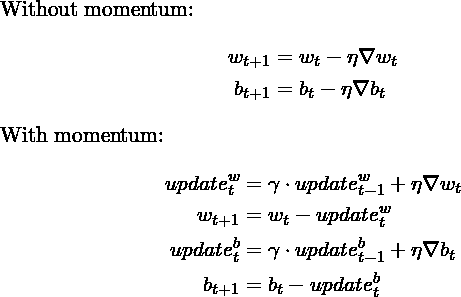
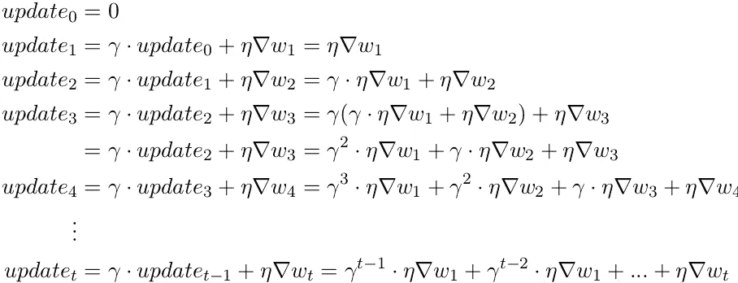
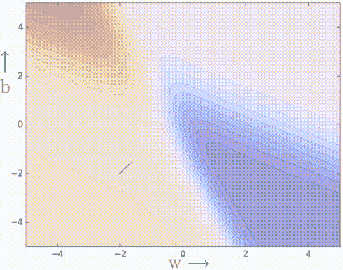
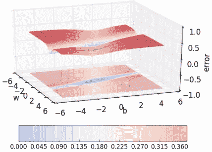
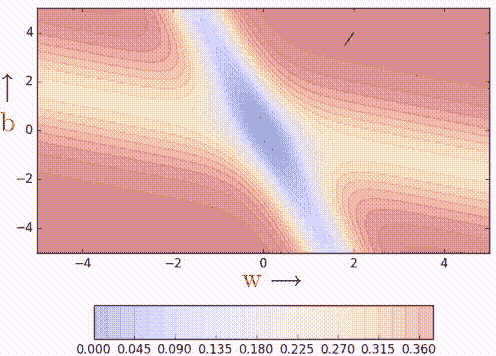
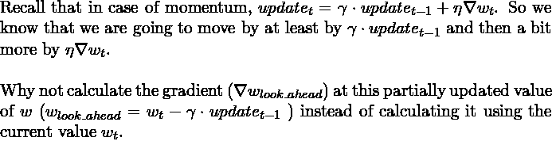
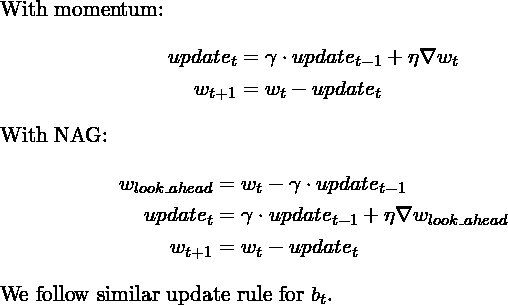
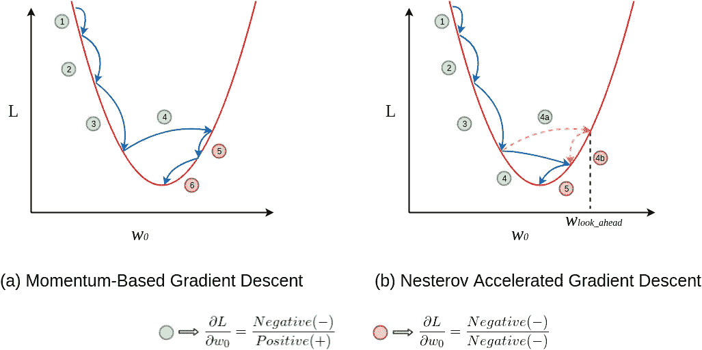
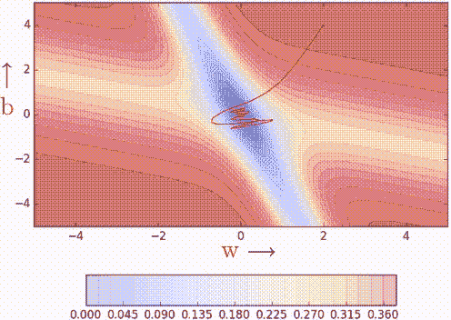

# 学习参数，第 2 部分:基于动量和内斯特罗夫加速梯度下降

> 原文：<https://towardsdatascience.com/learning-parameters-part-2-a190bef2d12?source=collection_archive---------9----------------------->

## [学习参数](https://medium.com/tag/learning-parameters/latest)

## 让我们看看梯度下降的两个简单但非常有用的变体。

在这篇文章中，我们看看如何在一定程度上利用动量的概念来克服梯度下降的平缓表面的限制。如果你不清楚这是关于什么的，一定要看看我的博客文章——[学习参数，第一部分:梯度下降](/learning-parameters-part-1-eb3e8bb9ffbb)。在整篇博文中，我们都在解决第 1 部分中介绍的玩具问题。你可以点击这个帖子顶部的踢球者标签查看 ***学习参数*** 系列的所有帖子。

在第 1 部分中，我们清楚地看到了一条曲线，在误差曲面的平缓区域，梯度可能很小，这可能会减慢速度。让我们看看什么样的动力可以克服这个缺点。

> 引用说明:本博客中的大部分内容和图表直接取自 IIT 马德拉斯大学教授 Mitesh Khapra 提供的深度学习课程第 5 讲。

# 基于动量的梯度下降

从登山运动员的角度来看，MBGD 背后的直觉(是的，这是我们在第 1 部分中使用的老掉牙的比喻)是

> 如果我被反复要求朝同一个方向前进，那么我可能应该获得一些信心，开始朝那个方向迈出更大的步伐。就像一个球滚下斜坡时获得动量一样。

## 动量更新规则

我们在梯度更新规则中容纳动量概念如下:

除了当前的更新，我们还会查看更新的历史。我鼓励你花点时间来处理新的更新规则，并尝试将*更新*期限在每个步骤中的变化写在纸上。还是继续看。分解它，我们得到

您可以看到，当前更新不仅与当前梯度成比例，还与先前步骤的梯度成比例，尽管它们的贡献在每个时间步骤减少***γ***(γ)*倍。这就是我们如何在平缓区域提高更新的幅度。*

# *行动中的动力*

*我们将普通梯度下降代码(如第 1 部分所示&也可从[这里](https://gist.github.com/akshaychandra21/703ecc8949a01f472d17db3359d56985)获得)稍微修改如下:*

*从现在开始，我们将只使用等高线地图。将事物可视化为三维可能会很麻烦，因此等值线图可以作为一种便捷的替代方法来表示具有二维输入和一维输出的函数。如果你没有意识到它们/对它们感到不舒服，请阅读我的基本材料博客文章-[*学习参数，第 0 部分:基本材料*](http://asasasasas) 的**第 5 节**(甚至有一个自我测试，你可以更好地理解它们)。让我们看看 MBGD 使用我们在第 1 部分中介绍的相同的玩具神经网络有多有效。*

**

*Momentum-Based Gradient Descent. 100 iterations of vanilla gradient descent make the black patch.*

*它工作了。普通梯度下降的 100 次迭代形成黑色斑块，很明显，即使在缓坡区域，基于动量的梯度下降也可以迈出实质性的步伐，因为动量带着它前进。*

*重要的是，快速行动总是好的吗？会不会有这样一种情况，动量会导致我们超越目标？让我们通过改变我们的输入数据来测试 MBGD，这样我们最终得到一个不同的误差表面。*

**

*比如上面显示的这个，误差在最小值谷的两边都很高。在这种情况下，冲力还能发挥作用吗？或者相反，冲力可能是有害的？让我们找出答案。*

**

*100 iterations of vanilla gradient descent make the black patch.*

*我们可以观察到，以动量为基础的梯度下降，随着动量带着它离开极小值谷，在极小值谷内外振荡。这使得我们在最终收敛之前做了很多 U 形转弯。尽管有这些 U 形转弯，它仍然比普通梯度下降收敛得更快。在 100 次迭代之后，基于动量的方法已经达到 0.00001 的误差，而普通梯度下降仍然停留在 0.36 的误差。*

*我们能做些什么来减少振荡/U 形转弯吗？是的，内斯特罗夫加速梯度下降帮助我们做到了这一点。*

# *内斯特罗夫加速梯度下降*

*NAG 背后的直觉可以用一句话来概括:*

> *三思而后行！*

**

## *NAG 更新规则*

**

*但是为什么向前看能帮助我们避免过度呢？我敦促你们停下来思考一下。如果还不清楚，我相信几分钟后就会清楚了。看一下这个图。*

**

*A toy illustration.*

*在图(a)中，更新 1 为正，即梯度为负，因为随着 ***w_0*** 增加 ***L*** 减少。甚至更新 2 也是积极的，你可以看到更新比更新 1 稍大，这要归功于动量。到目前为止，你应该确信更新 3 将比更新 1 和更新 2 更大，仅仅是因为动力和积极的更新历史。更新 4 是事情变得有趣的地方。在普通动量情况下，由于正历史，更新过冲，下降通过进行负更新来恢复。*

*但是在 NAG 的情况下，每次更新分两步进行——首先，部分更新，我们到达 *look_ahead* 点，然后是最终更新(参见 NAG 更新规则)，参见图(b)。NAG 的前 3 次更新非常类似于基于动量的方法，因为在那些情况下两次更新(部分和最终)都是正的。但是真正的区别在 update 4 中变得很明显。通常，每次更新分两个阶段进行，部分更新(4a)为正，但最终更新(4b)将为负，因为在 ***w_lookahead*** 计算的梯度将为负(通过观察图表说服自己)。这个负的最终更新稍微降低了更新的总幅度，仍然导致过冲，但是与普通的基于动量的梯度下降相比，过冲较小。我的朋友，这就是 NAG 如何帮助我们减少超调，即让我们采取更短的 U 形转弯。*

# *唠叨在行动*

*通过稍微更新 momentum 代码来进行部分更新和完全更新，我们得到了 NAG 的代码。*

*让我们用同样的玩具例子和同样的误差表面来比较基于动量的方法和 NAG 的收敛性。*

**

*You can see that (I hope you can) NAG (blue) is taking smaller U-turns compared to vanilla momentum (red).*

*即使接近误差面上的极小值谷，NAG 肯定也在进行较小的振荡/较短的 U 形转弯。与基于动量的梯度下降相比，向前看有助于 NAG 更快地修正其路线。因此，振荡更小，逃离极小值谷的机会也更小。之前，我们证明了回顾过去有助于**咳咳动力咳咳** ，现在我们证明了展望未来也有帮助。*

# *结论*

*在这篇博客文章中，我们看了两个简单的混合版本的梯度下降，帮助我们更快地收敛——*基于动量的梯度下降*和*内斯特罗夫加速梯度下降(NAG)* ，还讨论了 NAG 击败普通动量法的原因和位置。我们研究了它们的更新规则、方法的 python 代码实现中的细微差别，并在一个玩具示例中用图形展示了它们的收敛性。在下一篇文章中，我们将稍微偏离主题，谈谈这些算法的随机版本。*

*请阅读本系列的下一篇文章，网址是:*

*   *[学习参数，第 3 部分:随机&小批量梯度下降](/ee8558f65dd7)*

# *承认*

*IIT·马德拉斯教授的**和 [**CS7015:深度学习**](https://www.cse.iitm.ac.in/~miteshk/CS7015.html) 课程如此丰富的内容和创造性的可视化，这要归功于很多。我只是简单地整理了提供的课堂讲稿和视频。***