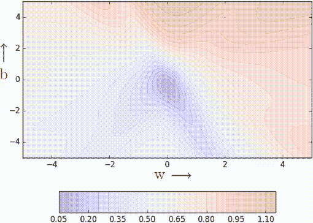
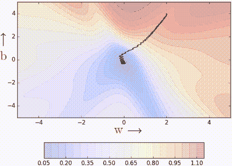
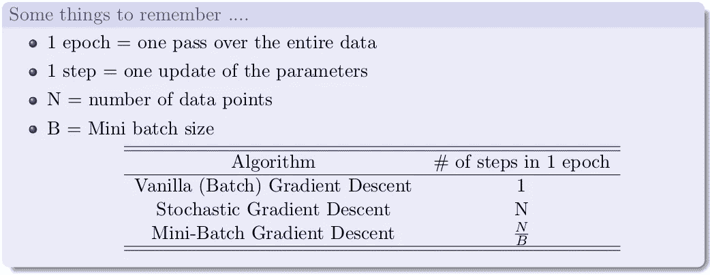
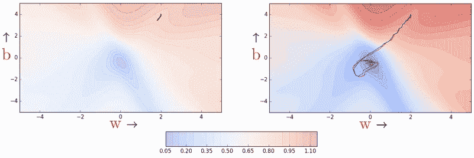
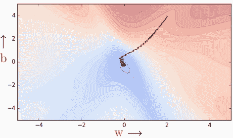

# 学习参数，第 3 部分:随机和小批量梯度下降

> 原文：<https://towardsdatascience.com/learning-parameters-part-3-ee8558f65dd7?source=collection_archive---------22----------------------->

## [学习参数](https://medium.com/tag/learning-parameters/latest)

## 让我们暂时离开优化器，谈谈这些算法的随机
版本。

在第 2 部分中，我们看了梯度下降的两个有用的变体——基于动量的[和内斯特罗夫加速梯度下降](/learning-parameters-part-2-a190bef2d12)。在这篇文章中，我们将看看梯度下降的随机版本。你可以点击这个帖子顶部的踢球者标签查看 ***学习参数*** 系列的所有帖子。

> 引用说明:本博客中的大部分内容和图表直接摘自 [CS7015:深度学习](https://www.cse.iitm.ac.in/~miteshk/CS7015.html)课程的第 5 讲，该课程由[IIT 马德拉斯大学的 Mitesh Khapra](https://www.cse.iitm.ac.in/~miteshk/) 教授讲授。

# 动机

让我们看看我们在本系列的第 1 部分中谈到的香草梯度下降。

如果您观察两个奇怪注释行之间的代码块，您会注意到梯度是在整个数据集上计算的。也就是说，该算法在更新参数之前会对整个数据进行一次检查。为什么？因为这是前面第 1 部分中推导出的损失的真实梯度(对应于每个数据点的损失梯度的总和)。这是一件好事，因为我们没有逼近任何东西。因此，所有的理论假设和保证都成立(换句话说，每一步都保证损失会减少)。这是可取的吗？当然是，但是另一方面是什么？

假设我们有一百万个训练数据点。对 ***w*** ， ***b*** 进行 1 次更新，算法进行百万次计算。显然，这可能会非常慢！！我们能做得更好吗？是的，我们来看看随机梯度下降。

# 随机梯度下降

随机梯度下降(常简称为 SGD)是一种优化可微目标函数的迭代方法，是梯度下降优化的随机近似。基本上，你是在用某种近似，而不是高贵的“真实梯度”。随机梯度下降是用于训练深度学习模型的主要方法。让我们直接看看 SGD 的代码。

事情是这样的——我们不是通过计算所有数据点的梯度来进行更新，而是一次只更新一个数据点的梯度。因此，名称随机，因为我们是估计总梯度的基础上，一个单一的数据点。几乎就像只扔一次硬币，然后估算 P(正面)。现在，如果我们有一百万个数据点，我们将在每个时期进行一百万次更新(1 个时期= 1 遍数据；1 步= 1 次更新)。另一面是什么？这是一个近似的(相当随机的)梯度，所以不能保证每一步都会减少损失。

## SGD 在行动

当我们有一些数据点时，让我们从几何角度来看这个算法。

如果你仔细观察，你会发现我们的下降产生了许多微小的振荡。为什么？因为我们正在做出贪婪的决定。每个点都试图将参数推向对其最有利的方向(没有意识到这会如何影响其他点)。局部有利于一个点的参数更新可能会损害其他点(就好像数据点在相互竞争)。我们能否通过改进梯度的随机估计(目前一次仅从一个数据点进行估计)来减少振荡？是的，让我们看看小批量梯度下降。

# 小批量梯度下降

在小批量的情况下，我们不是一次更新一个数据点的梯度，而是计算一批大小为 k 的数据点的梯度。

注意，该算法在看到*个 mini_batch_size* 个数据点后更新参数。随机估计现在应该稍微好一点了。

## 小批量生产

当*k*/*mini _ batch _ size*= 2 时，让我们看看这个算法是如何运行的。

即使批量大小为 *k=2，*振荡也略有减少。为什么？因为我们现在对梯度有了更好的估计(类比:我们现在投掷硬币 *k=2* 次来估计 P(正面))。k 值越高，估计就越精确。实际上，k 的典型值是 16、32、64。当然，仍然存在振荡，只要我们使用的是与“真实梯度”相对的近似梯度，振荡就会一直存在

插图不清楚，而且最重要的是， *k* 仅仅是 2，所以很难看出有什么不同。但是相信数学，mini-batch 帮助我们得到稍微好一点的梯度估计。

# 新币与动力和老马

我们可以有基于动量的梯度下降和内斯特罗夫加速梯度下降的随机版本。

虽然动量(红色)和 NAG(蓝色)的随机版本都表现出振荡，但 NAG 相对动量的优势仍然存在(即 NAG 的 u 形转弯相对较短)。此外，它们都比随机梯度下降更快(在 60 步之后，随机梯度下降[黑色左图]仍然表现出非常高的误差，而 NAG 和动量接近收敛)。

当然，我们也可以有 Momentum 和 NAG 的小批量版本，但不在本文中。

# 结论

在学习参数系列的这一部分中，我们看了近似梯度更新的梯度下降算法的变体——随机梯度下降和小批量梯度下降。我们研究了它们之间的主要区别，这两种方法的 python 代码实现，并在一个玩具问题上用图形展示了它们的收敛性。我们还设想了动量和 NAG 的随机版本。在下一篇文章中，我们将讨论一些调整学习率和动量相关参数的有用技巧，并简要介绍什么是线搜索。

请阅读本系列的下一篇文章，网址是:

*   [学习参数，第 4 部分:调整学习率的技巧&动量，线搜索](/learning-parameters-part-4-6a18d1d3000b)

# 承认

IIT·马德拉斯教授的**和 [**CS7015:深度学习**](https://www.cse.iitm.ac.in/~miteshk/CS7015.html) 课程如此丰富的内容和创造性的可视化，这要归功于很多。我只是简单地整理了提供的课堂讲稿和视频。**

****