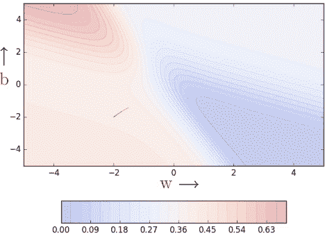
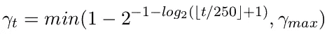
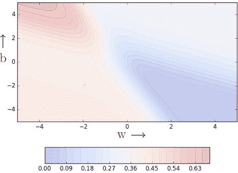
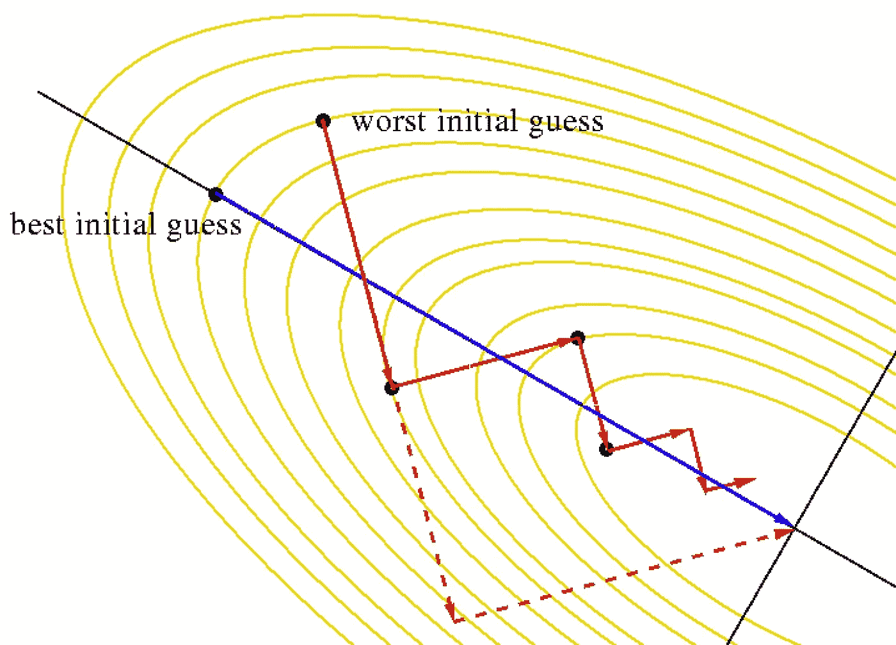

# 学习参数，第 4 部分:调整学习速度的技巧，线搜索

> 原文：<https://towardsdatascience.com/learning-parameters-part-4-6a18d1d3000b?source=collection_archive---------20----------------------->

## [学习参数](https://medium.com/tag/learning-parameters/latest)

## 在进入高级优化算法之前，让我们回顾一下梯度下降中的学习率问题。

在[第 3 部分](/learning-parameters-part-3-ee8558f65dd7)中，我们看到了优化器的随机性和小批量版本。在这篇文章中，我们将会看到一些关于如何调整学习率等的普遍遵循的启发法。如果你对这些试探法不感兴趣，可以直接跳到[学习参数](https://medium.com/tag/learning-parameters/latest)系列的[第 5 部分](/learning-parameters-part-5-65a2f3583f7d)。

> 引用说明:本博客中的大部分内容和图表直接取自 IIT 马德拉斯大学教授 Mitesh Khapra 提供的深度学习课程第 5 讲。

有人可能会说，我们可以通过设置较高的学习率来解决在缓坡上导航的问题(即，通过将较小的坡度乘以较大的学习率 ***η*** )来放大较小的坡度)。这个看似微不足道的想法有时在误差函数平缓的情况下确实有效，但当误差面平坦时就不起作用了。这里有一个例子:

显然，在斜率较大的区域，已经很大的梯度会进一步扩大，较大的学习率在某种程度上有助于这一原因，但一旦误差表面变平，就没有太大帮助了。假设有一个可以适应梯度的学习率总是好的，这是安全的，我们将在学习参数系列的下一篇文章(第 5 部分)中看到一些这样的算法。

# 一些有用的提示

## 初学率小贴士

*   调整学习率。在对数标度上尝试不同的值:0.0001、0.001、0.01、0.1、1.0。
*   每一个都运行几个时期，找出一个最有效的学习速率。
*   现在围绕这个值进行更精细的搜索。例如，如果最佳学习率是 0.1，那么现在尝试一些值:0.05，0.2，0.3。
*   声明:这些只是启发，没有明确的赢家策略。

## 退火学习率提示

**阶跃衰减**

*   每 5 个周期后将学习率减半
*   如果验证误差大于前一个时期结束时的误差，则在一个时期后将学习率减半

**指数衰减**

*   *η = η₀⁻ᵏᵗ* ，其中 *η₀* 和 *k* 为超参数，t 为步数

**1/t 衰变**

*   *η = (η₀)/(1+kt)，*其中 *η₀* 和 *k* 为超参数，t 为步数。

## 动量秘诀

以下时间表由 Sutskever *等人*于 2013 年提出

其中， *γ_max* 选自{0.999，0.995，0.99，0.9，0}。

# 线搜索

在实践中，通常进行线搜索以找到相对更好的 *η* 值。在线搜索中，我们使用不同的学习率( *η* )更新 *w* ，并在每次迭代中检查更新后的模型的误差。最终，我们保留给出最低损失的 *w* 的更新值。看一下代码:

本质上，在每一步，我们都试图从可用的选项中使用最佳的 *η* 值。这显然不是最好的主意。我们在每一步都做了更多的计算，但这是寻找最佳学习速率的一种折衷。今天，有更酷的方法可以做到这一点。

## 在线搜索正在进行

显然，收敛比普通梯度下降更快(见[第 1 部分](/learning-parameters-part-1-eb3e8bb9ffbb?source=your_stories_page---------------------------))。我们看到一些振荡，但注意到这些振荡与我们在动量和 NAG 中看到的非常不同(见[第 2 部分](/learning-parameters-part-2-a190bef2d12))。

**注:** Leslie N. Smith 在他 2015 年的论文中， [*循环学习率用于训练神经网络*](https://arxiv.org/pdf/1506.01186.pdf) 提出了一种比线搜索更聪明的方式。我建议读者参考[这篇由](/estimating-optimal-learning-rate-for-a-deep-neural-network-ce32f2556ce0) [Pavel Surmenok](https://towardsdatascience.com/@surmenok) 撰写的文章来了解更多信息。

# 结论

在学习参数系列的这一部分中，我们看到了一些启发，可以帮助我们调整学习速度和动力，以便更好地进行培训。我们还研究了线搜索，这是一种曾经流行的方法，用于在梯度更新的每一步找到最佳学习速率。在学习参数系列的下一(最后)部分，我们将仔细研究具有自适应学习速率的梯度下降，特别是以下优化器——AdaGrad、RMSProp 和 Adam。

你可以在这里找到下一部分:

*   [学习参数，第 5 部分:AdaGrad、RMSProp 和 Adam](/learning-parameters-part-5-65a2f3583f7d)

# 承认

IIT·马德拉斯教授的**和 [**CS7015:深度学习**](https://www.cse.iitm.ac.in/~miteshk/CS7015.html) 课程如此丰富的内容和创造性的可视化，这要归功于很多。我只是简单地整理了提供的课堂讲稿和视频。**

****