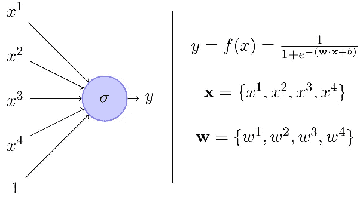
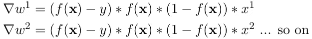
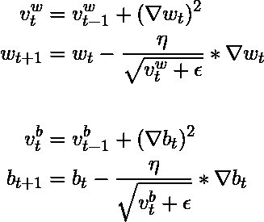
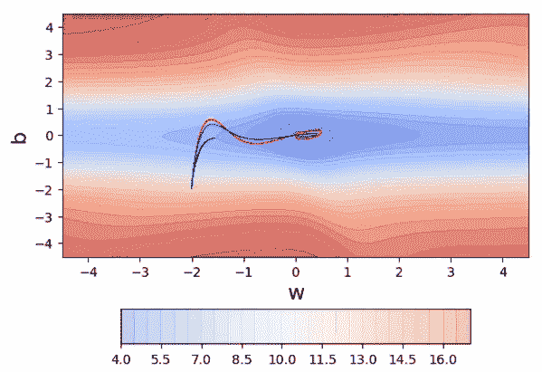
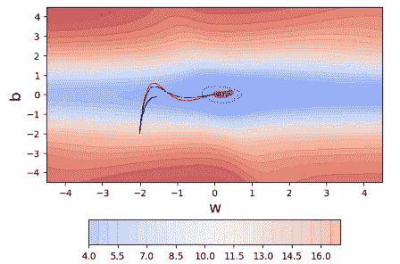
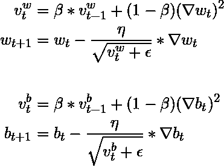
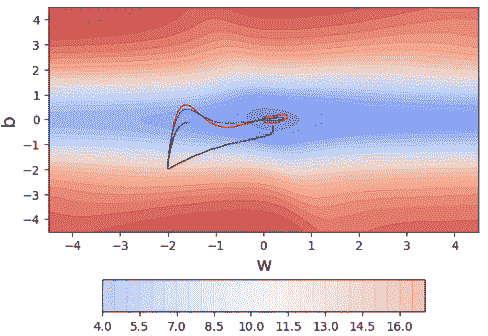
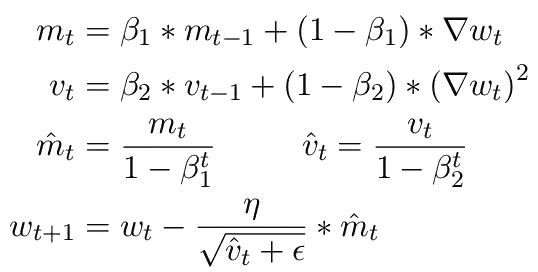
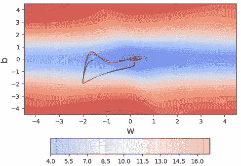
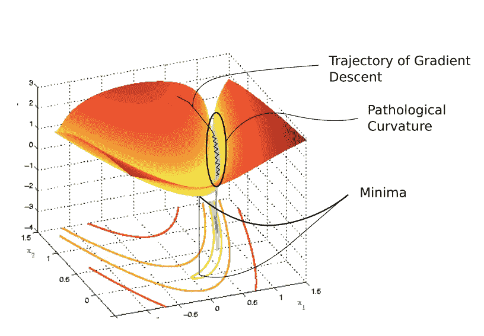

# 学习参数，第 5 部分:AdaGrad、RMSProp 和 Adam

> 原文：<https://towardsdatascience.com/learning-parameters-part-5-65a2f3583f7d?source=collection_archive---------4----------------------->

## [学习参数](https://medium.com/tag/learning-parameters/latest)

## 让我们看看具有自适应学习率的梯度下降。

在[第四部分](/learning-parameters-part-4-6a18d1d3000b)中，我们看了一些启发法，可以帮助我们更好地调整学习速度和动力。在[系列](https://medium.com/tag/learning-parameters/latest)的最后一篇文章中，让我们来看看一种更有原则的调整学习速度的方法，并给学习速度一个适应的机会。

> 引用说明:本博客中的大部分内容和图表直接取自 IIT 马德拉斯大学教授 Mitesh Khapra 提供的深度学习课程第 5 讲。

## 适应性学习率的动机

考虑以下具有 sigmoid 激活的简单感知器网络。

很容易看出，给定一个点( **x** ， *y* )，梯度 **w** 如下:

See [Part-1](/learning-parameters-part-1-eb3e8bb9ffbb) if this is unclear.

***【f(x)****w . r . t 的梯度到一个特定的权重显然依赖于其相应的输入。如果有 *n* 个点，我们可以将所有 *n* 个点的梯度相加得到总梯度。这条新闻既不新鲜也不特别。但是，如果特征 ***x2*** 非常稀疏(即，如果它的值对于大多数输入都是 0)，会发生什么呢？假设∇ ***w2*** 对于大多数输入(见公式)将为 0 是合理的，因此 ***w2*** 将不会获得足够的更新。*

*不过，这有什么好困扰我们的呢？需要注意的是，如果***【x2】***既稀疏又重要，我们会认真对待 ***w2*** 的更新。为了确保即使在特定输入稀疏的情况下也能进行更新，我们是否可以为每个参数设定不同的学习速率，以考虑特征的频率？我们当然可以。我的意思是，这是这篇文章的全部要点。*

# ***AdaGrad —自适应梯度算法***

## *直觉*

*衰减参数的学习率与其更新历史成比例(更新越多，衰减越多)。*

## *AdaGrad 的更新规则*

**

*从更新规则可以清楚地看出，梯度的历史累积在 ***v*** 中。累积的梯度越小，**T5【v值就会越小，导致学习率越大(因为**v除以 *η* )。*****

## *阿达格拉德的 Python 代码*

## *阿达格拉德在行动*

*要查看 AdaGrad 的运行情况，我们需要首先创建一些其中一个要素稀疏的数据。对于我们在学习参数系列的所有部分中使用的玩具网络，我们将如何做呢？嗯，我们的网络正好有两个参数( ***w*** 和 ***b*** ，参见 [part-1](/learning-parameters-part-1-eb3e8bb9ffbb) 中的*动机*)。这其中，b 对应的输入/特征是一直开着的，所以我们不能真的让它稀疏。所以唯一的选择就是让 x 稀疏。这就是为什么我们创建了 100 个随机的 *(x，y)* 对，然后大约 80%的这些对我们将 *x* 设置为 0，使得 ***w*** 的特征稀疏。*

**

*Vanilla GD(black), momentum (red), NAG (blue)*

*在我们实际查看运行中的 AdaGrad 之前，请查看上面的其他 3 个优化器——香草 GD(黑色)、momentum(红色)、NAG(蓝色)。这 3 个优化器为这个数据集做了一些有趣的事情。你能发现它吗？请随意停下来思考。**答:**最初，三种算法都是主要沿垂直( ***b*** )轴运动，沿水平( ***w*** )轴运动很少。为什么？因为在我们的数据中，对应于 ***w*** 的特征是稀疏的，因此 ***w*** 经历很少的更新。另一方面， ***b*** 非常密集，经历很多更新。这种稀疏性在包含 1000 个输入特征的大型神经网络中非常普遍，因此我们需要解决它。现在让我们来看看阿达格拉德的行动。*

**

*瞧啊。通过使用参数特定的学习率，AdaGrad 确保尽管稀疏度*w 获得更高的学习率，并因此获得更大的更新。而且，这也保证了如果**b经历大量更新，其有效学习率会因为分母的增长而下降。实际上，如果我们从分母中去掉平方根，效果就不那么好了(这是值得思考的)。另一面是什么？随着时间的推移， ***b*** 的有效学习率将衰减到不再对 ***b*** 进行更新的程度。我们能避免这种情况吗？RMSProp 可以！****

# **RMSProp — **均方根传播****

## **直觉**

**AdaGrad 非常积极地降低学习率(随着分母的增长)。结果，一段时间后，由于学习率的衰减，频繁参数将开始接收非常小的更新。为了避免这种情况，为什么不衰减分母，防止其快速增长。**

## **RMSProp 的更新规则**

****

**一切都非常类似于阿达格拉德，除了现在我们也衰减分母。**

## **RMSProp 的 Python 代码**

## **RMSProp 正在运行**

****

**Vanilla GD(black), momentum (red), NAG (blue), AdaGrad (magenta)**

**你看到了什么？RMSProp 和 AdaGrad 有什么不同？请随意停下来思考。**回答:**阿达格拉德在接近收敛的时候卡住了，因为学习率的衰减，已经无法在垂直( ***b*** )方向
移动。RMSProp 通过减少衰减来克服这个问题。**

# **Adam — **自适应矩估计****

## ****直觉****

**尽 RMSProp 所能解决 AdaGrad 的分母衰减问题。除此之外，使用梯度的累积历史。**

## **更新 Adam 的规则**

****

**以及类似于***b****_ t*的一组方程组。注意，Adam 的更新规则与 RMSProp 非常相似，除了我们也查看梯度的累积历史(***m****_ t*)。注意，上面更新规则的第三步是偏差修正。Mitesh M Khapra 教授解释了为什么偏差校正是必要的，可在[这里](https://www.youtube.com/watch?v=-0ZMU-gnm2g)找到。**

## **亚当的 Python 代码**

## **亚当在行动**

****

**很明显，获取梯度的累积历史可以加快速度。对于这个玩具数据集，它似乎是超调(有点)，但即使这样，它收敛的方式比其他优化。**

# **百万美元问题:使用哪种算法？**

*   **亚当现在似乎或多或少是默认的选择( *β1* = 0.9， *β2* = 0.999，*ϵ*= 1e 8)。**
*   **虽然它被认为对初始学习速率是鲁棒的，但是我们已经观察到对于序列生成问题 *η* = 0.001，0.0001 工作得最好。**
*   **话虽如此，但许多论文报道，具有简单退火学习速率调度的动量(内斯特罗夫或经典)SGD 在实践中也运行良好(通常，序列生成问题从 *η* = 0.001 开始，0.0001)。**
*   **亚当可能是最好的选择。**
*   **最近的一些工作表明 Adam 存在问题，在某些情况下它不会收敛。**

# **结论**

**在本系列的最后一篇文章中，我们研究了具有自适应学习速率的梯度下降如何帮助加快神经网络的收敛。本文涵盖了直觉、python 代码和三个广泛使用的优化器的可视化说明——AdaGrad、RMSProp 和 Adam。Adam 结合了 RMSProp 和 AdaGrad 的最佳特性，即使在有噪声或稀疏的数据集上也能很好地工作。**

# **承认**

**IIT·马德拉斯教授的 [**和**](https://www.cse.iitm.ac.in/~miteshk/) **[**CS7015:深度学习**](https://www.cse.iitm.ac.in/~miteshk/CS7015.html) 课程如此丰富的内容和创造性的可视化，这要归功于 Mitesh M Khapra** 教授和助教。我只是简单地整理了提供的课堂讲稿和视频。**

****

****Source:** Paperspace article on RMSProp by [Ayoosh Kathuria](https://blog.paperspace.com/intro-to-optimization-momentum-rmsprop-adam/).**