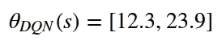
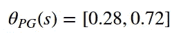
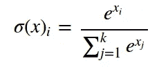
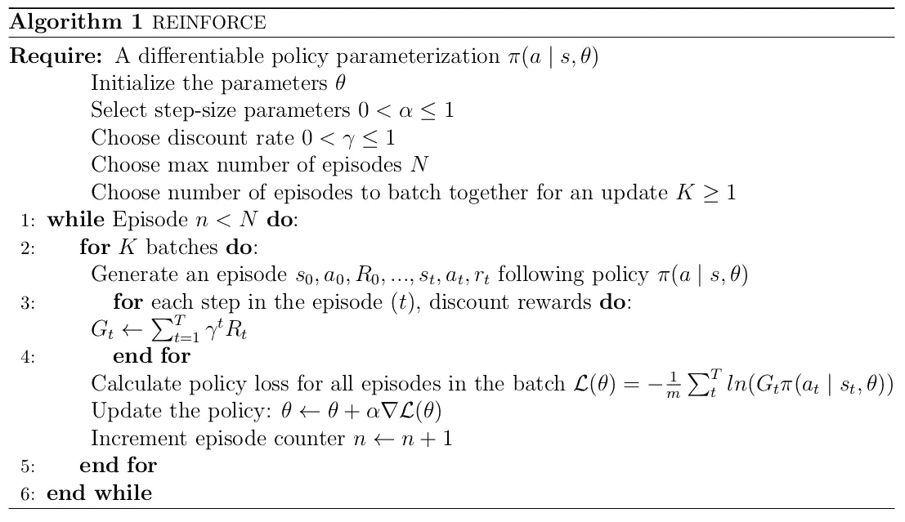
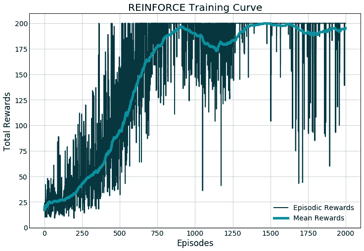

# 学习强化学习:用 PyTorch 强化！

> 原文：<https://towardsdatascience.com/learning-reinforcement-learning-reinforce-with-pytorch-5e8ad7fc7da0?source=collection_archive---------5----------------------->

## 策略梯度入门


Photo by [Nikita Vantorin](https://unsplash.com/@vantorin?utm_source=medium&utm_medium=referral) on [Unsplash](https://unsplash.com?utm_source=medium&utm_medium=referral)

强化算法是强化学习中最早的*策略梯度*算法之一，也是进入更高级方法的一个很好的起点。策略梯度不同于 Q 值算法，因为 PG 试图学习参数化的策略，而不是估计状态-动作对的 Q 值。因此，策略输出被表示为动作的概率分布，而不是一组 Q 值估计。如果有任何困惑或不清楚的地方，不要担心，我们会一步一步地分解它！

# TL；速度三角形定位法(dead reckoning)

在这篇文章中，我们将看看加强算法，并使用 OpenAI 的 CartPole 环境和 PyTorch 对其进行测试。我们假设对强化学习有一个基本的理解，所以如果你不知道状态、动作、环境等是什么意思，在这里查看一些[到其他文章的链接](https://www.datahubbs.com/reinforcement-learning/)或者在这里查看关于这个主题的[简单入门](https://www.datahubbs.com/intro-to-q-learning/)。

# 政策与行动价值观

我们可以将策略梯度算法与 Q 值方法(例如，深度 Q 网络)区分开来，因为策略梯度在不参考动作值的情况下进行动作选择。一些策略梯度学习值的估计以帮助找到更好的策略，但是这个值估计不是选择动作所必需的。DQN 的输出将是价值估计的向量，而政策梯度的输出将是行动的概率分布。

例如，假设我们有两个网络，一个政策网络和一个 DQN 网络，它们已经学会了用两个动作(左和右)做横翻筋斗的任务。如果我们将状态 *s* 传递给每一个，我们可能会从 DQN 得到以下内容:



这来自政策梯度:



DQN 为我们提供了该州未来奖励折扣的估计值，我们基于这些值进行选择(通常根据一些ϵ-greedy 规则取最大值)。另一方面，政策梯度给了我们行动的概率。在这种情况下，我们做出选择的方式是在 28%的情况下选择行动 0，在 72%的情况下选择行动 1。随着网络获得更多的经验，这些概率将会改变。

# 概率值

为了得到这些概率，我们在输出层使用了一个简单的函数叫做 *softmax* 。该函数如下所示:



这将所有值压缩到 0 和 1 之间，并确保所有输出总和为 1(σσ(x)= 1)。因为我们使用 exp(x)函数来缩放我们的值，所以最大的值往往占主导地位，并获得更多分配给它们的概率。

# 强化算法

现在谈谈算法本身。



如果你已经关注了[之前的一些帖子，](https://www.datahubbs.com/reinforce-with-pytorch/)这看起来应该不会太令人生畏。然而，为了清楚起见，我们还是要走一遍。

要求相当简单，我们需要一个可区分的策略，为此我们可以使用一个神经网络，以及一些超参数，如我们的步长(α)、折扣率(γ)、批量(K)和最大集数(N)。从那里，我们初始化我们的网络，并运行我们的剧集。每集之后，我们会对我们的奖励进行折扣，这是从该奖励开始的所有折扣奖励的总和。我们将在每一批(例如 K 集)完成后更新我们的政策。这有助于为训练提供稳定性。

保单损失(L(θ))起初看起来有点复杂，但如果仔细观察，不难理解。回想一下，策略网络的输出是一个概率分布。我们对π(a | s，θ)所做的，只是得到我们网络在每个状态下的概率估计。然后，我们将其乘以折扣奖励的总和(G ),得到网络的期望值。

例如，假设我们处于状态 *s* 网络分为两个行动，那么选择 a=0 的概率是 50%，选择 a=1 的概率也是 50%。网络随机选择 a=0，我们得到 1 的奖励，剧集结束(假设贴现因子为 1)。当我们回过头来更新我们的网络时，这个状态-动作对给我们(1)(0.5)=0.5，这转化为在该状态下采取的动作的网络期望值。从这里，我们取概率的[对数，并对我们这一批剧集中的所有步骤求和。最后，我们将其平均，并采用该值的梯度进行更新。](https://stats.stackexchange.com/questions/174481/why-to-optimize-max-log-probability-instead-of-probability)

快速复习一下，[推车杆](https://gym.openai.com/envs/CartPole-v0/)的目标是尽可能长时间地保持杆在空中。您的代理需要决定是向左还是向右推购物车，以保持平衡，同时不要越过左右两边的边缘。如果你还没有安装 OpenAI 的库，只要运行`pip install gym`就应该设置好了。此外，如果你还没有的话，请抓住 pytorch.org 的最新消息。

继续并导入一些包:

```
import numpy as np
import matplotlib.pyplot as plt
import gym
import sysimport torch
from torch import nn
from torch import optimprint("PyTorch:\t{}".format(torch.__version__))PyTorch:	1.1.0
```

# PyTorch 中的实现

导入我们的包后，我们将建立一个名为`policy_estimator`的简单类，它将包含我们的神经网络。它将有两个隐藏层，具有 ReLU 激活功能和 softmax 输出。我们还将为它提供一个名为 predict 的方法，使我们能够在网络中向前传递。

```
class policy_estimator():
    def __init__(self, env):
        self.n_inputs = env.observation_space.shape[0]
        self.n_outputs = env.action_space.n

        # Define network
        self.network = nn.Sequential(
            nn.Linear(self.n_inputs, 16), 
            nn.ReLU(), 
            nn.Linear(16, self.n_outputs),
            nn.Softmax(dim=-1))

    def predict(self, state):
        action_probs = self.network(torch.FloatTensor(state))
        return action_probs
```

请注意，调用`predict`方法需要我们将状态转换成一个`FloatTensor`，供 PyTorch 使用。实际上，`predict`方法本身在 PyTorch 中有些多余，因为张量可以直接传递给我们的`network`来得到结果，但是为了清楚起见，我把它包含在这里。

我们需要的另一件事是我们的贴现函数，根据我们使用的贴现因子γ来贴现未来的奖励。

```
def discount_rewards(rewards, gamma=0.99):
    r = np.array([gamma**i * rewards[i] 
        for i in range(len(rewards))])
    # Reverse the array direction for cumsum and then
    # revert back to the original order
    r = r[::-1].cumsum()[::-1]
    return r — r.mean()
```

我在这里做了一件有点不标准的事情，就是减去最后奖励的平均值。这有助于稳定学习，特别是在这种情况下，所有奖励都是正的，因为与奖励没有像这样标准化相比，负奖励或低于平均水平的奖励的梯度变化更大。

现在谈谈增强算法本身。

```
def reinforce(env, policy_estimator, num_episodes=2000,
              batch_size=10, gamma=0.99): # Set up lists to hold results
    total_rewards = []
    batch_rewards = []
    batch_actions = []
    batch_states = []
    batch_counter = 1

    # Define optimizer
    optimizer = optim.Adam(policy_estimator.network.parameters(), 
                           lr=0.01)

    action_space = np.arange(env.action_space.n)
    ep = 0
    while ep < num_episodes:
        s_0 = env.reset()
        states = []
        rewards = []
        actions = []
        done = False
        while done == False:
            # Get actions and convert to numpy array
            action_probs = policy_estimator.predict(
                s_0).detach().numpy()
            action = np.random.choice(action_space, 
                p=action_probs)
            s_1, r, done, _ = env.step(action)

            states.append(s_0)
            rewards.append(r)
            actions.append(action)
            s_0 = s_1

            # If done, batch data
            if done:
                batch_rewards.extend(discount_rewards(
                    rewards, gamma))
                batch_states.extend(states)
                batch_actions.extend(actions)
                batch_counter += 1
                total_rewards.append(sum(rewards))

                # If batch is complete, update network
                if batch_counter == batch_size:
                    optimizer.zero_grad()
                    state_tensor = torch.FloatTensor(batch_states)
                    reward_tensor = torch.FloatTensor(
                        batch_rewards)
                    # Actions are used as indices, must be 
                    # LongTensor
                    action_tensor = torch.LongTensor(
                       batch_actions)

                    # Calculate loss
                    logprob = torch.log(
                        policy_estimator.predict(state_tensor))
                    selected_logprobs = reward_tensor * \  
                        torch.gather(logprob, 1, 
                        action_tensor).squeeze()
                    loss = -selected_logprobs.mean()

                    # Calculate gradients
                    loss.backward()
                    # Apply gradients
                    optimizer.step()

                    batch_rewards = []
                    batch_actions = []
                    batch_states = []
                    batch_counter = 1

                avg_rewards = np.mean(total_rewards[-100:])
                # Print running average
                print("\rEp: {} Average of last 100:" +   
                     "{:.2f}".format(
                     ep + 1, avg_rewards), end="")
                ep += 1

    return total_rewards
```

对于算法，我们传递我们的`policy_estimator`和`env`对象，设置一些超参数，然后我们就可以开始了。

关于实现的几点，在将值传递给`env.step()`或像`np.random.choice()`这样的函数之前，一定要确保将 PyTorch 的输出转换回 NumPy 数组，以避免错误。此外，我们使用`torch.gather()`将实际采取的行动与行动概率分开，以确保我们如上所述正确计算损失函数。最后，你可以改变结局，让算法在环境一旦“解出”就停止运行，而不是运行预设的步数(连续 100 集平均得分 195 分以上就解出 CartPole)。

要运行这个程序，我们只需要几行代码就可以完成。

```
env = gym.make('CartPole-v0')
policy_est = policy_estimator(env)
rewards = reinforce(env, policy_est)
```

绘制结果，我们可以看到它工作得相当好！



即使是简单的策略梯度算法也可以很好地工作，并且它们比 DQN 算法的负担更少，后者通常采用像记忆回放这样的附加功能来有效地学习。

看看您可以在更具挑战性的环境中使用该算法做些什么！