# 艰难地学习 SQL

> 原文：<https://towardsdatascience.com/learning-sql-the-hard-way-4173f11b26f1?source=collection_archive---------5----------------------->


[Pixabay](https://pixabay.com/?utm_source=link-attribution&utm_medium=referral&utm_campaign=image&utm_content=1246836)

## 通过写它

***一个不懂 SQL 的数据科学家不值他的盐*** *。*

在我看来，这在任何意义上都是正确的。虽然我们觉得创建模型和提出不同的假设更有成就，但数据管理的作用不能低估。

当谈到 ETL 和数据准备任务时，SQL 无处不在，每个人都应该知道一点，至少是有用的。

我仍然记得我第一次接触 SQL 的时候。这是我学会的第一种语言(如果你可以这么说的话)。这对我产生了影响。我能够将事情自动化，这是我以前从未想过的。

在使用 SQL 之前，我曾经使用 Excel——VLOOKUPs 和 pivots。我在创建报告系统，一次又一次地做着同样的工作。SQL 让这一切烟消云散。现在我可以写一个大的脚本，一切都将自动化——所有的交叉表和分析都是动态生成的。

这就是 SQL 的强大之处。尽管你可以使用 [Pandas](/minimal-pandas-subset-for-data-scientists-6355059629ae) 做任何你用 SQL 做的事情，你仍然需要学习 SQL 来处理像 HIVE，Teradata，有时还有 [Spark](/the-hitchhikers-guide-to-handle-big-data-using-spark-90b9be0fe89a) 这样的系统。

***这个帖子是关于安装 SQL，讲解 SQL，运行 SQL 的。***

# 设置 SQL 环境

现在，学习 SQL 的最好方法是用它来弄脏你的手(对于你想学的任何其他东西，我也可以这么说)

我建议不要使用像 w3schools/tutorialspoint for SQL 这样的基于网络的菜谱，因为你不能用这些菜谱来使用你的数据。

此外，我会建议您学习 MySQL 风格的 SQL，因为它是开源的，易于在您的笔记本电脑上安装，并且有一个名为 MySQL Workbench 的优秀客户端，可以让您的生活更加轻松。

我们已经解决了这些问题，下面是一步一步地设置 MySQL:

*   您可以从[下载 MySQL 社区服务器](http://dev.mysql.com/downloads/mysql/)为您的特定系统(MACOSX、Linux、Windows)下载 MySQL。就我而言，我下载了 DMG 档案。之后，双击并安装文件。你可能需要设置一个密码。记住这个密码，因为以后连接到 MySQL 实例时会用到它。

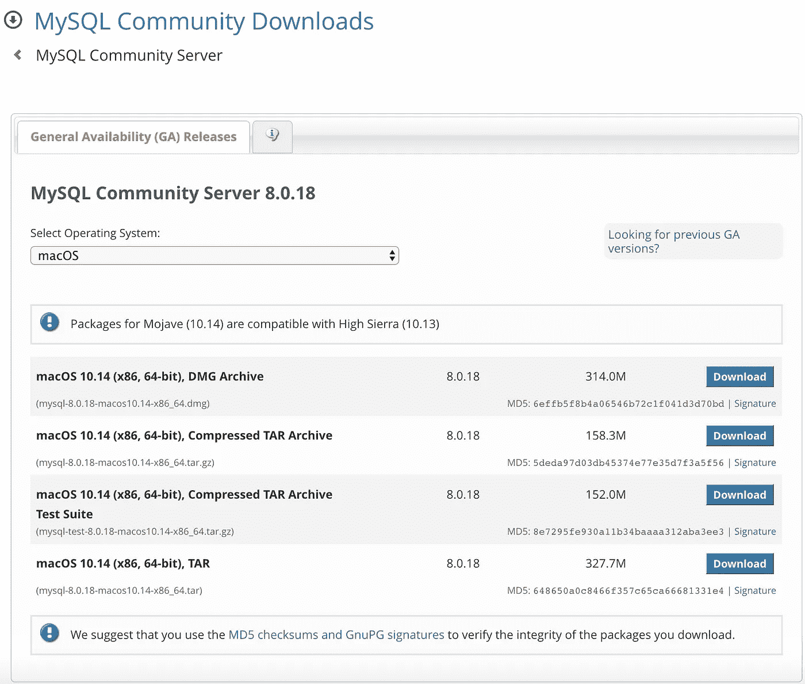

*   创建一个名为`my.cnf`的文件，并将以下内容放入其中。这是向 SQL 数据库授予本地文件读取权限所必需的。

```
[client]
port= 3306
[mysqld]
port= 3306
secure_file_priv=''
local-infile=1
```

*   打开`System Preferences>MySQL`。转到`Configuration`并使用选择按钮浏览到`my.cnf`文件。

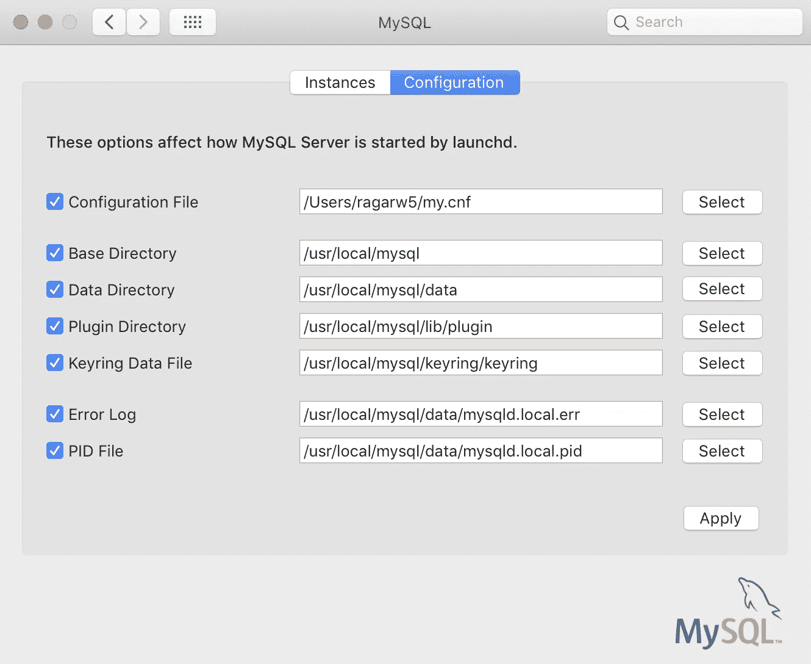

*   通过点击停止和启动，从`Instances`选项卡重启服务器。

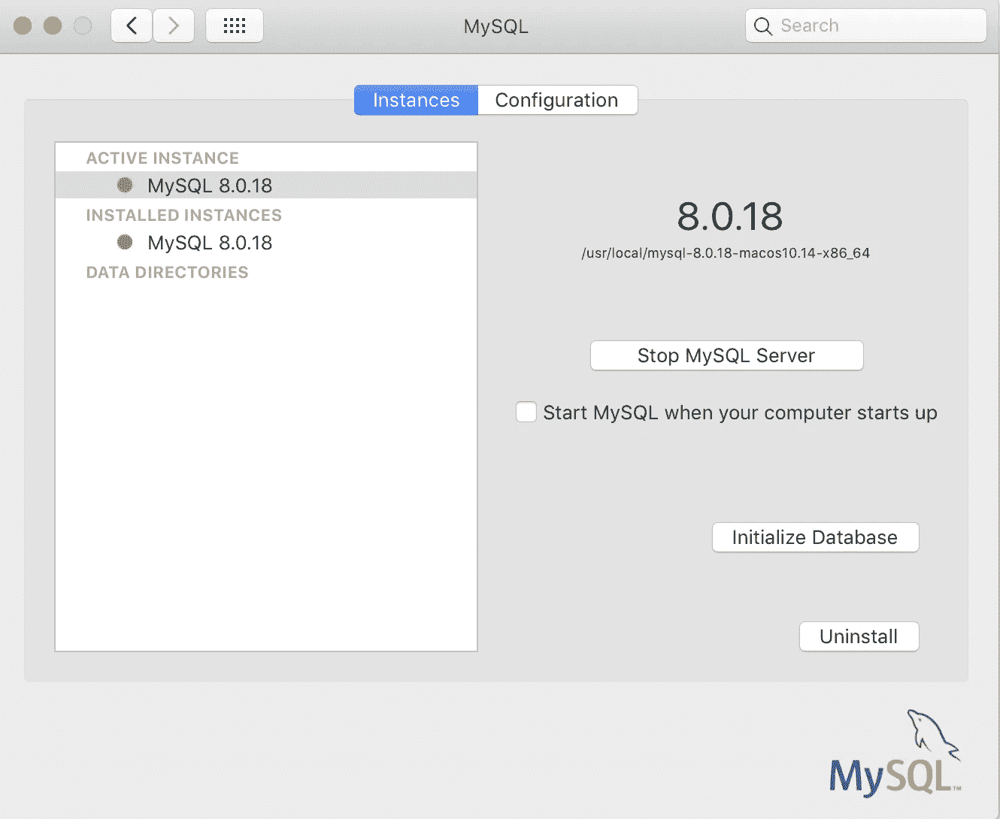

*   一旦服务器开始运行，下载并安装 MySQL 工作台:[下载 MySQL 工作台](https://dev.mysql.com/downloads/workbench/)。工作台为您提供了一个编辑器来编写 SQL 查询并以结构化的方式获得结果。

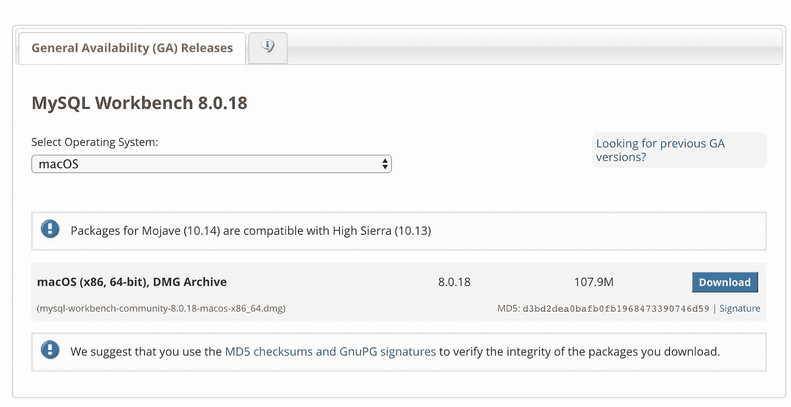

*   现在打开 MySQL 工作台，通过它连接到 SQL。您将看到如下所示的内容。

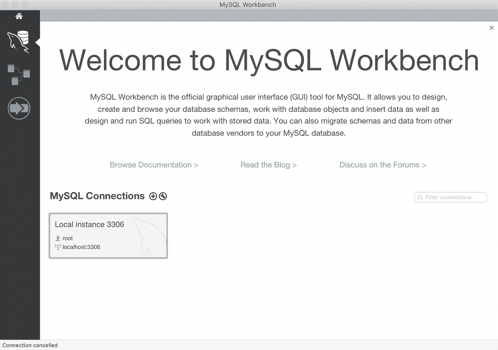

*   您可以看到本地实例连接已经预先为您设置好了。现在，您只需点击该连接，并开始使用我们之前为 MySQL 服务器设置的密码(如果您有地址、端口号、用户名和密码，您还可以创建一个到现有 SQL 服务器的连接，该服务器可能不在您的计算机上)。

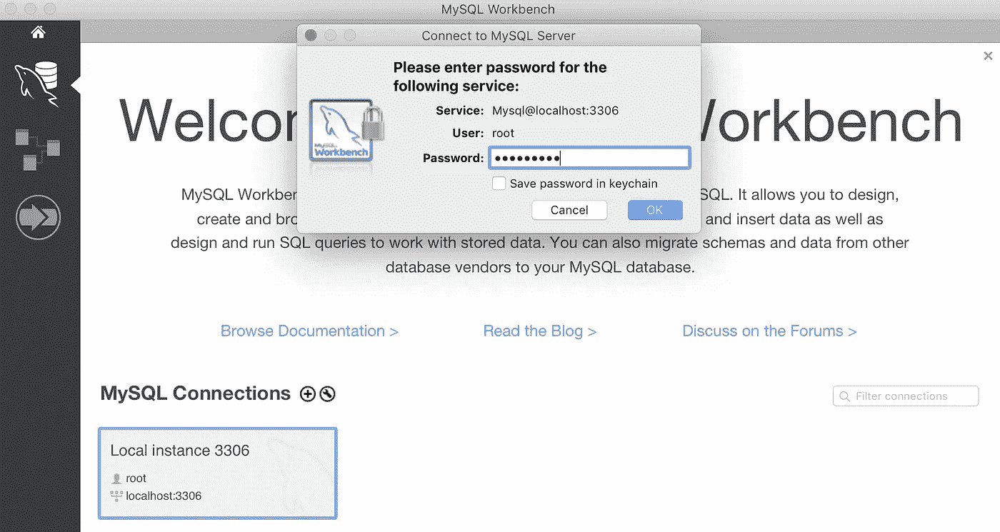

*   你会得到一个编辑器来编写你对特定数据库的查询。

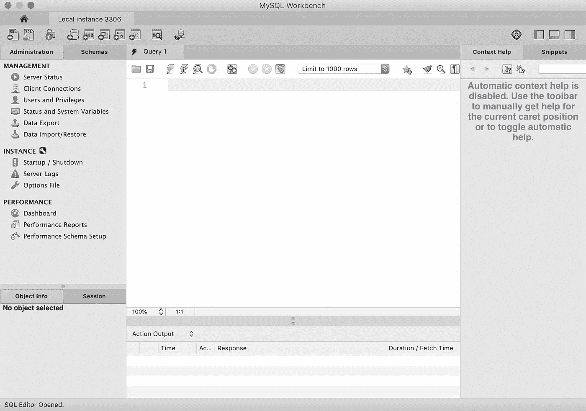

*   检查左上方的`Schemas`选项卡，查看显示的表格。表`sys_config`中只有一个`sys`模式。不是学习 SQL 的有趣数据源。所以还是装一些数据来练习吧。
*   如果你有自己的数据要处理。那就很好。您可以使用以下命令创建一个新的模式(数据库)并将其上传到表中。(您可以使用`Cmd+Enter`或点击⚡️lightning 按钮来运行命令)

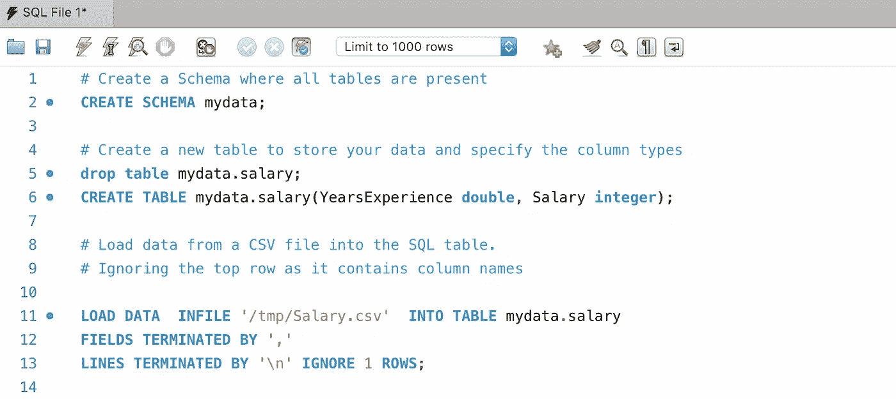

然而，在本教程中，我将使用 Sakila 电影数据库，您可以通过以下步骤安装该数据库:

*   转到 [MySQL 文档](https://dev.mysql.com/doc/index-other.html)并下载 Sakila ZIP 文件。
*   解压文件。
*   现在转到 MySQL 工作台，选择文件>运行 SQL 脚本>选择位置`sakila-db/sakila-schema.sql`
*   转到 MySQL 工作台，选择文件>运行 SQL 脚本>选择位置`sakila-db/sakila-data.sql`

完成后，您将看到模式列表中添加了一个新的数据库。

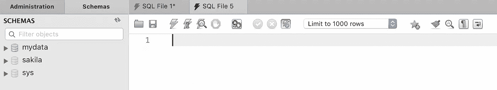

# 玩弄数据

现在我们有了一些数据。最后。

让我们从编写一些查询开始。

您可以尝试使用 [Sakila Sample Database](https://dev.mysql.com/doc/sakila/en/sakila-structure.html) 文档详细了解 Sakila 数据库的模式。

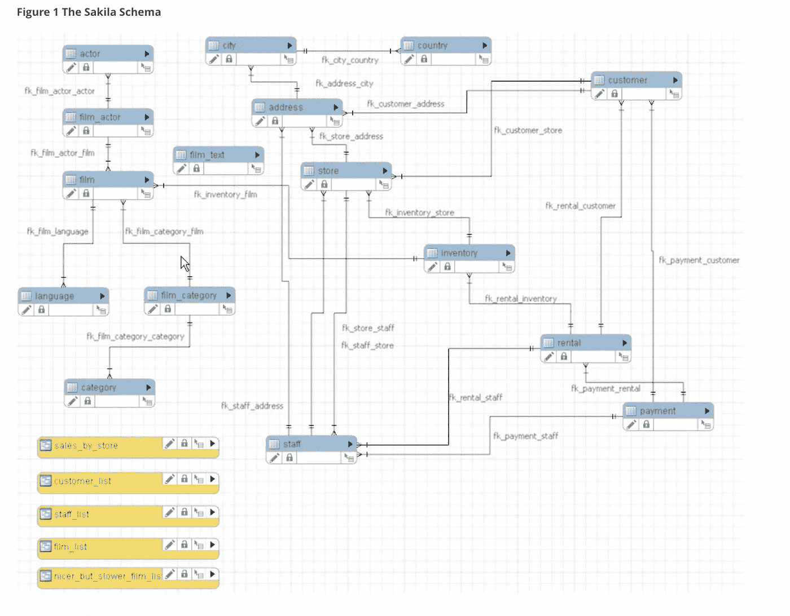

Schema Diagram

任何 SQL 查询的基本语法都是:

```
SELECT col1, SUM(col2) as col2sum, AVG(col3) as col3avg 
FROM table_name 
WHERE col4 = 'some_value' 
GROUP BY col1 
ORDER BY col2sum DESC;
```

该查询中有四个元素:

1.  **选择**:选择哪些列？在这里，我们选择`col1`，在`col2`上进行总和聚合，在`col3`上进行 AVG 聚合。我们还通过使用`as`关键字给`SUM(col2)`起了一个新名字。这就是所谓的混叠。
2.  **FROM** :我们应该从哪个表中选择？
3.  **WHERE** :我们可以使用 WHERE 语句过滤数据。
4.  **分组依据**:不在聚合中的所有选定列都应该在分组依据中。
5.  **排序依据**:排序依据`col2sum`

上面的查询将帮助您在数据库中找到大多数简单的东西。

例如，我们可以使用以下方法找出不同审查级别的电影在不同时间播放的差异:

```
SELECT rating, avg(length) as length_avg 
FROM sakila.film 
GROUP BY rating 
ORDER BY length_avg desc;
```

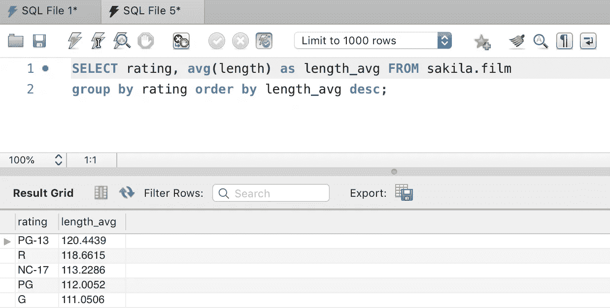

## 练习:提出一个问题

你现在应该提出一些你自己的问题。

例如，你可以试着找出 2006 年发行的所有电影。或者试图找到分级为 PG 且长度大于 50 分钟的所有电影。

您可以通过在 MySQL Workbench 上运行以下命令来实现这一点:

```
SELECT * FROM sakila.film WHERE release_year = 2006; 
SELECT * FROM sakila.film WHERE length>50 and rating="PG";
```

# SQL 中的联接

到目前为止，我们已经学习了如何使用单个表。但实际上，我们需要处理多个表。

接下来我们要学习的是如何连接。

现在连接是 MySQL 数据库不可或缺的一部分，理解它们是必要的。下图讲述了 SQL 中存在的大多数连接。我通常最后只使用左连接和内连接，所以我将从左连接开始。

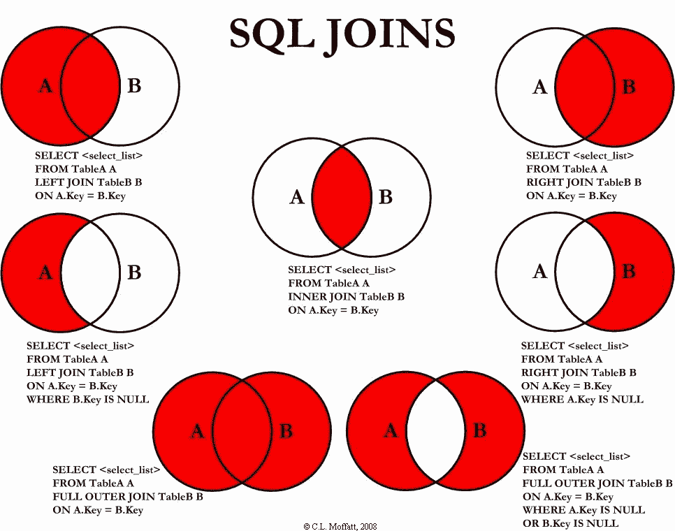

当您希望保留左表(A)中的所有记录并在匹配记录上合并 B 时，可以使用左连接。在 B 没有被合并的地方，A 的记录在结果表中保持为 NULL。MySQL 的语法是:

```
SELECT A.col1, A.col2, B.col3, B.col4 
FROM A 
LEFT JOIN B 
ON A.col2=B.col3
```

这里，我们从表 A 中选择 col1 和 col2，从表 b 中选择 col3 和 col4。

当您想要合并 A 和 B，并且只保留 A 和 B 中的公共记录时，可以使用内部联接。

## 示例:

为了给你一个用例，让我们回到我们的 Sakila 数据库。假设我们想知道我们的库存中每部电影有多少拷贝。您可以通过使用以下命令来获得:

```
SELECT film_id,count(film_id) as num_copies 
FROM sakila.inventory 
GROUP BY film_id 
ORDER BY num_copies DESC;
```

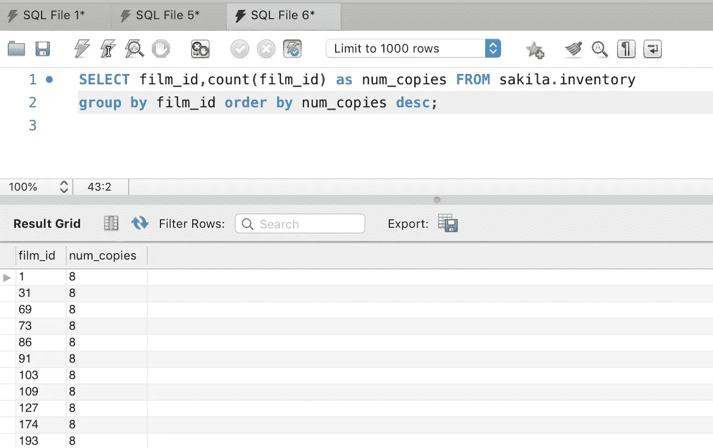

这个结果看起来有趣吗？不完全是。id 对我们人类来说没有意义，如果我们能得到电影的名字，我们就能更好地处理信息。所以我们四处窥探，发现表`film`和电影`title`都有`film_id`。

所以我们有所有的数据，但是我们如何在一个视图中得到它呢？

来加入救援。我们需要将`title`添加到我们的库存表信息中。我们可以用——

```
SELECT A.*, B.title 
FROM sakila.inventory A 
LEFT JOIN sakila.film B 
ON A.film_id = B.film_id
```

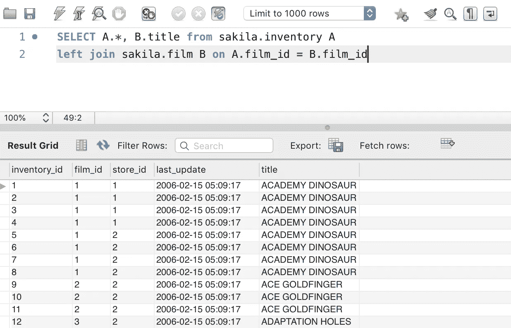

这将向您的库存表信息中添加另一列。正如你可能注意到的，有些电影在`film`表中，而我们在`inventory`表中没有。我们使用了一个左连接，因为我们希望保留库存表中的所有内容，并将其与`film`表中对应的内容连接，而不是与`film`表中的所有内容连接。

因此，现在我们将标题作为数据中的另一个字段。这正是我们想要的，但我们还没有解决整个难题。我们想要库存中标题的`title`和`num_copies`。

但是在我们继续深入之前，我们应该首先理解内部查询的概念。

# 内部查询:

现在您有了一个可以给出上述结果的查询。您可以做的一件事是使用

```
CREATE TABLE sakila.temp_table as 
SELECT A.*, B.title FROM sakila.inventory A 
LEFT JOIN sakila.film B 
ON A.film_id = B.film_id;
```

然后使用简单的 group by 操作:

```
SELECT title, count(title) as num_copies 
FROM sakila.temp_table 
GROUP BY title 
ORDER BY num_copies desc;
```

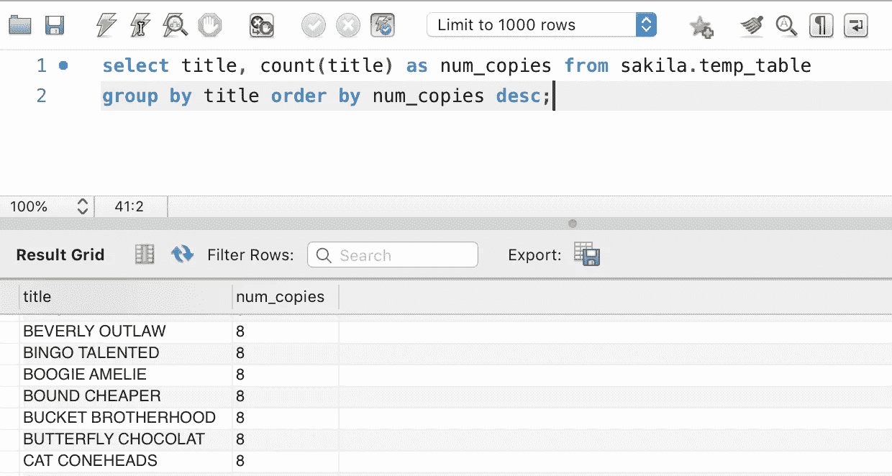

但这是多走了一步。我们必须创建一个临时表，它最终会占用系统空间。

SQL 为我们提供了针对这类问题的内部查询的概念。相反，您可以在一个查询中编写所有这些内容，使用:

```
SELECT temp.title, count(temp.title) as num_copies 
FROM (
SELECT A.*, B.title 
FROM sakila.inventory A 
LEFT JOIN sakila.film B 
ON A.film_id = B.film_id) temp 
GROUP BY title 
ORDER BY num_copies DESC;
```

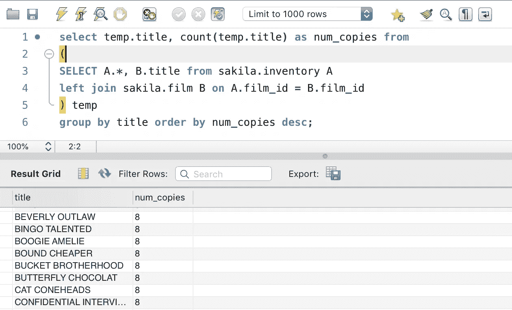

我们在这里做的是将我们的第一个查询放在括号中，并给这个表一个别名`temp`。然后我们按照操作进行分组，考虑`temp`，就像我们考虑任何表一样。正是因为有了内部查询的概念，我们才能编写有时跨越多个页面的 SQL 查询。

# 从句

HAVING 是另一个有助于理解的 SQL 结构。所以我们已经得到了结果，现在我们想得到拷贝数小于或等于 2 的影片。

我们可以通过使用内部查询概念和 WHERE 子句来做到这一点。这里我们将一个内部查询嵌套在另一个内部查询中。相当整洁。

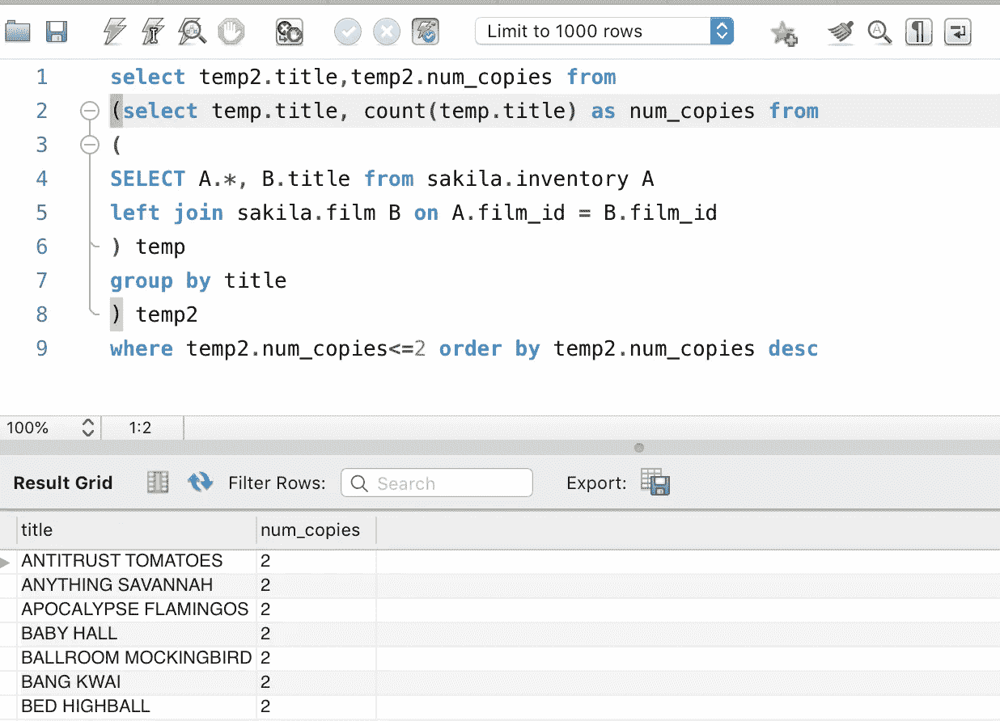

或者，我们可以使用 HAVING 子句。

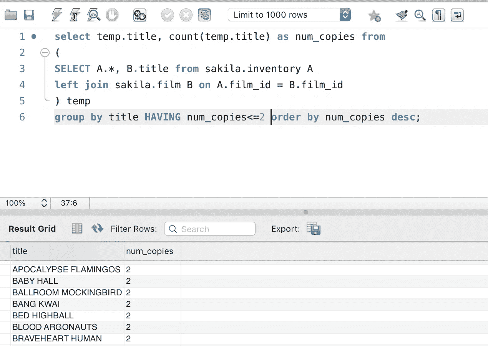

HAVING 子句用于过滤最终的聚合结果。它不同于 where，因为 WHERE 用于筛选 from 语句中使用的表。在分组发生后，对最终结果进行过滤。

正如您在上面的例子中已经看到的，有很多方法可以用 SQL 做同样的事情。我们需要尽量想出最不冗长的，因此在许多情况下有意义的。

如果你能做到这一步，你已经比大多数人知道更多的 SQL。

接下来要做的事情: ***练习*** 。

尝试在数据集上提出您的问题，并尝试使用 SQL 找到答案。

首先，我可以提供一些问题:

1.  ***在我们的盘点中，哪位演员的电影最鲜明？***
2.  ***在我们的盘点中，哪些类型片的租借率最高？***

# 继续学习

这只是一个关于如何使用 SQL 的简单教程。如果你想了解更多关于 SQL 的知识，我想向你推荐一门来自加州大学的关于数据科学的优秀课程。请务必阅读它，因为它讨论了其他 SQL 概念，如联合、字符串操作、函数、日期处理等。

将来我也会写更多初学者友好的帖子。在 [**中**](https://medium.com/@rahul_agarwal) 关注我，或者订阅我的 [**博客**](http://eepurl.com/dbQnuX) 了解他们。一如既往，我欢迎反馈和建设性的批评，可以通过 Twitter [@mlwhiz](https://twitter.com/MLWhiz) 联系到我。

此外，一个小小的免责声明——这篇文章中可能会有一些相关资源的附属链接，因为分享知识从来都不是一个坏主意。