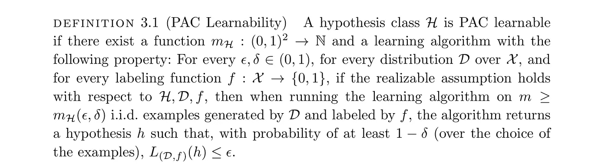
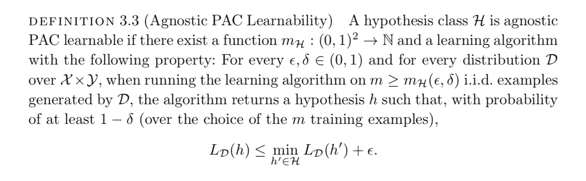

# 学习理论:(不可知论者)大概近似正确的学习

> 原文：<https://towardsdatascience.com/learning-theory-agnostic-probably-approximately-correct-learning-dfd0d7c76467?source=collection_archive---------3----------------------->

在我以前的文章中，我讨论了什么是经验风险最小化，以及它在某些假设下产生令人满意的假设的证明。现在我想讨论一下大概正确的学习(这有点拗口，但是有点酷)，这是 ERM 的一个概括。对于那些不熟悉 ERM 的人来说，我建议阅读我在该主题上的[前一篇文章](/learning-theory-empirical-risk-minimization-d3573f90ff77)，因为这是理解 PAC learning 的先决条件。

请记住，在分析 ERM 时，我们得出的结论是，对于有限的假设空间 **H** 我们可以得出一个假设，当假设假设空间中存在这样一个假设时，它的误差以一定的概率低于**ε**。基于这些参数，我们可以计算出需要多少样本才能达到这样的精度，我们得出了样本的下限值:

这可以放入通用的 PAC 学习框架，下面的正式定义来自《理解机器学习》一书:

至少对我来说，这个定义一开始有点混乱。这是什么意思？该定义规定，如果存在函数 **m_H** 和算法，则**假设类**是 PAC 可学习的，该算法对于输入域 **X、δ**和**ε**上的任何标记函数 **f、**分布 **D** ，其中 **m ≥ m_H** 产生假设 **h** ，使得概率为 1-**δ**一个标注函数无非就是说我们有一个确定的函数 **f** 标注域内的数据。

这里，假设类可以是任何类型的二元分类器，因为将标签分配给来自域的例子的标签函数分配标签 **0** 或 **1。****m _ H**函数为我们提供了一个最小样本数的界限，我们需要该界限来实现低于**ε**的误差，并具有置信度**δ。**精确度**ε**逻辑上控制必要的样本大小，因为我们的精确度越高，逻辑上我们需要我们的训练集是来自领域的更忠实的样本，因此，增加实现这种精确度所需的样本数量。

## 使模型不可知

Photo by [Evan Dennis](https://unsplash.com/@evan__bray?utm_source=medium&utm_medium=referral) on [Unsplash](https://unsplash.com?utm_source=medium&utm_medium=referral)

上述模型有一定的缺点，由于可实现性假设(在[经验风险最小化](/learning-theory-empirical-risk-minimization-d3573f90ff77)中解释)，它不够通用——没有人保证存在一个假设，由于模型的失败，该假设将导致我们当前假设空间中的真实误差为 0。另一种看待它的方式是，也许标签没有被数据很好地定义，因为缺少特征。

我们绕过可实现性假设的方法是用数据标签分布代替标签函数。您可以将此视为在标注函数中引入了不确定性，因为一个数据点可以共享不同的标注。那么为什么叫**不可知 PAC 学习**？不可知论一词来源于这样一个事实，即学习对于数据标签分布是不可知论的——这意味着它将通过不对数据标签分布做任何假设来学习最佳标签函数 **f** 。这种情况下有什么变化？嗯，**真误差**定义改变了，因为一个标签到一个数据点是在多个标签上的分布。我们不能保证学习者将达到最小可能的真实错误，因为我们没有数据标签分布来说明标签的不确定性。

经过这些考虑，我们从一书中得出了以下正式定义:

注意定义中关于 **PAC** 可学习性的变化。通过引入数据标签分布 **D** ，我们考虑到学习假设的**真实误差**将小于或等于**最优假设的误差**加上因子**ε**的事实。这也包含了 **PAC** 在假设空间中存在最优假设的情况下的自我学习，该假设产生的**真误差**为 0，但我们也考虑到可能不存在这样的假设。这些定义将在稍后解释 **VC 维度**和证明**没有免费的午餐定理时有用。**

如果术语对你来说有点陌生，我建议你看一下[学习理论:经验风险最小化](/learning-theory-empirical-risk-minimization-d3573f90ff77)或者更详细地看一下文章中提到的 Ben-David 的精彩著作。除此之外，继续机器学习！