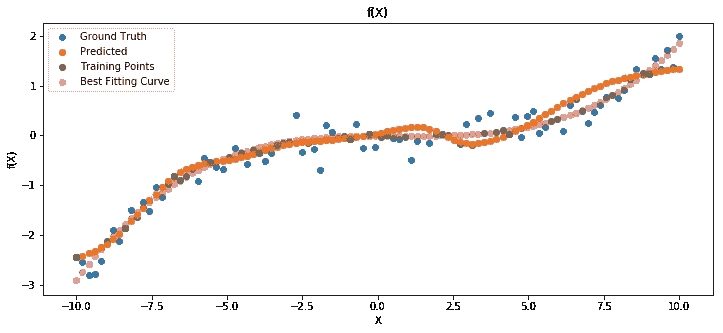

# 学习理论:经验风险最小化

> 原文：<https://towardsdatascience.com/learning-theory-empirical-risk-minimization-d3573f90ff77?source=collection_archive---------2----------------------->

经验风险最小化是机器学习中的一个基本概念，然而令人惊讶的是许多从业者并不熟悉它。理解 ERM 对于理解机器学习算法的限制以及形成实用的问题解决技能的良好基础是至关重要的。企业风险管理背后的理论是解释风险资本维度、大概正确(PAC)学习和其他基本概念的理论。在我看来，任何认真对待机器学习的人都应该乐于谈论 ERM。我将尽可能简单、简短和有理论依据地解释基本概念。这篇文章在很大程度上基于 Schwartz 和 Ben-David 的书[理解机器学习](http://www.cs.huji.ac.il/~shais/UnderstandingMachineLearning)，我强烈推荐给任何对学习理论基础感兴趣的人。

先说一个简单的监督学习分类问题。假设我们要对垃圾邮件进行分类，这可能是机器学习中最常用的例子(注意，这不是关于朴素贝叶斯的帖子)。每封邮件都有一个标签 0 或 1，要么是垃圾邮件，要么不是垃圾邮件。我们用 ***X*** 表示领域空间，用 ***Y*** 表示标签空间，我们还需要一个将领域集合空间映射到标签集合空间的函数，****f:X->Y***，这只是一个学习任务的形式化定义。*

*现在我们有了正式的问题定义，我们需要一个模型来做出我们的预测:垃圾邮件或不是垃圾邮件。巧合的是，**模型**的同义词是假设 ***h*** ，可能有点混乱。在这种情况下，假设只不过是一个从我们的域 ***X*** 获取输入并产生标签 0 或 1 的函数，即函数***h:X->Y****。**

*最后，我们实际上想找到最小化我们误差的假设，对吗？由此，我们得出了经验风险最小化这一术语。术语“经验的”意味着我们基于来自领域集合 **X** 的样本集合 ***S*** 来最小化我们的误差。从概率的角度来看，我们说我们从域集合 **X** 中采样 ***S*** ，其中 ***D*** 是在 **X** 上的分布。因此，当我们从域中采样时，我们表示从域 **X** 中通过***D***(**S**)采样的域子集的可能性有多大。*

*在下面的等式中，我们可以定义**真误差**，它基于整个域 **X** :*

**

*The error for hypothesis h. Starting from left to right, we calculate the error L based on a domain distribution D and a label mapping f. The error is equal to the probability of sampling x from d such that the label produced by the hypothesis is different from the actual label mapping.*

*由于我们只能访问输入域的子集 ***S*** ，因此我们是基于训练示例的样本进行学习的。我们无法访问**真实误差**，但可以访问**经验误差**:*

**

*m denotes the number of training examples. You can see from the equation that we effectively define the empirical error as the fraction of misclassified examples in the set S.*

*经验误差有时也被称为概括误差。原因是，实际上，在大多数问题中，我们无法访问输入的整个域*，而只能访问我们的训练子集**。W* e 想在 ***S*** 的基础上进行归纳学习，也叫归纳学习。这个误差也被称为**风险，**因此在经验风险最小化中称为风险。如果这让你想起了小批量梯度下降，那你就对了。这个概念在现代机器学习中基本是无处不在的。***

**现在可以谈谈**过拟合**的问题了。也就是说，由于我们只有数据的子样本，可能会发生这样的情况:我们最小化了**经验误差**，但实际上增加了**真实误差。**这个结果可以在简单的曲线拟合问题中观察到。让我们想象一下，我们有一些想要控制的机器人，我们想要将一些传感器数据 **X** 映射到扭矩。传感器数据有某种噪声，因为传感器从来都不是完美的，在这种情况下，我们将对传感器数据使用简单的高斯噪声。我们拟合了一个神经网络来做这件事，并且我们获得了以下结果:**

****

**The green points are the points that were used in fitting the model, our sample S. The model is actually quite good considering the small number of training points, but deviations from the optimal curve can be seen.**

**我们可以从另一个图中看到这种泛化误差，请注意，在某个点上，真实误差开始增加，而经验误差进一步减少。这是模型过度拟合训练数据的结果。**

****

**既然我们已经定义了我们的**经验风险**和**实际风险**，那么问题就来了，我们是否真的能用这些做些有用的事情？事实证明，我们可以有把握地保证 ERM 将会发挥作用。换句话说，我们希望以一定的信心得出模型误差的上界。上界的意思很简单，我们可以保证误差不会超过这个界限，因此有了界这个词。**

****

**This gives us the probability that a sampled set S (or training data in other words) is going to overfit the data, i.e. that the true error(L) is going to be larger than a certain number epsilon.**

**在当前情况下，我们将在**可实现性假设**下操作。我不打算写正式的定义，但简而言之，假设表明在所有可能的假设*的空间中存在一个假设 ***h*** ，该假设在真实风险为 0 的意义上是最优的，这也意味着在子集 ***S*** 上找到的假设实现了 0 经验误差。当然，这在现实世界的用例中大多是不正确的，有一些学习范例放松了这种假设，但这一点我可能会在另一篇文章中讨论。***

**让我们定义真实误差高于ε的一组假设:**

****

**对于这组假设，很明显，要么他们接受了一组非代表性的学习，这导致了低的经验误差(风险)和高的真实误差(风险)，要么他们没有好到足以学到任何东西。**

**我们想要分离导致假设的误导性训练集，这些假设导致低经验误差和高真实误差(过拟合的情况)，这将在稍后推导上限时有用:**

****

**抽样一个非代表性样本的特定子集 ***S*** 的概率在逻辑上等于或低于抽样 ***M*** 的概率，因为 ***S*** 是*M 的子集，因此我们可以写成:***

******

***我们将并集界引理应用于等式的右侧，该引理表示对两个集合的并集进行采样的概率低于对它们分别进行采样的概率。这就是为什么我们可以把总数写在右边:***

******

***此外，我们假设这些例子是独立同分布的(iid ),因此我们可以将经验误差为零的概率写成各个预测正确的概率的乘积:***

******

***The constant m denotes the number of training examples in the set S.***

***假设在某一数据点正确的概率可以写成 1 减去**真实风险**。这是因为我们将风险定义为错误分类样本的分数。这个不等式来自于我们假设误差低于或等于上界的事实。***

******

***如果我们把前面的两个等式结合起来，我们会得到下面的结果:***

******

***The exponential on the right comes from a simply provable inequality.***

***如果我们将上面的等式与应用联合边界的前一个等式结合起来，我们会得到以下有见地的结果:***

******

***Here |H| is the cardinality of the hypothesis space, obviously, this formulation doesn’t make sense in the case when we have an infinite number of hypotheses.***

***我们可以用某个常数 1δ来代替左侧，其中δ是我们希望误差不高于ε的置信度。我们可以简单地重新排列等式，以便表述如下:***

******

***最终结果告诉我们，我们需要多少个示例(m ),以便 ERM 不会导致高于ε且具有某个置信度δ的误差，即，当我们为 ERM 选择足够多的示例时，它可能不会具有高于ε的误差。我在这里使用可能这个词，因为它取决于我们的置信常数δ，它在 0 和 1 之间。这是一件很直观的事情，但我认为有时候看看方程，发现它在数学上是有意义的，这很好。***

***在企业风险管理中，做出了许多假设。我提到了可实现性假设，即在我们的假设池中有一个最优假设。此外，假设空间可能不是有限的，因为它是在这里。在未来，我计划通过范例来放松这些假设。然而，ERM 是学习理论中的一个基本概念，对于任何认真的机器学习实践者都是必不可少的。***