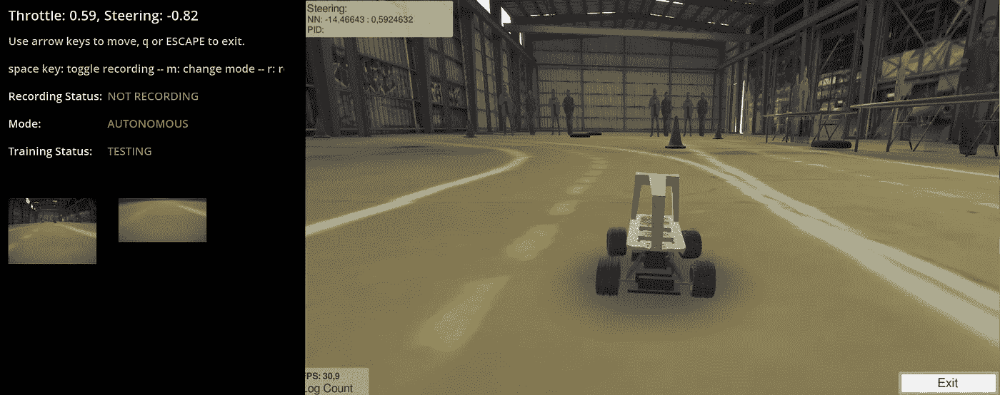
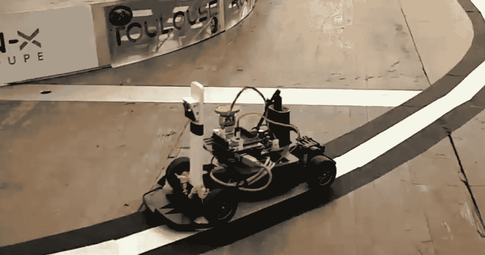
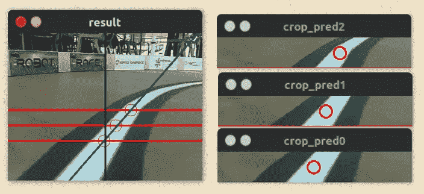
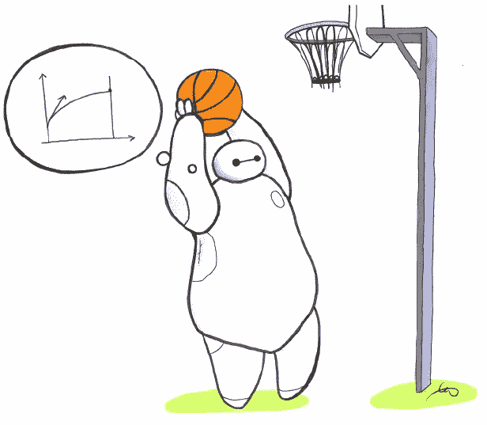
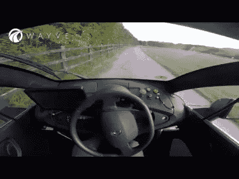
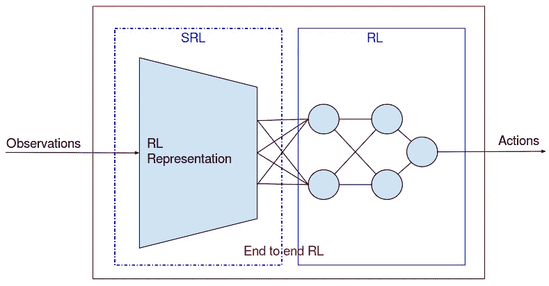
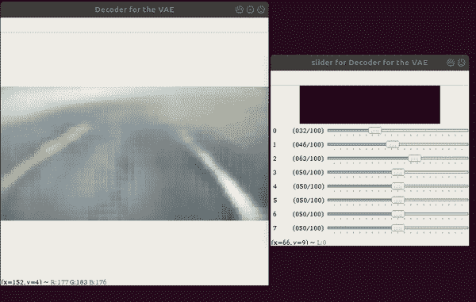
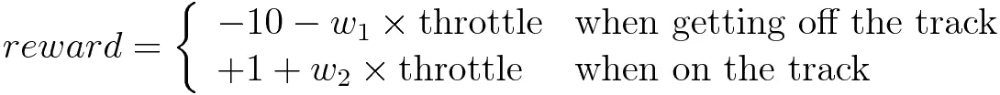
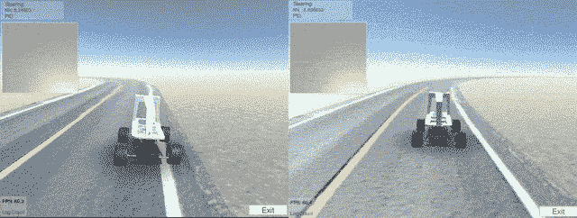

# 几分钟内学会平稳驾驶

> 原文：<https://towardsdatascience.com/learning-to-drive-smoothly-in-minutes-450a7cdb35f4?source=collection_archive---------4----------------------->

## 小型赛车上的强化学习

Donkey Car in action with teleoperation control panel in the unity simulator

在这篇文章中，我们将看到如何在几分钟内训练一辆自动驾驶赛车，以及如何平稳地控制它。这种基于强化学习(RL)的方法，在这里的模拟(驴车模拟器)中提出，被设计成适用于现实世界。它建立在一家名为 [Wayve.ai](https://wayve.ai/) 的专注于自动驾驶的初创公司的工作基础上。

本文中使用的代码和模拟器是开放源代码和公共的。更多信息请查看[关联的 GitHub 库](https://github.com/araffin/learning-to-drive-in-5-minutes)；)(预先训练的控制器也可以下载)

**重要提示:如需最新版本(使用**[**Stable-baselines 3**](https://github.com/DLR-RM/stable-baselines3)**和 PyTorch)，请查看**[https://github . com/araffin/aae-train-donkey car/releases/tag/live-twitch-2](https://github.com/araffin/aae-train-donkeycar/releases/tag/live-twitch-2)

**2022 年 4 月更新**:我用强化学习做了一系列学习赛车的视频:[https://www.youtube.com/watch?v=ngK33h00iBE&list = pl 42 JK f1 t1 f 7 dfxe 7 f 0 vteflhw 0 ze Q4 XV](https://www.youtube.com/watch?v=ngK33h00iBE&list=PL42jkf1t1F7dFXE7f0VTeFLhW0ZEQ4XJV)

## 录像

## GitHub 库:重现结果

 [## araffin/5 分钟学会驾驶

### 实施强化学习方法，使汽车在几分钟内学会平稳驾驶——5 分钟内学会驾驶

github.com](https://github.com/araffin/learning-to-drive-in-5-minutes) 

## 赛车比赛

自从几年前 DIY Robocars 诞生以来，现在已经有了无数的自主赛车比赛(例如[图卢兹机器人大赛](http://toulouse-robot-race.org/)、[铁车、](http://www.ironcar.org/)……)。在这些项目中，目标很简单:你有一辆赛车，它必须在赛道上尽可能快地行驶，只给它车载摄像头的图像作为输入。

The Warehouse level, inspired by DIY Robocars

自驾挑战是进入机器人领域的好方法。为了方便学习，开发了开源的自动驾驶平台[驴车](http://www.donkeycar.com/)。在其生态系统中，现在有一个以那个小机器人为特色的 [unity 模拟器](https://github.com/tawnkramer/sdsandbox/tree/donkey)。我们将在这辆驴车上测试提议的方法。

## 概述

在简要回顾了小型自动驾驶汽车比赛中使用的不同方法后，我们将介绍什么是强化学习，然后详细介绍我们的方法。

[Autonomous Racing Robot With an Arduino, a Raspberry Pi and a Pi Camera](https://becominghuman.ai/autonomous-racing-robot-with-an-arduino-a-raspberry-pi-and-a-pi-camera-3e72819e1e63)

## 自驾车比赛中使用的方法:路线跟踪和行为克隆

在介绍 RL 之前，我们将首先快速回顾一下目前在 RC 赛车比赛中使用的不同解决方案。

在[之前的博客文章](https://becominghuman.ai/autonomous-racing-robot-with-an-arduino-a-raspberry-pi-and-a-pi-camera-3e72819e1e63)中，我描述了第一种自动驾驶的方法，它结合了*计算机视觉和 PID 控制器*。虽然这个想法很简单，适用于许多设置，但它需要手动标记数据(以告诉汽车赛道的中心在哪里)，这既费钱又费力(相信我，手动标记并不好玩！).

[Predicting where is the center of the track](https://www.youtube.com/watch?v=xhI71ZdSh6k)

作为另一种方法，许多竞争对手使用监督学习来*再现人类驾驶员行为*。为此，人类需要在几圈期间手动驾驶汽车，记录相机图像和来自操纵杆的相关控制输入。然后，训练一个模型来再现人类驾驶。然而，这种技术并不是真正健壮的，需要每条赛道的同质驾驶和再训练，因为它的泛化能力相当差。

## 什么是强化学习(RL)，我们为什么要使用它？

鉴于上述问题，强化学习(RL)似乎是一个有趣的选择。

在强化学习环境中，一个代理(或机器人)作用于它的环境，并接收一个奖励作为反馈。它可以是积极的奖励(机器人做了好事)或消极的奖励(机器人应该受到惩罚)。

*机器人的目标是累积奖励最大化。*为了做到这一点，它通过与世界的交互来学习所谓的策略(或行为/控制器),将它的感官输入映射到行动。

在我们的例子中，*输入是摄像机图像，动作是油门和转向角度*。因此，如果我们以这样一种方式模拟奖励，即赛车保持在赛道上并使其速度最大化，我们就完成了！

[Stable-Baselines: an easy to use reinforcement learning library](https://github.com/hill-a/stable-baselines)

这就是[强化学习](https://spinningup.openai.com/en/latest/)的美妙之处，你只需要很少的假设(这里只设计一个奖励函数),它会直接优化你想要的(在赛道上快速前进，赢得比赛！).

注意:这不是第一篇关于小型无人驾驶汽车强化学习的博客文章，但与[以前的方法](https://flyyufelix.github.io/2018/09/11/donkey-rl-simulation.html)、*相比，本文介绍的技术只需要几分钟*、**、**(而不是几个小时)就可以学会一个良好而平滑的控制策略(对于一个平滑的控制器来说大约需要 5 到 10 分钟，对于一个非常平滑的控制器来说大约需要 20 分钟)。

现在我们已经简要介绍了什么是 RL，我们将进入细节，从剖析 Wayve.ai 方法开始，这是我们方法的基础。

## 一天学会驾驶——way ve . ai 方法的关键要素

[Wayve.ai](https://wayve.ai/blog/learning-to-drive-in-a-day-with-reinforcement-learning) 描述了一种在简单道路上训练现实世界中自动驾驶汽车的方法。这种方法由几个关键要素组成。

[Wayve.ai approach](https://www.youtube.com/watch?v=eRwTbRtnT1I): learning to drive in a day

首先，他们*训练一个特征提取器*(这里是一个可变自动编码器或 *VAE* )将图像压缩到一个更低维度的空间。该模型被训练来重建输入图像，但是包含迫使其压缩信息的瓶颈。

**这个从原始数据中提取相关信息的步骤叫做** [**状态表征学习(SRL)**](https://github.com/araffin/robotics-rl-srl) ，是我主要的[研究课题](https://openreview.net/forum?id=Hkl-di09FQ)。这显著地允许减少搜索空间，并因此加速训练。下图显示了 SRL 和端到端强化学习之间的联系，也就是说，直接从像素学习控制策略。

注意:训练自动编码器[并不是提取有用特征的唯一解决方案](https://arxiv.org/pdf/1802.04181.pdf)，你也可以训练例如[逆动力学模型](https://github.com/araffin/srl-zoo)。

[Decoupling Feature Extraction from Policy Learning](https://openreview.net/forum?id=Hkl-di09FQ)

第二个关键要素是使用名为[深度确定性策略梯度(DDPG)](https://stable-baselines.readthedocs.io/en/master/modules/ddpg.html) 的 RL 算法，该算法使用 VAE 特性作为输入来学习控制策略。这个政策每集之后都会更新。该算法的一个重要方面是*它有一个内存，称为重放缓冲区***，在这里它与环境的交互被记录下来，并可以在以后“重放”。因此，即使汽车不与世界互动，它也可以从这个缓冲区中采样经验来更新它的策略。**

**在人类干预之前，汽车被训练成最大化行驶的米数。这是最后一个关键因素:一旦汽车开始偏离道路，人类操作员就结束这一集。这个*提前终止*真的很重要(如[深度模仿](https://xbpeng.github.io/projects/DeepMimic/index.html)所示)，防止汽车探索不感兴趣的区域来解决任务。**

**到目前为止，没有什么新的东西被提出来，我们只是总结了 Wayve.ai 的方法。以下是我对基本技术的所有修改。**

## **几分钟内学会驾驶——最新方法**

**虽然 Wayve.ai 技术在原理上可能行得通，但要将其应用于自动驾驶的遥控汽车，还需要解决一些问题。**

**首先，因为特征提取器(VAE)在每集之后被训练，所以特征的分布不是固定的。也就是说，*特征随着时间的推移而变化*，并可能导致策略训练的不稳定性。此外，在笔记本电脑上训练 VAE(没有 GPU)相当慢，所以我们希望避免在每一集后重新训练 VAE。**

**为了解决这两个问题，我决定*事先训练一只 VAE*并使用谷歌 [Colab 笔记本](https://colab.research.google.com/drive/1mF2abRb_yi4UNqYXVBF-t4FuCy6fl1c1#scrollTo=9bIR_N7R11XI)来保存我的电脑。通过这种方式，使用固定的特征提取器来训练策略。**

**在下面的图片中，我们[探索 VAE 学到了什么](https://github.com/araffin/srl-zoo)。我们在它的潜在空间中导航(使用滑块)并观察重建的图像。**

****

**[Exploring the latent space](https://github.com/araffin/srl-zoo) learned by the VAE**

**然后，众所周知，DDPG 是不稳定的(在某种意义上，它的表现会在训练中灾难性地下降)，并且很难调整。幸运的是，最近一个名为 [**的软演员评论家**](https://stable-baselines.readthedocs.io/en/master/modules/sac.html) **(SAC)的算法具有相当的性能，并且更容易调整** *。**

***在我的实验中，我尝试了 PPO、SAC 和 DDPG。DDPG 和 SAC 在几集内给出了最好的结果，但 SAC 更容易调整。**

**对于这个项目，我使用了我为[stable-baselines](https://github.com/hill-a/stable-baselines)**编写的软 Actor-Critic (SAC)实现(如果你正在使用 RL，我肯定推荐你看一看；) )，里面有算法的[最新改进](https://bair.berkeley.edu/blog/2018/12/14/sac/)。****

**** [## 丘陵/稳定基线

### OpenAI 基线的一个分支，强化学习算法的实现- hill-a/stable-baselines

github.com](https://github.com/hill-a/stable-baselines) 

最后，我更新了奖励函数和动作空间，以平滑控制和最大化速度。

## 奖励功能:走得快但留在赛道上！

机器人汽车没有任何里程计(也没有速度传感器)，因此行驶的米数(也没有速度)不能作为奖励。

因此，我决定在每个时间步给予“生命奖励”(即停留在赛道上的+1 奖励)，并对机器人进行惩罚，对离开赛道的使用**碰撞惩罚**(-10 奖励)。此外，我发现惩罚开得太快的车也是有益的:与油门成比例的额外负奖励被加到撞车惩罚上。****

****最后，因为我们想跑得快，因为它是一辆赛车，我添加了一个与当前油门成比例的“油门加成”。这样，**机器人会尽量待在轨道上，同时最大化速度**。****

****总结一下:****

********

****其中 w1 和 w2 是常数，允许平衡目标(w1 << 10，w2 << 1，因为它们是次要目标)****

## ****避免摇晃控制:学习平稳驾驶****

> ****世界并不是随机的。如果你注意到了——机器人不会自发地开始颤抖。除非你给它接上一个 RL 算法。—埃莫·托多洛夫****

********

****Left: Shaky Control — Right: Smooth Control using the proposed technique****

****如果到目前为止你应用了所介绍的方法，它将会起作用:赛车将会停留在赛道上，并且会试着跑得更快。然而，**你很可能会以一个不稳定的控制结束:**汽车会如上图所示振荡，因为它没有动力不这样做，它只是试图最大化它的回报。****

******平滑控制的解决方案是约束转向角的变化，同时用先前命令的历史增加输入**(转向和油门)。这样，*你就能在转向中保持连贯性。*****

****举例来说，如果当前汽车转向角度为 0，并且它突然尝试以 90°转向，则连续性约束将仅允许它以 40°转向。因此，两个连续转向命令之间的差异保持在给定的范围内。这种额外的约束是以多一点培训为代价的。****

****在找到令人满意的解决方案之前，我花了几天时间试图解决这个问题**，以下是我尝试过但没有成功的方法**:****

*   ****输出相对转向而不是绝对转向:产生较低频率的振荡****
*   ****添加一个连续性惩罚(惩罚机器人转向的高变化):机器人没有优化正确的事情，它有时会工作，但后来不会留在轨道上。如果惩罚的成本太低，它就忽略它。****
*   ****限制最大转向:在急转弯时，汽车不能再停留在赛道上****
*   ****[堆叠几帧](https://danieltakeshi.github.io/2016/11/25/frame-skipping-and-preprocessing-for-deep-q-networks-on-atari-2600-games/)以给出一些速度信息:产生较低频率的振荡****

****注:最近，[苏黎世联邦理工学院的研究人员](http://robotics.sciencemag.org/content/4/26/eaau5872)建议利用课程学习进行持续的节能控制。这可能是第二个解决方案(尽管有点难以调整)。****

## ****概述该方法****

****在我们的方法中，我们将策略学习从特征提取中分离出来，并添加一个额外的约束来平滑控制。****

****首先，人类通过手动驾驶汽车来收集数据(手动驾驶约 5 分钟可获得 10k 张图像)。这些图像被用来训练 VAE。****

****然后，我们在探索阶段(使用随机策略)和策略培训(当人类将汽车放回赛道以优化花费的时间时完成)之间交替。****

****为了训练该策略，首先使用 VAE(这里具有 64 维的潜在空间)对图像进行编码，并将其与最近十次采取的动作(油门和转向)的历史连接，从而创建 84D 特征向量。****

****控制策略由神经网络(32 和 16 个单元的两个全连接层，具有 ReLU 或 eLU 激活功能)表示。****

****该控制器输出转向角和油门。我们将油门限制在给定的范围内，并且还限制了当前转向角和先前转向角之间的差异。****

## ****结论****

****在这篇文章中，我们提出了一种方法，只使用一个摄像头，在几分钟内学习驴车的平稳控制策略。****

****由于该方法旨在应用于现实世界，这肯定是我在这个项目中的下一步:在一辆真实的 RC 汽车上测试该方法*(见下文)。这将需要缩小 VAE 模型(政策网络已经很小了)，以便让它在树莓派上运行。****

****今天到此为止，不要犹豫测试代码，评论或提问，记住，分享是关怀；)!****

***** Roma Sokolkov 在一辆真实的遥控汽车上复制了 wayve.ai 方法[，但是这不包括平滑控制的最新改进](https://www.youtube.com/watch?v=6JUjDw9tfD4)****

## ****感谢****

****如果没有 [Roma Sokolkov](https://github.com/r7vme/learning-to-drive-in-a-day) 对 Wayve.ai 方法的重新实现、 [Tawn Kramer](https://github.com/tawnkramer) 的驴车模拟器、 [Felix Yu](https://flyyufelix.github.io/2018/09/11/donkey-rl-simulation.html) 的博客文章获得灵感、 [David Ha](https://github.com/hardmaru/WorldModelsExperiments) 在 VAE 的实现、 [Stable-Baselines](https://github.com/hill-a/stable-baselines) 及其 [model zoo](https://github.com/araffin/rl-baselines-zoo) 用于 SAC 实现和训练脚本、用于遥控操作的[赛车机器人项目](https://github.com/sergionr2/RacingRobot)和[就不可能完成这项工作](https://github.com/araffin/robotics-rl-srl)****

****我也想感谢罗马，塞巴斯蒂安，塔恩，佛罗伦萨，约翰内斯，乔纳斯，加布里埃尔，阿尔瓦罗，阿瑟和塞尔吉奥的反馈。****

## ****附录:学习状态表示****

*****潜在空间维度和样本数的影响*****

****VAE 的潜在空间维度只需要足够大，以便 VAE 能够重建输入图像的重要部分。例如，64D 和 512D VAE 之间的最终控制策略没有巨大差异。****

****重要的不是样本的数量，而是样本的多样性和代表性。如果你的训练图像没有覆盖所有的环境多样性，那么你需要更多的样本。****

****我们能从随机特征中学习控制策略吗？****

****我试图在初始化后立即修正 VAE 的权重，然后学习关于那些随机特征的策略。然而，这并没有奏效。****

*****与像素学习的比较*****

****我没有时间(因为我的笔记本电脑没有 GPU)来比较直接从像素学习策略的方法。然而，如果有人能使用我的代码库做到这一点，我会对结果感兴趣。****

*****有效的最低限度政策是什么？*****

****单层 mlp 有效。我也尝试了线性策略，但是，我没有成功地获得一个好的控制器。********