# 学习用价值迭代网络进行计划

> 原文：<https://towardsdatascience.com/learning-to-plan-with-value-iteration-networks-5768e80df2c3?source=collection_archive---------15----------------------->

## 可以学习模仿规划算法的神经网络

**被动策略**

深度强化学习的第一个主要成就是著名的 DQN 算法在各种雅达利视频游戏中的人类水平表现，其中一个神经网络使用原始屏幕像素作为输入来学习玩游戏。在强化学习中，我们希望学习一种将状态映射到行动的**策略**，这样可以最大化累积的回报。例如，在 DQN 的论文中，神经网络是一种卷积神经网络，它将屏幕图像作为输入，并输出可能行为的得分。

虽然强化学习算法被设计成使得该策略应该学习挑选具有长期益处的动作，但是我们从我们的策略获得的信息仅适用于当前状态。这被称为**反应策略**，这是一种将当前状态映射到应该立即采取的行动的策略，或者映射到行动的概率分布**。**

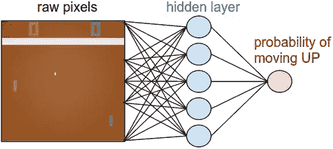

[source](http://: http://karpathy.github.io/assets/rl/policy.png)

虽然反应性政策主导了大多数强化学习文献，并导致了一些惊人的和广为人知的成就，但有时我们需要从我们的政策中获得更丰富的答案，而当前推荐的行动是不够的。有时，我们的应用程序要求我们能够比单一步骤看得更远，并验证我们的策略将带我们走上一条“安全”的轨道，这要受到我们系统的其他组件的审查。在这种情况下，与其采取当前最好的行动，我们更想要的是一个完整的计划，或者至少是一个特定的未来计划。

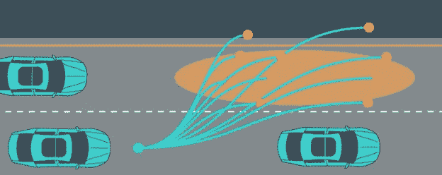

[source](https://cdn-images-1.medium.com/max/1000/1*umJ5XJ3PS828PE0cr8nCmg.png)

但是，如果我们伟大的 RL 算法可以学习非常好的反应策略，我们为什么要为一个完整的计划费心呢？一个可能的原因是，RL 策略在成功学习任务之前通常需要大量的尝试，因此通常在模拟环境中训练，在模拟环境中，策略可以尽可能多地撞车，或者射击友军，如果失败就再试一次。模拟并不是真实世界的完美呈现，尽管存在这些差异，我们还是希望我们的系统能够正常工作，这是 RL 代理人[所知的与](https://arxiv.org/pdf/1812.02341.pdf)斗争的事情。

拥有一个完整的计划可以让我们使用外部知识来评估它，并防止采取危险的行动。例如，如果一辆自动驾驶汽车希望改变车道，但突然有一辆汽车非常快地接近，比训练期间模拟汽车的速度还快，则外部程序可以预测当前计划的轨迹将会发生碰撞，并中止操纵。对于被动的政策来说，这要困难得多，因为在这种情况下，可能很难预测该情景在结束之前会如何结束。

渴望一个完整计划的另一个原因是，它可能使我们的政策执行得更好。也许通过迫使它提前计划，我们可以约束我们的政策更加一致，并能够更好地适应看不见的情况，这就是我们想要的。

**马尔可夫决策过程**

规划问题的一个非常常见的模型是马尔可夫决策过程，或 MDP。在 MDPs 中，我们将世界定义为一组**状态** S，一组可能的**动作**采取 A，一个**奖励函数** R 和一个**转换模型** P。它们一起构成元组:

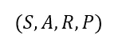

它定义了 MDP。让我们看一个具体的例子:

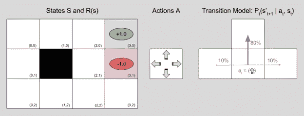

[source](https://i.stack.imgur.com/jkJ5b.png)

在这个例子中，一个代理人必须在 2D 地图上导航并到达绿色方块，因为绿色方块它会得到+1 奖励，并且避免红色方块，如果踩到红色方块它会受到-1 奖励的惩罚。其余状态不返回奖励(或等价地返回 0)。按照我们对 MDP 的定义，州是地图上除了黑色瓦片以外的瓦片集合，黑色瓦片是一个障碍。这组动作是四个方向，转移概率由右图给出。假设采取了特定的动作，转换模型指定了从当前状态转换到另一个状态的概率。在我们的例子中，如果我们的代理选择向上的动作，它将有 80%的机会向上移动，10%的机会向左或向右移动。如果代理选择正确的动作，它有 80%的机会向右移动，10%的机会向上或向下移动。

假设我们的代理位于地图的左下角，并且必须安全地导航到绿色方块。必须区分规划**轨迹**还是寻找**政策**。如果我们计划一个轨迹，我们会得到一个序列，指定应该采取行动的顺序，例如:(**上，上，右，右，右**)。如果我们的问题是确定性的，并且选择一个方向将有 100%的机会将我们的代理移动到那个方向，那么这将对应于轨迹:

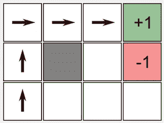

edited from: [source](https://mpatacchiola.github.io/blog/images/reinforcement_learning_example_r004.png)

然而，由于我们的问题是不确定的，我们可能会偏离我们想要走的道路，这一系列的行动对我们来说是不够的。我们真正想要的是一个完整的计划，将每个状态映射到期望的动作，就像这样:

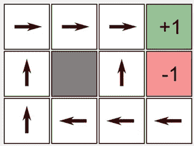

[source](https://mpatacchiola.github.io/blog/images/reinforcement_learning_example_r004.png)

这实际上正是我们的 RL 策略所代表的，从状态到行动的映射。不同的是，在这个简单的问题中，我们可以把整个状态空间展开，然后观察这个策略。在复杂的现实世界问题中，我们可能知道我们当前的状态，但是计算出未来行动和状态的可能结果可能是不现实的。，尤其是当我们的输入是图像或视频等高维传感器观测数据时。

但是回到我们的例子，我们怎样才能找到如上图所示的最优策略呢？这类问题有一个经典的算法叫做**值迭代**。这个算法所做的是计算当前处于某种状态所能获得的长期收益，通过问这个问题“如果我从这种状态开始，我能获得的最佳利润是多少？”。在 MDP 行话中，这个量被称为状态**值**，直观地看，如果我们知道每个状态的**值**，我们可以尝试总是移动到具有更高**值**的状态，并获得它们承诺的好处。

假设我们知道问题中所有状态的最优值；V*(s)，我们现在可以定义从我们的状态采取一个具体行动的价值，并从此采取最优行动；Q*(s，a)。

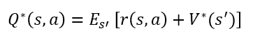

状态-行动值是除了下一个状态的最优值之外，我们在这个状态采取行动得到的回报。但是，由于我们的问题是随机的，我们必须对它有一个预期，以便考虑到达未来状态的不同概率。但是由于 V*(s)是我们可以从当前状态获得的最佳值，这意味着这个等式必须成立:

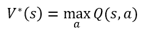

这给出了最优值函数的递归定义:

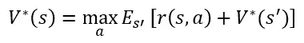

如果我们为每个状态猜测一个值，并且证明这个递归方程对所有状态都是满足的，我们**知道**我们有一个最优值函数。但除此之外，我们可以猜测我们状态的任何初始值函数，并使用我们的方程来更新它，如下所示:

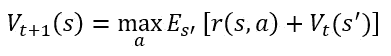

通过使用一些数学方法，我们甚至可以证明，如果在每次迭代中，我们对问题中的所有状态都这样做，最终我们的价值函数将收敛到最优价值函数。一旦我们有了最优价值函数，我们就可以很容易地提取最优策略:

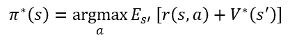

这整个过程被称为**值迭代**。

但是这显然不能用于复杂的问题，在这些问题中，我们甚至无法获得转换模型的描述，甚至可能无法获得回报函数，那么我们如何将它用于更有趣的问题呢？

**价值迭代网络**

伯克利的研究人员在 NIPS 2016 上发表了一篇非常有趣的论文(他们因此获得了最佳论文奖)，试图以一种非常优雅的方式解决这个问题，即赋予神经网络在其内部执行类似过程的能力。想法是这样的:因为我们并不真正知道我们真正问题的潜在 MDP，我们可以让我们的神经网络学习一些其他的 MDP，这与真正的不同，但为真正的问题提供了有用的计划。他们在一个 2D 导航问题上演示了他们的方法，其中输入是包含目标位置和障碍的地图图像。

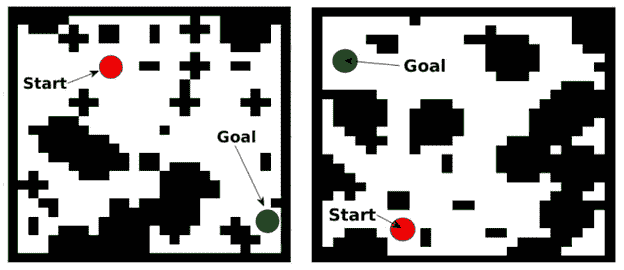

[source](https://arxiv.org/pdf/1602.02867.pdf)

输入图像被馈送到卷积神经网络，该网络输出相同大小的图像，该图像表示地图中不同位置的“回报”,并被馈送到另一个 CNN，该 CNN 将其映射到初始值地图。然后，对于 M 次迭代，卷积层被应用于连接的值和回报图像，以产生 Q 值图像，其具有 K 个通道，每个通道表示学习的 MDP 中的“动作”。最大池是沿着通道的维度执行的，本质上执行的操作与我们在上一节中看到的值迭代算法非常相似。

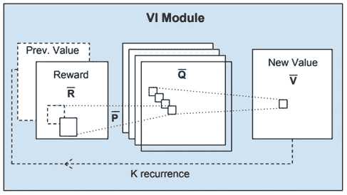

[source](https://arxiv.org/pdf/1602.02867.pdf)

最终的价值图(或者它的特定部分)被提供给一个反应策略，该策略选择在我们的实际问题中执行的动作。值得注意的是，在任何阶段，模型都不会被赋予真实回报图或价值图的基础事实标签，我们只是希望通过学习使用这个价值迭代网络(VIN)来行动，我们的神经网络将**学习** **成为有用的 MDP** 。

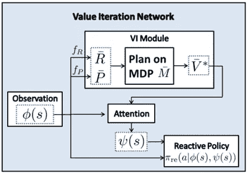

[source](https://arxiv.org/pdf/1602.02867.pdf)

这整个模型要么通过使用给定轨迹的模仿学习来训练，要么通过从头开始的强化学习来训练，结果证明，结果确实非常棒:

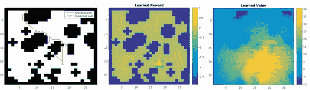

[source](https://arxiv.org/pdf/1602.02867.pdf)

在没有给它们的情况下，神经网络学习了奖励和价值图，它们看起来正是我们认为它们应该是的。奖励地图在目标位置及其附近具有高值，在障碍物处具有负值。值图似乎有一个梯度，将点引向目标位置并远离障碍物，这非常有意义。

虽然这个 2D 导航任务看似简单，但实际上看似困难。在一组训练地图上训练一个标准的 CNN 策略是可行的，但是对于看不见的地图的泛化能力相对较差。使用 VIN，作者显示了对不可见地图的更好的概括能力。除了简单的网格世界导航任务，他们还展示了使用月球表面高程图像的导航问题的算法，其中月球车必须在不可穿越的特征中安全导航，以及使用自然语言输入的网络导航问题。

我发现非常令人惊讶的是，模型可以完全从图像输入中学习这些，我们可以将这一成功归因于架构产生的固有归纳偏差，这迫使模型以类似于规划算法的方式执行计算。从那时起，这项工作已经得到了改进，并扩展到了更一般的领域，如图形，但仍然是一个令人印象深刻的成就。