# 学习以每秒 100 万帧的速度玩蛇

> 原文：<https://towardsdatascience.com/learning-to-play-snake-at-1-million-fps-4aae8d36d2f1?source=collection_archive---------15----------------------->

## 用优势耍蛇演员兼评论家

在这篇博文中，我将向你介绍我最近的项目，它结合了我觉得很有趣的两件事——电脑游戏和机器学习。很长一段时间以来，我一直想掌握深度强化学习，我认为没有比做自己的项目更好的方法了。为此，我用 PyTorch 实现了经典的手机游戏“Snake ”,并训练了一个强化学习算法来玩这个游戏。这篇文章分为三个部分。

1.  贪吃蛇游戏的大规模并行矢量化实现
2.  《优势演员——批评家》解读(A2C)
3.  结果:分析不同药剂的行为

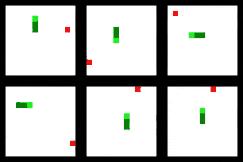

本项目的代码可在 https://github.com/oscarknagg/wurm/tree/medium-article-1获得

# Snake —矢量化

尽管取得了令人印象深刻的成就，深度强化学习仍然非常缓慢。像 DotA 2 和星际争霸这样的复杂游戏已经取得了令人难以置信的成绩，但这些都需要数千年的游戏时间。事实上，即使是引发当前对深度强化学习(即学习玩 Atari 游戏)兴趣的工作，也需要数周的游戏时间和每场游戏数亿帧的画面。

从那以后，在通过并行化和改进的实现来加速深度强化学习方面，以及在样本效率方面，已经进行了大量的研究。许多先进的强化学习算法同时在一个环境的多个副本中被训练，通常每个 CPU 核心一个。这产生了一个大致线性的速度，你可以用更多的 CPU 内核产生游戏体验的速度。

因此，为了试验深度强化学习，你最好有大量的计算资源。一个非常快速/并行的环境或愿意等待很长时间。由于我没有访问大型集群的权限，并且希望快速看到结果，所以我决定创建一个矢量化的 Snake 实现，它可以实现比 CPU 内核数量更高级别的并行化。

## 什么是矢量化？

矢量化是单指令多数据(SIMD)并行的一种形式。对于那些 Python 程序员来说，这就是 numpy 运算通常比执行相同计算的显式 For 循环快几个数量级的原因。

基本上，矢量化是可能的，因为如果处理器可以在一个时钟周期内对 256 位数据执行操作，而您的程序的实数是 32 位单精度数，那么您可以将这些数中的 8 个打包到 256 位中，并在每个时钟周期内执行 8 次操作。因此，如果一个程序足够聪明，能够在正确的时间调度指令，使得总是有 8 个操作数在适当的位置，那么理论上，它应该能够比一次对一条数据执行指令实现 8 倍的加速。

## 实现:表示环境

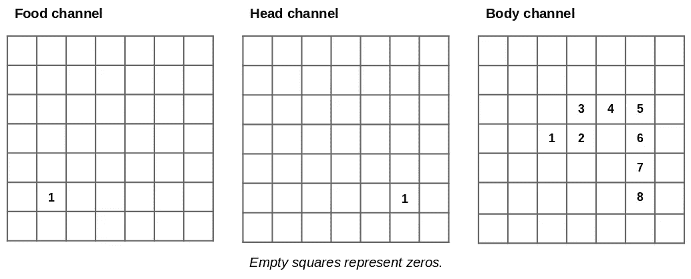

关键思想是将环境的完整状态表示为单个张量。事实上，多个环境被表示为单个 4d 张量，其方式与表示一批图像的方式相同。在蛇的情况下，每个图像/环境有三个通道:一个用于食物颗粒，一个用于蛇头，一个用于蛇身，如上所示。这样做可以让我们利用 PyTorch 已经拥有的许多特性和优化来处理这类数据。

The example above rendered with a black border. This is a smaller version of the input given to the agent.

## 实现:移动蛇

所以现在我们有了一种表示游戏环境的方法，我们需要只使用矢量化张量运算来实现游戏。第一个技巧是，我们可以在每个环境中移动所有蛇头的位置，方法是用手工制作的过滤器对环境张量的头部通道应用 2D 卷积。

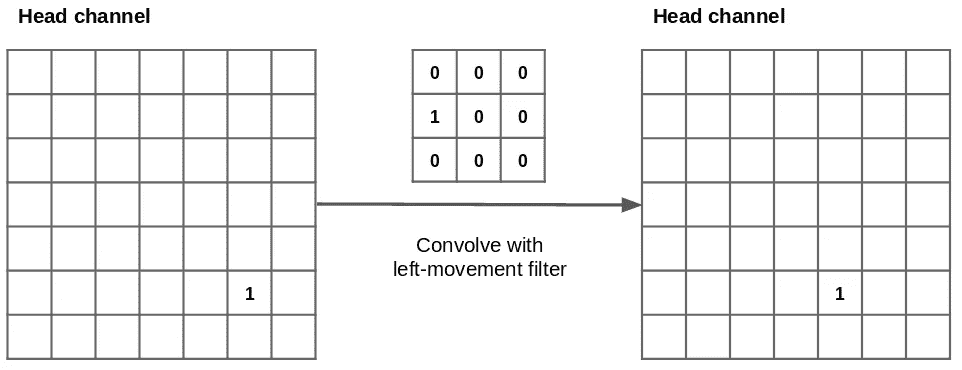

然而 PyTorch 只允许我们对整批应用相同的卷积滤波器，但我们需要能够在每个环境中采取不同的行动。因此，我应用了第二个技巧来解决这个限制。首先将 4 个输出通道(每个运动方向一个)的卷积应用到每个环境，然后使用非常有用的 [torch.einsum](https://pytorch.org/docs/stable/torch.html?highlight=einsum#torch.einsum) 使用一个动作的热键向量来“选择”正确的动作。我强烈推荐阅读[这篇](https://rockt.github.io/2018/04/30/einsum)文章，它很好地介绍了爱因斯坦求和及其在 NumPy/PyTorch/Tensorflow 中的应用。

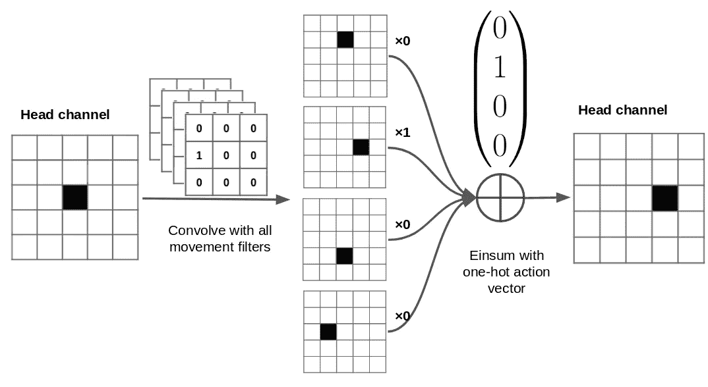

The full head movement procedure. See [this gist](https://gist.github.com/oscarknagg/863602483afc83d698ce399a67eb21d4) for a minimal implementation.

现在我们移动了头部，我们需要移动身体。首先，我们通过从所有身体位置减去 1 来向前移动尾部(即身体上的 1 位置),然后应用 ReLu 函数来保持其他元素大于 0。其次，我们复制头部通道，乘以最大身体值加 1。然后，我们将这个副本添加到头部通道，为身体创建一个新的前位置(图中的位置 8)。

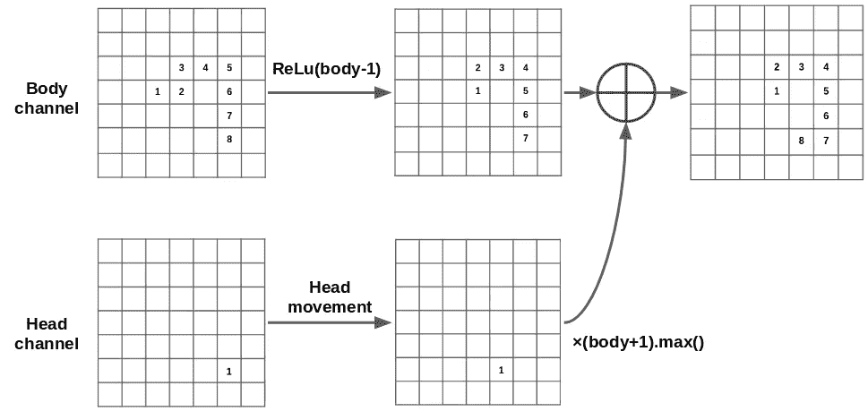

Body movement procedure. The input action is left. See [this gist](https://gist.github.com/oscarknagg/627dbcfe020cc63dd47d57e1cf6b076c) for a minimal implementation.

需要更多的逻辑，例如检查碰撞和食物收集，在死后重置环境，以及检查蛇是否试图向后移动——以跨多个环境矢量化的方式实现这一切的方法非常有趣。所有这些优化的最终结果如下图所示。使用单个 1080Ti 和大小为 9 的环境，我可以使用随机代理每秒运行超过一百万步的最大值，而使用 A2C 训练卷积代理每秒运行超过 70，000 步(使用与后面结果相同的超参数)。

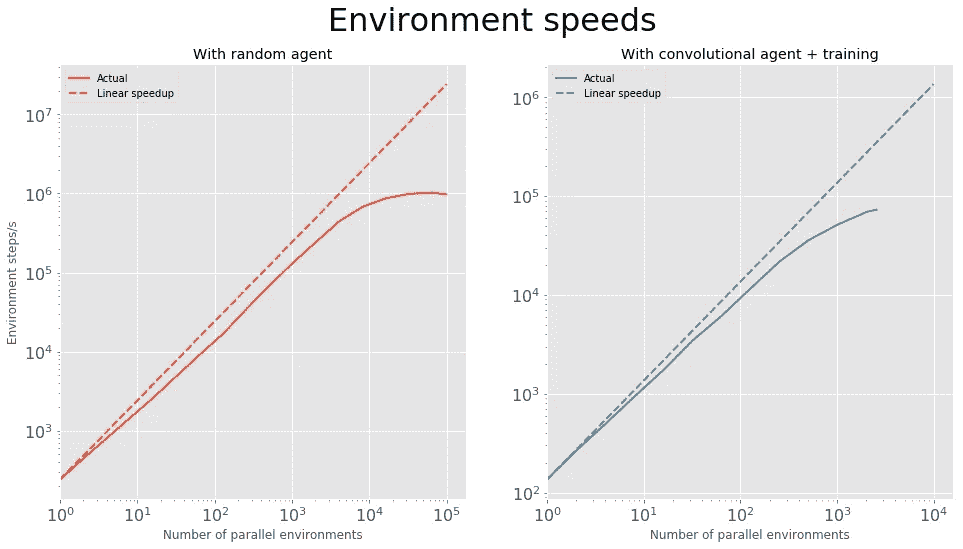

Clickbait title — justified [✓] not justified [ ]

# 最佳演员兼评论家(A2C)

*在本节中，我假设您熟悉强化学习的基本术语，例如价值函数、政策、奖励、回报等……*

演员-评论家算法背后的想法很简单。你训练一个行动者网络，将观察到的状态映射到行动(即策略)的概率分布。这个网络的目的是学习在特定的状态下应该采取的最佳行动。

同时，你也训练了一个从状态映射到期望值的批判网络，即处于这种状态后预期的未来回报的总和。这个网络的目的是学习处于某一特定状态是多么令人向往。这个网络还通过为状态提供基线值来稳定策略网络的学习，我们将在后面看到。

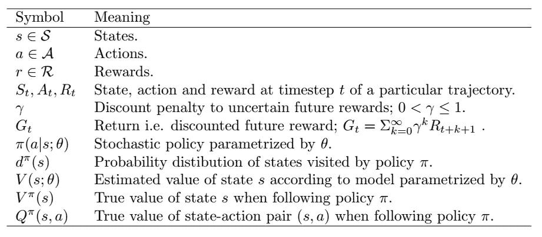

Table of symbols to make reading the following part easier.

## 价值函数学习

价值函数的损失是特定状态的预测值和从该状态产生的实际回报之间的平方差。因此，价值函数学习是一个回归问题。

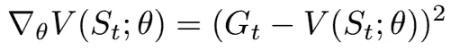

在实践中，计算特定状态的真实回报需要从该状态开始直到时间结束的轨迹，或者至少直到代理人死亡。由于有限的计算资源，我们计算来自固定有限长度 T 的轨迹的回报，并使用自举来估计最终轨迹状态之后的遥远回报。Bootstrapping 是指我们用轨迹中最终状态的预测值替换总和的最后一部分——模型的预测被用作其目标。

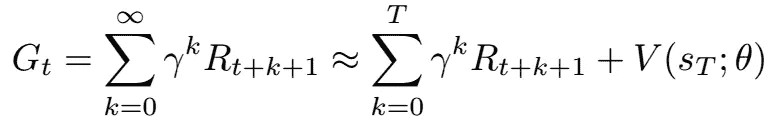

## 政策学习

在强化学习领域有一个重要的结果被称为策略梯度定理。这表明，对于参数化策略(例如，从状态到动作的神经网络映射)，其参数存在梯度，平均而言，这导致策略性能的提高。策略的性能被定义为该策略所访问的状态分布的期望值，如下所示。

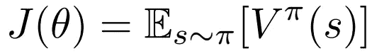

The loss function maximised by the policy gradient.

这实际上是一个比乍看起来更令人惊讶结果。给定一个特定的状态，计算改变策略参数对行为的影响以及相应的回报是相对简单的。然而，我们感兴趣的是策略所访问的州的分布中的期望回报，这也将随着策略参数而改变。改变策略对状态分布的影响通常是未知的。因此，当性能取决于政策变化对状态分布的未知影响时，我们可以计算性能相对于政策参数的梯度，这是非常值得注意的。

下面显示的是策略梯度算法的一般形式。这个定理的证明和完整的讨论超出了范围，但是如果你有兴趣深入研究，我推荐萨顿和巴尔托的《强化学习:导论》的第 13 章。

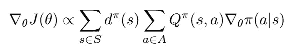

利用一点数学知识，我们可以把它写成对我们的策略所访问的状态和动作的期望。

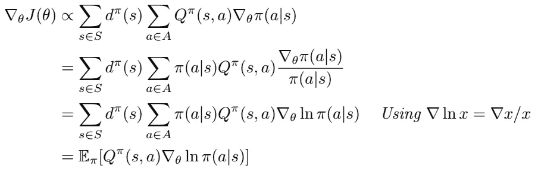

这个表达式更容易得到一个直觉。期望中的第一部分是政策所看到的状态-动作对的 Q 值，即性能测量。第二部分是增加特定动作的对数概率的梯度。直觉上，总体政策梯度是增加高回报行为概率的个体梯度的期望。相反，如果 Q(s，a)为负(即不良行为)，那么各个梯度必须降低这些行为的概率。

如前所述，对政策梯度定理的一个重要认识是，如果将任意的独立于动作的基线 *b(s)* 添加到 Q 函数中，它不会改变。

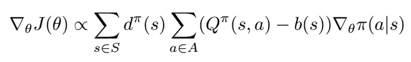

添加这个基线函数给策略梯度引入了一个新的项，假设它是独立于动作的，则总是等于 0。

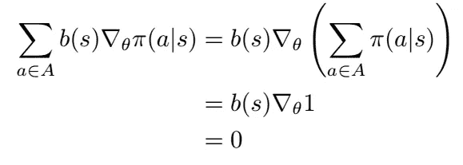

尽管添加基线不会影响政策梯度的*预期*，但它会影响其*方差*，因此一个精心选择的基线可以加快学习一个好政策的速度。

A2C 选择的基线是*优势函数*(因此是优势行动者-批评家)。这量化了特定状态-动作对与该状态的平均动作相比有多好。

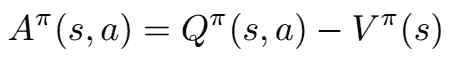

The advantage function.

基于这个表达式，看起来我们需要学习另一个网络来逼近 Q(s，a)。然而，我们可以用更简单的方式重写。

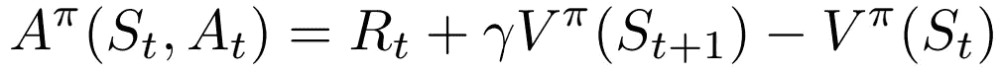

我们可以这样做，因为一个特定政策的 Q 函数的定义是在状态 *s* 中行动 *a* 的回报加上在这一集的剩余时间里遵循该政策的预期回报。因此，最终的优势演员-评论家梯度如下。

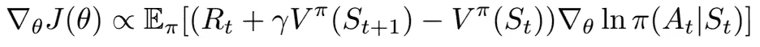

## 整体算法

既然我已经勾勒出了 A2C 的理论基础，是时候看看完整的算法了。我们需要获得我们的策略的增量改进的全部是获得样本的方法，使得那些样本的梯度的期望与上面的表达式成比例。这可以非常简单地通过记录我们的政策所产生的经验轨迹来实现。为了加速这一过程，我们可以在同一环境中并行运行我们策略的多个副本，以更快地获得经验。

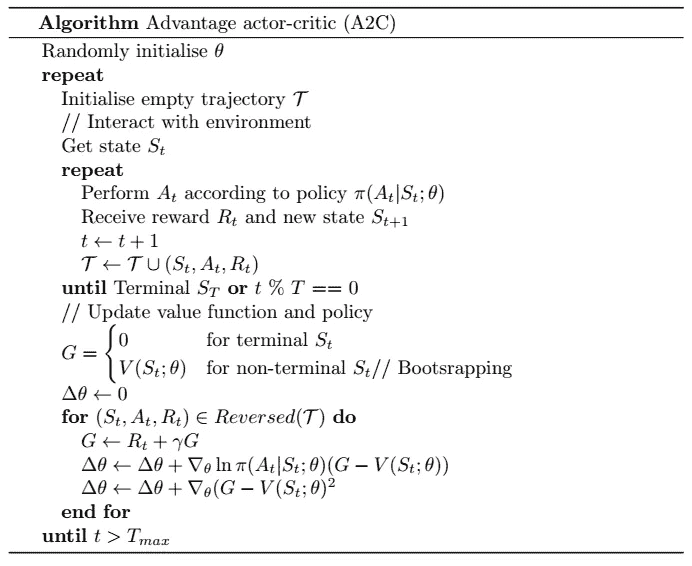

这是著名的异步优势行动者-批评家算法(A3C)的同步版本。不同之处在于，在 A3C 中，参数更新是在许多工作线程中分别计算的，并用于更新其他线程定期与之同步的主网络。在分批 A2C 中，来自所有工人的经验被周期性地组合以更新主网络。

A3C 异步的原因是不同线程中环境速度的差异不会降低彼此的速度。然而，在我的 snake 环境中，环境速度总是完全相等的，因此同步版本的算法更有意义。

# 结果

现在我已经描述了实现和理论，是时候学习玩蛇了！在我的实验中，我比较了三种不同架构的性能，如下图所示。

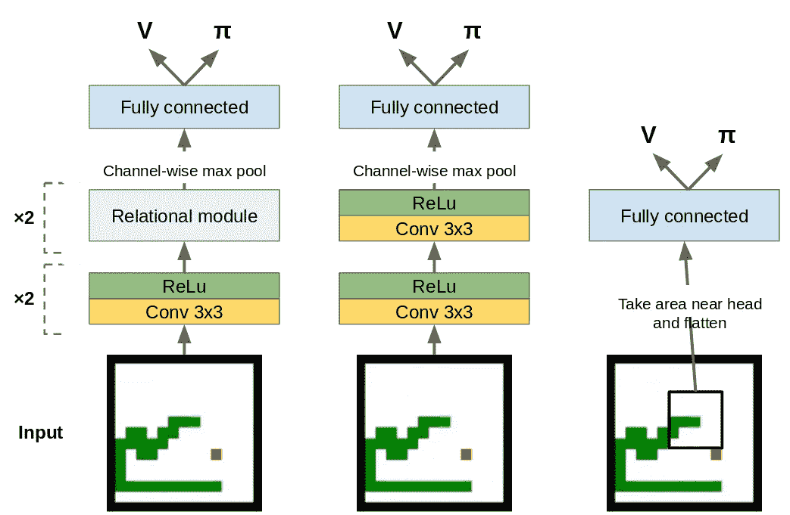

第一个代理(左)是 Deepmind 的“[具有关系归纳偏差的深度强化学习](https://openreview.net/pdf?id=HkxaFoC9KQ)”论文中的代理的较小版本。这个代理包含一个“关系模块”,它本质上是来自应用于 2D 图像的[转换器](https://arxiv.org/abs/1706.03762)模型的自我关注机制。此后，我们在值和策略输出之前应用通道式最大池和单个全连接层。为了比较，我还实现了一个卷积代理(中间层),除了关系模块被更多的卷积层取代之外，其他方面都是一样的。

作为一个黑马竞争者，我介绍了一个更简单的纯前馈代理(右)，它只接受蛇头周围的局部区域作为输入，使环境部分可观察。输入观测值被展平并通过两个前馈层。与其他两个代理一样，值和策略输出是最终激活的线性投影。

所有 3 个代理都在 9 号环境中接受了 5 次 5000 万步的训练。具有 1 个标准偏差的训练曲线如下所示。

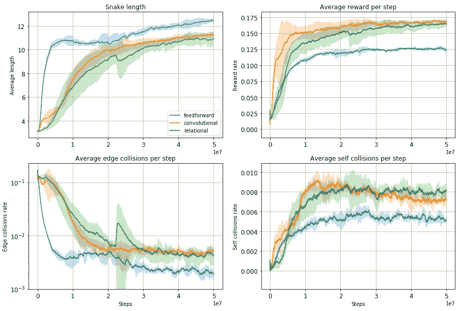

有趣的是，仅具有部分环境可观测性的前馈代理表现非常好，实现了所有代理中最高的平均规模。它也学得最快，可能是因为拥有最小的观察空间。正如你从下面的 GIF 中看到的，它已经学会了通过环绕环境来避免能见度有限的缺点，这样所有的东西最终都会进入视野。这使它能够找到分散在环境中的回报，但不如卷积和关系代理有效。

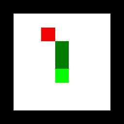

The feedforward agent in action

其他代理或多或少地直接走向奖励，但也有犯一些愚蠢错误的倾向，这反映在与前馈代理相比相当高的边缘冲突率上。有趣的是，在这个任务中，关系代理的表现并不比卷积代理好。我假设 snake 环境太简单了，关系模块中的归纳偏差没有用。Deepmind 对关系代理进行基准测试的任务涉及收集多个盒子的多个密钥，以便收集最终的大笔奖励——比 snake 复杂得多！

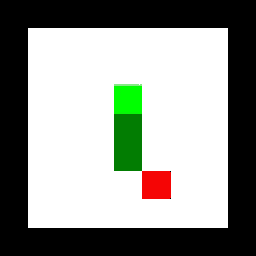

The convolutional agent in action.

## 好处:转移到更大的环境中

作为一个额外的实验，我决定看看如果我将代理从较小的 9 号环境转移到较大的 15 号环境会发生什么。我评估了每种类型的代理的 5 个实例在更大的环境中一百万步的性能，没有进一步的培训。

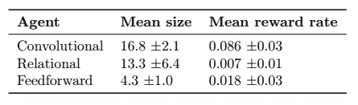

Agent performance transferring from size 9 to size 15 environment.

此表显示了不同类型的座席代表之间，甚至在特定的训练运行中，转移性能的巨大差异。卷积代理泛化得很好，实现了大的平均规模和高报酬率。事实上，卷积代理比在更大的环境中从头开始训练的相同代理表现得更好。我相信这是因为在更大的环境中奖励更少，所以在更大的环境中学习会明显变慢。

可以观察到一些相当聪明的行为。在大型蛇形飞机上，卷积智能体有时会执行一个“盘旋”动作，同时等待它的尾巴移开。

Convolutional agent waiting for its tail to move out of the way.

有限可见性代理继续围绕环境边缘的相同策略。这可以很好地执行，直到一个食物团在代理人无法观察到的环境中心产生，从这一点上代理人不再收集奖励。这与上表中的大尺寸小奖励率是一致的。

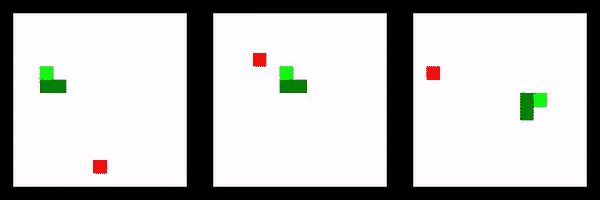

The limited visibility agent fails to transfer.

关系代理的性能至少可以说是不稳定的。在某些运行中，它会执行得相当好，而在其他运行中，它几乎会立即死亡或陷入循环。

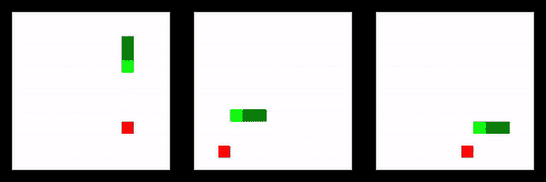

Transfer behaviour of the relational agent.

在这个项目中，我亲眼目睹了深度强化学习的缓慢，并想出了一个简洁的、尽管是蛮力的方法来绕过它。我还通过观察非常相似的环境之间失败的转移，体验了 deep RL 的脆弱本质。

在未来的工作中，我想实现更多的 gridworld 游戏，以研究游戏之间的迁移学习。或者，我可能会实现一个多代理 snake 环境，以便回答 OpenAI 的“slither in”[研究请求](https://openai.com/blog/requests-for-research-2/)。

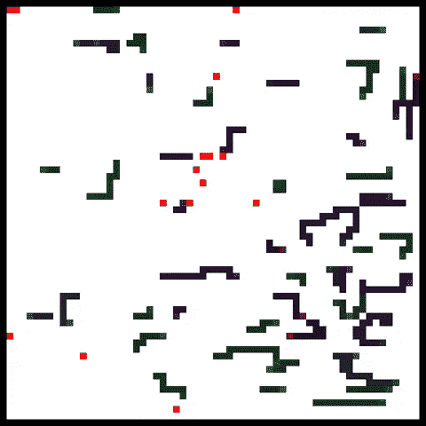

Multi-agent slither.io style environment.

本项目的*代码位于:*