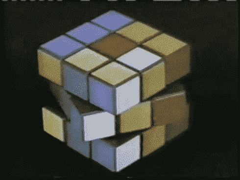
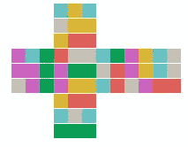
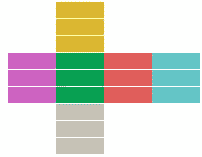
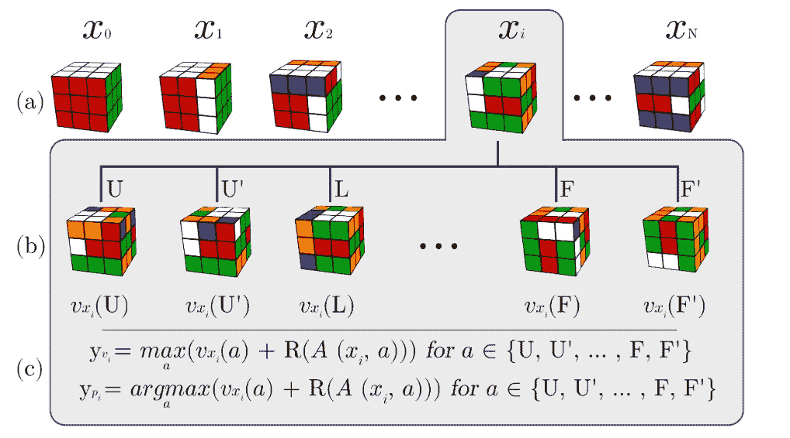
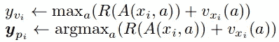
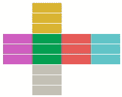

# 使用强化学习从头开始学习解魔方

> 原文：<https://towardsdatascience.com/learning-to-solve-a-rubiks-cube-from-scratch-using-reinforcement-learning-381c3bac5476?source=collection_archive---------11----------------------->

Photo by [Olav Ahrens Røtne](https://unsplash.com/@olav_ahrens?utm_source=unsplash&utm_medium=referral&utm_content=creditCopyText) on [Unsplash](https://unsplash.com/s/photos/rubik?utm_source=unsplash&utm_medium=referral&utm_content=creditCopyText)

# 动机:

魔方是一种有 6 个面的 3D 拼图，每个面通常有 9 个 3×3 布局的贴纸，拼图的目标是达到每个面只有一种独特颜色的已解状态。一个 3x3x3 魔方的可能状态有[万亿次](https://en.wikipedia.org/wiki/Quintillion)的数量级，其中只有一个被认为是“已解”状态。这意味着任何试图解立方体的强化学习代理的输入空间都是 huuuuuge。

# 数据集:

我们使用 python 库 [pycuber](https://github.com/adrianliaw/pycuber) 来表示一个立方体，并且只考虑四分之一旋转(90°)移动。这里没有使用注释数据，所有样本都是作为一个状态序列生成的，该序列从已解状态开始，然后被反转(以便它进入已解状态)，然后这些序列就是用于训练的序列。

# 问题设置:

Flattened Cube

从一个像上面例子一样的随机洗牌的立方体中，我们想要学习一个模型，它能够从集合{**‘F’**:0，**‘B’**:1，**‘U’**:2，**‘D’**:3，**‘L’**:4，**‘R’**:5，**【F’**:6， **"L'"** : 10， **"R'"** : 11} *(定义见*[*【https://ruwix.com/the-rubiks-cube/notation/】*](https://ruwix.com/the-rubiks-cube/notation/)*)*进入如下所示的求解状态:

Flattened solved Cube

# 型号:

这里实现的想法大多来自论文[在没有人类知识的情况下解魔方](https://arxiv.org/abs/1805.07470)

Figure from “Solving the Rubik’s Cube Without Human Knowledge” by McAleer et al.

所实施的 RL 方法被称为自动教学迭代或 ADI。如上图所示(来自论文)。我们通过从已解决状态往回走来构建到已解决状态的路径，然后我们使用完全连接的网络来学习路径中每个中间状态的“策略”和“值”。学习目标被定义为:

其中“A”是引言中定义的所有 12 个可能动作的变量，R(A(x_i，A))是通过从状态 x_i 采取动作 A 获得的回报。如果我们到达已解决状态，我们定义 R = 0.4，否则为-0.4。奖励是网络在训练期间得到的唯一监督信号，该信号可能被多个“动作”决策延迟，因为具有正奖励的唯一状态是最终解决的状态。

在推理时，我们使用价值策略网络来指导我们对已解决状态的搜索，以便我们可以通过减少“值得”采取的行动的数量来在尽可能短的时间内解决难题。

# 结果:

我用这个实现得到的结果并不像论文中呈现的那样壮观。据我所知，这个实现可以很容易地解决离已解决状态 6、7 或 8 步的立方体，但在此之后就困难多了。
网络运行示例:

# 结论:

这是强化学习的一个非常酷的应用，用来解决一个组合问题，其中有大量的状态，但没有使用任何先验知识或特征工程。

重现结果的代码可在:[https://github.com/CVxTz/rubiks_cube](https://github.com/CVxTz/rubiks_cube)获得