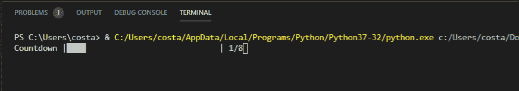
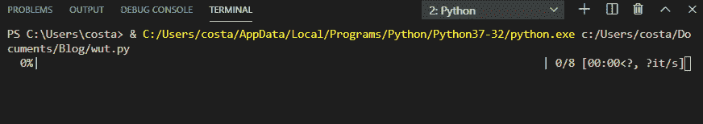
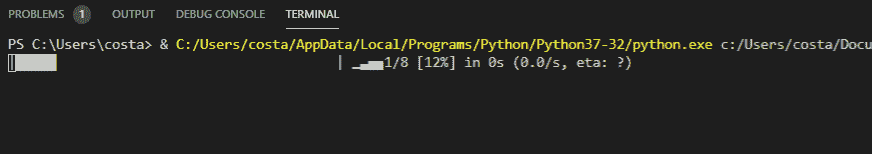
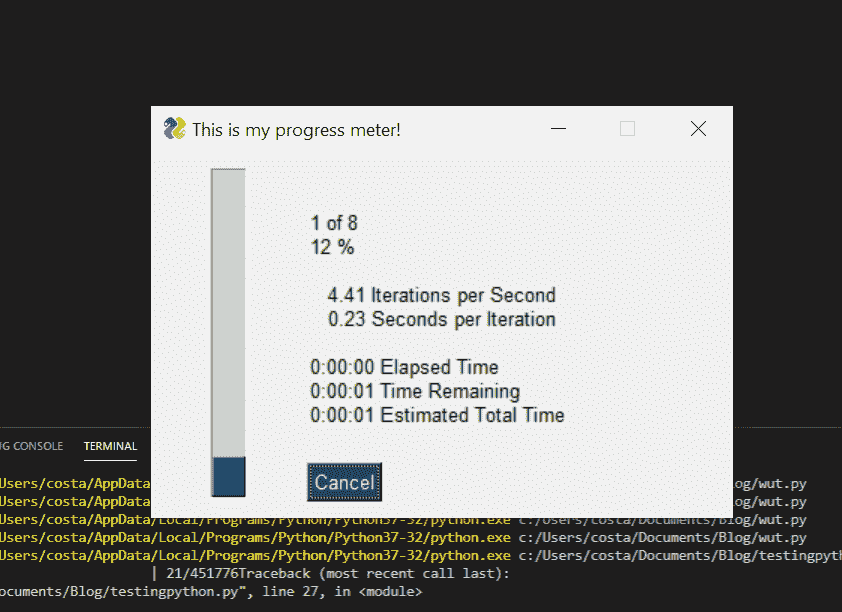
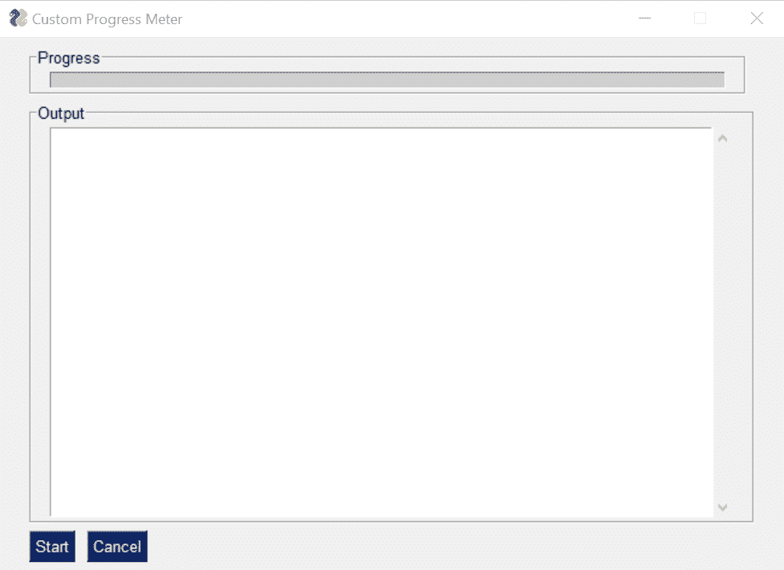

# 如何在 Python 中使用进度条

> 原文：<https://towardsdatascience.com/learning-to-use-progress-bars-in-python-2dc436de81e5?source=collection_archive---------3----------------------->

## 4 个不同库的介绍(命令行和用户界面)


Photo by [Arget](https://unsplash.com/@arget?utm_source=medium&utm_medium=referral) on [Unsplash](https://unsplash.com?utm_source=medium&utm_medium=referral)


Types of bars from ProgressBar (gif from the library’s page)

# 进度条太棒了

进度条是一个可视化的表示，表示一个过程还剩下多长时间才能完成。它们让您不必担心进程是否已经挂起，或者试图预测您的代码进展如何。您可以实时直观地看到脚本的进展情况！

如果你以前从未想过或使用过进度条，很容易认为它们会给你的代码增加不必要的复杂性，并且很难维护。这与事实相去甚远。在短短几行代码中，我们将看到如何在命令行脚本和 PySimpleGUI UIs 中添加进度条。

# 使用进度

第一个要回顾的 python 库是 *Progress。*

你需要做的就是定义你期望做的迭代次数，bar 的类型，并在每次迭代时让 bar 知道。

```
import time
from progress.bar import IncrementalBarmylist = [1,2,3,4,5,6,7,8]bar = IncrementalBar('Countdown', max = len(mylist))for item in mylist:
    bar.next()
    time.sleep(1)bar.finish()
```

返回:



Incremental Bar of Progressbar

如果你不喜欢进度条的格式，有很多供你选择:


Types of bars from ProgressBar (gif from the library’s page)

别忘了查看他们的[文档](https://pypi.org/project/progress/1.5/)。

# 使用 tqdm

在我们的评论中，下一个是 *tqdm* 库。

> Python 和 CLI 的快速、可扩展进度条

就像前面的库一样，我们已经看到，通过几行代码我们可以引入一个进度条。在设置方面只有一点不同:

```
import time
from tqdm import tqdmmylist = [1,2,3,4,5,6,7,8]for i in tqdm(mylist):
    time.sleep(1)
```

给了我们:



和以前一样，酒吧也有一些选择。务必检查[文档](https://github.com/tqdm/tqdm)。

# 使用实时进度

顾名思义，这个库试图让进度条活起来。它比我们之前看到的进度条多了一些动画。然而，就代码而言，它们非常相似:

```
from alive_progress import alive_bar
import timemylist = [1,2,3,4,5,6,7,8]with alive_bar(len(mylist)) as bar:
    for i in mylist:
        bar()
        time.sleep(1)
```

酒吧看起来像预期的那样:



再一次，不要忘记探索图书馆的[不同特性](https://github.com/rsalmei/alive-progress)。

# 使用 PySimpleGUI 的图形进度条

本着我们到目前为止所看到的同样的精神，我们可以添加一行代码来获得命令行脚本的图形化进度条。



为了实现上述目标，我们需要的是:

```
import PySimpleGUI as sg
import timemylist = [1,2,3,4,5,6,7,8]for i, item in enumerate(mylist):
    sg.one_line_progress_meter('This is my progress meter!', i+1, len(mylist), '-key-')
    time.sleep(1)
```

*感谢* [*麦克*](https://medium.com/u/bc85c7e63ea3?source=post_page-----2dc436de81e5--------------------------------) *指出这一点！*

# PySimpleGUI 应用程序中的进度条

如果你一直关注我最近的博客，我们探索了如何[快速启动 Python UI](/learn-how-to-quickly-create-uis-in-python-a97ae1394d5)，然后我们构建了一个带有 UI 的[比较工具。为了继续我们的学习之旅，今天我们将探讨如何集成一个进度条。](/building-a-python-ui-for-comparing-data-13c10693d9e4)

用户界面:



代码:

```
import PySimpleGUI as sg
import timemylist = [1,2,3,4,5,6,7,8]progressbar = [
    [sg.ProgressBar(len(mylist), orientation='h', size=(51, 10), key='progressbar')]
]
outputwin = [
    [sg.Output(size=(78,20))]
]layout = [
    [sg.Frame('Progress',layout= progressbar)],
    [sg.Frame('Output', layout = outputwin)],
    [sg.Submit('Start'),sg.Cancel()]
]window = sg.Window('Custom Progress Meter', layout)
progress_bar = window['progressbar']while True:
    event, values = window.read(timeout=10)
    if event == 'Cancel'  or event is None:
        break
    elif event == 'Start':
        for i,item in enumerate(mylist):
            print(item)
            time.sleep(1)
            progress_bar.UpdateBar(i + 1)window.close()
```

# 结论

伙计们，这就是了！只需几行代码，您就可以在 python 脚本中实现进度条！这没什么太复杂的，你不必再猜测你的剧本进展如何了！

希望你觉得这有用！