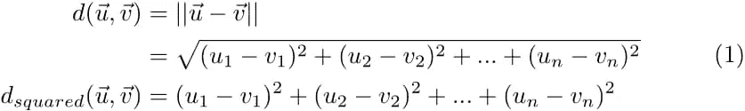

# 学习矢量量化

> 原文：<https://towardsdatascience.com/learning-vector-quantization-ed825f8c807d?source=collection_archive---------10----------------------->

## 基于原型的学习导论

Image from Pixabay from Pexels

如今，机器学习和人工神经网络这两个术语似乎可以互换使用。然而，当谈到最大似然算法时，世界上不仅仅只有神经网络。事实上，在大学期间，我所做的大多数 ML 项目根本没有使用神经网络。但是除了神经网络，为什么还要使用其他东西呢？的确，神经网络可以对非常复杂的问题取得惊人的结果。不过，还有一些关键问题。它们需要大数据集和大量的计算能力，尤其是后者并不总是在一个人的能力范围内。通常，对于相当小而简单的问题，使用像神经网络这样复杂的东西是没有意义的，因为其他算法更快，可能更好！

学习矢量量化(LVQ)就是我经常使用的一种算法。虽然与其他一些算法相比，该算法本身并不是特别强大，但它非常简单和直观。此外，它有一些扩展，可以使算法在各种 ML 相关任务中成为一个强大的工具。

LVQ 是一种所谓的原型学习方法。一个或多个原型用于表示数据集中的每个类，每个原型被描述为特征空间中的一个点。然后，新的(未知的)数据点被分配最接近它们的原型的类别。为了使“最近”有意义，必须定义距离度量。您可以自由选择任何距离度量，通常，欧几里得距离是距离度量的选择。每个类可以使用多少原型没有限制，唯一的要求是每个类至少有一个。下图显示了一个简单的 LVQ 系统，其中每个类(红色和蓝色)由一个原型(较大的点)表示。

2D LVQ system with corresponding prototypes representing each class

那么我们如何让原型适合每一个类，使它们能够很好地代表那个类呢？我们从选择距离度量开始，在本例中，我们将应用欧几里德距离度量。

回想一下，N 维中 2 个向量之间的欧几里德距离由下式给出:

请注意，我们可以使用平方欧几里得距离，这不需要我们计算平方根。

# 那么我们该怎么做呢？

第一步是初始化每个原型，通常原型是通过使用类方法初始化的。

下一步是遍历数据集，一次一个特征向量。对于每个这样的特征向量，我们需要使用选择的距离度量来计算到每个原型的距离。然后我们只对最接近的原型进行更新。如果原型具有与特征向量相同的标签，则原型被推向特征向量，否则原型被从相反方向推离特征向量。推动的幅度由学习速率决定，学习速率是算法的参数之一。

一旦我们对数据集中的每一个样本都这样做了，我们就可以多次重复这个过程，直到算法收敛。对数据集的一次扫描也称为训练时期。该算法通常需要几个历元来达到收敛，这取决于问题的复杂程度。

下面的代码是 LVQ 算法在 Python 中的实现。

# 给我看看代码

请随意试验您选择的数据集。你也可以改进算法，例如允许每个类使用多个原型。

现在我们已经有了算法，让我们在一些样本数据上测试它。在这种情况下，我使用了来自 UCI 机器学习库的[钞票认证数据集](https://archive.ics.uci.edu/ml/datasets/banknote+authentication)。

在对样本数据集运行算法之前，我对特征向量进行了洗牌，并留出 10 %的集合作为验证集。现在你应该如何处理学习率参数呢？理想情况下，您应该使用交叉验证来找出最佳值。在这种情况下，我简单地选择 0.01 作为学习率，因为它给出了不错的结果。在 25 个时期之后，该算法在验证集上收敛到 0.28 的误差。对于一个如此直观和简单的算法来说，这并不是一件坏事。

为了对新的未知特征向量进行分类，只需将最接近的原型的类别分配给它。

# 谢谢，还有别的吗？

LVQ 有一些明显的优势:它简单、直观、易于实现，同时还能产生不错的性能。然而，在更复杂的问题中，如果数据有很多维度或有噪声，欧几里德距离会引起问题。特征空间的适当归一化和预处理是必要的。但是，即使这样，如果你的数据有很多维度，你可能会遭受[维度](/the-curse-of-dimensionality-50dc6e49aa1e)的诅咒，你可能会考虑某种形式的降维。

伙计们，现在就到这里吧！下一次，我们将研究处理 LVQ 问题的算法的更复杂的变体。