# Python 中的最小二乘线性回归

> 原文：<https://towardsdatascience.com/least-squares-linear-regression-in-python-54b87fc49e77?source=collection_archive---------1----------------------->


Photo by [Jeswin Thomas](https://unsplash.com/@jeswinthomas?utm_source=medium&utm_medium=referral) on [Unsplash](https://unsplash.com?utm_source=medium&utm_medium=referral)

顾名思义，****最小二乘法**的方法是将数据集中观察到的目标与线性近似预测的目标之间的残差的**平方**之和最小化。在这篇后续文章中，我们将看到如何使用线性代数找到最佳拟合线，而不是像梯度下降这样的东西。**

# **算法**

**与我最初的想法相反，线性回归的`scikit-learn`实现最小化了以下形式的成本函数:**

**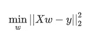**

**利用 x 的奇异值分解。**

**如果您已经熟悉线性回归，您可能会发现它与前面的方程和均方差(MSE)有一些相似之处。**

**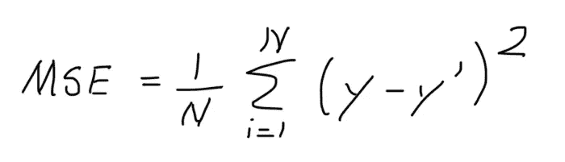**

**作为快速复习，假设我们有下面的散点图和回归线。**

**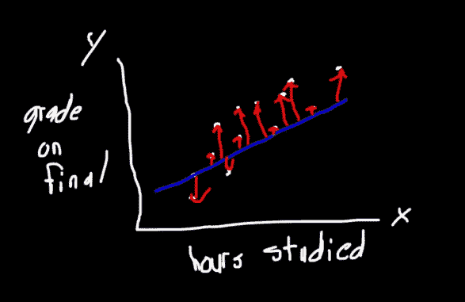**

**我们通过从一个数据点减去另一个数据点来计算从直线到给定数据点的距离。我们取差值的平方，因为我们不希望低于实际值的预测值被高于实际值的预测值抵消。用数学术语来说，后者可以表示如下:**

**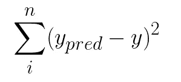****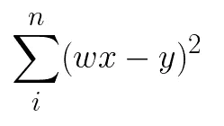**

**`scikit-learn`库中使用的成本函数是相似的，只是我们同时使用矩阵运算来计算它。**

**对于那些上过微积分课程的人来说，你们可能以前遇到过这种符号。**

**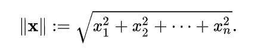**

**在这种情况下， **x** 是一个矢量，我们正在计算它的大小。**

**在同样的意义上，当我们用竖线包围矩阵的变量(即 A)时，我们是说我们想从一个由行和列组成的矩阵变成一个标量。从矩阵中导出标量有多种方法。取决于使用哪一个，你会在变量的右边看到一个不同的符号(等式中多出来的 2 不是偶然放在那里的)。**

**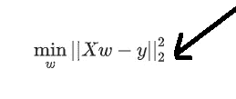**

**额外的 2 意味着我们取矩阵的[欧几里德范数](https://en.wikipedia.org/wiki/Euclidean_norm)。**

**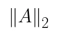**

**假设我们有一个矩阵 A，A 的欧氏范数等于 A 点转置的最大[特征值](https://en.wikipedia.org/wiki/Eigenvalue)的平方根，为了清楚起见，我们来走一个例子。**

**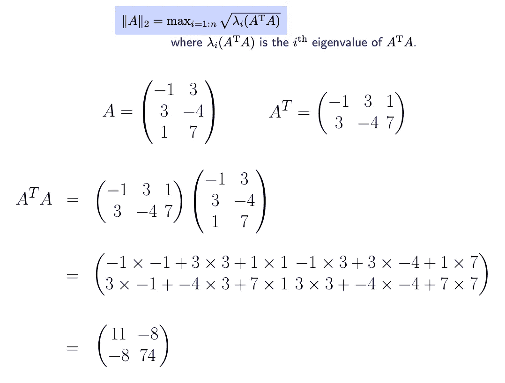****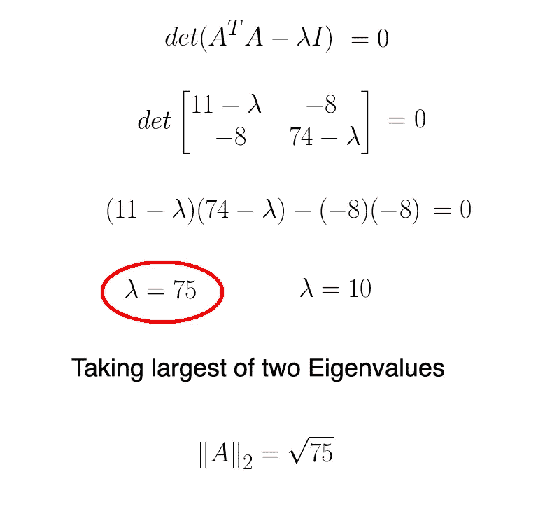**

**这就是我们量化误差的方法。然而，这引起了一个新的问题。具体来说，我们实际上如何着手最小化它呢？事实证明，最小范数最小二乘解(系数)可以通过计算输入矩阵 X 的伪逆并乘以输出向量 y 来找到。**

**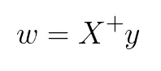**

**其中 X 的伪逆定义为:**

**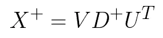**

**上述矩阵均可从 X 的奇异值分解(SVD)中获得。回想一下，X 的 SVD 可描述如下:**

**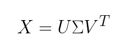**

**如果你对如何确定 U，sigma 和 V 的转置很好奇，看看我不久前写的这篇文章[](/singular-value-decomposition-example-in-python-dab2507d85a0)**，这篇文章讲述了如何使用 SVD 进行降维。****

****我们通过对`sigma`矩阵中的值求逆来构造对角矩阵 D^+。`+`指的是所有元素必须大于 0，因为我们不能被 0 整除。****

****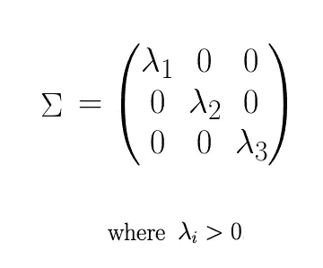********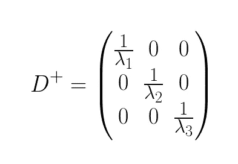****

# ****Python 代码****

****让我们看看如何使用基本的`numpy`函数从头开始实现线性回归。首先，我们导入以下库。****

```
**from sklearn.datasets import make_regression
from matplotlib import pyplot as plt
import numpy as np
from sklearn.linear_model import LinearRegression**
```

****接下来，我们使用`scikit-learn`库生成数据。****

```
**X, y, coefficients = make_regression(
    n_samples=50,
    n_features=1,
    n_informative=1,
    n_targets=1,
    noise=5,
    coef=True,
    random_state=1
)**
```

****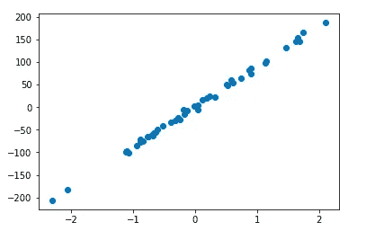****

****我们将矩阵的秩和列数存储为变量。****

```
**n = X.shape[1]
r = np.linalg.matrix_rank(X)**
```

****我们使用奇异值分解找到我们的特征矩阵的等价物。****

```
**U, sigma, VT = np.linalg.svd(X, full_matrices=False)**
```

****然后，D^+可以从西格玛得到。****

```
**D_plus = np.diag(np.hstack([1/sigma[:r], np.zeros(n-r)]))**
```

*****V* 当然等于其转置的转置，如以下恒等式所述。****

****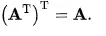****

```
**V = VT.T**
```

****最后，我们确定 x 的 **Moore-Penrose 伪逆**。****

```
**X_plus = V.dot(D_plus).dot(U.T)**
```

****正如我们在上一节中看到的，系数向量可以通过矩阵 X 的伪逆乘以 y 来计算。****

```
**w = X_plus.dot(y)**
```

****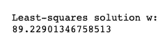****

****为了获得实际误差，我们使用我们看到的第一个等式来计算残差平方和。****

```
**error = np.linalg.norm(X.dot(w) - y, ord=2) ** 2**
```

****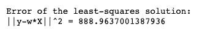****

****为了验证我们得到了正确的答案，我们可以使用一个`numpy`函数来计算并返回线性矩阵方程的最小二乘解。具体来说，该函数返回 4 个值。****

1.  ****最小二乘解****
2.  ****残差和(误差)****
3.  ****矩阵的秩(X)****
4.  ****矩阵的奇异值(X)****

```
**np.linalg.lstsq(X, y)**
```

****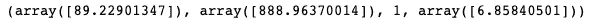****

****通过绘制回归线，我们可以直观地确定系数实际上是否导致最佳拟合。****

```
**plt.scatter(X, y)
plt.plot(X, w*X, c='red')**
```

****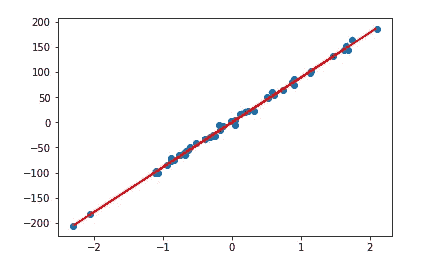****

****让我们使用线性回归的`scikit-learn`实现做同样的事情。****

```
**lr = LinearRegression()lr.fit(X, y)w = lr.coef_[0]**
```

****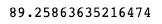****

****最后，我们使用新发现的系数绘制回归线。****

```
**plt.scatter(X, y)
plt.plot(X, w*X, c='red')**
```

********