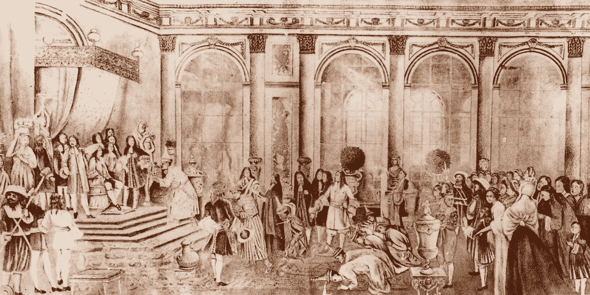
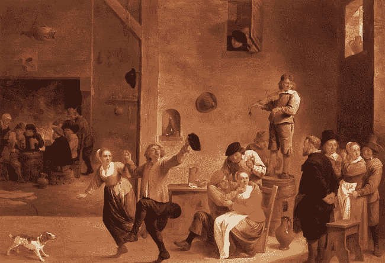

# 列奥纳多与甘之梦

> 原文：<https://towardsdatascience.com/leonardo-and-the-gan-dream-f69e8553e0af?source=collection_archive---------25----------------------->

## 通过回到文艺复兴时代来探索 GAN 网络的概念，因为莱昂纳多面临着他最令人惊讶的挑战之一

莱昂纳多用拳头猛敲桌子。
—令人发指！悲惨之猪。

国王的朝臣和其他皇室成员从大房间的侧面凝视着这一场景。克拉拉，他的表妹和知己，试图安慰他。大师，发生了什么事？发生了什么事?

莱昂纳多犹豫了一会儿。然后叹了口气，抬起眼睛看着克拉拉。突然，他的食指做了一个巨大的跳跃，把克拉拉的目光一直带到了豪华房间的另一端。

—安东尼奥？你徒弟怎么了？我以为你很高兴，而且..

大家赶紧小声说。莱昂纳多举起了手，整个房间陷入了沉默。他站起来，一边踱步一边急促地说话。

—我为什么要雇佣安东尼奥？特尔喃喃自语道。

—安东尼奥将负责挑选吉诺维斯画室首席画家的最佳作品，带给我。与此同时，安东尼奥应该利用自己的时间，靠自己慢慢地、仔细地、有条不紊地学习和提高自己的技术..

克拉拉假装不明白，尽管事实上，她理解得很好，一如既往。列奥纳多继续说道。

—我很快警觉到吉诺维斯工作室的作品与我想象的完全不同..主题，技巧，都是错的！他停顿了一下，抬头向上看..仿佛他能再次见到他们。

—它们会包含一些令人震惊的错误..太可怕了。完全没有手艺。但是安东尼奥..他..对我说甜言蜜语，他说..首席艺术家生病了，产生了幻觉，正在经历一些个人的混乱..你会相信吗

与此同时，克拉拉试图给莱昂纳多提供一些水。但是列奥纳多越来越激动。

—你们所有人！你想知道真相吗？达夫韦罗？真理报。
他用手指着安东尼奥，他在房间的另一端，不安地看着地板。

—他在撒谎！那些可怕的画，是他自己的！安东尼奥是..制造它们！他们是..糟透了。莱昂纳多再次用手指指着安东尼奥。

—当然，开头很糟糕。我会告诉他哪里出了问题，然后…嗯..随着时间的推移，他们变得更好..和..较好的..直到有一天..

克拉拉几乎要跌倒了，她不停地试图把一杯水放在莱昂纳多的手上，但是莱昂纳多没有注意到。

——那天，我告诉安东尼奥，这位吉诺维斯画家已经恢复了他的触觉。我很高兴..一切都恢复正常了！

克拉拉终于设法把杯子放在了他的手上。
—莱昂纳多，喝一杯，坐下，冷静下来。

莱昂纳多坐下来，匆匆喝了些酒，然后急切地看着克拉拉。

——但是那天晚上克拉拉，那天晚上..我抓住他了！！秘密绘画，画一个..

就像被隐藏的开关激活一样，安东尼奥向莱昂纳多冲去，莱昂纳多惊讶地看着他。房间变成了窃窃私语的海洋。

—列奥纳多大师，我需要你明白，让我解释一下。

—解释？，雷奥纳多恼怒的回答道。

几周前，我做了一个梦，主人。

低语的海洋来来回回，左右，然后转了三圈，停在了莱昂纳多的鼻子上，他用力地把它推到了一边。

—我知道，令人困惑，我也不明白它主人，但是..我现在相信我们是一个..甘。

房间里的每个人都陷入了沉默，除了萨宾娜女士，她声嘶力竭地喊道——亵渎！

克拉拉要求每个人都冷静下来。莱昂纳多好奇地看着安东尼奥。

—马彻 cosa？，告诉我..你喝酒了吗？

—师傅，我来解释一下。

莱昂纳多脸色阴沉。

如果你没有喝酒，你最好现在就解释..，否则..

安东尼奥的脸变得容光焕发。

—是的，我解释。师父，几周前的那个下午，当你休息的时候，我收到了一封信。Genovese 工作室的业主决定翻新他们的整个建筑，并将所有工作推迟到明年。

一名朝臣拿来一把椅子，安东尼奥坐了下来。

——我慌了，我知道你会失望的。国王相信你和你的名声会把吉诺维斯工作室的作品带到他的宫廷，作为交换，他会资助你下一阶段的研究。我沮丧地睡着了。一切都不顺利。我非常想学习成为一名伟大的画家。但由于我被雇来监督与热那亚的沟通，我担心一旦你知道他们的工作室将所有工作推迟到明年，你会把我送回家。

莱昂纳多目不转睛地看着安东尼奥，试图破译他接下来要说什么。

—我发烧了。然后就发生了..我做了一个奇怪的梦。我在寻找一种快速的方法来解开这个谜。我怎么能在为你工作的同时，像热那亚的大师们一样学习绘画，却不给你带来坏消息，他们的画室要关闭几个月的消息…

当他们听着的时候，每个人都慢慢走向房间的中央，安东尼奥正在那里讲话。

—我开始想象..如果我把自己画成吉诺维斯的作品呢？。但是，当然，我不知道如何像他们一样画画，甚至不知道他们的画是什么样子。然而，我决定尝试一下。

安东尼奥戏剧性地停顿了一下，看了看每个人，然后转向莱昂纳多。

—我的第一次尝试看起来..命运..几乎是随机的。莱昂纳多翻了翻白眼。

房间里到处都能听到窃窃私语。

—我送给你的。你被激怒了。你说过这不可能是真的。所以我问你:为什么不呢？。

莱昂纳多不安地在椅子上动了动。

你向我解释了，你解释了我的创作与真实事物的不同之处。对你的解释很满意，我向你保证我会向吉诺维斯工作室投诉，你对此很满意。

列奥纳多看起来仍然有些恼火，但同时也真正地着迷了。

—然后我创作了另一幅不同主题的画。但是这一次，我采纳了你给我的反馈。第二天，我回来了，在展示任何东西之前，我解释说吉诺维斯的首席艺术家已经回复说他有一些健康和个人问题，将持续一段时间。

安东尼奥继续说着，太阳开始把房间染成金色。

—然而，我告诉你，首席画家向我保证，他会尽最大努力向你和国王交付伟大的作品。他请求耐心和理解。然后，我给你看了我的作品。你诅咒了又诅咒。你给了我一个很长的演讲，关于一个叫做“即兴表演”的神秘状况，然后继续启发我更多关于我的画和你所期待的之间的差异。

列奥纳多脸上的表情是痛苦和喜悦的混合体。

—日复一日，这个过程继续着。对我来说很明显，你真的相信了吉诺维斯画家的故事，并且随着我的画变得更好，你逐渐变得不那么沮丧了，这要感谢你的反馈。几周后，关键的一天终于到来了。

莱昂纳多皱起了眉头。克拉拉冲到他身边。低语的海洋冲了回来。

——我给你看了《五月多恩》的画。你很高兴。你笑了。你拥抱了我，并宣布吉诺维斯的首席艺术家恢复了健康。

—妈妈咪呀！，莱昂纳多朝着高高的天花板叹了口气。

—我感到非常自豪。在梦里，我和我的妻子玛加以及两个孩子安娜和皮埃特罗一起庆祝。我女儿带来了一个很棒的草莓蛋糕。在蛋糕上，草莓之间，有三个大大的粗体字:甘。

那是什么，安娜？，我问她。

她很快开始就事论事地说话。

—太清楚了，爸爸。你和莱昂纳多成了一个网络。你创作了越来越多的吉诺维斯风格的作品。你这样做是试图欺骗达芬奇，让他相信你的画实际上来自吉诺维斯工作室。然而，列奥纳多是这样一个天才，一个伟大的鉴别者和批评家。他会非常准确地指出并解释你的作品与 Genovese 工作室的真品之间的差异。有了这些反馈，你就能不断进步。直到有一天，列奥纳多真的相信你的创作是一幅价值相当于吉诺维斯工作室首席艺术家的画。

安娜做了一个快速暂停呼吸，并继续进行。

—你的网络达到了稳定，你成为了一个伟大的吉诺维斯风格的画家。爸爸，你所做的一切都是通过在你们两个之间创造一个敌对的动态过程。这就是为什么你的网络是一个 GAN，一个生成性的对抗性网络。

安东尼奥和玛加面面相觑，说不出话来。

如果你不相信我，去问伊恩·古德菲勒好吗？他想出了所有这些东西，这是我自己的梦在你的梦里告诉我的！

—这些天她是不是功课太多了？，玛加小声对安东尼奥说。

你还好吗，亲爱的？，安东尼奥给了安娜一个厚脸皮的微笑。但是安娜并没有结束，继续往前走。

——好吧，好吧，但是你难道不打算在你自己的梦里好好听听你女儿的话吗？还有很多，爸爸。莱昂纳多逐渐变得越来越善于辨别你的创作和真实的东西，你一直在进步，直到你达到模式崩溃！

—模式什么？安东尼奥正尽最大努力跟上安娜热情而自信的讲话。

—当你一遍又一遍地画着同样的东西，对它如此着迷。莱昂纳多要疯了！

玛加和安东尼奥交换了一下眼神。安东尼奥满意地说:“那些蔬菜汤很有效。”。

佩德罗直接跳了进去。
—我们可以玩 GANs 吗？求你了，求你了爸爸，安娜和我能去玩甘斯吗？
——我想成为评论家！，安娜自告奋勇。我会成为艺术家，我会愚弄你！，佩德罗提前庆祝。
——好了，孩子们，去玩吧，去玩甘斯吧。对我来说..，我必须走出梦的这一部分，我听到一些东西…

列奥纳多笑了，像打雷一样，他的笑声从装饰华丽的墙壁上反弹回来。
—非凡！贝利西莫。你聪明的孩子，好吧，你让我安东尼奥，一个甘，我们是一个甘！

安东尼奥被莱昂纳多的反应吓了一跳。

莱昂纳多示意安东尼奥坐在他旁边。

—安东尼奥，这个甘的东西很棒。你知道我没有时间教你像吉诺维斯大师那样画画。然而，你需要我的直接反馈来改进。所以你试图愚弄我，一次又一次。随着你越来越好，我渐渐发现不了你作品中的问题。但是安东尼奥，这个网络可能有问题。

那会是什么呢，莱昂纳多大师？

— Lenta，molto lenta，非常慢。你将需要大量的图形处理器。

安东尼奥看了看克拉拉，然后回到莱昂纳多身边。

—很多什么？

莱昂纳多笑了。

—哦，聪明的安东尼奥，你以为你是唯一一个想出令人讨厌的术语的人吗？我也能发明随机的时髦玩意儿，我的孩子！GPU！TPU！还有 CycleGAN 呢！呃！斯塔根。阿坦甘！比根。

安东尼奥对这些新单词的发音感到惊讶。主人，我明白了。我花了很长时间才走到这一步，付出了很多努力。你真的认为这个过程可以更快吗？

—也许吧

—怎么做，主人？

—还是等到第二部吧，哈？

—什么部分？

——我也做了一个梦安东尼奥。我梦见我们生活在——灵媒——这是第一部分。此外，我觉得让每一部分都超过几分钟并不是一个好主意。这种东西是有统计数据的，你明白我的意思吗，安东尼奥？

克拉拉冲出房间，急切地请求帮助。
—药，把......的药·雷奥纳多带来！！

——Va bene 大师，我们等到第 2 部分，但请告诉我，如果我的女儿一直问我，我们是否生活在模拟中，我应该担心吗？