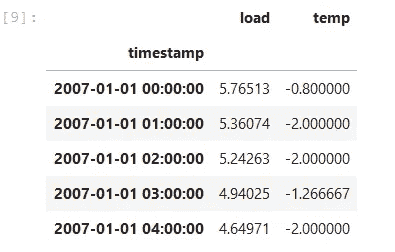
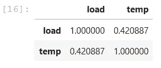
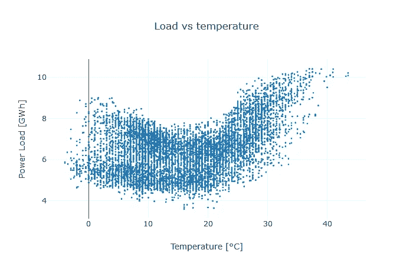
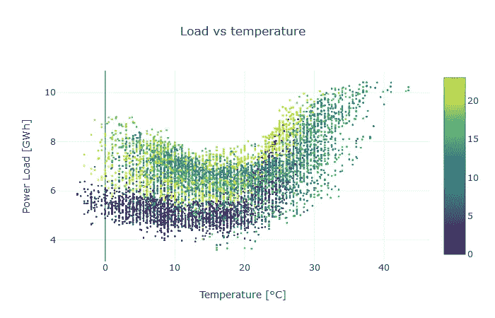
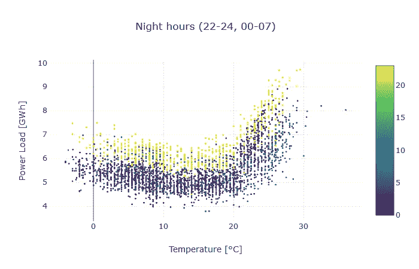
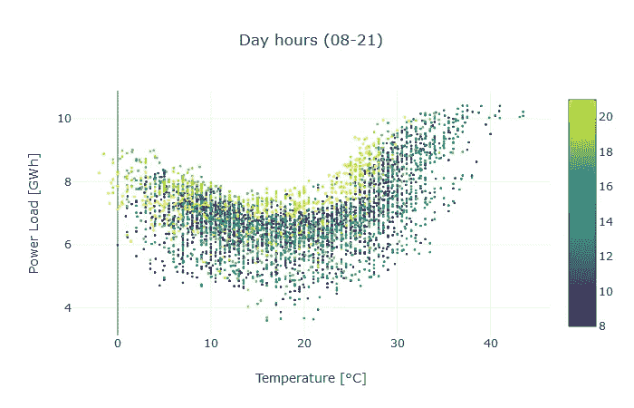

# 真实机器学习项目的经验，第 2 部分:数据探索的陷阱

> 原文：<https://towardsdatascience.com/lessons-from-a-real-machine-learning-project-part-2-the-traps-of-data-exploration-e0061ace84aa?source=collection_archive---------17----------------------->

## 如何落入数据探索的陷阱并逃脱

这是该系列的第二个故事，所以我将残酷地缩短介绍。我写信来分享一个真实的企业级机器学习项目教会了我和我的团队什么。如果你好奇想了解更多，可以随意查阅第一章: [*从朱庇特到路易吉*](/lessons-from-a-real-machine-learning-project-part-1-from-jupyter-to-luigi-bdfd0b050ca5) *。*

# 开头:冗长乏味的总结

在大学，我听说过数据探索。在真正的乐趣开始之前，这是一个乏味的初步步骤。您汇总数据集，绘制一些图表，并检查模型的假设。

很简单，但不是很有用，对吧？

# 教训:数据探索的陷阱

这种不好的观点相当普遍，但本质上是有缺陷的。为了说明原因，让我们将数据探索的正式定义与我们的经验进行比较。据[维基百科](https://en.wikipedia.org/wiki/Data_exploration):

> 数据探索是一种类似于初始数据分析的方法，通过这种方法，数据分析师使用可视化探索来了解数据集中的内容以及数据的特征。

第一部分。

*数据探索是一种类似于初始数据分析的方法。*

其实它*就是*的初始数据分析。探索应该先于任何统计分析和机器学习模型。

这对于避免**第一陷阱**至关重要:汇总指标，如平均值和标准偏差。

辛普森悖论是一个众所周知的例子，它表明全球指标可能是肤浅和误导的。这是一个玩具，学术案例研究，但类似的事情也可能发生在现实世界中，你马上就会看到。

第二部分。

*当数据分析师使用可视化探索来了解数据集中的内容时，就会发生数据探索。*

当然，它比这更复杂。想象阅读一个巨大的表格，有几千行几十列，全是数字。你在视觉上探索数据，但是你不可能获得一些洞察力。

这是因为我们不是为处理庞大的数字表格而设计的。我们擅长从形状、尺寸和颜色方面解读世界。一旦转化成线、点和角度，数字就更容易理解了。

不幸的是，第二个陷阱来了:设计糟糕或吹毛求疵的图表。有时，错误的可视化会阻止数据科学家捕捉正确的洞察力或共享正确的信息。这不是缺乏经验或天赋的问题。世界上最优秀的故事讲述者也会犯错。几周前,《经济学人》的莎拉·利奥发表了一组[的优秀范例。](https://medium.economist.com/mistakes-weve-drawn-a-few-8cdd8a42d368)

# 案例研究:电力负荷和温度

为了展示我们如何掉进陷阱以及如何毫发无损地逃脱，我将使用一个公共数据集，其中包含希腊每小时的电力负荷和温度。为了简单起见，让我们只考虑 2007 年。

我们想预测电力负荷，我们有兴趣了解温度如何有所帮助。

起初，数据看起来像这样:

第一步可能是计算线性相关性:

接近 0.42 的值没什么好激动的。

这样说，我们就陷入了第一个陷阱:根据汇总指标得出结论。幸运的是，逃避相当容易:我们可以召唤一个简单的图表来拯救我们。

电力负荷和温度之间的关系远不是线性的。因此，皮尔逊相关性是没有意义的。

这对建模来说是一个很强的暗示:我们要么应用适当的特征工程，要么使用非线性模型。线性回归本身无法捕捉到这种模式。

我们做到了！我们摆脱了第一个陷阱，并获得了建模的重要线索。

不幸的是，我们不知不觉地陷入了第二个更微妙的陷阱。

如果你仔细观察图表，你会注意到数据中有两种不同的模式。在图的左边:在一条几乎是直线的上面有一条更弯曲的条纹。起初，我们错过了这一点，因为一条重要的信息丢失了。

The color maps the hour of the day

温度对电力负荷的影响随时间而变化。在图表中引入这个额外的维度揭示了另一个重要的证据:我们需要让模型知道一天中的某个时刻。例如，我们可以包括小时和温度之间的交互，或者拟合 24 个不同的模型。

为了更清楚起见，我们可以只显示白天或晚上的时间:

最后，我们也克服了第二个陷阱，剩下两个正确设计模型的重要提示:

*   温度对电力负荷有非线性影响
*   温度和负荷之间的关系随着一天中的每个小时而变化

# 包扎

最后，我们知道了数据探索的重要性和难度。我们检测到两个主要陷阱:

*   **汇总指标**，可能隐藏数据中的复杂模式
*   **设计不良的图表**，这可能会导致错误的结论或妨碍更深入的分析

我们没有找到一个单一的解决方案，但一些提示可能会有所帮助:

*   尽可能喜欢直观探索，而不是汇总指标
*   尝试调查图表显示的所有不寻常的事情
*   确保你得出的每个结论在现实世界中都有意义

我的读者，谢谢你来到这里！

*如果您有任何意见、建议或批评，我恳请您通过我的* [*LinkedIn 个人资料*](https://www.linkedin.com/in/emanuelefabbiani/) *与我分享。*

*还有，如果你对本帖的话题有任何疑问或疑问，欢迎随时联系！*