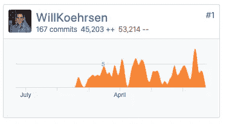
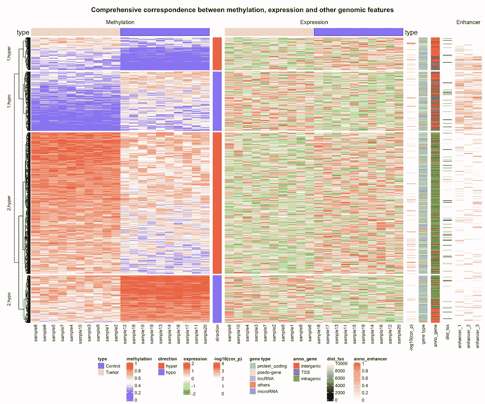
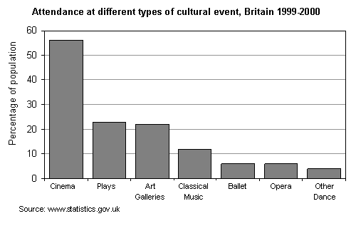
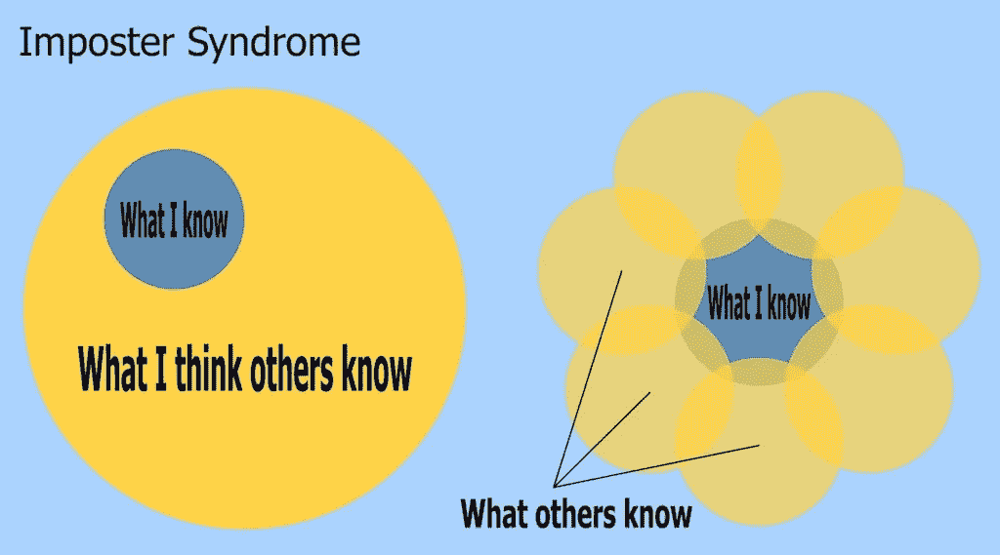

# 数据科学领域一年的经验教训

> 原文：<https://towardsdatascience.com/lessons-from-a-year-in-the-data-science-trenches-f06efa6355fd?source=collection_archive---------13----------------------->


[(Source)](https://www.pexels.com/photo/photography-of-lake-beside-mountain-and-pine-trees-3351654/)

## 在[学习将机器学习投入生产的五点收获皮层构建智能](https://get.cortexintel.com/)

在过去的一年里，我已经从编写 Jupyter 笔记本的简单世界转向开发机器学习管道，以便全天候向建筑工程师提供实时建议。虽然我还有改进的空间(我仍然会犯很多编码和数据科学方面的错误)，但我已经设法了解了一些关于数据科学的事情，我们将在本文中讨论。希望通过下面的课程，您可以避免我在日常数据科学前沿学习操作时犯的许多错误。

1.  **生产数据科学主要是计算机科学**
2.  **数据科学仍然高度主观**
3.  **人际交往和沟通技巧至关重要**
4.  **使用标准工具，缓慢采用新技术**
5.  **用外在的简单隐藏数据科学的内在复杂性**

作者注:这是从单一角度写的，不代表数据科学的整个领域。请记住，这是一位端到端(从概念到部署的机器学习系统)数据科学家在建筑能源领域的工作，为更有效地运营建筑提供实时建议。如果你有过不同的经历或者想反驳我，评论区等着你的回复。

# 生产数据科学主要是计算机科学

当被问及这项工作最难的部分时，我坚定地回答说这不是机器学习，考虑到我们所有的 ML 看起来都像:

```
from sklearn import ModelModel.fit(features, target)
predictions = model.predict(testing_features)
```

相反，数据科学最难的部分是开发建模前后发生的一切。在我们之前有:从数据库加载数据、特征工程、数据验证和数据处理管道(假设我们的工作在数据被摄取之后开始)。在我们需要验证结果之后，将任务设置为按计划自动运行，将结果写回我们的数据库，并发送 webhooks 来触发其他服务。

这些外围动作，包括机器学习中的大部分工作，都需要扎实的计算机科学实践。A [与开发代码相关的一些](https://en.wikipedia.org/wiki/Best_coding_practices#Coding_standards) e 实践是编写许多短函数，每个函数做好一件事，开发实现相关函数的类，适当的[命名约定](/data-scientists-your-variable-names-are-awful-heres-how-to-fix-them-89053d2855be)，对代码和数据编写单元测试，编写易于阅读的代码，以及不重复代码。此外，围绕代码本身还有其他计算机科学实践可以应用，如版本控制、代码审查、持续集成、代码覆盖和部署，这现在已经催生了一个完全独立的领域[机器学习操作](https://en.wikipedia.org/wiki/MLOps) (MLOps)。

虽然我成功地完成了机械工程->数据科学家的转型，但现在回想起来，做工程->计算机科学->数据科学会更有成效。第二种方法意味着我不必忘记我在数据科学课上学到的糟糕的编码实践。换句话说，我认为在扎实的计算机科学背景之上加上数据科学比先学数据科学再从事计算机科学更容易(但两条路线都有可能)。

计算机科学涉及一种完全不同的系统思维方式，在编码前有条不紊地计划，慢慢地写代码，一旦写好就测试代码。干净的代码与数据科学的自由天性形成鲜明对比，数据科学有几十个写了一半的笔记本(我们都有叫做`Untitled12.ipynb`的笔记本)，强调立即获得结果，而不是编写可以重用的无错误代码。

See also [https://www.youtube.com/watch?v=7jiPeIFXb6U](https://www.youtube.com/watch?v=7jiPeIFXb6U) for why notebooks aren’t always great

所有数据科学家都可以从关于计算机科学最佳编码实践的[课程](https://software-carpentry.org/)中受益。结构化脚本和包、编写干净的代码、测试和记录代码的能力使得从探索性数据科学到生产机器学习的过渡更加易于管理。此外，他们灌输了一种思维模式，这种思维模式可以让其他人更容易理解可重用的代码。即使是通常编写数据科学脚本来为论文分析数据的学术数据科学家，也会受益于更好的实践。如果科学家编写更干净的代码，并包含单元测试来验证输入、输出和功能行为，那么科学中的[再现性问题](https://fivethirtyeight.com/features/science-isnt-broken/#part1)可能会得到改善。

数据科学中有许多要学习的主题，有时会感到不知所措。然而，计算机科学不应该被看作是一种附加物；相反，它应该被视为希望看到他们的代码可操作化的数据科学家的基础。幸运的是，有大量的资源，例如[软件木工](https://software-carpentry.org/lessons/)，任何人都可以用来学习和应用这些实践。

# 数据科学仍然是高度主观的

数据科学承诺使用数据而不是人类判断来做出最佳决策。这是一项崇高的事业，但它与当前的现实相去甚远，因为我们用来分析它的数据和方法在很大程度上受到了人类的影响。即使是数据科学的客观领域也依赖于人类行为。正如 Vicki Boykis 在她出色的 [Normcore Tech](https://vicki.substack.com/) 时事通讯中所说的那样，[神经网络完全就是人。](https://vicki.substack.com/p/neural-nets-are-just-people-all-the)

典型的机器学习系统的每一步都受到个人选择的影响。以下是其中的一些决定:

*   **收集数据**:我们收集什么数据？我们用什么传感器？我们调查谁？我们如何表达我们的问题？
*   **特征工程**:我们做什么特征？我们使用领域知识还是[自动化特征工程](/automated-feature-engineering-in-python-99baf11cc219)？我们如何填充缺失值？应该删除哪些观察值？
*   **建模**:我们应该用什么超参数？我们应该制作多复杂的模型？
*   **验证**:评估的指标是什么？验证程序是什么？我们需要什么水平的性能？
*   **部署:**我们是否足够信任这些数字并向客户展示？我们是否需要一个人来评估这些预测以进行理智检查？

不可避免地，通过这个过程，不同的人会得出不同的结论。这方面的一个例子记录在论文[许多分析师，一个数据集](http://Many Analysts, One Data Set)中，该论文描述了数据科学家如何通过相同的数据集得出相互矛盾的决策，因为他们采用了不同的方法。毫不夸张地说，通过改变分析，你可以用一个数据集来证明一个论点及其对立面。这表明你不应该过于相信从一项研究中得出的任何结论，而是应该(带着怀疑的态度)看看[荟萃分析](https://www.sciencedirect.com/topics/neuroscience/meta-analysis)(并阅读 [*如何用统计数据*](/lessons-from-how-to-lie-with-statistics-57060c0d2f19) )。

此外，人类的偏见，无论是有意还是无意，都会进入数据，从而影响机器学习模型。像 [*数学毁灭的武器*](https://blogs.scientificamerican.com/roots-of-unity/review-weapons-of-math-destruction/) 这样的书里说的那样，把决定权让给机器并不能消除歧视，而是把现实世界数据中出现的现有偏见编成法典。用数据科学结束偏见决策的目标是崇高的，但只要人类参与其中，我们就不能盲目依赖机器学习预测。

数据科学中的主观性是否意味着我们应该放弃所有的真理观？我认为我们应该重新定义这个问题:我们不是寻找一个正确的答案，而是使用数据科学，不管它有多么有缺陷，朝着更好的解决方案的方向前进。毕竟，数据科学是科学的一个子领域，目标是[随着时间的推移](https://www.npr.org/sections/13.7/2018/02/12/585057058/a-new-goal-aim-to-be-less-wrong)减少错误。此外，越多的人致力于一个问题，并比较他们的工作，我们就越接近更好的结果。这 20 位科学家可能已经进行了 20 种不同的分析，但是如果他们比较他们的方法并一起工作，最终的结果将会比任何一个单独的项目都要好。

在实践数据科学时，我们必须记住，数据科学像任何领域一样，不是没有缺陷的，不应该毫无疑问地被信任。实践负责任的数据科学意味着以[不确定性区间](/how-to-generate-prediction-intervals-with-scikit-learn-and-python-ab3899f992ed)呈现结果，寻找反驳你的结论的理由，将你的结果与其他类似工作进行比较，并在呈现发现时保持现实。

由于数据科学依赖于人的判断，我们需要认识到…

# 人际交往和沟通技巧至关重要

虽然看似显而易见(有没有哪个领域的沟通技巧是不利的？)，我每天都被提醒需要与技术领域的人有效地交流机器学习。[懂你的 ML 行话](https://developers.google.com/machine-learning/glossary)还不够；你需要能够在人们理解的范围内与他们见面，并且只告诉他们需要知道的细节。

(举个有点幽默的例子，我的工作对一些人来说是“计算机的东西”，对另一些人来说是关于机器学习细节的半小时讨论。)

至少在我们的情况下，机器学习决策不会取代人类的选择(即使它们[更准确](https://www.sciencedaily.com/releases/2018/05/180528190839.htm))，因为使用我们的建议取决于建筑工程师。(自动建筑运营可能比自动驾驶汽车更遥远)。仅仅建立模型、展示模型的准确性、将结果交给客户并期望他们立即实现预测是不够的。数据科学家仍然需要掌握混乱的社交艺术。你可以产生尽可能最好的机器学习模型，但如果你不能说服人们使用它，那么它就没有任何影响。

我的工作中最常见的人员方面是通过写作和向内部和外部团队演示来解释方法，了解我们的客户当前如何做出决策，并与领域专家交谈以将其知识转化为数据科学系统。在大学里，我被告知数据科学家可以隐藏在完美客观的数字背后，但这些都没有被提及。

即使你解释了计算机是如何做出决定的，这个建议也可能被忽略，因为人[并不完全理性](https://en.wikipedia.org/wiki/Predictably_Irrational)。当面对客观上更好的选择时，人们可能会出于各种原因选择另一个选项:习惯、缺乏信任、熟悉、错误信息。

考虑风景路线的选择:有时，人们，出于似乎没有逻辑的原因，会在两个地方之间选择一条明显更长的路线。为什么？因为一路上还有更美的风景。一个天真的数据科学家可能只显示模型推荐的最短路线，但是，一个了解她的客户的数据科学家会知道，他们希望在他们的旅程中看到的不仅仅是无尽的州际公路。

同样，最佳机器学习预测可能不会被使用，因为准确性不是唯一的考虑因素。例如，我们预测建筑工程师开始为他们的建筑供暖的理想时间，但许多工程师仍然会更早打开设备，因为他们不想让租户感到不适。这是不合理的(我们对我们的建议进行计时，以确保租户到达时大楼将处于正确的温度)，但是，在我们将人类从决策过程中移除之前，我们将不得不使我们的计算机系统适应人类，而不是相反。

或许除了你的计算机科学课程，还可以上几门社会学课程来了解你的人类同胞(或者读一些行为经济学书籍，比如理查德·塞勒的《T2》、《T3》、《行为不端》、《T4》、《T5》、《T6》、《T7》或者丹尼尔·卡内曼的《思考》、《快与慢》、《T10》、《T11》，两位诺贝尔经济学奖得主)。

# 使用标准工具，缓慢采用新技术

确保您的算法不包含任何错误的最佳方法是什么？从`sklearn`导入一个模型，而不是自己写。除非你在做前沿研究，否则几乎没有理由编写自己版本的机器学习模型。相反，使用广泛使用且经过良好测试的库(标准工具)中的函数来完成任务。

在最近的一条推文中，我说最差的数据科学家编写自己的算法，最好的从标准库中导入。我是在开玩笑，但我支持这样的原则，即使用开源库中经过良好测试的代码几乎总是比开发自己的代码更有效。

使用标准工具的逻辑不仅适用于机器学习模型。你想对数据集做的一切都已经在`pandas`中实现了(假设你使用 Python ),所以先在那里寻找一个解决方案。同样，有用于统计、绘图、测试、调度、部署任务和机器学习管道的大多数部分的标准库。

我从两位博士数据科学家那里接管了我的职位，他们迫切希望(可能是为了证明他们的学位)发明自己的数据结构、度量、算法、文件加载等。，这导致了一大堆没人理解的乱码。我工作的前六个月主要是用三个 import 语句替换数百行脚本，直到今天，我还很自豪地成为我们机器学习库的净负贡献者。



Via Negativa: [addition by subtraction](http://www.rationalwalk.com/?p=16047)

而且，[不要因为新](https://vicki.substack.com/p/you-dont-need-kafka)就切换到新的库/技术/框架/数据库。像 SQL 数据库，机器学习的 sklearn 和数据操作的 pandas 这样的标准工具工作得很好。他们可能平淡无奇，因为他们(相对)老了，但他们也是经过考验和可靠的。作为早期采用者，一开始可能看起来很有趣，但是当你在错误和有限的文档中挣扎时，很快就会变得筋疲力尽。

虽然新技术推动了媒体周期，但它们通常对实际工作的人和公司几乎没有直接影响([当心工程媒体](https://www.nemil.com/on-software-engineering/beware-engineering-media.html))。年轻时的我不相信我会这么说，但我现在更喜欢乏味的、经过验证的技术，而不是令人兴奋的、新奇的、尚未产生结果的技术。在内部，我们的工程团队对升级库版本进行了长时间的辩论，如果没有明显的好处或需要，那么我们不会升级，因为有新的版本。向我们的机器学习代码库添加一个库需要证明需求，因为另一个库意味着要管理另一个依赖。

最长寿的公司是那些做平凡的事情并且行动缓慢的公司([像卡特彼勒](https://en.wikipedia.org/wiki/Caterpillar_Inc.))，而行动迅速并且做“酷”事情的初创公司往往会在几年后消失。最强大的机器学习系统不会是那些使用尖端技术的系统，而是那些坚持使用久经考验的数据科学标准工具的系统。

# 用外在的简单隐藏数据科学的内在复杂性

计算机非常擅长处理大量的数字。人类几乎无法比较几个数字。为了最有效地结合计算机和人类的能力，我们应该使用计算机来分析大型数据集，并只向人类提供最关键的数字来做出决策。数百万个数字输入，尽可能少的数字输出。内部是复杂的模型，外部是可行的建议。

在过去的一年里，我发展了一个理论，一个图表的数据点越多，就不仅仅是一个小数字([也许是数字 7？](https://en.wikipedia.org/wiki/The_Magical_Number_Seven,_Plus_or_Minus_Two))，越没用。人类没有能力精确地分析复杂的定量图表。热图很酷，但是有没有人从一个有 1000 个数据点的热图和一个有五个数字的条形图中做出一个重要的决定？



Cool, but what am I supposed to do with this information? ([Source](https://jokergoo.github.io/ComplexHeatmap-reference/book/more-examples.html))

作为一个通常喜欢细读数字和倾听机器学习模型细节的人，我很难习惯大多数人不想要更多信息的想法。顾客和做决定的人渴望外卖，就是这样。更少的墨水意味着更好的图表。(如果需要制作图表的帮助，请咨询[定量信息可视化展示](https://www.edwardtufte.com/tufte/books_vdqi)或[数据可视化基础】](https://serialmentor.com/dataviz/)。



Dull? Probably. Informative? Absolutely.

外部简单性的论点并不意味着[只使用线性模型](/thoughts-on-the-two-cultures-of-statistical-modeling-72d75a9e06c2)。数据科学可能涉及复杂的算法和高度技术性的操作。只有数据科学面向外部的部分必须足够简单，非技术人员才能理解。尽管如此，小心不要把你的模型做得太复杂，以至于连你自己都不理解。以不能解释你的模型为代价，为了一个小的精度增益，值得一个混合模型吗？

为了用外部的简单性掩盖内部的复杂性，使用可以帮助描述模型决策的工具。 [SHAP 值](https://github.com/slundberg/shap)是一种有用的技术，你可以在其他方法上再加一层。为了解释建筑物的最佳开始时间建议，我们采用包括工程特征在内的所有特征的 SHAP 值，并将它们组合成人类可以理解的特征组，如天气和内部建筑条件。我们采用复杂的机器学习算法，用我们能理解的 SHAP 值简化它，然后在向客户展示之前，用我们的知识进一步简化它。

简化定量信息的一种方法是准备一份报告，从一个数字开始，然后根据需要添加其他数字(这也适用于图表)。这种相加的方法不是从几十个数字开始并删除它们，而是确保没有无关的统计数据进入演示和报告。记住，人不是计算机，你不应该像计算机一样呈现结果。

# +1 每个人都有冒名顶替综合症的感觉，都会犯错；不要让任何一个阻碍你

最后，因为这是数据科学(和其他职业)中的一个重要问题，这里有一个额外的教训作为鼓励:不要让冒名顶替综合症或错误让你沮丧。

每个人都有某种感觉，他们没有归属感，或者他们最终会被发现无法胜任这份工作，所以如果你有这种感觉，不要担心。你不是唯一一个有这些想法的人，学习新东西和产生结果一样重要，而且，如果你相对较新，作为新手也有好处(比如找到解决问题的新方法)。此外，环顾四周，很容易看到人们取得巨大的成功，但你没有看到他们一路上遇到的所有失败(一种形式的[生存偏见](https://en.wikipedia.org/wiki/Survivorship_bias))。



People have different areas of knowledge ([Source](https://psychologycompass.com/blog/overcoming-imposter-syndrome/))

即使是最好的表演者也是从初学者开始的，她会犯(并且继续犯)一些错误。错误并不意味着你不应该成为数据科学家或计算机程序员；它们意味着你有机会学习如何把事情做得更好。我们需要更多的人和更多样化的数据科学人才，我担心我们将数据科学家描绘成精英，并且数据科学职位需要多年的经验，从而将有技能的候选人排除在外。你只能通过在一个领域工作来获得专业知识，这不是你在开始职业生涯之前就有的东西。事实是，没有进入数据科学领域的“典型”途径。如果你因为背景或缺乏经验而认为自己不属于这里，好消息是那是一种[认知扭曲](https://en.wikipedia.org/wiki/Cognitive_distortion)；数据科学不是只为少数精英保留的职业。

# 结论

在这个领域工作了一年后，我最初对数据科学的无限乐观已经转变为谨慎的热情。机器学习可以很好地解决小范围的问题(比人类更好)，但不是解决人类错误的万灵药。认识到该领域的局限性以避免过度推销数据科学至关重要。尽管如此，以现实的态度对待机器学习，并牢记这些教训，机器学习可以带来令人印象深刻的结果。最好的机器学习系统将[通过让我们更有效地工作来帮助人类](https://www.designkit.org/human-centered-design)，而不是取代他们。

我感谢反馈和建设性的批评。联系我的最佳方式是在下面的回复中，或者在 twitter 上 [@koehrsen_will](http://twitter.com/@koehrsen_will) 。