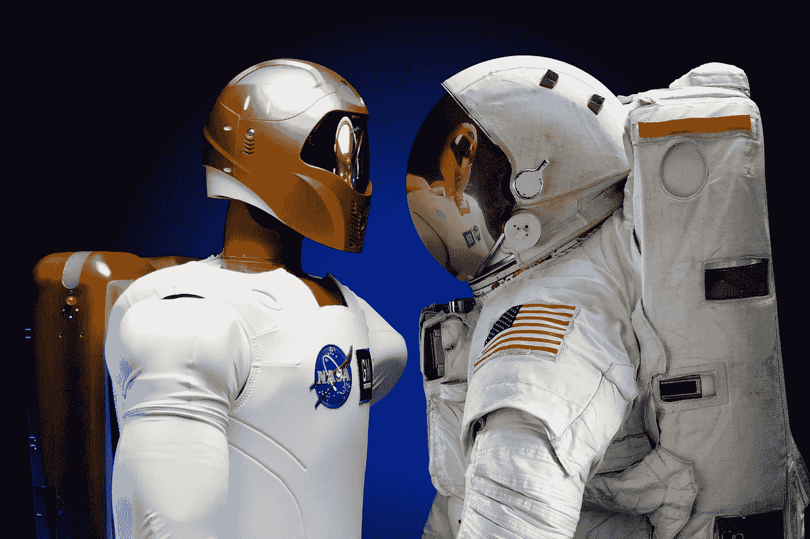

# 波音公司关于生活在计算机化世界的教训

> 原文：<https://towardsdatascience.com/lessons-from-boeing-about-living-in-a-computerized-world-74d89f40874f?source=collection_archive---------12----------------------->

波音公司在最近两起事故中遇到的麻烦引起了媒体的广泛关注。除了对波音公司、认证的政治和商业以及飞行时的安全感的影响，还有一些关于计算机和软件在我们生活中日益增长的存在的更重要的教训。

作为背景，我受过软件开发和软件架构方面的培训，也读过无数的航空调查报告。为什么？因为它们是在重大不利条件下找到根本原因，然后改进系统以防止其再次发生的黄金标准。在学习和将学习付诸行动方面，没有哪个行业比美国航空业做得更好。这就是为什么波音公司的这一失误更加重要。

生活中很多事情都是循环往复的。吸取教训，有时是艰难的。行为改变，安全措施到位。事情进展顺利很长一段时间。动机甚至对为什么会减弱的理解。直到重新吸取教训。这是人的本性。

但是，除了波音和航空业，还有其他值得学习的地方。虽然调查仍在进行中，但很明显，这两起事件都是人类与一台顽固的计算机作战并失败的案例。随着计算机控制着我们生活的越来越大的份额，甚至在这场技术革命的几十年里，我们将越来越多地面对计算机在我们生活中的角色，它们不仅仅承担卑微和麻木的任务，而且还控制着影响我们生活的决策。有时候重大决策。有时甚至是生死抉择。他们不会总是做出正确的决定。那现在怎么办？当你确信计算机是错误的时候，你如何与计算机争论？打电话给主管？有人能控制电脑吗？在这种环境下，常识怎么可能占上风？

随着计算机从低级工作人员手中接管任务，无论是收银台还是各种行政办公室，对这些工作人员的期望和培训都下降了。我们把过程、数据解释和工作流程外包给计算机，把最后一英里留给剩下的人。如果一切都符合软件设计师使用的工作流程图，那就太棒了。但是如果没有呢？职员有权做决定吗？职员受过做决定的训练吗？那个职员能控制电脑吗？在许多情况下，答案是否定的。计算机不懂常识，也不会听可能懂常识的人的话。

回到波音第二:在航空业的顶端有两个对手——波音和空客。几十年来，他们遵循不同的飞机设计理念。波音来自一个时代，当时飞机仍然有所有的机械电缆和滑轮控制，而空中客车是一个相对较新的实体。在波音飞机上，计算机辅助飞行员，但直到现在，飞行员才是最终的控制者。空客飞机从一开始就被设计成由计算机监督飞行员的决策，并可能拥有最终决定权。波音公司事故中涉及的 MCAS 系统是计算机在后台工作并在波音飞机上顽固不化的第一个案例。飞行员没有被告知或训练过。

所有的软件都需要测试。而且所有的软件都有 bug，否则我们永远也不会去安装安全更新和紧急补丁。如果计算机真的做出生死决定，而且它也有最后决定权，那么测试的门槛就会大大提高。这在预算、时间表和谁有权说“还没准备好”方面有文化含义。在多年设计受计算机影响程度更高的飞机后，空客公司应该已经做好了准备。波音公司可能在这方面措手不及，没有为这种类型的软件测试做好文化准备。

他们显然被传感器的故障率弄得措手不及，而这些传感器本应驱动更高的安全措施，他们错误判断的不是系统的单个功能，而是多次重置后的累积影响。正是这种难以测试的东西，因为它超越了整洁的流程图，而是涵盖了复杂的系统交互。[根据《纽约时报》报道]

事实是，在传统的编程中，人类将问题分解成许多小步骤和 if-then-else 决策。然后编写程序以极快的速度运行这些步骤。一旦程序写好了，就必须用尽可能多的场景进行测试，并验证预期的结果是否出现。

问题 A 是这非常复杂和耗时。所以通常只有一小部分可以完成，作为测试覆盖率来衡量。剩下的就留给希望、信心和机会了。在大多数情况下，如果遗漏了什么，几周后总会有软件更新。

问题 B 是在设计和测试过程中很难预见所有的排列。我们怎么知道我们真的想到了所有可能发生的事情？事实是我们不知道。我们可以建立统计模型，并获得更高程度的信心。但是我们必须承认会有不可预见的情况。那怎么办呢？嗯，计算机本身只服从命令(首先是程序员，其次是用户)，它不会思考。因此，我们必须让人类来评估情况，并在这种情况下做出最佳决策。这当然要求人能够控制局面。

任何飞行员都应该能够手动驾驶飞机，这意味着没有自动驾驶仪或计算机的指导。他们受过这方面的训练。在这两起事故中，他们显然都试图这样做。根据目前掌握的信息，计算机不会让他们这么做。

这也应该是我们对人工智能的关注，下一波计算机将在我们的日常生活中占据一席之地。普通大众对 AI 了解不多，这个词本身就有相当的误导性。人工智能给人的感觉是，计算机可能在某些时候与人类不相上下。它可能拥有传统程序所缺乏的常识。也许在遥远的未来某一天他们会。

传统程序和人工智能程序之间的关键区别在于，在传统软件中，开发者必须预见软件正在解决的整个复杂问题的每一个细节。在我们赋予计算机的越来越大的任务中，这面临着越来越大的挑战。人工智能可以解决一些更大的问题，因为不是所有事情都必须预先考虑和编码。程序可以学习输入和输出的模式，然后找到方法将相同的逻辑应用到开发过程中没有单独考虑的情况。

不久前优步在亚利桑那州的致命事故可能会对此有所启发。为了训练自动驾驶汽车，这些算法需要输入数百万张标准交通场景和路况的图像。这有助于他们分析摄像头反馈，解码汽车面临的情况以及他们应该如何处理。问题是，训练中灌输的许多意象不够多样化，不足以应对偶尔出现的奇怪事情。就像一个女人推着自行车在黑夜中穿过街道。你能在谷歌上找到多少这样的照片？

人类司机也可能第一次看到这一点。但是，人类驾驶员在做出最佳决策方面仍然更胜一筹。人类大脑比今天的人工智能系统有更多的生活经验。

人工智能程序最终能与人类的判断并行吗？是的，一旦我们可以用 70 亿人一生的经历、一个世纪的历史中可能的和期望的结果来训练它。但这是一个完全不同的层面。

这就是为什么我们应该对生活中的计算机持非常怀疑的态度。毫无疑问，它们以各种想象的方式让我们的生活变得更加美好。但是我们确实需要让常识占上风的方法。如果计算机是错误和顽固的，我们确实需要一个可以与之争论的人。如果必要的话，我们需要一种方法在适当的监督下控制电脑。

最简单的例子就是 IVR 系统(用于客户支持的自动电话菜单)。你多久在自动菜单中找到一次答案？我想很少。我们都学会了在遇到非标准问题时，按“0”或说“代表”来点击退出按钮，并与人交流。顺便说一句，这通常是我们拨打支持电话的情况。我发现 IVR 系统是一个非常误导和令人沮丧的成本节约策略。但最糟糕的是，如果系统不让你按零或与人交谈。有一次，我试了三次听不懂我的外国口音后，T-Mobile 就直接挂了我的电话，说“对不起，我们听不懂你的话，再见！”。计算机赢得战斗但输掉战争的定义。幸运的是，这是一个简单的服务问题，而不是生死攸关的情况。这些天我用 AT&T。

电脑是你的朋友。但它也可能是你的敌人。我们不要找麻烦了。

## 其他想法

以上为飞行员、办公室工作人员、收银员以及几乎所有与计算机工作流程交互的人提供了推翻计算机决定的机会。但是如何有序地做到这一点呢？

作为系统设计师，我们不希望他们拔掉电脑上的插头。在飞机上，断路器面板长期以来一直是禁用故障系统的最后手段。

因此，系统实际上必须设计覆盖用例。被授权的人必须表明他想推翻计算机的决定。通过这种方式，覆盖可以被本地化，它可以在数据模型中被标记，并且它可以在以后被跟踪以供审查和审计。一个明显的挑战是如何防止覆盖破坏数据模型完整性规则或软件中的其他假设。系统设计中的连锁反应是巨大的。

当然，为覆盖设计的用例可能仍然不工作。这就变成了一个递归问题。在某些时候，只需要拔掉插头。在昨天的最新报道中，似乎在波音公司的第二起相关事故中，飞行员遵循了系统设计师的程序来超越系统，但仍然失败了。众所周知的断路器时间到了。人类是最后一道防线，没有例外。根据模拟器测试，飞行员有 40 分钟。)来诊断、隔离、超越、从情况中恢复并有机会成功。没时间和电脑辩论了。接近地面的故障具有更小的裕度。

所有的智能设备不仅需要一个唤醒词‘Alexa，…’，还需要一个转义词‘Alexa，停止’。毫不含糊。否则，我们将在未来几年迎来#metoo 版本的人工智能。