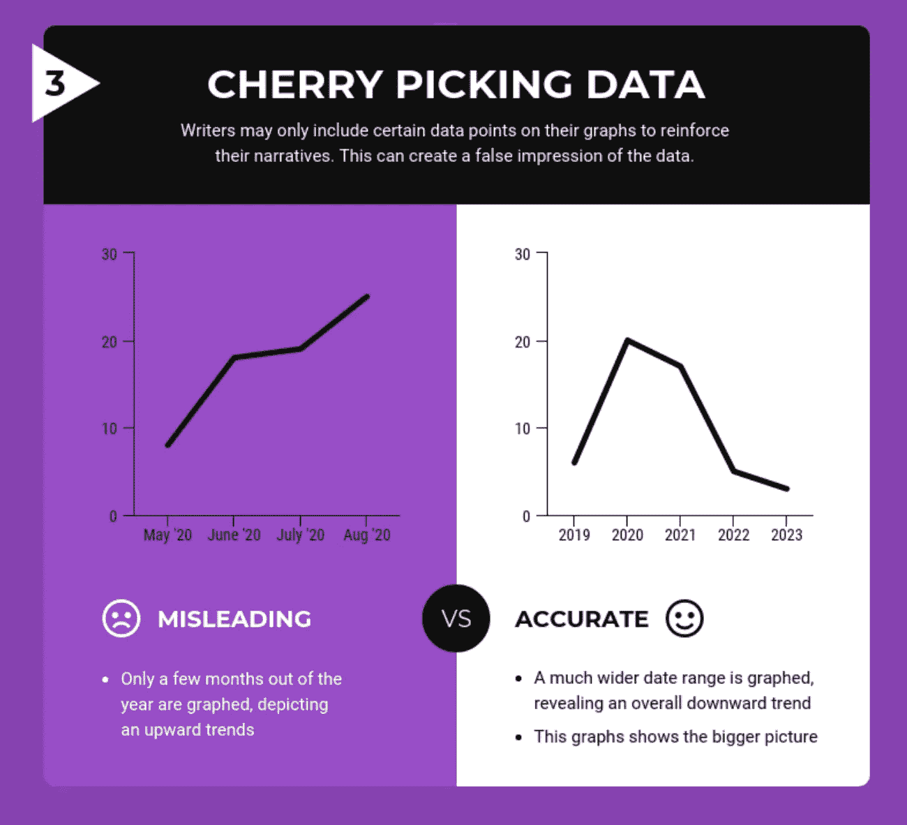

# 关于如何与统计数据撒谎的课程

> 原文：<https://towardsdatascience.com/lessons-from-how-to-lie-with-statistics-57060c0d2f19?source=collection_archive---------0----------------------->

[(Source)](https://www.pexels.com/photo/silhouette-of-trees-2058946/)

## 永恒的数据素养建议

*如何用统计数据撒谎*是一本 65 岁的书，可以在一个小时内读完，比任何关于“大数据”或“深度学习”的书都更能教会你每天可以使用的实用信息。尽管机器学习和 Pb 级数据承诺了一切，但数据科学中最有效的技术仍然是小表格、图表，甚至是总结情况的单个数字，并帮助我们或我们的老板根据数据做出决策。

一次又一次，我看到数千个复杂算法的工作时间被总结成一个数字。最终，这就是最大的决定是如何做出的:用一些人类可以处理的数据。这就是为什么《如何用统计数据撒谎》(达雷尔·赫夫著)中的教训是相关的，即使我们每个人可能[在一天内产生的数据](https://www.weforum.org/agenda/2019/04/how-much-data-is-generated-each-day-cf4bddf29f/)比在写这本书时全世界产生的数据还要多。作为表格和图表的制作者，我们需要有效地呈现有效的摘要。作为信息的消费者，我们需要发现误导/夸大的统计数据，这些数据操纵我们采取有利于他人而损害我们利益的行动。

这些技能属于一个被称为[“数据素养](https://en.wikipedia.org/wiki/Data_literacy)”的类别:阅读、理解、争论和从信息中做出决策的能力。与算法或大数据处理相比，数据素养似乎并不令人兴奋，但它应该成为任何数据科学教育的基础。幸运的是，这些核心思想不会随着时间的推移而改变太多，而且通常关于这个主题的最好的书(比如量化信息的可视化展示)已经有几十年的历史了。本文中讨论的经典书籍以简洁、有效和令人愉快的格式阐述了负责任的数据消费。以下是我从“如何用统计数据撒谎”中学到的经验，并附有我个人经历的评论。

The Classis Book on Data Literacy: “How to Lie with Statistics” [(Source)](https://www.google.com/url?sa=i&source=images&cd=&cad=rja&uact=8&ved=2ahUKEwijgYTJgNXjAhVQVd8KHctoCW0Qjhx6BAgBEAM&url=https%3A%2F%2Fwww.target.com%2Fp%2Fhow-to-lie-with-statistics-reissue-paperback-darrell-huff%2F-%2FA-11395199&psig=AOvVaw0U0FRS-6ApdqUQuZBgro7K&ust=1564313614376777)

## 1.以怀疑的态度看待相关性

当两个变量 X 和 Y 相关时——意味着它们一起增加，一起减少，或者一个上升另一个下降——有四种可能的解释:

**A. X 导致 Y**

**B. Y 原因 X**

**C .第三个变量 Z 同时影响 X 和 Y**

**D. X 和 Y 完全不相关**

当 C 或 D 同样可能的时候，我们经常立刻跳到——或者被引导去相信——A 或 B。例如，当我们听说更多年的大学教育与更高的收入正相关时，我们得出结论，更多年的大学教育会带来更多的财富。然而，这也可能是第三个因素，如努力工作的意愿或父母的收入，是更多年的高等教育和更高收入的背后原因。第三个隐藏变量会导致我们得出关于因果关系的错误结论。

其他时候，两个变量可能看起来相关，但实际上彼此无关。如果你在数据集之间进行足够多的比较，你一定会发现一些有趣的关系，它们看起来是同步的。泰勒·维根在[记录了这些虚假的相关性。](http://www.tylervigen.com/spurious-correlations)

A Questionable Correlation [(Source)](https://www.google.com/url?sa=i&source=images&cd=&cad=rja&uact=8&ved=2ahUKEwjm16yEgtXjAhXtc98KHfMLB5sQjhx6BAgBEAM&url=https%3A%2F%2Fwww.tylervigen.com%2Fspurious-correlations&psig=AOvVaw05f4jHFaINXtZjcJ2N6YjL&ust=1564313998141351)

我们都听说过这样的建议，相关性并不意味着因果关系，但即使有因果关系，也往往不确定它会如何发展。老师对学生的表扬越多，成绩越好吗？分数越高引起的好评越多吗？还是有第三个因素，更小的班级规模或更多的自然采光，导致这两个变量都增加了？原因问题由随机对照试验来回答，而不是由观察性研究来回答，在观察性研究中，我们不能排除我们没有测量的其他因素。为了避免被误导，通过寻找**混淆因素**来怀疑变量之间的相关性。人类喜欢简洁的因果叙述，但这通常不是数据告诉我们的。

## 2.关系不会永远持续下去

如果你已经成功地确定了一个相关性，不要假设它会永远存在，无论是正向还是负向。线性关系几乎总是仅在两个变量的有限区域内是线性的*。*超过一个点，关系可能变成对数，完全消失，甚至反转。

这可以在随时间外推的生长曲线中观察到。有一些线性时期，经济以恒定的速度增长，但最终增长会趋于平稳，因为几乎没有什么东西会无限期地增长下去。

Male Height vs Age Showing Leveling Off of Growth Curve [(Source)](https://en.wikipedia.org/wiki/Growth_curve_(biology)).

在一个关系的适用范围之外进行外推被称为泛化误差。你是在利用一种本地现象，并试图将其应用到全球。随着人们摆脱贫困，他们往往会对生活更加满意。然而，一旦他们达到某个点(也许是 75，000 美元/年)，幸福感不会随着财富而增加，甚至可能会减少。这表明财富的增加存在收益递减，就像人类活动的许多方面一样，比如为考试而学习。

Happiness Increases with Wealth Up to a Certain Income Level [(Source)](https://www.richardcarrier.info/archives/13954)

我们总是看到推断:公司增长率、人口统计、股票价格、国家支出等等。通常，人们会在一个地区使用有效的关系来表明一个地区的观点(例如声称 100 万美元/年将带来纯粹的幸福)。请记住，局部地区的关系并不总是适用于全球。即使你已经证实了因果关系——或者在图表中看到了——也要确保你不理解有限有效区域之外的内容。

## 3.总是看图表上的坐标轴

调整图表的轴来表示一个点是操纵图表的经典[技术。](https://venngage.com/blog/misleading-graphs/)作为首要原则，条形图上的 y 轴应该*始终*从 0 开始。如果不是，通过操纵范围来证明一个论点是很容易的，例如，把微小的增加变成巨大的变化:

Misleading Graph That Does not start at 0 on the Y-Axes (Left) [(Source)](https://www.datasciencejunction.com/2019/01/how-to-be-cautious-about-misleading.html)

另一个误导性图表的例子是不同比例的 y 轴。通过仔细调整价值，你会在不存在的地方创造出令人惊讶的趋势。

A Misleading Graph Creating An Extreme Trend Where There is Only a Small Increase [(Source)](https://www.statisticshowto.datasciencecentral.com/misleading-graphs/)

虽然这看起来像是一个明显的操纵，但广告商和报纸逃脱了惩罚，因为人们不阅读信息。大多数人看到一个图表，会立即从线条或条形的形状中得出结论，这正是制作图表的人想要的。要解决这个问题，请尝试读取轴值。一个简单的检查可能会告诉你变化并不像看起来那么大，趋势是从无到有的！

一旦你做了一些制作图表的练习，你就会意识到操纵它们对你有利是多么容易。防止不准确数据的最好方法可能是亲自动手制作。

(如果你想要一本关于制作合理的数据可视化的好书，可以看看爱德华·塔夫特的[定量信息的可视化显示](https://www.edwardtufte.com/tufte/books_vdqi)或者克劳斯·威尔基的数据可视化基础。)

## 4.小样本产生令人震惊的统计数据

如果我告诉你最高的癌症发病率往往发生在人口最少的县，你会惊讶吗？没那么震惊。如果我补充说，最低的癌症发病率也往往发生在人口最少的县，那会怎么样？[这是一个小样本情况下发生的经过验证的例子](https://en.wikipedia.org/wiki/Insensitivity_to_sample_size#cite_ref-4):极值。

任何时候研究人员进行研究，他们使用所谓的样本:代表整个人口的人口子集。当样本足够大并且具有更大人群的相同分布时，这可能会很好，但通常，由于资金或响应率有限，心理、行为和医学研究是用小样本进行的，导致结果有问题并且无法重现。

科学家通常被合法的问题限制在小样本范围内，但广告商通过进行许多微小的研究来利用少量参与者，其中一项将产生积极的结果。在评估一项研究时，人类并不擅长调整样本量，这实际上意味着我们将 1000 人试验的结果视为 10 人试验的结果。这被称为“对样本大小不敏感”或“样本大小忽略”。

这是另一个例子。如果你认为自己懂数据，那么这个问题对你来说没有问题:

> 某镇有两家医院。在大医院，每天大约有 45 个婴儿出生，在小医院，每天大约有 15 个婴儿出生。如你所知，大约 50%的婴儿是男孩。然而，确切的百分比每天都在变化。有时可能高于 50%，有时更低。
> 
> 在一年的时间里，每家医院都记录了超过 60%的新生儿是男孩的日子。你认为哪家医院记录了更多这样的日子？
> 
> 1.较大的医院
> 
> 2.较小的医院
> 
> 3.差不多(也就是彼此相差 5%以内)

如果你猜是 2。，那么恭喜你，你懂数据！原因是样本量越小，数值越极端。(这是来自 Tversky 和 Kahnemann 的[不确定性下的判断:启发和偏见](https://www.its.caltech.edu/~camerer/Ec101/JudgementUncertainty.pdf)。我强烈推荐阅读这篇论文，并思考，无论快慢，来了解影响我们决策的认知偏差。)

你可以通过掷硬币来检验小样本产生极端结果的原理。对于一个小样本，比如说 5 次投掷，你很有可能得到 4 条尾巴。这是不是意味着硬币总是 80%是反面？不，这意味着你的样本太小，不能得出任何有意义的结论。

With smaller sample sizes, we get more extreme results [(Source)](https://breakingdownfinance.com/finance-topics/behavioral-finance/sample-size-neglect/)

这种技巧通常在通过向少数人询问特定品牌来营销产品时使用。如果你反复调查小群体，只报告有利的结果，你可以得到令人印象深刻的数字(90%的医生喜欢这种牙膏)。问一个小组，看看结果，扔掉不好的，重复直到你得到你需要的统计数据！

避免被小样本愚弄的解决方案是在数据中寻找观察值的数量。如果没有给出，那么假设无论是谁进行了这项研究，都有所隐瞒，这些数据是没有价值的。行为科学家已经表明，我们大多数人容易忽视样本量；不要犯同样的错误——相信大量的观察结果，而不是来自小样本的令人震惊的统计数据。

## 5.看看所有描述数据集的数字

检查样本大小可能是避免被数据愚弄的一种方法，但前提是样本大小已经提供。误导数据消费者的另一个技巧是避免列出描述数据集的相关数字，如观测值的计数、数据的分布(范围)、数据的不确定性(标准误差)、数据的分位数等等。其中的每一个都可以用来更深入地研究数据，这往往违背了提供数据集的人的利益。

例如，如果你听说一个城市一年的平均温度是华氏 62 度，但不知道最高和最低温度，这是没有帮助的。这个城市可能会冷到零下 20 华氏度，热到 120 华氏度，但平均起来还是一个舒适的值。在这种情况下，正如在许多其他情况下一样，*单个数字不足以描述数据集*。

作为书中的另一个例子，如果你有两个孩子，其中一个智商测试 99，另一个 102，你真的不应该告诉他们，以避免比较。为什么？因为[智商测试可以有大约 3 分的标准误差](https://psycnet.apa.org/record/1990-03261-001)，这意味着一个曾经得过 99 分的孩子有大约 68%的几率会得到 96 到 102 分。总体差异可能并不显著，并可能在重复测试中逆转。换句话说，通过在结果中忽略预期的标准误差，你可以得出一个比数据更激烈的结论。

不报告一个以上数字的研究通常有所隐瞒。同样地，如果一个图表看起来切断了一些数据，它是不可信的。通过子集化数据来改变叙述太容易了。

Graphs can change based on data shown [(Source)](https://venngage.com/blog/misleading-graphs/)

你可以这样想:如果有一种药能让寿命平均延长两年，你会服用吗？如果最坏的影响是损失 12 年寿命，最多增加 14 年寿命，你会改变主意吗？重要的通常是细节，一个汇总统计数据不能说明全部情况。

## 6.检查使用哪个平均值

另一个有用的方法是改变“平均值”的定义。你有 3 个选择(如果你聪明的话，可能更多):

1.  平均值:将这些值相加，然后除以观察次数
2.  中位数:从最小到最大对数值进行排序，并找出中间值
3.  模式:找到最常出现的值

我以前写过这个问题([详见这里](/how-90-of-drivers-can-be-above-average-or-why-you-need-to-be-careful-when-talking-statistics-3df7be5cb116))，基本思想是:一个分布的均值和中值只有在它是正态的情况下才是相同的，我们生活在一个主要有[非正态数据的世界](https://sciencestruck.com/types-of-skewed-distribution-with-real-life-examples?source=post_page---------------------------)。这意味着数据集的平均值和中值不是同一个值，通常相差很大。

Mean vs Median vs Mode in Normal and Skewed Data [(Source)](https://www.quora.com/Is-median-always-greater-than-mean)

例如，美国[的平均收入和中值收入相差大约 16000 美元](https://dqydj.com/united-states-income-brackets-percentiles/?source=post_page---------------------------)。通过选择报告的平均值，政治家、营销人员和首席执行官可以从相同的数据中得出相反的结论。

A skewed distribution with different mean and median [(from my story on types of averages.)](/how-90-of-drivers-can-be-above-average-or-why-you-need-to-be-careful-when-talking-statistics-3df7be5cb116)

避免这种情况的方法是查看数据集的平均值、中间值和众数(同样，您需要所有这些数字！).找出哪一个是最合适的(通常是收入、城市规模、寿命、房价等高度倾斜数据集的中间值)，如果你需要一个数字的摘要，就用它。如果可以的话，将整组数值绘制成直方图，并观察分布情况。试着用一个以上的数字来描述一个数据集，如果你报告一个平均值，请说明你使用的是哪一个！

## 7.使用与公共基线的比较

查看统计数据时，重要的问题通常不是值是什么，而是当前值与以前的值相比如何？换句话说，与绝对量级相比，相对变化是多少。如果我告诉你，2017 年美国国内生产总值为 19.39 万亿美元，这听起来令人难以置信，因为你的日常经历。然而，如果你与美国前一年的 GDP 18.62 万亿美元相比，它看起来并不那么令人印象深刻。

数据通常在我们不熟悉的尺度上，我们需要与其他数字进行比较，以了解统计数据是否代表了真正的变化。火星平均半径 3389 公里大吗？我不知道这意味着什么，直到它与其他星球相比！

Compare stats to other similar numbers [(Source)](https://www.google.com/url?sa=i&source=images&cd=&cad=rja&uact=8&ved=2ahUKEwjk1MnshtjjAhWLVN8KHUiQAdYQjhx6BAgBEAM&url=https%3A%2F%2Fen.wikipedia.org%2Fwiki%2FSolar_System&psig=AOvVaw3yOgcjG7f24zAzlDAvIRQA&ust=1564418379443499)

我们不仅希望将统计数据与过去的值以及同一类别中的数字进行比较，还希望确保统计数据的定义不会改变。根据《如何撒谎》一书，美国农场的数量从 1930 年到 1935 年增加了 50 万，因为人口普查局对农场的定义改变了！降低失业率最简单的方法就是改变定义，将停止找工作的人排除在外。

数据收集方式或数值定义的变化往往会产生被误认为实际趋势的极端结果。为了解决这个问题，首先，从整体上看整个系列的值。其次，确保定义在时间范围内没有改变。只有这样，你才能开始从数据系列中得出结论。你可以说[纽约在 2018 年发生了](https://en.wikipedia.org/wiki/Crime_in_New_York_City) 289 起谋杀案来吓唬人们，但当你将这一数字与 1990 年的 2245 起相比较时，你会意识到纽约市从未如此安全过！重要的通常是比较；不要让一个孤立的数字左右了你的理性思考。

## 8.寻找样本选择中的偏差

还记得我们谈到的从样本中收集的所有数据吗？我们希望这些样本能够代表总体？除了关注样本大小，我们还需要寻找样本中的任何偏差。

这可能来自所使用的测量方法:固定电话屏幕可能有利于更富有、更年长的参与者。它也可能来自物理位置:只调查住在城市的人，因为它更便宜，可能会使结果偏向更进步的观点。样本偏差在政治民意调查中尤其普遍，2016 年的调查显示，有时样本并不能代表整个人口。

Sampling Bias in Action [(Source)](https://www.geckoboard.com/learn/data-literacy/statistical-fallacies/sampling-bias/)

在检查一项研究时，我们需要问谁被纳入样本，谁被排除在外。几十年来，心理学和社会学研究一直受到这种怪异偏见的伤害。样本只包括来自西方、教育、工业化、富裕、民主国家的人(通常是大学生)。当参与者如此有限时，很难合理地说一项调查代表了全人类！

我们还应该在我们的信息来源中寻找抽样偏差。现在，我们大多数人通过选择我们倾向于认同的信息来源，将信息选择偏见强加给自己。这导致了危险的情况，在这种情况下，我们不会遇到有不同意见的人，因此我们会变得更加固执己见。解决这个问题的方法很简单，但是很难:阅读不同来源的新闻，尤其是那些与你不一致的新闻。

如果你是《纽约时报》的读者，可以试试《华尔街日报》。对于那些喜欢冒险的人，你甚至可以试着和与你意见不同的人交谈。虽然这看起来有点吓人，但我发现表面上不同意的人往往有更多的共同点——相同的核心驱动欲望——促使他们选择各自的立场。面对面地达成共识要容易得多，但即使是在网上进行文明对话也是可能的、有成效的，可以帮助你摆脱自我强加的信息选择偏见。

总之，我们需要警惕外部取样偏差和我们选择媒体来源时自己造成的取样偏差。你不会喜欢有人告诉你只看一份报纸，所以不要对自己做同样的事情。不同的观点会带来更好的结果，整合不同观点的不同信息来源会让你对事件有更全面的了解。我们不能总是得到一件事情的完全真相，但我们至少可以从多个侧面看到它。同样，当阅读一项研究时，确保你认识到样本可能不能代表整个人群，并试图找出偏向的方向。

## 9.警惕研究中的“大人物”,审查权威

Huff 描述了一个“好名字”的想法，作为一个添加到一项研究中，赋予它一种权威的空气。医学专业人士(医生)、大学、科学机构和大公司的名字让我们自动信任他们产生的结果。然而，很多时候这些“专家”实际上并没有创作出作品，而只是间接参与其中，这个名字是为了迷惑我们而加进去的。其他时候，比如当卷烟制造商利用医生来销售他们的致命产品时，当局直接被收买去撒谎。

避免被令人印象深刻的名字说服的一个方法是“确保病历报告上的名字位于病历报告的后面，而不是旁边。”不要看到一个机构的名字就马上假设这项研究是可靠的。我认为我们不应该看作者或大学，直到我们分析了统计数据，以避免我们强加给自己的任何无意识的偏见。

即使结果来自一位公认的“专家”,也不意味着你应该毫无疑问地接受它们。权威人士的[观点是一种谬误，当我们假设拥有更大权力的人更有可能是正确的时候就会出现这种谬误。这是错误的，因为过去的成功与当前的结果是否正确没有关系。正如卡尔·萨根所说:“当局必须像其他人一样证明自己的论点。”(](https://en.wikipedia.org/wiki/Argument_from_authority)[出自*闹鬼世界:*](https://books.google.com/books?id=Yz8Y6KfXf9UC&q=Arguments+from+authority#v=snippet&q=Arguments%20from%20authority&f=false) *黑暗中的科学蜡烛*)。

The Appeal to Authority logical fallacy [(Source)](https://www.google.com/url?sa=i&source=images&cd=&cad=rja&uact=8&ved=2ahUKEwjOs9PIjNjjAhWIT98KHdFNC_kQjhx6BAgBEAM&url=https%3A%2F%2Ftheupturnedmicroscope.com%2Fcomic%2Flogical-fallacies-appeal-to-authority%2F&psig=AOvVaw3vwrBcjXOLbnJ7Co3UDiOV&ust=1564419925139695)

正如我们在整个科学史中所看到的，没有人是不怀疑的(记得亚里士多德说过有五种元素吗？或者当 IBM 的总裁说“我认为大约有五台电脑的世界市场”。)许多最伟大的发现都来自于挑战权威和公认的智慧。一个有着响亮名字的统计数据应该和其他任何统计数据一样受到同样多的审查。统计和数据并不效忠于更高的权力。

## 10.不要过于相信任何一个统计数字

“如何对统计数据撒谎”的总主题是:用怀疑的眼光看待任何一个统计数据。任何数字都代表一组数据的精华，这些数据是由容易出错的人使用不完善的工具，在不断变化的条件下，在某个时间点对人口样本进行提取的。数据由另一个人分析，他为一个机构工作，这个机构可能有不同动机的外部资助者。最后，统计数据或图表是由出版商提供给你的，出版商有自己的利益让你相信一个想法。

所有这些导致了两个结论:

1.  如果你把所有的信念都放在一个数字上，那么你将会过度适应产生这个数字的特定环境。
2.  统计和数据从来都不是纯粹客观的。统计是对不确定数据的一种解释，旨在说服。

我们不应该完全放弃统计和数据收集。有了正确的设计，研究可以发现关键的趋势——吸烟对你有害，[氯氟烃在臭氧层上制造了一个洞](https://news.nationalgeographic.com/news/2010/05/100505-science-environment-ozone-hole-25-years/)，[更多的财富带来更多的幸福](https://www.visualcapitalist.com/relationship-money-happiness/)，以及[氟化水极大地改善了牙齿健康](/a-great-public-health-conspiracy-73f7ac6fb4e0)——然后带来更好的总体结果。相反，我们需要承认数据收集和处理是一个不确定的过程，有许多因素影响我们看到的最终数字。

The identification and work to close the ozone layer hole is a data and environmental success story [(Source)](https://www.google.com/url?sa=i&source=images&cd=&cad=rja&uact=8&ved=2ahUKEwjl7OqRk9jjAhUFT98KHUX1CJkQjhx6BAgBEAM&url=https%3A%2F%2Fsvs.gsfc.nasa.gov%2F11781&psig=AOvVaw0gYXd4Z_LQcVK8vltOUw9R&ust=1564421545359104)

人类是可变的，世界也是可变的——这是生活在其中如此美好的部分原因——所以我们应该警惕声称用一个图表或表格来概括它的统计数据。我们应该寻找值的范围，用置信区间报告数字，在下结论之前收集更多的数据，比较多项研究，并询问数据收集过程的设计。

当证据的负担无可辩驳时，我们需要承认我们错了，改变我们的想法。也许没有适用于整个宇宙的客观真理，但随着时间的推移，我们会变得不那么错误。这基本上是科学的目标:每一项新的研究都让黑暗多一点光明。这也应该是数据科学的目标:通过每一个新的数据集揭示我们世界的更多结构。同时，我们需要认识到数据的局限性，不要过度概括。更多的数据不是万灵药，但是更多的数据加上辩论、多重分析和审查可以带来更好的现实世界决策，这就是我们作为[数据素养公民所希望的。](https://en.wikipedia.org/wiki/Data_literacy)

# 结论

如果我在数据科学领域学到了什么，那就是最有效的消磨时间的方式是用 4 个数字做一个条形图。机器学习建模是前沿的，但最终，CEO 想要看到的只是一个简单的图表，她可以从中得出结论。这本身没有错:作为数据科学家，我们的工作是从大量数据中提取意义。意义并不意味着显示几百个数字，它意味着显示有限的几个具有高价值的数字。我们呈现这些数字的方式会对它们的使用方式(或是否使用)产生很大影响。

Simple charts are usually the most effective [(Source)](http://www.storytellingwithdata.com/blog/2018/3/9/bring-on-the-bar-charts)

数据素养意味着拥有解释图形、图表和统计数据并得出可行结论的技能。这些结论不一定与制作图表的人一致，当他们一致时，你应该持怀疑态度。作为数据产品的消费者，我们需要了解操纵数据来证明一个观点或将消极因素转化为积极因素是多么容易。练习阅读统计数据和可视化数据——实际上是阅读一个数字——会有所帮助。另一个有用的策略是自己制作大量图表。练习使用最好的技术，并确保不故意误导他人。

这个世界不是一个糟糕的地方，但有人不把你的美好愿望放在心上。通常，他们会利用数据作为工具，说服你按照他们的利益行事，而不是按照你自己的利益行事。对抗这些策略的最佳屏障是基本的数据素养:理解数据是如何被操纵的，以及你可以突破错误观念的方法。适度的怀疑对你个人和整个数据科学领域都有好处。记住这些教训，走出去，做一个负责任的数据生产者和消费者。

一如既往，我欢迎反馈和建设性的批评。你可以在推特上找到我。