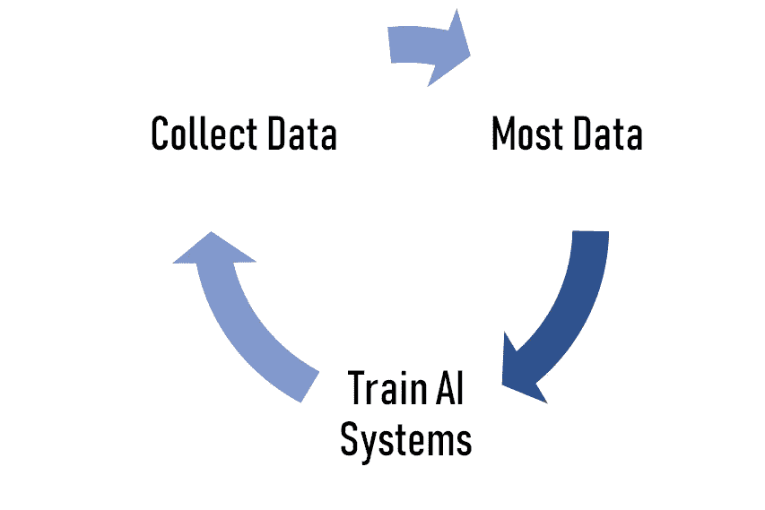
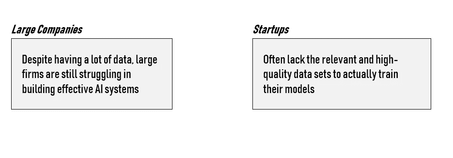

# 我在开发人工智能策略中学到的经验

> 原文：<https://towardsdatascience.com/lessons-ive-learned-developing-an-ai-strategy-45e3f7c18426?source=collection_archive---------19----------------------->

## 大公司如何建立人工智能战略？他们如何在 AI 时代建立竞争优势？他们如何构建 AIoT 生态系统？

作为一家全球科技公司的顾问，我在过去的两年里一直在研究这些问题。在这篇文章中，我想展示一家大公司是如何思考和构建其人工智能战略的。

许多公司正在试图从低成熟度的状态过渡到人工智能优先的模式。然而，成为一个人工智能优先的组织被证明是极其困难的，但也是非常有益的...

# 数据和竞争优势

我相信大公司已经到了**运营人工智能**的时代。他们有几个人工智能项目已经投入生产，并在其流程或产品中带来了真正的附加值。此外，他们已经将人工智能结果确立为整个公司的新标准，并正在进行持续的改进。

在考虑人工智能之前，我们花了很多时间通过几个计划(策划数据管道、数据湖等)来改善我们的数据文化。).它是人工智能生态系统首先工作的基础。

显然，拥有高质量数据的数据湖的公司可以训练出最好的 AI 系统；最好的系统有最广泛的用途；这些系统的广泛使用为拥有最佳人工智能系统的最大公司的数据湖贡献了更多数据。

然后，这些数据可以用来改进现有的模型，并创建全新的模型，从而形成一个强化/虚拟循环。那些拥有最多数据的人往往能够训练出最好的人工智能系统，而那些拥有最好人工智能系统的人往往能够收集到最多的数据。

这场数据竞赛具有重要的战略意义。事实上，一旦收集到足够的数据**(实时数据收集的过程是高效的)**试图进入该行业的新公司几乎没有选择，只能依赖先行者控制的数据。

**我相信，当涉及到数据& AI 时，先发优势的想法更加强烈。**事实上，访问大量相关的数据集意味着收集数据的新努力注定非常耗时，因此在商业上也很困难。

> 我们的目标是达到数据统治的水平。

我认为，许多公司花费大量时间和金钱积累的数据资产并不真正值得这么多**，因为从数据的角度来看，它们并没有提供一种主导市场的方式。**

最好的情况是，你的专有数据非常有价值(复制起来很难，成本也很高)，这就是为什么免费的数据如此之少。我相信，随着时间的推移，开发您的专有数据存储库将会产生价值和防御能力。我们制定战略时谨记，我们的数据是捍卫我们市场地位的一种方式。

数据统治也使你能够测试各种基于人工智能的想法。由于预算原因，小公司承担不起这么大的风险。您的数据优势越小，您的数据战略与业务战略分离的可能性就越小。**受益于人工智能的公司比竞争对手更早投资，这绝非偶然。**很明显，还需要准备好关闭早期阶段没有明显收益的人工智能概念验证。

越早开始，竞争对手就越难赶上。更好的预测将吸引更多的消费者，更多的消费者将产生更多的数据来训练人工智能，更多的数据将导致更好的预测，以此类推，形成良性循环。**过早采用可能代价高昂，但过晚采用可能是一个战略错误。**

另一个经常被低估的重要因素是发展伙伴关系的必要性。我们花了很多时间思考如何通过与其他组织、大学、数据提供商或政府部门合作来积累更多战略数据。建立互惠互利的关系可以为您的公司提供独家数据和相关利益。

*   大型公司和创业公司

我注意到，尽管拥有大量数据，但大公司仍在努力构建有效的人工智能系统。另一方面，人工智能创业公司缺乏相关的高质量数据集来训练他们的模型。这种情况创造了一种环境，在这种环境中，两个实体需要并经常相互合作。

大公司坐拥大量数据，他们甚至不知道如何处理这些数据，所以通常情况下，需要帮助的是那些人，但另一方面，初创公司，如果他们只使用开放数据，他们可能不具备训练算法所需的相关性和质量。

*   开放数据

我也意识到只有少数大公司倾向于使用公开数据。事实上，许多公司认为，公共部门组织公开发布的数据往往质量很差，需要进行广泛清理，并与其他专有数据集结合起来，以证明其有用。

然而，许多人工智能系统实际上主要或专门针对开放或可公开访问的数据进行训练。例如，可以对来自维基百科或 Twitter 等社交媒体的文本训练自然语言处理系统。

*   用更少的数据做更多的事

我们也非常重视一切可以帮助我们用更少的数据开发项目的东西。事实上，我们已经依赖数据增强技术或转移学习来提供帮助，但在未来，由于利用数据的新方法，我们可能会看到另一种转变。

# 商业模式和数据

决策者现在意识到，传统的商业模式在持续混乱的商业环境中根本行不通。建立人工智能战略的一个关键挑战是找到收集有用数据的方法，并用它们来加强你的地位。收集数据的最有趣的方式之一是，即使没有机器学习，也要构建一些有价值的东西，然后以一定的成本出售，以收集数据，甚至免费提供数据。通常，这种策略经常被创业公司用作商业模式。

> 当您希望通过从一开始就向用户提供大量价值来收集大量数据时，这种构建“数据陷阱”的想法非常有用。数据枯竭只是产品效用的副产品。

我们还试图将讨论从数据转移到智能产品和流程上。的确，数据可能是基础，但基础需要被设计成支持位于其上的东西:更智能的产品和业务流程。

我们的目标是通过人工智能增强我们所有的产品或后端操作，并为最终消费者创造真正的附加值。我经常听到人们说“我们必须进入 AI”，但这是一个错误。**问题的一部分在于，没有人工智能商业案例这种东西。**相反，商业案例将针对特定的商业场景、问题或用例，将人工智能方法和技术作为整体解决方案的一部分。

在我们的大多数人工智能项目中，我们非常注意在维护我们的品牌形象(精度、效率等)之间找到正确的平衡。)以及我们的模型提供的整体准确性。**没有一个模型是 100%没有错误的。**模型总会犯一些错误，但你要知道错误的后果是什么。它将如何影响您的品牌形象？你的客户会有什么反应？…

*   创造新的收入来源

由于人工智能的出现，我们还寻求通过利用我们所掌握的新信息来创造新的收入来源。我们使用这种方法来推动整体增长，通过这种方法，公司可以使用人工智能来不断识别结合自身和外部数据的领域，从而为他们提供进入新市场的途径。

**商业模式的转变在建立长期竞争优势方面具有战略意义，因为当公司使用人工智能做新的事情而不是做同样的事情时，人工智能在推动增长方面最有价值，只是稍微好一点**。

例如，通过聊天机器人应用人工智能来改善你的网站体验听起来很棒。但是，越来越多的公司做同样的事情，这不再是差异化。我们总是试图改变客户体验，提供全新的东西。

*   销售知识

我们也想了很多关于如何销售由于我们的人工智能计划而产生的见解。AI 的知识捕捉能力为企业创造了一个从销售实体产品转向销售知识的机会。例如，一个最先进的制造工厂可以使用人工智能系统向同行业的竞争对手展示其知识或流程。

# 建设文化

人工智能不仅仅是一种技术解决方案。我们花了很多时间围绕它建立一种文化。事实上，现在不同的部门不再互相争斗，而是分享他们的创新知识，以提供定制的、有凝聚力的客户体验。

为了改进我们的流程，我们决定用机器学习来改革公司。我们意识到推广我们的数据集和挑战成为潜在雇员的强大诱惑。

从人工智能采用的早期阶段及以后，许多公司要么止步不前，要么由于从数据、人才到技术本身的几个障碍而放缓。虽然人工智能提供了打开新市场和创造新收入流的独特能力，但当在整个企业范围内大规模实施时，它的好处会最大化。

我坚信一个人工智能的策略是不够的。在探索和利用战略机会方面，用人工智能制定战略同样重要，甚至更重要。优化精心选择的 KPI 成为 AI 的战略目标。