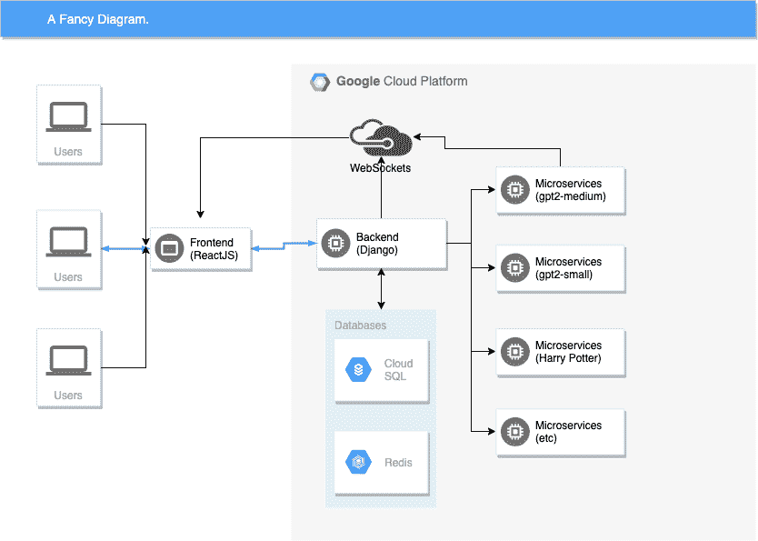

# 构建人工智能写作应用的经验教训[指南，开源]

> 原文：<https://towardsdatascience.com/lessons-learned-from-building-an-ai-writing-app-guide-open-sourced-6f661f9caec6?source=collection_archive---------41----------------------->


[**writeup.ai**](https://writeup.ai) **是一个开源的文本机器人，与你一起写作。**它(大部分)由 OpenAI 的 [GPT-2](https://openai.com/blog/better-language-models/) 驱动，并有额外的微调型号:

*   合法的
*   文案和使命陈述
*   抒情诗
*   [文学作品]哈利波特
*   《权力的游戏》
*   学术研究文摘

主要的技术挑战是创建一个能够快速******支持 10-20 个重度用户的应用程序，该应用程序可以交付 OpenAI 的 GPT-2 媒体(一个生成文本的 ml 模型)。******

# ****初始状态:****

*   ****开始是作为学习在 NLP(自然语言处理)中训练 ML 模型的借口。我最终主要学习了部署模型。****
*   ****估计要一个月才能建成。不对。花了我三个月的时间。****
*   ****工程师很难估计。过分自信的傻逼估计就更难了(咳)。****
*   ****遗憾的是，我对训练模型了解不多(lol)。还是什么都不知道。****
*   ****许多开源的训练脚本( [nsheppard](https://github.com/nshepperd/gpt-2/tree/finetuning) )做了繁重的工作。发现 gwern 的 [GPT2 指南](https://www.gwern.net/GPT-2)对于培训教程来说非常有价值。另一个很棒的快速入门工具是 Max 的 [gpt-2-simple](https://github.com/minimaxir/gpt-2-simple) repo。****
*   ****writeup.ai 大部分都是开源的。我添加了相应的链接，从我的错误/失败中吸取教训。我还在 GitHub 中添加了代码的直接链接。****

# ****链接。它是开源的！****

****app—[https://write up . ai](https://writeup.ai)
[前端回购](https://github.com/jeffshek/writeup-frontend)
[后端回购](https://github.com/jeffshek/open)****

# ****背景:****

*   ****在 [React](https://reactjs.org/) 、 [Django](https://www.djangoproject.com) 、 [Flask](https://palletsprojects.com/p/flask/) 做了太多年的网络应用。****
*   ****对机器学习(ML)和 MLOps(机器学习 devops)不熟悉，所以请以健康的怀疑态度阅读任何建议。****

# ****读者:****

*   ****一些网络开发的背景是必要的，但是我积极地用行话来帮助链接。****
*   ****机器学习的基础知识是有帮助的。****

# ****警告:****

*   ****简明扼要的要点。****
*   ****完整的短语和缩写。即。机器学习>机器学习****
*   ****在大多数情况下，模型意味着机器学习模型。编写“ML 模型”是多余的。****
*   ****供应商锁定是真实的。享受了[谷歌云平台](https://cloud.google.com) (GCP)这么多，从来没有打算离开。一些建议以 GCP 为中心。****
*   ****GCP 部署和扩展 ML 资源比以前的 AWS 体验更好。****
*   ****电子邮件，[推特](https://twitter.com/shekkery)，评论任何你想澄清的事情。****

# ****技术架构:****

********

*   ****前端(ReactJS)加入后端(Django)上的 WebSocket。通过 WebSockets 与后端通信。[前端代码](https://github.com/jeffshek/writeup-frontend/blob/8e2699cd7fffbe301673c32db272ff4510482b82/src/components/MainComponent/Main.js#L187) | [后端代码](https://github.com/jeffshek/open/blob/158e7095400e61688e62cde46e5565083d30b66a/open/core/writeup/consumers.py#L90)****
*   ****后端解析和序列化前端请求。将消息(文本、算法、设置)和 WebSocket 通道打包到 Google 负载平衡器。[后端代码](https://github.com/jeffshek/open/blob/158e7095400e61688e62cde46e5565083d30b66a/open/core/writeup/consumers.py#L131)****
*   ****负载平衡器中继到适当的微服务(小型、中型、大型、哈利波特、法律等)。****
*   ****微服务定期用建议词实时更新 websocket。这就产生了“流”的效果。****
*   ****前端从微服务接收更新的 WebSocket 消息。****
*   ****每个 ML 模型(小、中、大、哈利波特、法律、研究)都是一个微服务。利用率自动扩展。****
*   ****尝试了无数次迭代才做出 fast(er)。****
*   ****我通常不喜欢微服务架构(增加了额外的复杂性)。尽管尽了最大努力，微服务架构对于性能还是必要的。****
*   ****微服务的请求和计算成本与后端服务器有着本质的不同。传统的 web 服务器每秒可以轻松处理 500–5000 多个请求(参见 [C10K](https://en.wikipedia.org/wiki/C10k_problem) )。然而，对于一个运行 1gb 模型的实例来说，每秒 50 个请求生成 50-100 个单词就可以压垮一台机器。(*)****
*   ****后端和微服务都是用 Python 3.6 写的。姜戈(DRF)负责后台。Django 的一个单独实例被用于微服务。****
*   ****所有微服务实例都有一个附加的 GPU 或一个 Cascade Lake CPU 来运行 ML 模型。详情如下。****
*   ****后端和微服务托管在谷歌云平台上。****
*   ****谷歌负载平衡器将所有流量路由到微服务。它基于 URL 后缀"/gpt2-medium，/gtp2-medium-hp 等进行路由..负载平衡器还运行健康检查来检查 CUDA 崩溃。****

****(*) —每当您必须证明您的微服务用例时，这可能意味着它不值得如此复杂。****

# ****秘鲁利马三周:****

*   ****在秘鲁利马为期三周的旅行开始时开始认真编码。Trip 起到了催化剂的作用。****
*   ****一些朋友在接近尾声时开始了 beta 测试。缓慢且经常失败。****
*   ****我旅行的 80%时间都在一个[共同工作空间](https://worx.pe)中编码。****
*   ****后端和开发运维两周，前端上周。****
*   ****随着复杂性的增加，重写了 DevOps。****
*   ****在行程结束时，前端通过 POST 请求与后端通信，后端再转发给微服务。****
*   ****不算好看也不算快，但是看到第一条消息从前端→后端→微服务端到端，让我傻乎乎地兴奋起来。****

******MVP 版本******

********

# ****在利马取得的成就:****

*   ****前端的合理数量。它有一个简单的文本编辑器和由微服务填充的决策选项。****
*   ****后端可以创建 WebSockets 来与前端通信。在第一次迭代中，后端通过 POST 请求与微服务通信，然后将消息转发到 WebSocket。我非常想让微服务保持沉默，不处理 WebSockets。****
*   ****通过 Ansible 实现自动化部署(后来被重构/移除到 Google 启动脚本中)****
*   ******错误:提前发射！**事后看来，我本应该在构建 4-5 周后就发布。到那时，它已经是一个很好的 MVP 了，但是我害怕，如果没有那些花里胡哨的东西，它就是一个笑话。****

********

******Random**: There’s something magical about flow, 2:00 AM and an empty coworking space. Anything feels possible.****

# ****90/90 法则:****

> *****第***百分之九十的代码占了第* ***第*** *百分之九十的开发时间。剩下的* ***10*** *百分之十的代码占了其他* ***90*** *百分之十的开发时间。——****汤姆·卡吉尔，贝尔实验室********

*   *****工程师不擅长估算。*****
*   *****严重低估了机器学习 DevOps(孩子们称之为“MLOps”)的难度。*****
*   *****第二个主要的低估是管理我自己的特性蠕变。*****
*   *****让微服务在 Docker 容器上工作、扩展以及用合适的模型安装 CUDA 驱动程序出乎意料地困难。*****

*******为了让 ml-微服务在 Docker 容器中工作，我必须:*******

*   *****使用安装了 CUDA 的定制 TensorFlow 引导映像*****
*   *****向 Google 传递一个特殊的标志来安装 nvidia 驱动程序(对于某些图像并不总是必需的)*****
*   *****在 GCP 实例上安装 Docker*****
*   *****将 docker 的默认运行时覆盖到 nvidia(使得使用 docker 和 docker-compose 更容易)。*****
*   *****确保 docker 没有删除我的配置更改或恢复配置。*****
*   *****将 GitHub 与 GCP 同步；推送时建立 Docker 图像。*****
*   *****将 ml 模型与谷歌云存储同步。GCP 存储和实例的读取速度快得惊人。比 AWS 快。*****
*   *****从 Google Cloud Build 中提取预构建的 Docker 映像。*****
*   *****从云桶中提取 ml 模型，并使用单独的适当文件夹安装在 Docker 中。*****
*   *****祈祷所有的需求(TensorFlow / PyTorch)都被正确安装。*****
*   *****保存高清图像/快照，以便实例可以从图像快速冷启动。*****
*   *****其余的传统 DevOps (git、monitoring、start docker 容器等)。*****
*   *****在反思的时候，解决这些问题要容易得多，但是在那时，我不知道我让自己陷入了什么。*****

*****上述步骤必须完全自动化，否则缩放会失败。将 bash 脚本作为自动化部署的一部分来编写(在 2019 年)感觉很脏，但在 Google [startup-scripts](https://cloud.google.com/compute/docs/startupscript) 上使用自动缩放时，这是必要的。Kubernetes 是另一个选择，但我没有聪明到用 K8。Google startup-scripts 在机器启动时运行一个 shell 脚本。自动缩放实例时很难使用 Ansible。*****

*******提示:**使用[启动-脚本-网址](https://cloud.google.com/compute/docs/startupscript?hl=en_US&_ga=2.127770893.-1480088751.1570398368#cloud-storage)！这告诉实例从定制的 bucket URL 运行脚本。这比将你的脚本复制/粘贴到 GCP 的 CLI/UI 中要好得多。您将会遇到许多对启动脚本的小改动。*****

*   *****设置后端很简单。这是我第一次使用 Django 通道，它配置 WebSockets。姜戈频道的道具。*****
*   *****由于功能蔓延，前端花费了额外的时间。我一直在增加一个新功能，因为我担心它不够好。*****
*   *****微服务最初是用 Flask 编写的(因为每个人都这么建议)。然后我查看了基准测试，意识到如果我剥离它，我可以在 django-rest-framework 中获得相同的性能。在 django-rest-framework 中拥有一切对我来说要容易得多(我的背景是 django)。*****
*   *****优化微服务需要一些时间。我试验了不同的显卡、CPU、内存配置和图像。稍后会详细介绍。*****

## *****令人震惊的事情:*****

*   *****直到两个月前，TensorFlow 图片上的默认 python 是 2.7*****
*   *****PyTorch 的 docker images 使用了 conda。*****
*   *****使 nvidia 运行时在 Docker 上工作所需的覆盖。*****
*   *****ML 开源代码的例子比比皆是。很多意大利面和胶带。*****
*   *****Google 的 TensorFlow Docker 图片都是这么优化的(！)他们跑 PyTorch 的速度比 PyTorch 官方图片上的 PyTorch 跑的还快。这可能是上游 PyTorch 图像中的一个错误，没有进行调查。*****
*   *****从 Docker 容器(TensorFlow / PyTorch)中提取时，构建可能会在上游中断。一切都变化得太快了，你会习惯的。*****

*******提示**:尽量避免手动安装 CUDA。使用谷歌预装的引导镜像。
**提示**:记下什么 CUDA 版本/其他配置。有助于谷歌没有 CUDA 版本+一些其他要求的问题。很多 CUDA 版本 Bug +框架版本的墓地。*****

*******总的来说**:一旦你知道什么配置(引导映像、Docker 映像、Docker 配置、CUDA)起作用，事情就简单了。难的是提前知道…*****

*******提示** : ML 有很多新术语/行话要掌握。保存并写一份术语备忘单是有帮助的。我推荐[间隔重复和 Anki](https://senrigan.io/blog/chasing-10x-leveraging-a-poor-memory-in-software-engineering/) 。*****

# *****推理剖析:GPU 的名字听起来吓人！*****

*   *****当在网络上运行机器学习模型时，你有两种硬件选择:GPU(显卡)或 CPU。*****
*   *******优点**:GPU 更快，性能通常是 CPU 的 5-15 倍。 **CONS** :成本更高，增加部署复杂性。*****
*   *****许多机器学习任务只需要几分之一秒(又名图像分类)。完全可以使用中央处理器。*****
*   *****大多数用户不会注意到异步任务中 0.05 秒和 0.5 秒的区别。你的网页应该加载很快，但是加载任务结果很慢。*****
*   *****在 CPU 上运行 gpt-2 中等型号(1.2-1.5 GB)并不快。平均 CPU 每秒产生大约 3-7 个单词，不是理想的 UX。*****
*   *****在谷歌云上的 Cascade Lake(最新一代至强 CPU，针对 ML 优化)、K80s、V100s 或 P100s 之间做出决策。*****
*   *******这些基准并不是科学基线。这更像是写在餐巾纸上的快速排序启发法。*******
*   *****表格在 Medium 上显示不好(抱歉！).喀斯喀特湖:8-10 字每秒，K80:12-24 字每秒，P100:32-64 字每秒，V100:32-64 字每秒。*****
*   *******注意**:这是在运行多个 PyTorch 实例时。我这样做是为了消除 CPU / GPU 阻塞操作的利用率。例如，在具有 GPU 的同一台机器上，由于消除了 CPU/GPU 瓶颈，两个 PyTorch 实例产生的结果可能是单个 PyTorch 实例的 1.5 倍。运行单个 PyTorch 应用程序的实例可能每秒生成 15 个单词，但是运行两个 Python 应用程序可能每秒生成 10 个单词。*****
*   *****注意:我犯了一个巨大的错误，但是我没有尝试安装最新的 [MKL-DNN](https://github.com/intel/mkl-dnn) 驱动程序。你可能会看到一个很好的性能跳跃。或者你可能不会。*****
*   *****随着文本输入的增加，更高的记忆力是有帮助的。*****
*   *****从每周期成本来看，相比 GPU，Cascade Lakes 性价比更高。感觉喀斯喀特湖刚好低于 UX 的流速下限。Cascade Lakes 没有像我希望的那样快速生成提示。*****
*   *****我发现，在生成<50 words at once.*****
*   *****Ended up using mostly Cascade Lakes and K80s except for GPT-2 Large. Cost.*****

*******提示**时，K80s 与 P100 的权衡对 UX 的影响是可以接受的:你可以让其中的大多数运行为可抢占的，其成本是前者的 1/2。除了产品发布期间，我大部分时间都在使用 preemptible。
**提示**:如果使用 preemptible，Google 会每 24 小时强制重启一次。在凌晨 2 点这样的奇怪时间创建它们，这样对访问者的影响最小。提示:瀑布湖是一个完美的合理权衡。
**注意事项**:这些“基准”仅用于推断(实时运行模型)。大多数训练应该在 GPU 上完成。*****

# *****汤姆森给第一次做望远镜的人的规则是:*****

> ********“做四寸镜比做六寸镜快。”*** *—编程珍珠，美国计算机学会通讯，1985 年 9 月******

*   *****从简单开始:API 端点从 gpt2-medium 生成单词。慢点。同步任务。用过的烧瓶。单端点。*****
*   *****添加了前端。会查询 API 端点。慢点。重复的请求可能会破坏 API。*****
*   *****添加后端作为 API 端点的看门人。*****
*   *****将烧瓶终点改写为姜戈-DRF。*****
*   *****集成 django-后端处理 Websockets 的通道。添加了 redis-cache，在转发到微服务之前检查重复请求。*****
*   *****更改了前端以通过 WebSockets 进行通信。*****
*   *****重写了 Ansible 的部署脚本，以处理 Google Cloud 的启动脚本范例。*****
*   *****集成的微服务通过 WebSockets 进行通信，也就是允许“流式传输”。*****
*   *****培训并添加了额外的微服务(小型、中型、大型、法律、写作、哈利波特、歌词、公司、xlnet)*****
*   *****复杂性是从简单端点的最初概念逐渐发展而来的。*****

*****经过这些恶作剧之后，我在部署 ML 方面有了很大的提高。
**弊**:与 GCP 的核心产品(特别是存储、云构建、自动扩展、映像)紧密结合。单一服务供应商上的紧密耦合并不总是理想的(技术上或战略上)。
**提示**:如果你能接受与 GCP 产品的紧密耦合，你可以构建得更快。一旦我接受使用启动脚本，一切都变得容易了。
**总体而言**:如果我知道最终架构的复杂性(以及我自己对 DevOps 的无知)，我可能会感到气馁/害怕。归因于缺乏规划和不知道自己不知道什么风险。在我的许多错误中，从简单的架构构建一个应用程序，然后逐渐用更复杂的方式重构它，是我做对的事情。*****

# *****码头工人！我的显卡呢？！和其他部署困难。*****

*****注:GCP 和多克都有图像的概念。为了避免混淆，我将声明 GCP 的总是作为引导映像。*****

*****一般来说，使用 Docker 容器有助于简化部署、服务配置和代码可复制性(“iuno，worked on my machine problems”)。*****

*****在 ML 中使用 Docker 更难。问题:*****

*   *****图像会变得非常大。官方 TensorFlow Docker 图片大小轻松 500mb-1.5gb。*****
*   *****大多数 GCP 机器学习引导映像都没有 Docker/Compose。*****
*   *****计数器:许多包含 Docker 的引导映像没有 CUDA。*****
*   *****如果你有勇气从零开始安装 TensorFlow 和 CUDA，我为你鼓掌。*****
*   *****诀窍是找到一个足够好的启动映像，并安装两者中难度较低的(CUDA，Docker)。大多数时候，Docker + Docker Tools 比 CUDA 更容易安装。*****
*   *****许多模型经常是 1gb 以上，对于源代码控制来说太大了。需要在启动/部署时同步大型模型的脚本。*****
*   *****很容易忘记将 nvidia 运行时传递给 Docker 命令。*****
*   *****DevOps 中的反馈循环比编程慢得多。你可以做出改变，意识到你有一个打字错误，然后再花 10 分钟来部署。如果使用谷歌滚动部署，可能需要更长时间。*****

*******PRO** :一旦容器安装好，惊人的坚固。
**弊** : Docker 增加了部署的复杂性。合理反驳:如果做了这么多，为什么不加 Kubernetes？回答:我对 Kubernetes 不够聪明。
**提示**:小心谨慎，把你运行的每一个 shell 命令都放在一个颤动日志中(或者某种类型的记录保存)。您可能会多次复制和粘贴您的命令。稍后您将自动完成其中的大部分工作。如果你“有点”记得命令顺序，自动化就更难了。
**提示**:以绝对路径运行/保存命令，以避免覆盖错误的目录。即。“rsync /path1 /path2”而不是“rsync path1 path2”，哦 f f.
**提示**:如果你知道 Ansible，使用 Ansible 重新运行 google 的启动脚本。比 GCP 的滚动部署要快得多。*****

```
***- name: Deploy to Open
  # startup scripts does most of the hard work, but make sure 
  # you're only deploying to things that finished from startup scripts
  hosts: open_django:&finished_startup
  gather_facts: true
  become: true

  post_tasks:
    - name: Run Startup Script
      shell: |
        google_metadata_script_runner --script-type startup --debug
      args:
        chdir: /
      become: yes***
```

*******提示:花额外的时间写提纲*******

1.  *****模型应该存放在哪个桶上。建议将培训和生产的云桶分开。*****
2.  *****实例上应该同步桶/目录的位置。*****
3.  *****如果可能的话，让实例共享与 docker 容器的挂载目录完全相同的位置。即。实例的/models 挂载到 docker 容器的/models 路径*****
4.  *****将正确的 rsync 命令写入桶中。使用 rsync！(不是 cp)。重启时比通过 cp 拉同样的文件更有效。*****

*******提示**:对 py torch(torch . cuda . is _ available)或 tensor flow(TF . test . is _ GPU _ available)进行快速自动检查，可以省去确保 Docker 使用 nvidia 的麻烦。
**总的来说**:这个领域可能是许多 web 工程师在部署预先训练好的 ML 应用程序时努力的地方。*****

# *****寻找瓶颈。你说我内存不足是什么意思？*****

*   *****监控传统的 web 服务器负载通常是简单明了的。所有 GCP 页面上列出的 CPU 使用率百分比。对于内存，top 命令可以快速告诉程序使用了多少内存。谷歌的 StackDriver 会自动将内存使用情况转发到谷歌云。*****
*   *****几十年来，DevOps 一直关注对 cpu、内存、磁盘使用、网络的监控。*****
*   *****然而，唯一关心 GPU 使用的人是超频游戏玩家(又名 crysis-99-fps-water cooled-noobmaster)。自从 AlexNet(社区学会了使用 GPU 进行 ML)以来，生产 GPU 监控工具还没有完全达到标准。*****
*   *****为了正确地监控 GPU 的使用，你必须使用 nvidia-smi，按设定的时间间隔输出结果，编写一个供 Prometheus 读取的脚本，然后将其传递给 StackDriver。总之你要写一个微服务来监控一个微服务。*****
*   *****在使用过程中，CPU 和 GPU 的使用量都呈线性增长。作为一个黑客，我发现 vcpu 的最低数量可以达到 80–100 %,并根据 CPU 的使用情况自动扩展。太多的 vcpu 和 CPU 使用率%不会让步，而 GPU 受到打击。*****
*   *****当 GPU 耗尽内存时，可能会出现问题。当用户传递较长的提示(> 200 字)时，就会发生这种情况。PyTorch 引发了一个异常，但不幸的是包含了大量的内存泄漏。为了处理这个问题，我捕获了 PyTorch 异常并强制释放未使用的内存。nvidia-smi 没有用，因为内存使用统计数据不是实时精确的(IIRC，它只显示一个进程的内存使用峰值)。*****

# *****培训模型*****

*   *****微调了 gp T2-中型 P100 的附加型号。训练迭代(周期)从《权力的游戏》(GoT)和《哈利波特》(HP)上的 60k 到 600k(学术研究，在 200k 论文摘要上训练)。*****
*   *****用了 TensorFlow 1.13 来训练。*****
*   *****训练时间从几个小时(60k)到几天(600k)不等。*****
*   *****交叉熵损失在 2-3 之间。过度训练时，公制没有用。*****
*   *****分叉 nsheppard 的 gpt2 repo，做了一些小的修改来加速更大数据集的启动。*****
*   *****一旦你理解了 ML 的行话(尽管这可能是最难的部分)，遵循 gwern 的教程是非常简单的。*****
*   *****使用梯度检查点来处理内存问题。在没有内存问题的情况下，不可能在单个 GPU 上微调 gpt2-large (774M 参数，1.5gb)。*****
*   *****寻找和清理数据集从轻微的麻木痛苦到乏味的挫折。*****
*   *****同样，数据清理是 80%的工作。*****
*   *****从 Kaggle，Google 和 misc. free 数据集抓取数据集进行填充。在清理过程中，数据集异常、新行(\r，\n\，回车符)、unicode 检测和语言检测等问题是最耗时的。*****
*   *****Gwern 使用了大量 bash /命令行来清理他的莎士比亚文集。我推荐用 Python。更容易在不同的数据集上重用代码。*****
*   *****无法使 16 位训练(apex)在 Docker 中正常工作。Nvidia 性能指标评测(尽管是营销..)显示 16 位可以将训练周期缩短 2 倍(甚至更多)。没有太努力(累)去做 16 位的作品。*****
*   *****训练后，使用 huggingface 脚本将模型转换为 PyTorch。在 pytorch-transformers 上部署非常简单。*****
*   *****想避免在哈利波特语料库上过度训练，但事后看来，感觉过度训练比训练不足更好。在平衡小数据集的过度/不足训练风险时，您的结果可能会有所不同。*****

*******提示**:当你有了原始的训练数据集后，做一个拷贝。不要修改原始数据集。将修改后的输出复制到单独的文件夹中。将修改过的数据集和原始数据集保存在不同的文件夹中，以避免错误/混淆。
**提示**:如果你发现自己曾经清理过一个特定的数据集，后退一步，寻找一个没有问题的类似数据集。这发生在哈利波特数据集上。
**提示**:学习 tmux！使用 tmux 可以更容易地在远程机器上开始训练，并且您可以放心地退出。
**提示**:用箭袋来装你所有的命令。非常容易出现错别字。*****

# *****运行模型*****

*   *****二手 PyTorch。pytorch-transformers 为模型创建了方便的 API 调用点。模仿 huggingface 中 run_gpt2.py 的例子。然后应用大规模重构。*****
*   *****在 PyTorch 中加载 GPT-2 模型很慢(1-2 分钟)。*****
*   *****为了缩短加载时间，当微服务启动时，WSGI 加载适当的模型(gp T2——小型、中型、大型等),并将 PyTorch 实例存储为单例。*****
*   *****所有后续请求都使用 singleton PyTorch 实例。*****
*   *****基于模型大小，对运行的 WSGI 进程数量的配置限制。WSGI 进程太多，CUDA 内存不足。太少，GPU 利用不足。*****
*   *****当 PyTorch 耗尽内存时捕获异常；释放内存泄漏。*****

```
***def get_process_prompt_response(request, validated_data):
    try:
        output = generate_sequences_from_prompt(**validated_data)
    except RuntimeError as exc:
        if "out of memory" in str(exc):
            logger.exception(
                f"Ran Out of Memory When Running {validated_data}. Clearing Cache."
            )
            torch.cuda.empty_cache()

            oom_response = get_oom_response(validated_data)
            return oom_response

    response = serialize_sequences_to_response(
        output,
        validated_data["prompt"],
        validated_data["cache_key"],
        WebsocketMessageTypes.COMPLETED_RESPONSE,
        completed=validated_data["length"],
        length=validated_data["length"],
    )

    # clear cache on all responses (maybe this is overkill)
    torch.cuda.empty_cache()
    return response***
```

*   *****95%的请求时间用于预测逻辑。另一个是来自前端->后端->负载平衡器的路由和反序列化。*****
*   *****每隔五个单词，微服务就用更新的文本更新 WebSocket。*****
*   *****向后端添加缓存以防止重复请求很有帮助。*****
*   *******为了简化来自不同实例的相同响应，我对所有请求使用 42 的种子。*******

# *****其他部署改进、提炼和想法*****

*   *****TensorFlow 有 [TensorFlow Serve](https://www.tensorflow.org/tfx/guide/serving) 和 PyTorch 有 [TorchScript](https://pytorch.org/docs/stable/jit.html) 将模型转化为生产级。好处包括合理的速度提升(redditor 引用了 30%的提升)和在没有 Python 的设备上更容易部署。我在一些模型上追踪了(PyTorch 的转换过程),但是我发现速度上的好处并不明显，但是增加了更多的复杂性。*****
*   *****在过去的几个月中，模型的提取(在<50% of the size and runtime) has picked up traction. Huggingface’s distillation of gpt2-small is 33% smaller and 2x faster.*****
*   *****There’s a recently published paper about [Extreme Language Model Compression 中提取 90–95%以上的模型，将 BERT 压缩了 60 倍](https://arxiv.org/abs/1909.11687))。如果能在 GPT2 上应用，将会有很多影响！*****
*   *****有点反模式，但是 PyTorch 和 TensorFlow 在同一个 Docker 图像上非常有用。我能够更快地诊断和尝试潜在的解决方案。*****
*   *****我本来集成了 [XLNet](https://arxiv.org/abs/1906.08237) ，但是没有 GPT2 那么强的发现生成输出。我还试图让它建议单个单词(类似于它的屏蔽语言模型)，但我找不到一个好的写作用例/ UI。*****

# *****其他宝贵的工具*****

*   *****上面的一些重复。*****
*   *****哨兵对于错误报告来说是无价的。与 ASGI (Django-Channels)一起使用比正常情况下稍微困难一些。*****
*   *****[tmux](https://www.hamvocke.com/blog/a-quick-and-easy-guide-to-tmux/) —使用它来保持远程会话打开。另一种选择是屏蔽。*****
*   *****使用 django-rest-framework 是一种乐趣。感觉像是作弊代码。*****
*   *****Netlify 非常适合部署。*****

# *****应对倦怠*****

**********

*****How I Treat My Mental State Until It’s Too Late …*****

*   *****在接近终点线时撞上了一堵墙。*****
*   *****在大约 2-2.5 个月内开始燃烧。*****
*   *****精神上的痛苦，因为我觉得我应该发射，但还不够好。痴迷于缺失的功能。*****
*   *****打电话给一个亲密的朋友倾诉真的很有帮助(谢谢詹姆斯 C)。*****
*   *****自我施加的压力“发射！”让我避免给家人打电话。那是个错误。**我发现给妈妈打电话只是想问问她的生活让我又松了一口气。*******
*   *****很自豪我完成了这个。了解了许多关于 ML 部署的意想不到的事情。对我的下一个项目有用。*****

# *****非常感谢*****

*   *****GPT2 的 OpenAIpytorch 变形金刚的拥抱脸。*****
*   *****GCP 要求学分，否则负担不起。有偏见，但我发现 GCP 指标比 AWS 全面(桶、网络、易用性)更好。*****
*   *****我的朋友们帮助我进行了测试，并给了我宝贵的反馈。感谢(随机排序):克里斯汀李，，凯特阿克塞，Zoltan 萨拉斯，斯蒂芬林森和哈里尼巴布，他们都给了宝贵的反馈。*****
*   *****许多 Redditors / ProductHunt 真的在推动和玩产品，还有很好的反馈和令人捧腹的写作提示。*****

# *****下一步是什么？*****

*   *****致力于蒸馏 GPT 二号。能搞清楚的我就开源。*****
*   *****使用 GANs 制作营销图像。敬请期待！*****
*   *****还不至于愚蠢到再次做出不准确的时间表估计。*****

******最初发布于*[*https://senri gan . io*](https://senrigan.io/blog/how-writeupai-runs-behind-the-scenes/)*。******