# 从卡格尔的空中客车挑战中吸取的教训。

> 原文：<https://towardsdatascience.com/lessons-learned-from-kaggles-airbus-challenge-252e25c5efac?source=collection_archive---------9----------------------->

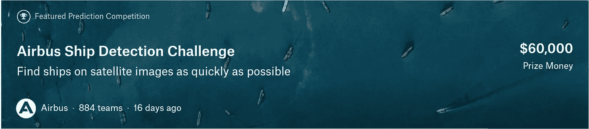

The challenge banner

在过去的三个月里，我参加了[空客船只探测卡格尔](https://www.kaggle.com/c/airbus-ship-detection)挑战赛。顾名思义，这是一项由[空中客车](http://www.intelligence-airbusds.com/satellite-data/)(其卫星数据部门)提出的检测计算机视觉([分割](https://en.wikipedia.org/wiki/Image_segmentation)更准确地说)竞赛，包括**在卫星图像**中检测船只。

在我开始这个挑战之前，我是(在某种程度上仍然是)细分领域的初学者。我很好地掌握了“经典”机器学习([梯度提升树](https://en.wikipedia.org/wiki/Gradient_boosting)，线性模型等等)，并将其用于生产，但深度学习对我来说仍然是一个新事物。

之前我写过一系列的博文解释和实现了使用 Keras 的 CNN(此处查看[此处](https://dsotb.quora.com) [)](https://dsotb.quora.com/) 并上过大 Coursera [深度学习赛道](https://www.coursera.org/specializations/deep-learning)系列。然而，我觉得我所学的缺乏实际应用。事实上，尽管有一些指导性的项目，但仅仅是课程并不能帮助你发展“现实世界”的技能。

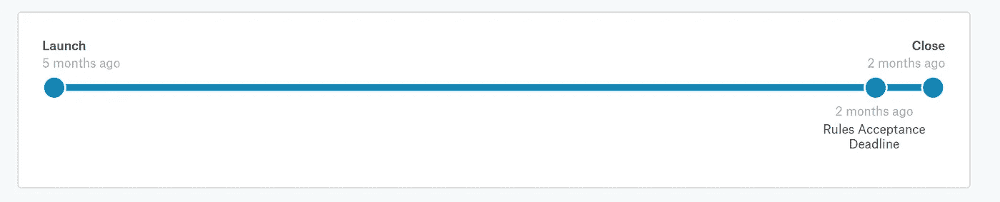

The competition’s timeline

那么，该怎么办呢？

我开始寻找“真实世界”的应用，因此，大约在 2018 年 3 月，我遇到了[数据科学碗 2018 Kaggle](https://www.kaggle.com/c/data-science-bowl-2018) 挑战。竞争在于检测细胞核。与空客挑战类似，这是一项实例细分任务。

当我发现这项挑战时，它已接近尾声(比赛于 2018 年 4 月 16 日结束)。因此，我关注了一些讨论，阅读并探索了一些模型，使用 [U-Net](https://arxiv.org/abs/1505.04597) 模型(及其变体)了解了许多关于细分的知识，但没有时间参与。

因此，当空中客车公司的挑战到来时，我更加兴奋，并为自己设定了以下目标:**训练一个细分模型，并根据该模型至少提交一份材料**。

我达到目标了吗？

是的，我做了，而且可能更多(你可以在读完这篇文章后自己决定)。

总的来说，这个过程是愉快的(至少大部分时间是这样)，我获得了很多实用的知识。接下来，我会和你分享我学到的一些经验(排名不分先后)。

让我们开始吧。

## 理解手头的任务

这当然是显而易见的，但并不是很多人关注的焦点(至少在他们开始的时候)。

尽管这听起来很明显，但每项任务都是不同的。许多比赛从远处看都很相似(例如卫星图像分割)，但细微的差异使得每项任务都很独特和困难(按照特定流程收集的数据、不平衡的数据集、不同的评估指标……)。

所以一定要理解任务，不要犹豫依靠社区来帮助你。

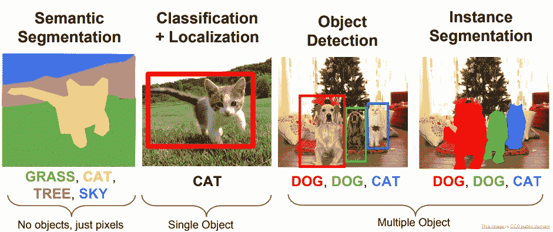

Various computer vision tasks (source: [http://cs231n.stanford.edu/slides/2018/cs231n_2018_lecture11.pdf](http://cs231n.stanford.edu/slides/2018/cs231n_2018_lecture11.pdf))

顺便说一句，如果你对计算机视觉世界和更精确的图像分割不熟悉，可以看看这些来自斯坦福大学 [CS231](http://cs231n.stanford.edu/) 课程的[幻灯片](http://cs231n.stanford.edu/slides/2018/cs231n_2018_lecture11.pdf)。

## 尽可能使用预先训练的模型

不要重新发明轮子或者在深度学习的情况下，不要从头重新学习所有的权重。

事实上，很多分段架构包含两部分:**一个编码器**和**一个解码器**。编码器通常使用在另一个数据集(例如 [ImageNet](http://image-net.org/) )上学习的预训练权重进行初始化。

使用这些权重来初始化您的模型也非常容易。查看以下示例:

在我忘记之前，非常感谢 [Pavel Yakubovskiy](https://github.com/qubvel) (和其他贡献者)的[分段模型](https://github.com/qubvel/segmentation_models)回购(注意它包含了比 U-net 更多的架构)。；)

## 投入一些时间构建一个可靠的架构，即不要只依赖笔记本电脑

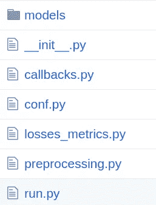

A partial view of my solution (source: [https://github.com/yassineAlouini/airbus_ship_detection](https://github.com/yassineAlouini/airbus_ship_detection))

许多 Kaggle 用户经常使用(或分叉)一个内核(Kaggle 的定制 [Jupyter](https://jupyter.org/) 笔记本实现)来发起一场竞赛。

这对于做 EDA(探索性数据分析)和感受竞争以及探索新想法是很好的。

然而，这并不能很好地扩展。

假设你想和一个同事合作(顶级竞争对手的常见做法)，整个代码库都在笔记本里。众所周知，笔记本很难协作，也很难进行版本控制(尽管有一些解决方案，如 [nbdime](https://github.com/jupyter/nbdime) )。

相反，我推荐以下更好的工作流程:

*   只保留用于 EDA 和可视化的笔记本
*   使用 git 进行版本控制
*   让你的代码模块化:一个文件用于数据预处理，一个用于建模，一个用于评估，一个用于运行管道，等等。

当你开始的时候，这些步骤会让你觉得有些多余，但是相信我，从长远来看是值得的。

这种方法的另一个好处是，你将发展更好的软件工程技能。这些都是就业市场上非常有价值的技能。事实上，你不仅想设计好的模型，还想学习如何有效地与其他同事合作，将模型投入生产，并确保它们的规模。

## 良好的数据扩充很重要

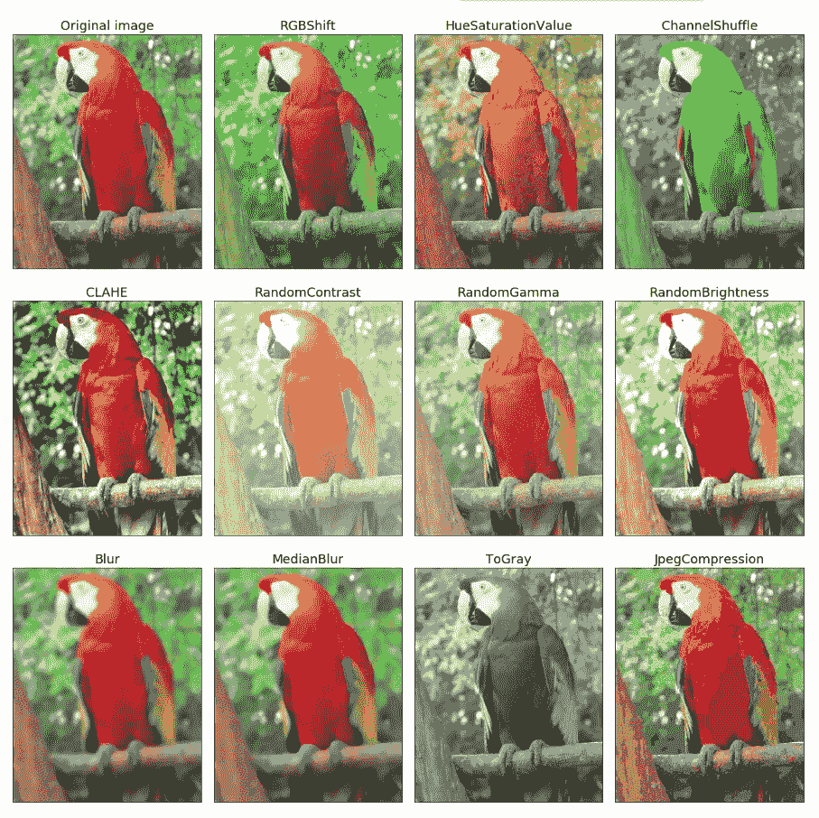

Example of image data augmentaion (source: [https://github.com/albu/albumentations](https://github.com/albu/albumentations))

在处理深度学习模型时，数据越多越好。事实上，在大多数的 ML 任务中，**获取更多的数据通常是昂贵的。**可以使用亚马逊的[机械土耳其](https://www.mturk.com/)(或类似的替代品)或使用专家标记(例如医学图像的医生)来手动完成。

幸运的是，由于数据增强，生成新图像更具可扩展性。这是避免[过度拟合](https://en.wikipedia.org/wiki/Overfitting)的一个很有价值的技巧。

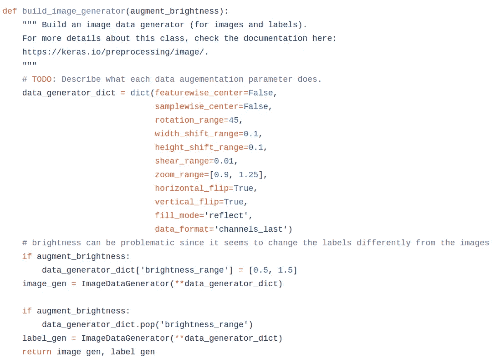

A sample of data augmentation using Keras (source: [https://github.com/yassineAlouini/airbus_ship_detection/blob/master/asd/preprocessing.py](https://github.com/yassineAlouini/airbus_ship_detection/blob/master/asd/preprocessing.py))

在这次挑战中，我使用了 Keras 的 [ImageDataGenerator](https://keras.io/preprocessing/image/) ，这是一种生成批量增强图像的非常简单的方法。

在挑战结束时，我发现了一个新的增强库:albumentations。我当时无法使用它，因为它更容易与 pytorch 集成，但计划在以后的挑战中尝试一下。检查[回购](https://github.com/albu/albumentations)和[纸张](https://arxiv.org/pdf/1809.06839.pdf)。它值得阅读和努力。

## 仪器和监控您的实验

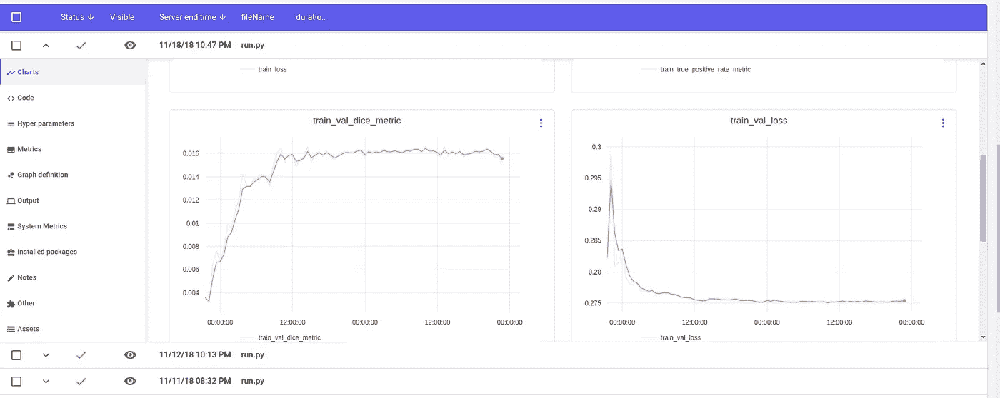

An example of a monitoring dashboard (using comet.ml)

你无法改善你无法衡量的东西(至少会更难)。

因此，花一些时间设置 ML 监控并组织好你将要进行的各种实验是一个好的实践。

幸运的是，有很多工具可以让你的生活更轻松。comet.ml 是一个很好的工具，如果你的代码是开源的，它有一个免费的计划。你可以在这里找到我的空客挑战赛仪表板。

## 探索预测

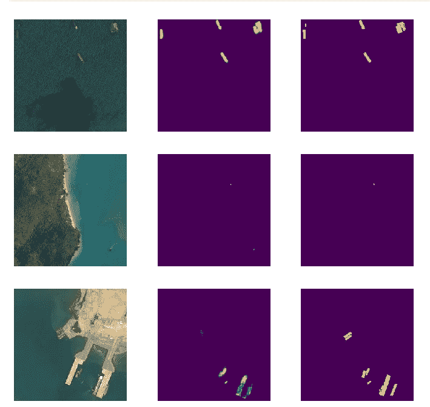

Predicted ships masks (source: [https://www.kaggle.com/iafoss/unet34-dice-0-87](https://www.kaggle.com/iafoss/unet34-dice-0-87))

好吧，让我们假设你已经编码了一个模型，训练了它，它在交叉验证数据集上给出了一个很好的分数。你该怎么办？

由于这是一场计算机视觉比赛，一件显而易见的事情是检查一些预测的分割。这将给你一种直觉，知道哪些可以改进(也许你的模型很难找到较小的船只或正确分割附近的船只)，以及你可以尝试哪些后处理技术。

## **投资好的硬件**

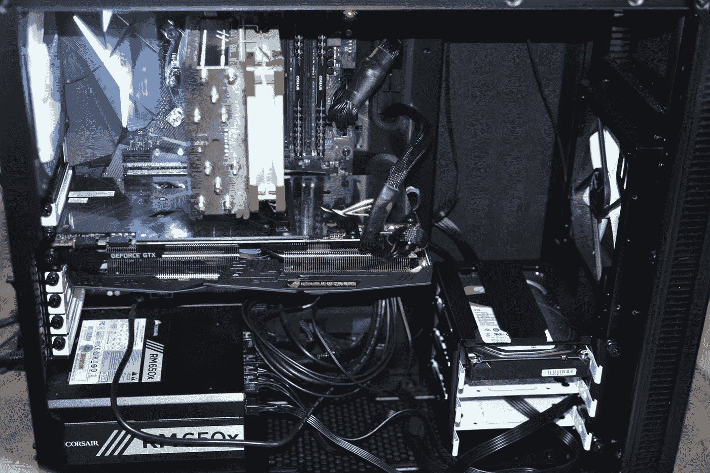

Build your own desktop if you can.

许多供应商使参加 ML 比赛比以前更容易。例如，谷歌和 Kaggle 提供免费的 GPU 笔记本电脑。因此，理论上，你只需要一个互联网连接和一台笔记本电脑。

也就是说，如果你对 Kaggle 竞赛(以及更广泛的 ML 实验)很认真，那么最好的投资就是构建你自己的桌面。如果你不擅长硬件，不要担心，我会帮你解决的。检查我的[建立](https://medium.com/@YassineAlouini/how-i-built-a-deep-learning-box-9dcbf284eab0)职位，我解释了整个过程。我还包括了一个部分，在那里我谈到了其他的选择。

## **选择一个合适的损耗**

您在模型中优化的内容有时与模型结构本身一样重要。

例如，对于分段任务，有几个变量:

*   骰子损失(是一减去[骰子系数](https://en.wikipedia.org/wiki/S%C3%B8rensen%E2%80%93Dice_coefficient)
*   Lovasz-softmax 损失
*   [焦](https://arxiv.org/abs/1708.02002)损
*   [交叉熵](https://en.wikipedia.org/wiki/Cross_entropy)损失(也称为对数损失)
*   [铰链](https://en.wikipedia.org/wiki/Hinge_loss)丢失
*   例如骰子和交叉熵的加权和(或其他组合)

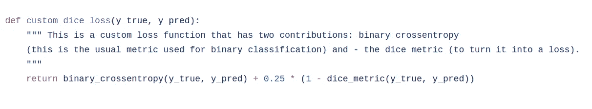

One of the losses I have tried (source: [https://github.com/yassineAlouini/airbus_ship_detection/blob/master/asd/losses_metrics.py](https://github.com/yassineAlouini/airbus_ship_detection/blob/master/asd/losses_metrics.py))

我最后尝试了骰子和交叉熵的加权和，以及焦点损失和骰子。

那么，选择哪一个呢？如果你熟悉计算机视觉任务和竞赛，你会有一种直觉，知道什么可能做得最好。

现在，如果您是新手(像我一样)，尝试各种方法，并选择一种在执行时间和交叉验证性能方面最有希望的方法。

最后，如果你不熟悉分类的损失函数，维基百科[页面](https://en.wikipedia.org/wiki/Loss_functions_for_classification)是一个很好的起点。

请注意，我正计划写一篇关于各种机器学习设置中的损失函数的更长的博文。所以请继续关注这方面的更多信息。；)

## 相信交叉验证

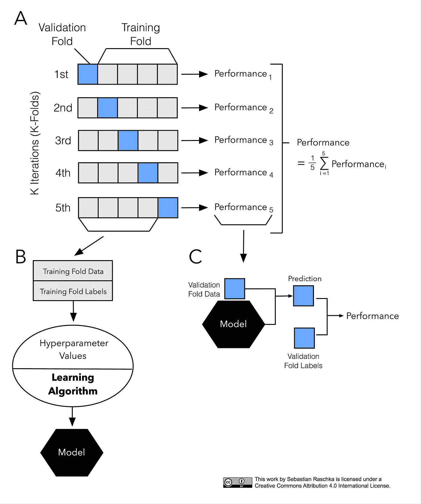

Trust the cross-validation (source: [https://sebastianraschka.com/blog/2016/model-evaluation-selection-part3.html](https://sebastianraschka.com/blog/2016/model-evaluation-selection-part3.html))

我怎么强调都不为过。这在 Kaggle 竞赛(否则你会[过度适应公共领导委员会](https://www.kaggle.com/caseyftw/overfitting-the-leaderboard))和“现实生活”机器学习模型中当然很重要。所以，抵制诱惑，提交在公共领导板上表现最好的模型，并选择交叉验证集中最好的一个。

## 理解数据很重要

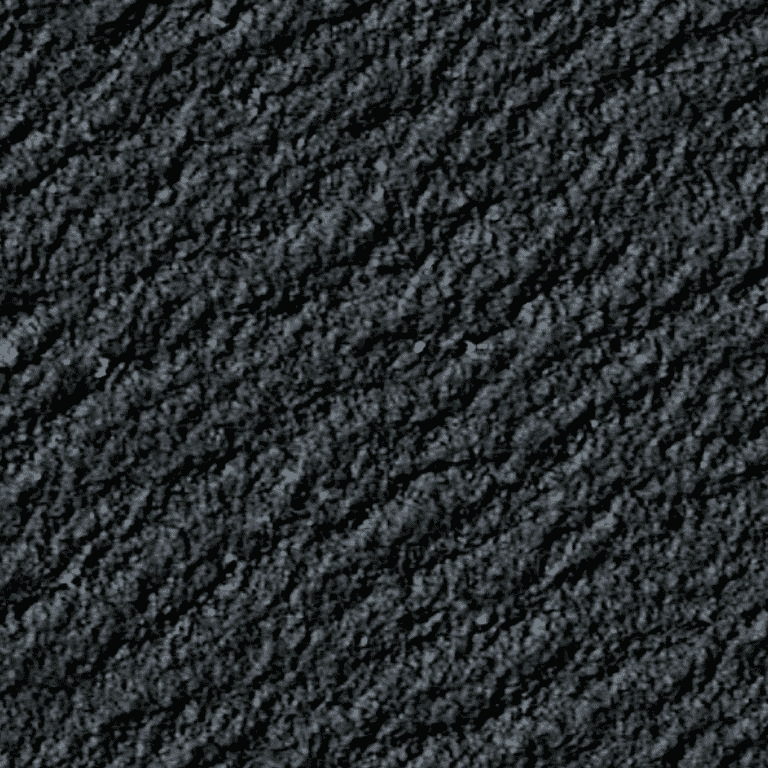

Is there a ship here or only waves?

数据不平衡吗？是不是很乱，需要很重的预处理？

这些问题对于决定你应该在哪些方面投入时间以及如何解决这个问题非常重要。

事实上，由于这场比赛中的数据非常不平衡(空海图像比有船的图像多得多)，一个聪明的解决方案是首先训练一个分类模型(无论是否有船)，然后在预测的有船图像上训练一个分割模型。查看这个[讨论](https://www.kaggle.com/c/airbus-ship-detection/discussion/71659)线程，寻找这样的解决方案。

## 向社区学习，尽你所能提供帮助

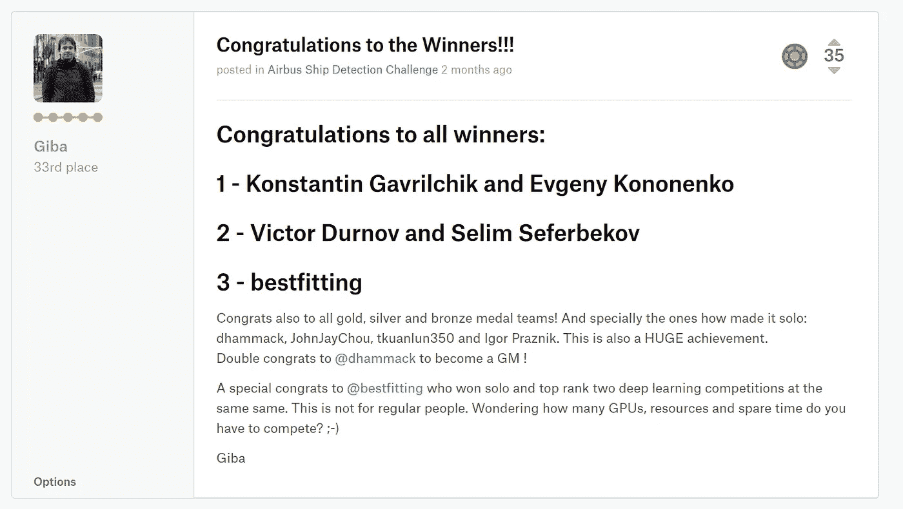

One day you could be here ;) (source: [https://www.kaggle.com/c/airbus-ship-detection/discussion/71591#422787](https://www.kaggle.com/c/airbus-ship-detection/discussion/71591#422787))

有一个巨大而有用的 Kaggle 社区，所以你可以利用它:如果你觉得有困难，就问问题，分享你所学到的，投票支持好的内核和帖子，并与竞争对手保持同步。这在这场比赛中尤为重要。事实上，一个数据泄露被[发现](https://www.kaggle.com/c/airbus-ship-detection/discussion/64355)，并与整个社区共享。最终[做出了](https://www.kaggle.com/c/airbus-ship-detection/discussion/64388)的修正，事情顺利地从那里恢复了。

## 堆叠和后处理，如果你是认真的 LB 分数

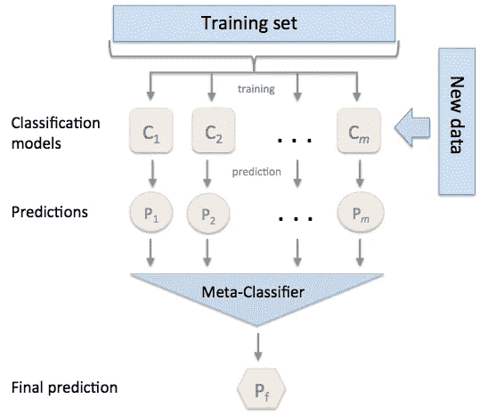

Stacking classifiers (source: [http://rasbt.github.io/mlxtend/user_guide/classifier/StackingClassifier/](http://rasbt.github.io/mlxtend/user_guide/classifier/StackingClassifier/))

许多最近获胜的解决方案(例如，查看此[讨论](https://www.kaggle.com/c/tgs-salt-identification-challenge/discussion/69291))是[堆叠](http://blog.kaggle.com/2016/12/27/a-kagglers-guide-to-model-stacking-in-practice/)模型(具有一层，有时两层或多层堆叠)。通常，它还与后处理技术相结合，因为这些在图像分割中非常重要。你可以在这个代码 [repo](https://github.com/ybabakhin/kaggle_salt_bes_phalanx) 中找到这些技术的一个很好的例子。

## 花费的时间很重要

每个竞争都伴随着新的变化和特定的问题:不同的评估指标、棘手的处理步骤、不平衡的数据、低质量的数据等等。

因此，不要期望很快得到“好”的结果(否则每个人都会这样做，竞争是不值得的)。相反，尽可能长时间地坚持比赛。不要很快灰心丧气(说起来容易做起来难)，要相信，经过足够的时间和努力，你最终会得到更好的结果(并且在某个时候，会取得胜利)。

## 尽情享受[心流](https://en.wikipedia.org/wiki/Flow_(psychology))

这应该是当然的一个重要方面。

试着平衡学习经历的乐趣和你的心流状态:逐步挑战自己，不要一开始就被所有事情压垮。

慢慢开始，随着你的进步逐渐增加。试着一次专注于一个方面，并有意识地努力改进你不擅长的领域。对我来说，这是图像预处理，增强，和后处理。给自己一点时间。

我希望你喜欢这篇文章，并获得新的见解。敬请期待下一期！