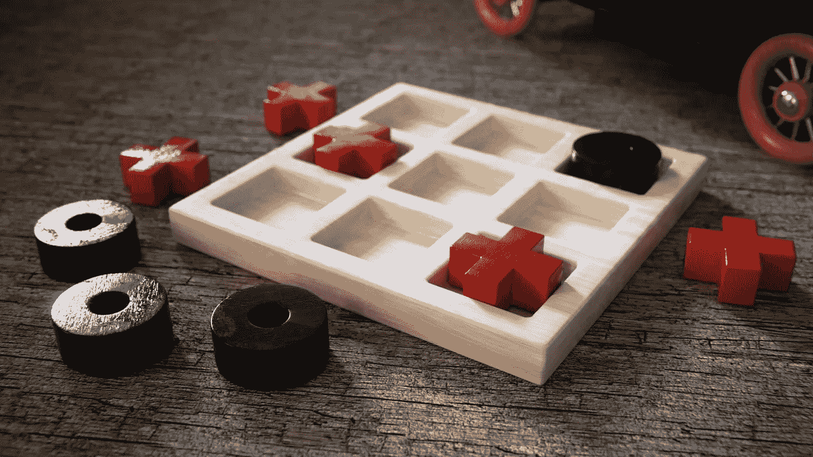

# 井字游戏的经验教训:实用强化学习技巧

> 原文：<https://towardsdatascience.com/lessons-learned-from-tic-tac-toe-practical-reinforcement-learning-tips-5cac654a45a8?source=collection_archive---------12----------------------->

## 回顾我在开发第一个强化学习代理时做错的所有事情，这样你就可以把它做对了

就在最近我发了一篇[介绍强化学习和深度 Q 网络](https://medium.com/@shakedzy/qrash-course-deep-q-networks-from-the-ground-up-1bbda41d3677)的帖子。但众所周知，理解理论和在现实世界中实际实施之间存在巨大差异。

我花了一段时间才找到对 DQN 来说有价值的第一次挑战。我看到的大多数教程都实现了一个 DQN +卷积网，并试图设计一个击败雅达利或末日游戏的代理。这似乎分散了注意力:我看不出浪费时间设计图像处理网络来解决强化问题有什么意义。这就是我选择井字游戏的原因:它相当简单，所以我可以在我的 MacBook 上训练它，因为我可以编写游戏代码，所以不需要图像处理，但它仍然需要策略设计才能获胜。

虽然我认为这将是直截了当和简单的，但我很快就意识到我错了——因此，我想描述一下我在解决这个挑战时学到的一些最重要的经验。顺便说一下，[的代码可以在我的 GitHub 页面](https://github.com/shakedzy/tic_tac_toe)找到。

# 1.把它分解成尽可能简单的任务

听起来很明显，这是我们偶尔都会忘记的事情。如果你读过我的[对 DQN](https://medium.com/@shakedzy/qrash-course-deep-q-networks-from-the-ground-up-1bbda41d3677) 的介绍，你可能记得我给了一个非常非常简单的游戏作为“Hello World”练习:一个需要填补空缺的代理(如果你还没有——别担心，我们很快就会回来)。这个练习不是我凭空想出来的。

当我决定实现井字游戏时，我坐下来一次写了几乎所有需要的代码:游戏类、玩家类、体验重放类、Q 网络类、双深度 Q 网络实现——然后推送 play。你猜怎么着？它什么也没学到。甚至不知道什么是有效或无效的移动，这是做任何事情的绝对基础。

现在去弄清楚是什么导致了这一切——是我代表各州的方式吗？这是超参数问题吗？代码有 bug 吗？如果有，在哪里？犯错误的可能性如此之多，却不知道从哪里开始。

所以我决定把它简化成我遇到的最简单的问题:代理能区分有效和无效的移动吗？然后，让我们训练一个代理，它只学习区分空缺和非空缺的位置。没别的了。这很快证明了自己，因为我能够隔离并修复我的网络实现中的几个 bug。然而，代理人拒绝学习。由于现在网络已经正确实施，我花了一段时间才意识到我错过了什么:

# 2.简单的任务只对你来说简单

如前所述，我给代理的*简单*任务是填充 4 单元板的所有空位。空单元格用“0”表示，填充单元格用“1”表示。你需要玩多少游戏才能理解其中的逻辑？可能不会太多。但你是人，而电脑不是。

Board representation. The second cell is filled, so a good action would be to choose any other cell

我认为几百个游戏应该足够了，但是事实证明我的实现需要大约 2500 个游戏来掌握这一点。事实证明，100-200 个游戏是不够的，成本几乎没有变化。更令人困惑的是，成本确实很低——但后来我发现，这是由于网络冷启动和培训次数不足([见我的实现](https://github.com/shakedzy/notebooks/tree/master/q_learning_and_dqn))。基本上，我没有给网络足够的培训来学习任何东西——因为我低估了代理人学习这些有多难。

底线——对我们人类来说似乎简单的东西对计算机来说可能一点也不简单(反之亦然——计算 147x819 需要多长时间？).将模型训练得更长。

# 3.如何(不)定义下一个状态

在这一点上，我能够回到井字游戏的挑战。网络在工作，代理在学习。我可以很容易地看到它挑选出哪些动作是有效的，哪些是无效的，当我检查它如何玩时，很明显它学会了如何赢——它连续三次的尝试非常明显，我很高兴——但不是太多。尽管它学到了什么，但很明显他没有注意到他的对手在做什么，也没有努力尝试阻止他的对手连续三次。无论我训练它多长时间，我给网络增加了多少层，或者我调整了多少超参数——都没有改变这一点。

我花了比我想象的更长的时间才意识到我做错了什么。这与我看到的几乎所有 DQN 代码都是单人游戏的事实有很大关系——我不知道如何处理多人游戏。只有当我发现[这个家伙的游戏实现](https://github.com/yanji84/tic-tac-toe-rl)时，我才明白我做错了什么——为此我必须解释我是如何设计这个游戏的。看看下面描述的游戏:

玩家 X 执行向奇数状态的转换，玩家 o 执行向偶数状态的转换。这正是我如何向模型的内存缓冲区添加记录的:如果 *s=0* 并且玩家 X 选择了左中间的单元格，那么 *s'=1* 。玩家 O 随后收到状态 *s=1* 并过渡到 *s=2* 。这是我添加到模型体验回放记忆中的两个单独的记录。

但是这意味着当轮到一个玩家玩的时候，他永远不会输。再来看 *s=3* :玩家 O 选择了中上单元格，过渡到 *s=4* 。他还没输。现在轮到玩家 X 了，他做出了显而易见的选择，并转换到 *s=5* ，然后赢了。直到现在，玩家 O 才知道他输了——因此，为了下一次有更好的判断，玩家 O 在 *s=5* 处收到的负奖励需要向后传播两个状态，直到 Q 值为 *s=3* 。理论上，由于贝尔曼方程的递归性和网络的反复训练，这应该不是问题。*理论上。*

实际上，这是行不通的——我认为有两个原因。第一个，也是更直观的一个，模型认为从 *s=3* 过渡到 *s=4* 没有风险，因为它*不知道*选择如何从 *s=4* 过渡的不是他。就模型所知，当处于 *s=4* 时，他可以简单地选择不同的动作，防止他失败。

一旦我意识到这一点，修复就很容易了——我所需要做的就是将下一个状态定义为玩家将看到的下一个棋盘表示——因此对于玩家 O，如果 *s=3* 并且动作是*顶部中间单元格*，那么*s’= 5*而不是*4*——现在模型可以知道这个动作将导致他输掉游戏。

第二个原因是什么？嗯—

# 4.请记住，网络只是一个近似值

在这个调试过程中，我检查了几次网络学习到的 Q 值，试图看看这是否有助于找到我做错了什么。我花了一段时间才意识到这毫无意义，我会解释原因。

这可能是一个回到我上面描述的[我的“填充板”例子的解决方案的好点。如果你看一下我在那里实现的 Q 表和 Q 网络算法，你可以看到我在测试它们时绘制了所有 Q 值的预测。表中的 Q 值是有意义的(尽管由于训练过程中“较少选择的道路”有时会有点偏差)，但 Q 网络预测值并非如此。这些和表格算法计算出来的完全没有关系。](https://github.com/shakedzy/notebooks/tree/master/q_learning_and_dqn)

仔细想想，这其实并不奇怪。请记住，网络只是一个*近似值*——你实际上要求它做的是预测最佳*行动*，这对应于它预测的最高 Q 值。想一想:你并不是真的要求网络学习*正确的 Q 值*，而只是要求最佳动作会有最高的预测值。这是两件完全不同的事情。当您记住成本函数在最小化时使用网络自己的预测时，网络无法预测正确的 Q 值就更有意义了-它没有可比较的基础事实。这是一个提醒:

Deep Q-Network cost function

我猜这里的关键信息是，虽然他们被称为*深度 Q 网络*，但 Q 值并不是他们实际学到的。令人困惑，但这就是生活。

# 最后的话

在发现新领域时，实现理论知识是最大的挑战之一。知道*如何工作*和*让它工作*是不一样的。我希望这篇文章能在你的强化学习和深度 Q 网络之旅中对你有所帮助，我也很乐意听到你在开发自己的算法时学到的经验教训。*让它发生。*

