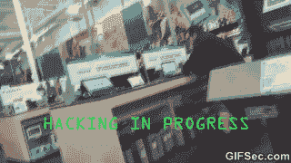

# 在一家非科技公司作为一名孤独的数据科学家实习的经验教训

> 原文：<https://towardsdatascience.com/lessons-learned-interning-as-a-lone-data-scientist-at-a-non-tech-corporate-b751dd79d8a8?source=collection_archive---------25----------------------->

Photo by [Noah Silliman](https://unsplash.com/@noahsilliman?utm_source=medium&utm_medium=referral) on [Unsplash](https://unsplash.com?utm_source=medium&utm_medium=referral)

对于我在 Medium 上的第一篇文章，我面临着两个可预见的老问题:“我应该写些什么？”以及“人们会觉得我写的东西有用吗？”。我觉得我最近在一家财富 500 强公司完成的实习，在那里我完成了一个面向产品的自然语言处理项目，为我提供了回答这两个问题的材料。

“我会写下我在一个如此流行的领域实习时学到的无数非技术性和技术性的东西，你不能改变睡姿而不迎头撞上一条相关的新闻。我有一个不寻常的视角，因为我独自在一家并非技术出身的公司工作。接下来，“对于对数据科学和 Medium 编程感兴趣的读者，我的帖子将提供一些参考点，如果这些读者走上与我相似的职业道路，会有什么样的期望。对于更倾向于其他行业/兴趣的人来说，尽管他们在睡梦中看到了“人工智能”和“机器学习”这两个术语，但感觉有一堵无形的墙阻止他们了解这些概念的日常实现是什么样子，我的帖子将试图在这面墙上打几个洞。

好吧，自我放纵的理由分类，这是我学到的:

## 1.问题构建和问题分解可能(而且经常)比编制解决方案更难

我可以感觉到经验丰富的数据科学家要么点头表示同意，要么对我所面临的问题的简单解决方案进行推理。不幸的是，考虑到就业立法，我无法真正记录我所处理的问题的本质，但我可以肯定地说，这比编写解决方案更让我夜不能寐。

一般来说，大公司的业务问题可能会跨越多个部门，每个部门都理所当然或错误地最关心与他们相关的后果。鉴于我实习期间的情况，提出一个问题公式，充分解决不同经理经常出现的分歧，证明是非常具有挑战性的。

现代劳动力变得专业化的程度进一步加剧了这种恰当的问题结构的困难。当问题是基于数据的时候，就像我的问题一样，很自然，不是每个部门的每个人都知道机器学习的能力和局限性。毕竟，这些人首先在他们自己的领域是熟练的，而机器学习毕竟是一个在最近 5 到 10 年才进入公众意识的领域。

经理可能会要求您做在广度或深度上超出当前可能(更有可能)的事情，或者要求不开发数据科学潜力的交付成果(不太可能)。

因此，为业务问题找到一个清晰的定义，并确定一个可实现的范围，比听起来要困难得多。做对了，你就成功了一半。弄错了，你会让冒名顶替综合症成为你最好的朋友。理想情况下，您应该为不同团队的经理提供他们在最终模型中寻求的解决方案，但我知道管理预期是一个巨大的挑战，作为一名数据科学家，我应该继续努力。

## 2.快速学习数据科学中的一个新的子领域是一项可以实现的重要技能

我开始实习的时候，只有不到一年的编程教育。在那段时间里，我从未见过一个关于自然语言处理的网页或演讲幻灯片。

在我第一天得知我将查看社交媒体文本数据后，走出办公室，你可以想象我当时惊慌失措的心情。我花了几个星期疯狂地试图理解简单问题的答案。NLP 的概述是什么样的？在 NLP 问题中，到底什么被认为是特征？我到底应该如何将文本转换成机器可读的输入呢？什么库是 NLP 任务中的主力？我以前学到的东西有适用的吗？

幸运的是，有很多资料和社区支持我选择的语言(Python ),数据科学家可以依赖。我从谷歌搜索和专门的编程网站学到了将近 90%我需要知道的东西。此外，我意识到强烈的滚雪球效应的存在。当你刚开始学习时，学习全新事物的惰性是最大的。但是当你让(雪)球滚动起来时，事情就变得容易了。

这并不等于说我确切地知道要找什么材料，在哪里找，这意味着

## 3.退出和重新启动经常发生

我花了很多精力去理解和学习 NLP 库。然而，我经常会在学习某个库的速成班中进行到一半，并在意识到由于这样或那样的原因它不能完全按照我想要的那样做之前做大量的笔记。我不得不重新开始做一些别的事情，这引起了很多沮丧的叫喊(下面会有更多)。我浏览了 NLTK(自然语言工具包，我所阅读的 NLP 库的 OG)、TextBlob 和 spaCy 等等。

导致我放弃我从一些库学到的大部分知识的问题包括:从一方面了解到 NLTK 不适合生产，到另一方面意识到 TextBlob 在我的特定问题上表现不佳。

退出和重启并不局限于学习图书馆这样的特定领域。它还扩展到更一般的任务；例如，仅仅理解 NLP 模型的流程就让我倒退了很多次。我是一名视觉学习者，看到一个流程的缩小视图以及一个步骤如何与另一个步骤相关联对我来说很重要。我经常会想“好吧，在花了几天时间之后，我终于明白了 C 和 D 的关系”。

然后我会意识到 C 和 D 实际上并不存在；它们只是占位符，以某种复杂的方式与 K 和 T 相关。我会放弃并重新开始，但是这些行为伴随着坚持，最终让我到达了我需要去的地方。

## 4.NLP 问题中的等级不平衡可能是慢性疼痛的来源

在分类问题中，当因变量中至少一个类别的数据点明显少于其他类别时，就会出现类别不平衡。假设我想根据“非垃圾邮件”和“垃圾邮件”对电子邮件进行分类。如果在我的训练数据中有 1000 个“非垃圾邮件”的例子和 100 个“垃圾邮件”的例子，这将是一个类别不平衡。

这种不平衡会对模型性能产生负面影响，但是当您的要素是数字时，处理这些不平衡通常不是什么大问题。您可以对多数类进行过采样，对少数类进行欠采样，甚至创建从现有数据中“学习”的合成数据点。

但是如果你的特征不是数字的，而是文本的，会发生什么呢？你创造了那些合成数据点吗？这是我发现自己面临的问题，但我正在处理社交媒体用户生成的文本，所以创建没有真正用户生成的人工数据点是不是“作弊”？我想是的。过采样和欠采样怎么办？当你的数据集很小的时候，这是不可能的。不幸的是，这就是我发现自己的处境。更不幸的是，对于这个问题，我还没有找到比“等待更多数据”更复杂的解决方案。

## 5.挫折是游戏的一部分，但意外的突破也是游戏的一部分

实习进行到一半的时候，一个朋友问我怎么样了。接下来，我无意中说出了一句意味深长的话(至少我的朋友是这么告诉我的):“10 天中有 7 天，我会用头撞墙。10 天中有 1 天，我试图爬过去，但却摔了个嘴啃泥。但在第九天，我设法跑过它，有时还绕着它跑。

Gif via [Giphy](https://giphy.com/gifs/funny-meme-hacker-eCqFYAVjjDksg)

这准确地描述了我的进步。我会花几个小时尝试做一些简单的事情，比如加载预先训练好的单词嵌入，但都失败了。我让我的终端经历了几天的绞肉机，试图通过更新和重装让特定版本的包和库(看看你，TensorFlow 和 Keras)一起工作。

我没有计算机科学背景，所以大多数时候，我不知道我从栈溢出中复制粘贴了什么。到最后，情况变得如此糟糕，以至于我的电脑不再把熊猫当成图书馆；我甚至不能加载我的数据。

我的救星是那些陈词滥调的淋浴顿悟时刻，就我所见，这在我看来是数据科学家中的一个普遍现象。我会在一段代码上工作到晚上，没有进展就辞职。第二天早上，我的手经常会自己动起来，神奇地做出有用的东西。也许我睡觉的时候，我的大脑在后台嗡嗡作响，重新整理信息。

关键是，突破几乎从未通过认知蛮力的应用来实现。我学会了耐心，并希望我的潜意识思维能拯救我，这种情况发生了很多次。

## 最终

回顾我实习之初的心态，我低估了数据科学家所承担的非技术责任的重要性。尽管如此，整件事仍是一次令人惊奇的经历，我希望继续在 Medium 上记录我在这个领域学到的东西。