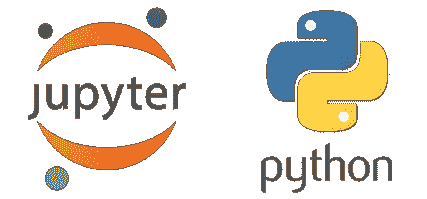
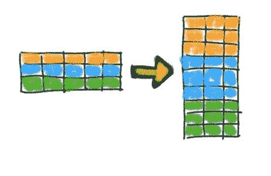

# 标记地标的经验教训(或者 Kaggle 如何踢我的屁股)

> 原文：<https://towardsdatascience.com/lessons-learned-labeling-landmarks-or-how-kaggle-kicked-my-butt-8cea2a5be2b8?source=collection_archive---------17----------------------->

One of the easier landmarks to identify among ~15,000 others.

到目前为止，我已经在这场 Kaggle 竞赛中苦干了大约 5 个月——这可以分解为大约 99%的精力用于构建、改进和调试我的数据管道，最后 1%用于深度学习模型本身。随着继续培训和优化我的模型变得成本高昂，我希望从我的经历中获得我所能获得的(阅读:证明几个月的努力和大约 200 美元的 AWS 账单)以及一个简短的教训列表，这些教训有望在下一个项目中为我(和你)节省一些时间和金钱。

( [Kaggle](http://kaggle.com/) ，对于不知道的人来说，是 Google 在 2017 年收购的一个数据科学竞赛平台，也是数据科学入门的绝佳资源)。

# 1.使用 GitHub

Octocat ❤ ([source](https://blog.continuum.cl/moving-all-your-bitbucket-repositories-to-github-373e80fd4022?gi=ef3892da55d1))

从一个真正令人震惊的开始！这个并不太令人兴奋，也不难实现。在项目期间，我的“版本控制”是将我的 EC2 实例的状态保存为 AWS 映像，并在下次我想从我离开的地方开始时简单地从该映像启动。老实说，这不是一个可怕的方法，尽管每个月都有几个额外的钱，除非我的图像被破坏或取消注册，否则我所有的工作都会丢失(这从未发生过，但我有几次接近了)。

但是 GitHub 提供的不仅仅是另一种保存更改的方式。Jupyter 笔记本在模块化或多代码路径方面并没有提供太多东西，所以我最终使用了“科学怪人”笔记本:分散在各处的注释块，决定运行什么和以什么方式运行的布尔变量，以及带有不知什么版本的各种方法的笔记本副本。一旦我过渡到 GitHub 的版本控制，我就能够使用新的分支进行实验，而不必担心保留我的工作代码。例如，在使我的模型过度适应数据子集以确保它正确训练时，我不再需要担心用“should_subset”变量添加额外的流；相反，我可以随心所欲地分支添加[:1]。

Because OF COURSE we all carefully read EVERY line of our code before we run it each time…

然而，Jupyter 也不能很好地使用 Git，也不能提供模块化，这就引出了我的下一课:

# 2.。操场的 ipynb，。py 代表真正的工作

Is it just me or does the Jupyter logo look like someone with orange slices in their mouth? ([source](https://www.twilio.com/blog/2017/10/basic-statistics-python-numpy-jupyter-notebook.html)).

这可能会引起争议，因为 Jupyter 似乎是用于研究目的的事实上的工具，但是当您将自己所有的代码都写在 Jupyter 笔记本上时，您就放弃了很多。Python 不仅为您提供了适当的 Git 集成(而 Jupyter 是……缺乏的),还允许您轻松地编写库或“模块”!这意味着无论你在哪里调用一个方法，它都可以来自同一个代码块，而 Jupyter 笔记本不能在笔记本之间轻松地共享代码。

仅仅使用 Jupyter 会导致多个笔记本上有大量复制粘贴的代码，这些代码需要与源代码保持同步——这不是您在试图追踪数据管道中的 bug 时想要的！

这并不是说 Jupyter 在 Kaggle 项目中没有一席之地——我肯定会继续使用它进行数据探索和可视化。但是我也会在我的主 Python 文件中定义大多数方法，并将它们导入到我的笔记本中——这样我就知道在笔记本中工作的代码也将在我的管道中工作。不管你怎么做，可视化每一步的数据都是非常重要的(提示 3…)

# 3.可视化您对数据执行的每个转换

MS Paint seems to be [this site’s](https://www.exceldashboardtemplates.com/friday-challenge-data-transformation/) visualization tool of choice.

我怎么强调都不为过。还记得我提到过试图追踪我管道中的一个 bug 吗？那是在大约一个月不知道它的存在之后，这是一个充满令人困惑的错误和糟糕结果的月份。在搜寻文档时，我看到了[这篇](https://hackernoon.com/how-tensorflows-tf-image-resize-stole-60-days-of-my-life-aba5eb093f35)文章，其中一个像素偏移花费了开发人员两个月的调试时间！

每次更改前后都要可视化数据，以确保操作按预期执行。如果是图像，就展示出来。如果是 CSV 数据，对汇总统计数据进行健全性检查，并确保替换 NaN 值。即使使用 NLP 数据，您也可以在词干前后打印文本，或者在 2D 或 3D 图上绘制[嵌入向量](https://www.analyticsvidhya.com/blog/2017/06/word-embeddings-count-word2veec/)。

Example of word embeddings reduced to 3D vectors. If instead, “man” is to “woman” as “king” is to “taco”, then you may have a bug to squash ([source](/word-embedding-with-word2vec-and-fasttext-a209c1d3e12c)).

这些小检查将为您节省大量调试时间，意味着您不必回头再做。另外，您可以将可视化代码保存在单独的 Jupyter 笔记本中，这样它就不会碍事了！

# 4.针对正确的指标进行优化

Not quite as intuitive as accuracy or MSE ([source](https://www.kaggle.com/c/landmark-recognition-challenge#evaluation)).

这可能是一个很大的要求，但仍然很重要。许多在线 ML(专业人士称之为机器学习)教程提供了加载数据和训练模型的代码，它们几乎总是使用内置的度量标准之一，如分类准确性或均方误差。但是，如果你试图在大脑扫描中检测肿瘤，而竞争值[回忆](https://en.wikipedia.org/wiki/Precision_and_recall)超过准确性(也就是说，你想尽可能多地抓住病例，以一些假阳性为代价)，那么准确性不会训练你的模型表现良好！

See? Deep learning as easy as Copy-Paste! ([source](https://keras.io/))

在开始处理数据之前，尤其是在开始处理模型之前，请务必查看竞争指标。有时一个标准指标就足够了，有时你不得不在一些随机的源代码文件中编写一个定制的目标函数，并且由于 Tensorflow 非常有趣的图形系统而遇到几乎无法诊断的错误(我的第一个 StackOverflow 帖子，遗憾的是没有得到答复)。

Wow, 3 whole upvotes! (Not going to [link](https://www.youtube.com/watch?v=dQw4w9WgXcQ) you to my embarrassing StackOverflow questions)

长话短说，当你甚至没有为正确的事情进行优化时，你不能指望挤掉数百个 ML 博士。

# 5.选择一个让你兴奋的比赛

When you learn coding just for the THRILLS ([source](https://media2.giphy.com/media/xTiTnnLkYTDWSOWSHK/giphy.gif?cid=790b76115ca02f066f5337625945797a))

这可能令人惊讶，但我的热情并不在于给历史地标的“业余”(蹩脚)智能手机图像贴上标签。随着我继续做这个项目，最初的兴趣消退了，我发现越来越难说服自己打开笔记本电脑，在上面多花几个小时。

与之形成鲜明对比的是，就在上周，我为一场办公室竞赛设计了一个快速行进的疯狂机器人；结果并不令人印象深刻(我在提交截止日期后的几个小时发现了一个 bug，但它就这样过去了),但我发现时间过得很快，像[深度工作](http://calnewport.com/books/deep-work/)的风格，即使是在一整天的编程工作之后。我会把这作为未来比赛的一个教训，甚至是关于 Kaggle 的个人笔记:在排行榜上有一个排名来展示你的劳动成果是很好的，但如果你不能找到一个保持参与和不断改进的理由，你就无法做到最好。

# 外卖食品

写连贯的英语显然比写代码更难。但你应该看到，虽然 Kaggle 在让数据科学变得简单方面做得很好，但专业人士正在发布最先进的分数，因为他们有坚实的基础和从许多失败中建立的直觉，其中许多我还没有遇到过。

试图自学数据科学和机器学习可能很残酷，但我也从未在任何其他领域看到更多的合作和高质量的免费资源。坚持下去！感谢阅读！

PS:如果有人想尝试一下[谷歌地标识别挑战赛](https://www.kaggle.com/c/landmark-recognition-challenge)，请查看[我的内核，下载数据集到 S3 的 TFRecord 文件](https://www.kaggle.com/elitcohen/dataset-to-tfrecords-in-s3)！

更多信息请关注我的 Twitter @Eli_password123！