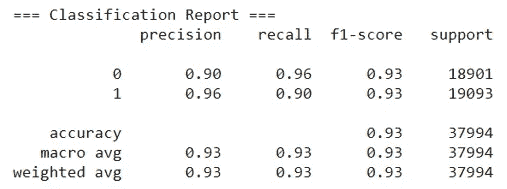

# 让我提醒你一下:在机器学习中，准确性不是一切。

> 原文：<https://towardsdatascience.com/let-me-recall-you-this-accuracy-isnt-everything-in-machine-learning-8e3a84ce0a8?source=collection_archive---------42----------------------->

## 为什么在评估你的机器学习模型时，回忆如此重要？

[source](https://foodsafetybrazil.org/recalls-de-alimentos-em-maio-um-por-iniciativa-da-empresa-outro-pela-anvisa/)

数据科学专业人士每天都在思考一件事:这个模型真的有效吗？数据就像一个活生生的生物，几乎每天都在变化和变得混乱。最后，我们想要的只是找到一种方法来处理它并做出好的预测，但是我们怎么知道我们的结果有多有价值呢？

嗯，最基本的事情之一是评估我们结果的成功率，或者说我们正确预测了多少测试数据。如果这个数字很高，理论上我们的模型做得很好。我们喜欢称这个值为**精度**。

起点是理解我们试图预测什么。它可以是一个数字，一个类，甚至是一个是/否问题的答案。了解这些之后，我们就可以定义评估性能的参数了。对于本文，我将使用一个模型来尝试预测客户在网上购物体验后留下的评论是好是坏，这是一个典型的分类问题，有两种可能的结果:

0 =不是好评论

1 =是好的评论

为了回答这个问题，我做了传统的步骤:数据清理和特征选择，然后我训练了几个模型，挑选了一个并试图改进它。你可以在我的 GitHub 上找到完整的项目，包括我使用的数据集，[在这里](https://github.com/lucasmoratof/customers_review_project)。

最初，我尝试了 3 种分类算法:KNN、随机森林和支持向量机(SVM)，使用了 [scikit-learn](https://scikit-learn.org/) 上提供的原生函数，并在每个模型上调整了一个参数。让我们来看看结果:

Source: author

让我们开始看看“F1 的准确性”一栏。在这里我们可以看到结果非常相似，每个都是 80%左右，这意味着从所有的预测来看，算法在 80%的时间里都是正确的，如果我们只有这些信息，这看起来很好。但是，当我们查看类“0”和“1”的召回时，这些值是完全不同的。但这意味着什么呢？

通俗地说，回忆列显示了一个模型在正确预测一个类的真实正面方面有多好。在上面的例子中，如果我们检查类别“0”的召回，在 KNN 算法中我们得到的值是 0.13。这意味着该模型只在 13%的时间里正确地分类了那个类。看起来很糟糕，确实如此！另一方面，我们可以观察到，类别“1”的召回率比类别“0”高得多，这推动了整体准确性的提高。

所以，在第一次尝试后，我选择了随机森林，因为它的召回率和准确率都比其他两种算法高。为了提高我的结果的质量，我使用了一些技术，如 [*上采样*](https://scikit-learn.org/stable/modules/generated/sklearn.utils.resample.html) 少数类，以及 G[*ridsearccv*](https://scikit-learn.org/stable/modules/generated/sklearn.model_selection.GridSearchCV.html)来调整三个超参数。我不会在本文中讨论这些细节，因为我将在后面写更多关于模型改进的内容。

最主要的一点是:成功了！让我们来看看我改进后的结果:

source: author

像以前一样，让我们从 F1 分数开始，它从 80%跃升到 93%，表明该模型预测的准确性更高。但是当我们查看召回时，特别是对于“0”类，它从 24%增加到 96%，这是一个相当好的改进，不是吗？现在，这两个类都有了更加稳定和可靠的结果，即使对于部署来说还不理想，它也提供了更多的提示，告诉我们如何让它更好地工作。

今天就到这里。精确度很好，但绝对不是评估机器学习性能的唯一参数。目标是强调回忆的意义和重要性，我希望这篇文章对任何学习数据科学魔力的人都有用！

## 资源:

维基百科，精确和召回。可在:[https://en.wikipedia.org/wiki/Precision_and_recall](https://en.wikipedia.org/wiki/Precision_and_recall)

GitHub 库:[https://github.com/lucasmoratof/customers_review_project](https://github.com/lucasmoratof/customers_review_project)