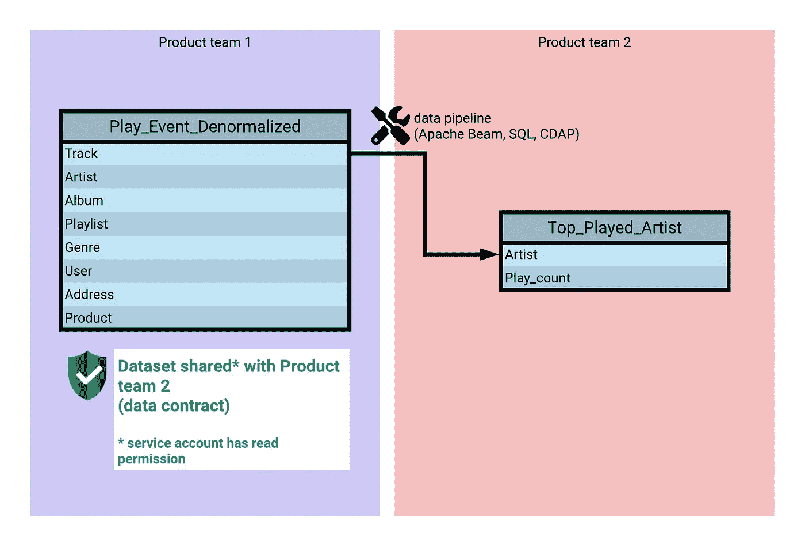

# 让孩子们进图书馆

> 原文：<https://towardsdatascience.com/let-the-kids-into-the-library-8ae59af7e3fc?source=collection_archive---------12----------------------->

## 在云中建立数据驱动型公司的固执尝试。

> 声明:在 Spotify 工作 5 年后，我现在在谷歌的云团队工作。观点是我自己的，而不是我过去或现在雇主的观点。

Photo by [bantersnaps](https://unsplash.com/@bantersnaps?utm_source=unsplash&utm_medium=referral&utm_content=creditCopyText) on [Unsplash](https://unsplash.com/?utm_source=unsplash&utm_medium=referral&utm_content=creditCopyText)

# 在云中建立数据驱动型公司的 10 个步骤

Photo by [Justin Wang](https://unsplash.com/@justinljwang?utm_source=unsplash&utm_medium=referral&utm_content=creditCopyText) on [Unsplash](https://unsplash.com/?utm_source=unsplash&utm_medium=referral&utm_content=creditCopyText)

一天，我订购了一个新的耳机，它到达时已经坏了。所以我联系了我购买它的公司要求一个新的。他们甚至没有要求照片证明，就寄给我一双新的。

起初，我认为一定有很多人欺骗他们的支持服务来免费获得第二个耳机。
但后来我意识到这家公司很可能是数据驱动型的。你是想投资解决 1%的边角案例，还是应该专注于 99%并改进你的产品？雇用一个支持团队来处理少数收到坏耳机的顾客，与不问问题就运送一副全新耳机相比，成本是多少？

能够像这样自信地做出数据驱动的决策，不仅能为您的公司节省时间和资金，还能带来许多其他好处，例如:

*   消除产品开发中的偏见。有多少产品因为某人有了一个伟大的想法而失败？
*   了解顾客想要什么。通过实验，您可以在趋势发生之前识别它们，并且更加主动。

> 在了解 [**【资料网】**](https://martinfowler.com/articles/data-monolith-to-mesh.html) 的概念之前，我写了这篇文章。下面给出的 10 个步骤可以看作是分布式域驱动架构的实现指南，由 Zhamak Dehghani 描述。

# 1.改变比工具更重要

**突发新闻:选择更快的数据仓库不会让您的公司更加数据驱动。**

许多公司往往天真地认为，开始将所有数据推送到云、下一代数据仓库就足够了，奇迹就会开始发生。虽然更快的洞察途径是必要的(因为没有人愿意等待 4 个小时来完成一个查询)，但这是不够的。**更重要的是不同的团队在做出数据驱动的决策时如何合作。**阅读[【Spotify 上的 DIBB 框架】](https://blog.crisp.se/2016/06/08/henrikkniberg/spotify-rhythm)。

这就是为什么在评估云数据仓库时，您不应该将所有精力都放在运行速度最快的基准测试上。相反，您应该评估:

*   发现、共享、复制、转换数据集的难易程度，以及是否支持列表一致性或高并发性等关键协作特性。
*   获取数据是多么容易。例如，如果您必须安装一个 native client，打开一个防火墙端口，连接到不同的实例…或者如果所有数据都可以通过一个简单的 URL 并从同一个 API 安全地访问。[【beyond corp 研究论文】](https://cloud.google.com/beyondcorp/)。
*   随着数据的增长和时间的推移，扩展有多容易。因为如果你不得不继续依赖基础设施团队来扩展你的集群，它最终会成为一个瓶颈。因此，请确保诸如重新集群和 vacuum 之类的维护任务得到完全管理或毫不费力，并确保新的数据仓库将以无服务器的方式满足您未来的需求。
    就这一点而言，大数据格局每 6 个月都会发生或多或少的变化，所以选择一个盟友[【持续创新】](https://cloud.google.com/bigquery/docs/release-notes)，这样你就不会以构建明天的遗产而告终。

# 2.从数据基础架构到数据运营

30 年的建筑应用可以简单地总结如下:

[【单片应用】](https://en.wikipedia.org/wiki/Monolithic_application) = > [【多层架构】](https://en.wikipedia.org/wiki/Multitier_architecture) = > [【微服务】](https://en.wikipedia.org/wiki/Microservices)

没有理由为什么同样的变化不能应用于数据工程。DevOps 原则毕竟不是软件工程独有的。
贵公司是否仍有基础设施团队维护和调整您的数据仓库？你所有的分析仍然是集中的吗，就像软件开发过去集中在大型计算机上一样？是时候让数据跟随微服务革命了！

但是，请不要马上解雇您的基础架构团队。这个团队的自然发展是让他们向上移动，开始成为一个**数据运营**团队。[【为什么做 data ops】](https://www.datakitchen.io/blog/dataops/2019/10/07/Why-Do-DataOps.html)。为了避免孤立的实现，您的公司将需要他们有价值的工作来引导数据工程堆栈朝着正确的方向发展。正如开发人员所倡导的那样，他们的新使命是让其他团队在他们的数据之旅中取得成功，例如通过构建公司特定的框架(这就是[【Scio】](https://github.com/spotify/scio)在 Spotify 诞生的方式)、模板或测试工具。他们应该拥有不同的自助服务工具，供数据工程师用于 CI/CD、数据治理、数据访问和匿名化、编排、计划和事件交付。

如下图所示，该团队的一些数据工程师也可以嵌入其他产品领域，以便在您组织的不同部门教授和提升数据专业知识。
数据分析不再是一个团队的工作，它应该是所有团队都可以自主完成的事情**它应该是用例驱动的**。
每个产品领域应该能够定义和跟踪他们的关键指标，例如，MAU(每月活跃用户)，以便他们能够迭代和改进他们正在发布的功能。

就像一些公司[【决定不要首席技术官】](https://www.quora.com/Why-is-there-no-CTO-for-Google)一样，你应该质疑在你的公司里雇佣一个分析/数据(科学)主管是否有意义，或者相反，数据应该是一个分布在不同任务中的专业领域，以遵循[【康威定律】](https://en.wikipedia.org/wiki/Conway%27s_law)。

# 3.降低壁垒

现在，您的公司可能只有一个人手不足的数据分析团队，他们以一种漂亮的星形模式仔细分类您的所有数据，就像一位老图书管理员会仔细整理和分类他所有的书籍一样。

如果你想让你的公司转型，变得更加数据驱动，**你必须让孩子们进入图书馆**。通过这个类比，我的意思是:让你的所有员工，而不仅仅是数据专家，访问数据。这个概念并不新鲜，也被称为**数据民主化**。

没有人应该再拥有数据仓库，它应该是多租户的。数据应该属于它所源自的不同产品领域，因为这些团队拥有可以确认数据确实正确的业务逻辑。

数据运营团队应该提供工具来降低所有员工的门槛，而不仅仅是 Java 或 Python 开发人员。

*   ETL/ELT 应该对每个人来说都很容易做到，也许是通过 SQL 而不是 Java，也许是使用一个具有拖放界面的数据集成工具，例如[【CDAP】](https://cdap.io)或[【马蒂利翁】](https://www.matillion.com)。
*   确保容易采用机器学习。现在，您可以使用 AutoML 产品或直接用 SQL 编写 ML 来获得很好的结果。[【大查询 ML】](https://cloud.google.com/bigquery-ml/docs/)。当然，如果你的 ML 专家想要培训和部署定制模型，也应该是可能的。看看[【kube flow】](https://www.kubeflow.org)也许吧。

参考资料:

*   以安全的方式实现数据分析、可视化和机器学习的民主化是重中之重[【对于 Twitter 的数据平台团队】](https://blog.twitter.com/engineering/en_us/topics/infrastructure/2019/democratizing-data-analysis-with-google-bigquery.html)。
*   观看[【来自 Spotify 的此番谈话】](https://youtu.be/5aBORQim-KM?t=2290)关于“降低摩擦”，透露 25%(！！)的员工现在使用数据仓库。

# 4.关于这个语义层

一开始，拥有一个语义层似乎是一个好主意，这样孩子们就知道去图书馆哪里找到他们最喜欢的书。
在遗留数据仓库中，数据通常被建模为数据仓库或 Kimball 星型模式，以支持语义层。但是这些方法现在已经[【25-30 岁】](https://archive.org/details/datawarehousetoo00kimb_0)如果说 NoSQL 的崛起已经扰乱了数据建模一次，那么大数据和云可能是标准化数据模型的又一枚钉子。
事实是，维护一个对公司每个人都有意义并且每个人都容易查询的总体语义层真的很难。随着时间的推移，这种语义层甚至有可能因为缺乏灵活性而降低您的分析速度。

为了说明这一点，我们举一个例子，定义一个语义层来表示 Spotify 这样的应用程序，见下文。

给定这个简化的雪花图式，下面是一个请求示例:给我 2018 年在瑞典演奏的前 10 名艺术家。
数据模型应该允许这样的查询，而不必在复杂且容易出错的查询中连接 5 或 6 个表，这样的查询最终会扫描整个数据集。**您所做的查询应该定义您的数据模型**。

对于不擅长编写 SQL 查询的人来说，从生成的<top_played_artist>表中找到前 10 名艺术家不是更容易吗？</top_played_artist>

为了实现真正的数据驱动，你必须**释放数据**，让不同的团队随心所欲地复制粘贴、构建管道和分割数据，以解决他们的问题，而不是强迫他们根据通用的语义法则格式化数据。
这就是**数据契约**发挥作用的地方。

> 请注意，我并没有完全放弃保留语义层的想法。如果你不知道你在找什么，它会很有用。对于 BI 仪表板中的数据探索，表示不同数据点集合在一起的语义层是有意义的。但是它应该被定义为一个逻辑层，而不是在物理表上强制任何特定的模式。[【LookML】](https://looker.com/platform/data-modeling)。

补充阅读:
[【Kimball 维度建模在现代数据仓库中是否仍然相关？]](https://discourse.getdbt.com/t/is-kimball-dimensional-modeling-still-relevant-in-a-modern-data-warehouse/225/5)

# 5.数据契约

你可以说是[【API 指令】](https://techcrunch.com/2016/07/02/andy-jassys-brief-history-of-the-genesis-of-aws/)改变了亚马逊，诞生了 AWS。我相信，如果你想建立一个数据驱动的公司，你应该考虑采用类似的原则，并像对待 API 端点一样对待数据。您的开发 ETL/ELT 管道的团队应该开始使用数据契约进行交流，通过[【SLOs】](https://en.wikipedia.org/wiki/Service-level_objective)进行衡量。

回到我们上面的前 10 名艺术家的例子，这里有一个使用数据契约解决这个问题的典型过程:

1.  首先，我们不要多此一举。也许另一个团队已经创建了一个数据端点(=共享数据集)，可以解决我们的问题。在你的[【数据目录】](https://cloud.google.com/data-catalog/)里找吧。
2.  如果没有找到现有的数据集，去和拥有计算前 10 名艺术家所需数据的团队谈谈。如果多个团队都有这个数据，找到**真相来源**。两个选项:

a)查看公司数据谱系，事实的来源可能是起点(最上游的数据集)。通常，它是来自 OLTP 系统的数据转储或[【CDC】](https://en.wikipedia.org/wiki/Change_data_capture)。
*不用说:不要把你的数据管道直接连接到他们的 OLTP 系统。*

b)查看数据治理元数据标记，可能有一个(下游)数据集被提升为真实的来源。
这被称为 **MDM(主数据管理)**，如果你正在转向 BigQuery，我推荐关于这个主题的[【这篇优秀的读物】](https://cloud.google.com/solutions/migration/dw2bq/dw-bq-data-governance#master_data_management)。

3.一旦你找到要交谈的团队，就数据契约达成一致，并让他们为你公开一个数据端点，就像你在两个团队之间构建一个松散耦合的微服务架构一样。

如果上面的团队 2 不精通数据工程，也许团队 1 可以计算前 10 名艺术家，并在数据集中公开，或者你可能同意另一个团队 3 为公司的其他人做这件事。

这个数据契约是关于数据模式和服务级别目标的协议:可用性、响应时间、质量等。通过相互交谈，两个团队知道他们已经创建了这个链接，如果需要更新，他们将必须就新的合同达成一致。这个契约确保了这个实现不会在几个月后雇佣新的工程师时变成一个过时的依赖。

你可能已经发现我们**反规格化了**我们的雪花模式。为了使查询更简单，我们牺牲了一些一致性和存储空间。没有更复杂的语义层来容纳两个团队。SQL 初学者现在可以编写查询。

最佳实践是对您的模式进行版本化，并将它们上传到您在数据契约文档中引用的公司**模式注册中心**中。

# 6.放护栏，以后再关心成本

Photo by [Dominik QN](https://unsplash.com/@dominik_qn?utm_source=unsplash&utm_medium=referral&utm_content=creditCopyText) on [Unsplash](https://unsplash.com/@dominik_qn?utm_source=unsplash&utm_medium=referral&utm_content=creditCopyText)

您不应该回避使用上述数据契约方法复制数据。云中的存储很便宜，你只需为你使用的东西付费，如果成本成为一个问题，你可以调整旋钮。

尝试在云中使用星型架构*来优化存储空间，就像在连接到互联网时关心使用哪种 TCP 变体一样，这在 90 年代很有趣。相反，把你的工程时间花在[【夸张】](https://en.wikipedia.org/wiki/Over-the-top_media_services)用例上。现在，您不再受以前数据中心容量的限制，可以开始接收更多日志和数据了。如果由于数据驱动的决策，您可以获得 100 倍的额外收入，那么花 1000 美元购买存储是完全可以的。

*在发明列存储之前，星型模式曾经是压缩事实表的好主意:)

# 7.数据大学

Photo by [Vasily Koloda](https://unsplash.com/@napr0tiv?utm_source=unsplash&utm_medium=referral&utm_content=creditCopyText) on [Unsplash](https://unsplash.com/?utm_source=unsplash&utm_medium=referral&utm_content=creditCopyText)

将一些软件/后端工程师转变为数据工程师，并运行一个内部[【数据大学】](https://medium.com/airbnb-engineering/how-airbnb-democratizes-data-science-with-data-university-3eccc71e073a)项目！

使用像 Apache Beam 这样的框架，如果您是一名懂 Java 或 Python 的软件开发人员，您应该能够很快学会如何创建您的第一个数据管道。

# 8.数据质量不是可选的

[【不正确的数据比没有数据更糟糕】](https://medium.com/@tdelazzari/allow-me-to-clarify-why-i-stated-incorrect-data-is-worse-than-no-data-i-had-in-mind-alphago-zero-9454e168a9b0)。为了确保数据质量，您可以:

*   培养质量第一的心态，委托你的数据工程师去测试他们正在做的事情。这可能比雇佣一个专门的 QA 测试团队更有效。游戏化可以鼓励正确的行为。例如:为数据管道引入不同级别的测试认证，当你升级时有一个奖励系统。在 Spotify 上阅读关于[【TC4D】](https://labs.spotify.com/2017/10/17/tc4d-data-quality-by-engineers-for-engineers/)的内容。
*   将您的业务流程分解成多个工作流程。既然您让不同的产品团队开发他们自己的数据管道，他们将需要某种编排工具，如[【气流】](https://airflow.apache.org)。如果出现问题，需要重新处理数据，Airflow 可以重试或回填给定的工作流。
    能够将计算追溯到物化的东西通常是至关重要的，并且气流还可以绘制不同转换步骤的谱系(上游输入&下游输出)。
    [【dbt】](https://www.getdbt.com)或[【data form】](https://dataform.co)可能是另一种选择，如果您的管道都是用 SQL 编写的(或者您可以将它与 Airflow 结合使用)。

*   创建一个存储生产数据副本的测试环境，以便您可以运行验收测试。实施 DevOps 支柱，如 CI/CD(运行您构建的内容)、代码评审、[【基础设施即代码】](https://cloud.google.com/blog/products/data-analytics/introducing-the-bigquery-terraform-module) …
*   验证您选择的工具是否包含某种测试框架。比如:如果你所有的管道都是用 SQL 写的，或者都是用图形用户界面实现的，那你怎么写测试呢？下面是一个用 SQL 编写的[【简单上游健康检查】](https://github.com/GoogleCloudPlatform/training-data-analyst/blob/master/blogs/bqblog/2019-10/simple_healthcheck.md)的例子。
*   在 Stackdriver 或 Grafana 中设置监控。在不符合 SLO 的情况下发送警报。这里有几件你可以监控的事情:
    ——数据是否按时交付？例如:在每日分区中每天上午 8 点。
    -数据完整吗？使用[【数据计数器】](https://beam.apache.org/releases/javadoc/2.15.0/org/apache/beam/sdk/metrics/Metrics.html)。
    -数据是否正确？它必须根据数据协定中约定的模式进行格式化。
    -数据一致吗？运行一些端到端的测试，检查不同系统的数据是否意味着相同的事情，否则船可能会沉。

*   尽量避免突变(DML)为了避免副作用，保留你的原始文件(ELT 而不是 ETL)，对你所有的表进行分区，保持你的任务“纯净”，就像[【功能数据工程】](https://medium.com/@maximebeauchemin/functional-data-engineering-a-modern-paradigm-for-batch-data-processing-2327ec32c42a)指南中描述的那样。

参考:[【Spotify 如何解决数据质量】](https://www.youtube.com/watch?v=Kw4bvxkcCN8)

# 9.建立一些控制

通过让孩子进入图书馆，你实际上制造了混乱:)
数据治理是拼图中的重要一块，为这种混乱带来一点秩序。因此，制定一些规则是很重要的；由您新组建的数据运营团队撰写的黄金路径。让您的数据工程师成为这一转变的向导。
到处都是数据契约，就像微服务一样，这是一个大混乱，直到你带来类似[【Istio】](https://istio.io)的东西。
如果你存储个人信息，需要匿名，如果你打开了数据仓库的大门，数据到处都是，你怎么办？这可能是一个很好的解决方案:[【加密删除】](https://medium.com/google-cloud/bigquery-encryption-functions-part-i-data-deletion-retention-with-crypto-shredding-7085ecf6e53f)。

关于这个主题的一些最后的建议:启用审计日志，为您的数据设置一个保留期，使用[【最小特权原则】](https://en.wikipedia.org/wiki/Principle_of_least_privilege)并实现[【ITGCs】](https://en.wikipedia.org/wiki/ITGC)。

# 10.发现新数据

**你知道谷歌照片和 Spotify 有什么共同点吗？它们都非常适合发现新照片和音乐！几年前，当第一批数码照片和 MP3 文件开始出现时，我们当时使用的应用程序反映了我们以前制作相册和制作混音带的非数码习惯。**

这是因为[(正如埃隆·马斯克解释的)](https://youtu.be/NV3sBlRgzTI)，用类比推理比从基本原则推理更容易。
当迁移到云时，你必须抓住机会，消除所有现有的偏见和已知的限制。直到你到了一个什么都不能推断的地步。你回到了基本原则，你可以开始构建一个新的更好的解决方案。这种思维模式最终被 Google Photos 和 Spotify 应用到了他们的产品开发中，为生活带来了新的数字体验:我们现在不再对照片进行分类，而是将所有东西上传到云端，因为我们每天给孩子拍 500 张照片，但没有时间对它们进行分类。我们让 Spotify 根据我们的心情推荐歌曲，而不是听一两个播放列表。

获取无限的照片和音乐改变了我们的习惯。我们可以说，数据也在发生同样的转变。公司正在存储越来越多的数据，运行 A/B 测试，发布 canary 并比较关键指标，以验证他们的选择。过去，你必须仔细分类并删除冗余数据，否则你的数据仓库会很快填满。如今，这已经不重要了，就像谷歌照片和 Spotify 一样，你应该彻底改变处理数据的方式，专注于发现。

Photo by [Aaron Burden](https://unsplash.com/@aaronburden?utm_source=unsplash&utm_medium=referral&utm_content=creditCopyText) on [Unsplash](https://unsplash.com/?utm_source=unsplash&utm_medium=referral&utm_content=creditCopyText)

感谢阅读！
随时在 Twitter 上联系 [@tdelazzari](https://twitter.com/tdelazzari)