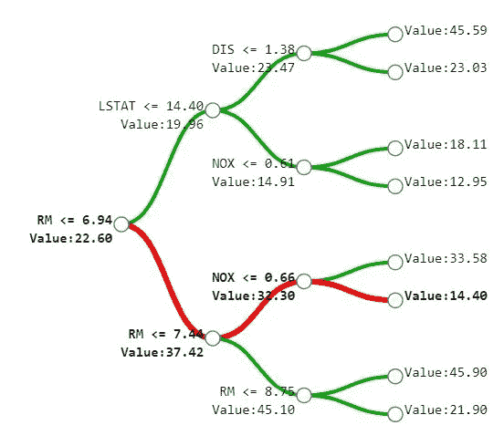

# 让我们将机器学习应用于行为经济学

> 原文：<https://towardsdatascience.com/lets-apply-machine-learning-in-behavioral-economics-eb952d0f2300?source=collection_archive---------10----------------------->

Photo by [Headway](https://unsplash.com/@headwayio?utm_source=medium&utm_medium=referral) on [Unsplash](https://unsplash.com?utm_source=medium&utm_medium=referral)

目前，机器学习(ML)在行为经济学或社会科学中没有得到很好的应用，这种缺乏使用来自于对这种不同方法的不熟悉。然而，随着时间的推移，随着机器学习成长起来的一代科学家将进入社会科学，并产生这些技术在计算机视觉中产生的影响。

机器学习和行为经济学之间的互动可以是互利的。一方面，ML 可以用来挖掘大量的数据，并找到促成不同行为出现的行为类型变量。另一方面，嵌入用于识别偏差和错误假设的 ML 算法将达到更高的性能。本文旨在为最先提到的最大似然法在行为经济学研究中的应用提供一种意义，即识别在塑造人们行为中起重要作用的变量。更具体地说，这篇文章简单解释了随机森林和梯度推进机等 ML 技术如何帮助行为经济学或社会心理学等相关领域的研究。

行为经济学是一个研究领域，它研究心理、认知、情感、文化和社会因素对人类决策的影响，以及这些决策如何偏离理性思维所隐含的决策。换句话说，人类不会被认为是足够理性的主体，心理变量和环境将被强调为人类决策的基本决定因素。这种方法有助于更好地预测人类行为，在某些情况下，理性思维存在方向性偏差，允许设计微调政策来改善人们的决策。

正如丹尼尔·卡内曼在他的优秀著作《思考，快与慢》中所说:“*我们(人类)是模式的追寻者。*“为了理解这些模式，行为经济学家在分析人们的行为时考虑了个人的心理特征和背景。然而，很难大规模地应用这种基于个人和环境的方法。机器学习可以通过检测模式并在大量数据中搜索对形成模式有影响的变量来显著解决这一挑战。

机器学习通常是关于模式识别的，它有助于自动检测数据中的模式，然后使用检测到的模式作为预测未来行动的工具。然而，对最大似然法的关注主要集中在它的预测能力上，而对它的解释能力关注较少。例如，虽然使用 ML 可以更准确和更早地诊断癌症是非常有益的，但是 ML 可以提供的更重要的东西是关于在增加癌症风险中具有更大权重的变量的洞察力。这一知识有助于研究人员和决策者更好地控制这些变量，降低癌症风险。换句话说，最大似然法不仅给了我们对目标变量的预测能力，也给了我们发现哪些输入变量在预测目标变量时更重要的知识。

为了了解 ML 在行为经济学中的应用是如何工作的，让我们来看看决策树模型，这是一个机器学习算法家族，从对一个项目的观察到关于该项目的目标值的结论。这种模型的一种形式称为分类树，其中目标变量具有一组离散的值。在这些模型中，树的分支代表输入变量的合取，这些合取导致代表目标变量的类标签的叶子。另一种决策树模型是回归树，其中目标变量具有连续值。使用决策树集成来达到高预测准确度的两个著名模型是随机森林和梯度推进机。这些基于决策树的算法的目标是建立一个模型，该模型基于几个输入变量来预测目标变量的值。这些模型的重要方面是这些模型中输入变量的数量没有限制。换句话说，他们不太担心维数灾难。

使用这些技术建立模型和进行解释的一般步骤如下:首先，数据被分成两组，一组是训练数据，其通常包括建立模型所基于的大部分数据，另一组是测试数据，通过该测试数据来验证模型。在基于训练和测试数据创建最有效的模型之后，我们将达到可以预测数据中观察到的行为的模型。这个模型现在给我们知识来识别对目标变量的预测有最大贡献的变量。数据分析中的这一过程被称为特征重要性。例如，如果我们有关于大量观察的数百个输入数据，包括个人和背景相关的变量，通过使用这种方法，我们可以发现哪些变量在引导人们表现出不同行为方面是至关重要的。

Figure 1: Decision tree path (source: [http://blog.datadive.net/interpreting-random-forests/](http://blog.datadive.net/interpreting-random-forests/))

这些模型也提供了局部解释的可能性。换句话说，我们可以了解在每个单独的预测中最重要的顶级输入变量。例如，两个人可能出于完全不同的原因表现出相同的行为。因此，查看对某一特定行为的每个预测，并对最能解释该行为的变量进行分组，将有助于我们了解哪些特征对驱动该行为更有影响。这种可能性是由基于决策树的模型的性质决定的，在这种模型中，从分支到每片树叶都有一条特定的路径，代表每个观察的目标值(图 1)。因此，机器学习的这些强大能力不仅解决了数据规模的挑战，还使我们能够在数千或数百万人口中为一个人匹配正确的政策。换句话说，机器学习使得在正确的环境下将正确的轻推瞄准正确的人成为可能。

**领英:**【https://www.linkedin.com/in/atanehkar/】T2