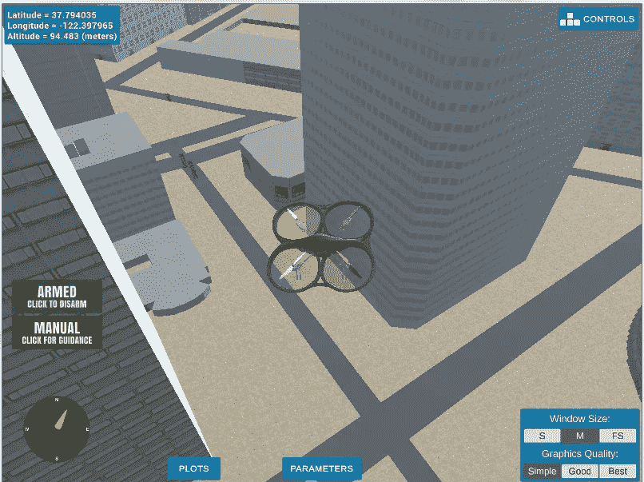
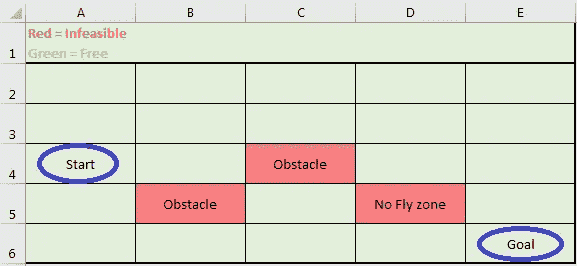
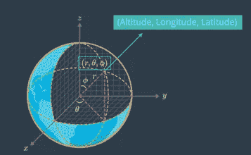
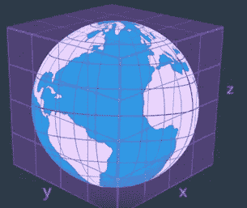
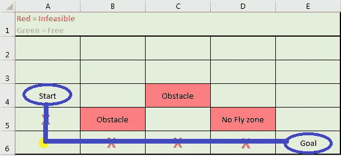
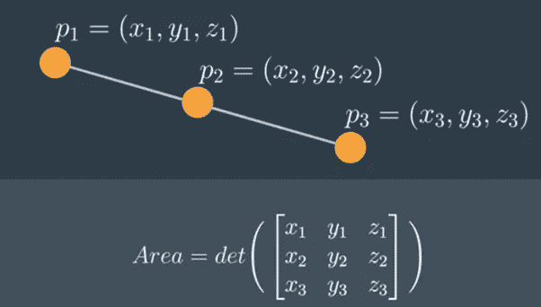

# 让我们成为一个* —学习并编写一个路径规划算法来驾驶无人机

> 原文：<https://towardsdatascience.com/lets-be-a-learn-and-code-a-path-planning-algorithm-to-fly-a-drone-4d5b566fa1ae?source=collection_archive---------10----------------------->

## 在本教程中，我们将学习并编写一个非常著名的算法，通常用于路径规划，称为 a*(A-Star)

*   **简介**
    我们将使用 Udacity 提供的开源模拟器，让一架无人机从起点飞到终点。规划是任何自动驾驶汽车的核心能力之一。任何自动驾驶车辆在开始执行任务之前，都需要有一个计划，这个计划无非是车辆为了安全高效地从某个初始位置移动到某个目标位置而必须采取的一系列行动。从一个规划问题开始，我们需要有以下内容——A)一组所有可能的集合，车辆可以在其中找到自己(它需要在其中运行的环境的地图), b)开始状态和目标状态。c)允许车辆从一种状态转移到下一种状态的一组动作。最后，d) —从一种状态转换到另一种状态时每个可能动作的成本。
*   **搜索空间、动作集和成本**
    那么我们能想到的代表“搜索空间”的最简单的表示法是什么呢？让我们考虑一个自上而下的二维世界观。我们可以把这个世界分成小网格。接下来，我们需要在这个表示中加入障碍。一种常见的方法是将任何包含障碍的格网单元标记为不可行。不允许车辆进入这些牢房。所有剩余的网格单元被标记为空闲单元。准备一个计划意味着找出一条路径，这条路径将通过一系列自由网格单元从起始状态到达目标状态。

Image 1

接下来我们需要的是动作场景。我们可以将移动车辆的右、左、上、下和对角运动视为我们的动作空间。对于成本函数，我们可以简单地从将*向右*、*向左*、*向上*和*向下*的动作视为成本为 1 开始。对于对角线运动，我们可以计算出，如果横向和垂直运动花费 1，那么根据毕达哥拉斯定理，对角线运动将花费 2 的平方根。每当我们制定计划时，我们可以把这个成本加起来(从起点到目标地点)，并用它来比较不同的计划。

*   **广度优先搜索(BFS)** 现在我们有了网格世界，我们需要建立一个从开始状态到目标状态的步骤序列。那么我们如何建立这个计划呢？通过“广度”进行实际搜索的过程可以归结为几个步骤，我们将不断重复，直到我们达到目标。广度优先搜索的主干由这些基本步骤组成:
    1 .将网格中的节点/顶点添加到要“访问”的节点队列中。
    2。访问队列中最顶端的节点，并将其标记为这样。
    3。如果该节点有任何邻居，检查它们是否被“访问过”。
    4。将仍然需要“访问”的任何相邻节点添加到队列中。
    5。从队列中删除我们访问过的当前节点。

    让我们通过从上图 1 所示地图的起始位置搜索目标位置来看看这些步骤的实际操作。我们将维护两个“队列”(称为“队列”和“已访问”)，一个用于跟踪我们需要访问的节点，另一个用于列出我们已经访问过的节点。因此，从“start”位置开始，让我们将它作为队列中的第一个元素。这是 BFS 算法的第 1 步，转到第 2 步，我们将“访问”“开始”节点。访问一个节点的过程实际上意味着我们注意到它的存在，并检查它的相邻节点。在这种情况下,“开始”的相邻节点是节点 A3、B4 和 A5；因此，我们将把它们添加到我们的队列中。一旦我们访问了节点“start”并将其邻居添加到队列中，我们就可以让节点“start”出列，因为我们已经完成了需要对它做的所有事情。这时我们的 2 个队列会是这样的:
    *队列->A3—B4—A5；Visited - > Start* 从我们的先进先出(FIFO)队列中取出下一个元素，我们将访问节点 A3，检查其相邻的空闲节点 A2 和 B3，将这些相邻节点添加到队列中，并将 A3 从队列移至“Visited”。我们更新后的队列将是这样的:
    *queue->B4—A5—A2—B3；再举一个例子，我们的 FIFO 队列中的下一个节点是 B4。事情变得有点有趣了。我们看到 B4 有节点 B3，“开始”，C4 和 B5 作为它的邻居。我们已经在地图上标出了障碍物和禁飞区，所以我们不考虑 C4 和 B5。接下来，我们可以在“已访问”列表中看到“开始”节点，因此我们将忽略它。最后，我们看到 B3 已经出现在队列中，所以我们也将忽略这个节点，因为它已经包含在我们的队列中。这样，我们已经检查了 B4 的所有相邻节点。我们会将它移出队列，并将其插入“已访问”列表。在访问 B4 的情况下，您可以看到 BFS 算法是如何巧妙地识别出“开始”节点先前已被访问过并且节点 B3 已经在队列中列出的事实。更新后的队列会是这样的:
    *queue->A5—A2—B3；参观- >开始-A3-B4*
    接下来我们拿 A5，重复同样的程序。我们继续这个过程，直到我们找到我们的“目标”位置。
    BFS 算法的一个非常重要的特点是，它非常适合于我们想要找到任何节点到起始节点的最短距离的情况。事实上，许多 BFS 算法会跟踪每个节点的“父”节点。父节点是第一个发现有问题的节点的节点。回头看看上面我们所做的迭代，让我们考虑一下我们“访问”A3 的情况。当我们在 A3 时，我们发现 A2 和 B3 是新发现的节点。现在，当在我们的队列中添加 A2 和 B3 时，如果我们只记下是 A3 帮助我们发现了 A2 和 B3 节点，我们将有一种非常方便的方法来确定从“开始”节点到任何节点的最短距离。例如，如果我们的“目标”是 A2，一旦我们发现 A2(当我们将“访问”A3 时)，我们可以注意到 A3 是它的父节点。然后，追溯“已访问”列表，我们可以发现“开始”节点将是 A3 的“父”节点。像这样，我们找到了从“开始”到 A2 的最短路径，如 A2 < - A3 < -“开始”。虽然这可能看起来是一个非常简单的例子，但我鼓励您对您感兴趣的任何节点进行这个练习，并自己发现，如果您保存有关“父”节点的信息并通过“已访问”列表追溯它，您将总是找到从“开始”到该节点的最短路径。不用说，这将保持良好，如果你改变你的'开始'节点到任何其他位置。*
*   **启发式**
    现在我们有了一张地图，我们的起点和目标位置，以及一个准备计划的方法，我们可以开始给我们的算法增加一点智能。现在，如果你在上面的广度优先搜索示例中看到，我们是在先来先服务的基础上访问节点的。例如，如果您喜欢先查看右边的节点，那么每次我们在任何节点时，它右边的节点将获得 FIFO 队列中的优先级，并且我们将总是在其他节点(左、上、下和对角线节点)之前访问这个“右边”的节点，即使其他节点离我们的目标位置更近。这似乎不是一个非常智能的系统。给定我们需要遍历的世界地图，我们可以粗略估计目标位置离所有其他节点有多远。有几种常见的方法可以做到这一点。一个例子是将从我们正在访问的节点到目标位置的欧几里德距离(或者换句话说，x 和 y 距离的平方和的平方根)作为判断访问该节点有多明智的标准。

另一种常见的方法是采用曼哈顿距离，它是到达目标的剩余 x 和 y 距离的总和。

这两种方法都忽略了障碍，并且会被低估，但它会告诉你你计划访问的节点是带你走向你的目标还是走得更远。使用这个距离，我们可以优先考虑我们想要首先访问的节点。在上面的 BFS 部分，我们看到我们随机选择相邻节点的顺序。但是现在我们可以使用这个距离信息来“访问”距离我们的“目标”最近的节点。

这些距离估计就是所谓的试探法，它们帮助我们找到规划问题的解决方案。如你所见，试探法并不完美——它们忽略了追踪不同路径的障碍和困难/成本，并且总是被低估。

所以我们得到了一个代价函数和一个启发式，接下来让我们把它们结合起来！

*   为了给搜索过程提供指导，我们现在可以使用两个函数。我们有到目前为止已经采取的行动的总和的成本函数，让我们称之为“G ”,我们有我们的启发式函数“H ”,它是达到目标状态的剩余成本(在我们的情况下，与剩余距离成比例)的表示。如果我们把这两个量加在一起，我们就得到了一个从开始一直到目标的计划总成本的估计值，尽管我们还不知道具体如何一直到目标。让我们回到我们的例子。我们将从起始状态开始，并扩展到右侧、上下的所有相邻节点，我们可以为每个节点添加一个标签，其中包含操作的总成本“G”。如果计算所有相邻节点的总成本=成本+启发式算法，我们可以看到向右或向下移动的总成本最低，这就是我们要选择的方向。根据行动的实际成本加上来自计划中最后一个节点的启发，选择总成本最低的路径的过程就是著名的算法，称为 **A star。**

*   **坐标框架**
    到目前为止，我们一直在考虑如何通过连接网格中的单元找到从开始状态到目标状态的路径。但是在找到到达目标位置的路径之前，我们首先需要表示车辆的当前位置。我们将使用两个不同的坐标来表示我们的车辆的位置。第一个框架可能是我们最熟悉的一个，即使用纬度和经度来定义位置，这被称为大地框架。大地坐标系只是一个球面坐标系，其中典型的坐标‘r’、theta (θ)和 phi (φ)分别由高度、经度和纬度表示。我们将地球表面的海拔高度设置为 0，而不是中心的海拔高度为 0。

一个球形系统实际上做运动规划有点困难，因为很难用角度量来计算距离。因此我们将它们转换成更方便的本地坐标系，称为地心地球固定(ECEF)坐标系。在 ECEF，空间中的每一个点都用 x，y 和 z 来表示。然而，如果这个坐标系的原点在地球表面，会更有用。这样我们就有了自己的 ECEF 相框。

*   **共线性检查**
    现在我们有了从 A*算法输出的计划，我们知道如何从起点到达目标位置。但是如果我们把这个计划，网格单元的序列发送给自动驾驶仪，我们真正要求车辆做的是通过一系列短目标行进。在我们一直在做的例子中，我们会告诉自动驾驶仪从我们的起始位置到目标位置。自动驾驶仪要做的是从当前位置出发，向下一格，然后停下来。接下来，我们发送下一个航路点，它将再次向下移动一个网格单元并停止。接下来，我们发送航路点，向右移动一个网格单元，然后停止等等。我们真正想让我们的车做的是向下，转向，一路行驶到最后一个网格单元，这是我们的目标位置。

接下来的问题是，我们如何将这一系列的网格单元转化为路点？我们可以使用的一种方法是获取网格单元的原始列表，只获取位于直线上的任何状态序列的开始和结束单元的网格单元。假设我们有 3 个点，如下所示。如果这三个点在同一条线上(它们共线)，那么由这三个点定义的三角形的面积为零。如果我们以如下所示的矩阵形式指出这三个点的坐标，那么这个矩阵的行列式表示由这三个点形成的面积。如果这个矩阵的行列式为 0，三角形的面积为 0，这三个点共线。

在本博客的下一部分，我们将使用旧金山市的地图以及我们在这一部分学到的方法，并将它们结合起来编写一个 3D 运动规划算法。如果听起来让你兴奋，请继续关注！

直到下一次…干杯！！