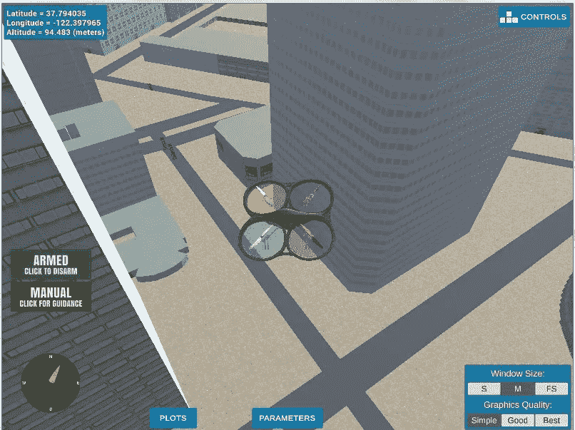
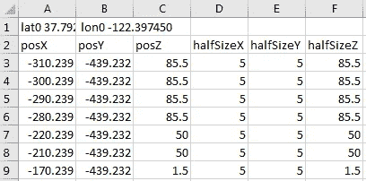
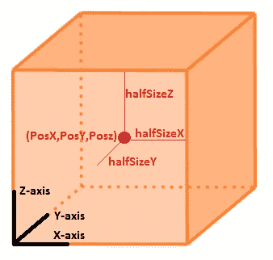
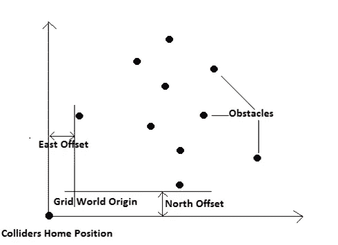
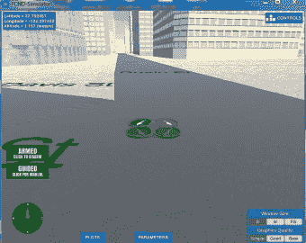

# 让我们成为一个* —学习并编写驾驶无人机的路径规划算法—第二部分

> 原文：<https://towardsdatascience.com/lets-be-a-learn-and-code-a-path-planning-algorithm-to-fly-a-drone-part-ii-b0489dcb9c94?source=collection_archive---------10----------------------->

## 在这一部分中，我们将建立在我们在[第 1 部分](/lets-be-a-learn-and-code-a-path-planning-algorithm-to-fly-a-drone-4d5b566fa1ae)中学到的理论基础上，并用 Python 编写 A*算法。



*   **Unity 模拟器、Python 环境安装和启动文件** 在开始编码之前，我们需要安装好设置和工具。我们首先从[这里](https://github.com/udacity/FCND-Simulator-Releases/releases)下载适合您操作系统的 Unity 模拟器。接下来，我们安装所需的 Python 库。我鼓励你创建一个独立的 Python 环境(在你选择的任何 IDE 中)，以保持它的整洁和独立。遵循 github [repo](https://github.com/udacity/FCND-Term1-Starter-Kit) 中的安装说明。最后，我们下载这个 github [repo](https://github.com/udacity/FCND-Motion-Planning) 来获得我们的启动文件。通过检查您是否能够运行上面提供的 github repo for starter 文件的步骤 4 中提供的说明，确保您的设置正确。
*   **Starter Code** 从这个项目开始，我们提供了两个脚本，motion_planning.py 和 planning_utils.py。在这里，您还会发现一个名为 colliders.csv 的文件，其中包含模拟器环境的 2.5D 地图。一个 2.5D 地图只不过是一个 2D 地图(x，y 位置)和额外的障碍物“高度”信息。一旦我们开始编码，我们将更深入地研究这个文件。
    motion _ planning . py 中的 main 函数与 simulator 建立“Mavlink”连接，并创建“MotionPlanning”类的“drone”对象。运动规划类包含了很多已经为我们准备好的内置函数。它包含回调函数'本地位置回调'，'速度回调'，'状态回调'。

```
if __name__ == "__main__":
    parser = argparse.ArgumentParser()
    parser.add_argument('--port', type=int, default=5760, help='Port number')
    parser.add_argument('--host', type=str, default='127.0.0.1', help="host address, i.e. '127.0.0.1'")
    args = parser.parse_args()conn = MavlinkConnection('tcp:{0}:{1}'.format(args.host, args.port), timeout=60)
    drone = MotionPlanning(conn)
    time.sleep(1)drone.start()
```

什么是回调函数？回调函数只有在特定事件触发时才会被执行。例如，如果您查看代码行“self.register_callback(MsgID。LOCAL_POSITION，self.local_position_callback)'它所做的是注册 MsgID。python 字典中作为键值对的 LOCAL_POSITION 和 self.local_position_callback(在“self.register_callback”函数中实现)。现在每当 MsgID 中的值。' LOCAL_POSITION '变量发生变化，就会触发对' self.local_position_callback '函数的调用。因此它被称为回调函数。因为在正常的“顺序”程序流中不调用该函数，而是仅在特定事件发生时调用，该事件是“MsgID”值的变化。在这种特殊情况下为“LOCAL_POSITION”。

```
class MotionPlanning(Drone):def __init__(self, connection):
        super().__init__(connection) self.target_position = np.array([0.0, 0.0, 0.0])
        self.waypoints = []
        self.in_mission = True
        self.check_state = {} # initial state
        self.flight_state = States.MANUAL # register all your callbacks here
        self.register_callback(MsgID.LOCAL_POSITION, self.local_position_callback)
        self.register_callback(MsgID.LOCAL_VELOCITY, self.velocity_callback)
        self.register_callback(MsgID.STATE, self.state_callback)
```

这些回调函数构成了无人机飞行总体程序的核心结构。各种操作，如起飞，着陆，转换到航路点跟随状态，装备和解除无人机以及所需的回调功能都在这个起始代码中处理。你可以仔细阅读 motion_planning.py 文件并理解这个函数，但是由于本文的主要目的是解释“plan_path”函数的代码，所以我们不会过多地讨论起始代码。一旦无人机待命，它就成功起飞并转换到航路点跟随状态，我们需要开始一次发送一个航路点，这将由我们的“计划路径”功能在无人机起飞前生成。

一旦我们确保我们的无人机准备好了(基本上是一个系统检查，以确保所有的螺旋桨和其他系统都按照预期运行)，我们在起飞前做的第一件事就是准备一条有效的路径。简单地说，我们计划在恒定高度飞行。我们也将与地图/世界中的障碍物保持“安全距离”。

目标高度= 5
安全距离= 5

*   **Creat_Grid** 为了创建一条路径，我们需要一张地图，这是在‘colliders . CSV’文件中提供给我们的。打开文件，我们可以看到第一行包含“lat0”和“lon0”值。这些是我们地图上的家的位置或 0，0，0。



下面几行读取 colliders.csv 第一行中提供的家乡纬度和经度，并将其设置为我们的家乡位置。

```
# TODO: read lat0, lon0 from colliders into floating point values
        lat0_lon0 = pd.read_csv('colliders.csv', nrows = 1, header = None)
        lat0, lon0 = lat0_lon0.iloc[0,0], lat0_lon0.iloc[0,1]
        _, lat0 = lat0.split()
        _, lon0 = lon0.split()
        lat0 = np.float64(lat0)
        lon0 = np.float64(lon0)# TODO: set home position to (lat0, lon0, 0)
        self.set_home_position(lon0, lat0, 0)
```

然后检查我们当前的全球位置，并将其转换为本地位置，这将是相对于我们之前设置的本地位置。然后，我们打印当前的本地和全球位置以及全球主位置值。

```
# TODO: retrieve current global position 
# TODO: convert to current local position using global_to_local()
current_local_pos = global_to_local(self.global_position, self.global_home)

# Me: checking current local position
print ('current local position {0} and {1}'.format(current_local_pos[0], current_local_pos[1]))

print('global home {0}, position {1}, local position {2}'.format(self.global_home, self.global_position,
                                                                         self.local_position))
```

接下来，我们用网格格式定义我们的地图，我们在这个系列的[第 1 部分](/lets-be-a-learn-and-code-a-path-planning-algorithm-to-fly-a-drone-4d5b566fa1ae)中学习过。我们首先从 colliders.csv 中读取完整的数据，然后将该 numpy 数组传递给名为“create_grid”的函数。

```
# Read in obstacle map
data = np.loadtxt('colliders.csv', delimiter=',', dtype='Float64', skiprows=3)

# Define a grid for a particular altitude and safety margin around obstacles
grid, north_offset, east_offset = create_grid(data, TARGET_ALTITUDE, SAFETY_DISTANCE)
```

在我们了解“create_grid”如何创建我们的网格图之前，我们需要了解 colliders.csv 中提供的数据格式。如果我们查看每列的标题(如图 2 的第 2 行所示)，我们会看到给定了一个点的 3 个位置值—其 x、y 和 z 坐标，以及 3 个距离值。x、y 和 z 坐标是障碍物中心点的坐标，3 个距离是其宽度、长度和高度值。实际上它们是高度、宽度和长度的一半，因为它们是从中心点到障碍物一边的距离。下图解释了如何提供障碍物的中心点和尺寸值。



我们将创建类似于在[第一部分](/lets-be-a-learn-and-code-a-path-planning-algorithm-to-fly-a-drone-4d5b566fa1ae)中解释的 2.5D 结构的地图。事实上，我们将更进一步。我们已经用“目标高度”变量固定了无人机的飞行高度。因此，在创建地图时，如果障碍物的高度(PozZ + 2 * halfSizeZ)大于“TARGET_ALTITUDE”，我们将只在地图中包含该障碍物。如果障碍物的高度小于“目标高度”,我们将假设它是一个自由空间，因为我们的无人机可以飞越它。这种方法大大减少了我们的地图所需的空间和处理的复杂性。

随着高度参数的排序，我们需要确定我们需要创建的地图的大小。为此，我们首先确定 X 和 Y 方向上离原点最近和最远的点。假设 X 方向为北，Y 方向为东，我们可以得到两个方向上最近点和最远点的值，如下所示:

```
# minimum and maximum north coordinates
north_min = np.floor(np.min(data[:, 0] - data[:, 3]))
north_max = np.ceil(np.max(data[:, 0] + data[:, 3]))# minimum and maximum east coordinates
east_min = np.floor(np.min(data[:, 1] - data[:, 4]))
east_max = np.ceil(np.max(data[:, 1] + data[:, 4]))# given the minimum and maximum coordinates we can
# calculate the size of the grid.
north_size = int(np.ceil((north_max - north_min + 1)))
east_size = int(np.ceil((east_max - east_min + 1)))
```

最后，我们将网格图初始化为 numpy 个零数组

```
# Initialize an empty grid
grid = np.zeros((north_size, east_size))
```

接下来，我们将从 colliders.csv 数据中迭代每个障碍，我们已经在变量“数据”中捕获了这些数据。我们将首先比较障碍物的高度是否高于“目标高度”，如果是，那么我们将在我们的网格世界中将障碍物占据的区域+我们在变量“安全距离”中配置的安全距离标记为 1。最后，我们返回网格世界以及 north_min 和 east_min 值。

```
# Populate the grid with obstacles
    for i in range(data.shape[0]):
        north, east, alt, d_north, d_east, d_alt = data[i, :]
        if alt + d_alt + safety_distance > drone_altitude:
            obstacle = [
                int(np.clip(north - d_north - safety_distance - north_min, 0, north_size-1)),
                int(np.clip(north + d_north + safety_distance - north_min, 0, north_size-1)),
                int(np.clip(east - d_east - safety_distance - east_min, 0, east_size-1)),
                int(np.clip(east + d_east + safety_distance - east_min, 0, east_size-1)),
            ]
            grid[obstacle[0]:obstacle[1]+1, obstacle[2]:obstacle[3]+1] = 1return grid, int(north_min), int(east_min)
```

我们需要理解的一个小警告是，碰撞器中的障碍物和我们当前的本地位置是相对于全局 home 的，这是我们在 lat0 和 lon0 变量的帮助下配置的。然而，我们在 create_grid 函数中创建的网格世界的原点在第一个障碍点。还记得我们是如何计算北部最小和最大值以及东部最小和最大值，然后计算北部和东部大小来创建网格的吗？因此，在碰撞器之间有一个偏移&我们无人机的位置值和我们网格世界中相应的相同位置。下图将帮助我们更好地理解它。



因此，每当我们试图将无人机位置传感器的值映射到网格世界时，我们需要分别减去北偏和东偏。这个偏移值就是 create_grid 函数返回的 north_min 和 east_min。我们将我们在 grid_world 中的当前位置设置为

```
# TODO: convert start position to current position rather than map center
grid_start = (int(current_local_pos[0] - north_offset), int(current_local_pos[1] - east_offset))
```

指定我们选择的目标位置

```
# Take GPS co-ordinates as Grid goal -Me
grid_goal = (-122.396582, 37.795714, 0)
grid_goal = global_to_local(grid_goal, self.global_home)
grid_goal = (int(grid_goal[0] - north_offset), int(grid_goal[1] - east_offset))
```

打印我们的起点和目标位置，然后开始我们成为 A*的旅程！！

```
print('Local Start and Goal: ', grid_start, grid_goal)
path, _ = a_star(grid, heuristic, grid_start, grid_goal)
```

*   **A*在城市中** 我们将刚刚在上面部分创建的网格、一个启发式函数以及我们的起点和目标位置作为参数传递给 a_star 函数。希望我们在本系列的[第 1 部分](/lets-be-a-learn-and-code-a-path-planning-algorithm-to-fly-a-drone-4d5b566fa1ae)中获得的概念能够帮助我们更好地理解这个函数的代码。事实上，让我们重温一下我们在理解广度优先算法时所经历的步骤列表。知道算法的哪一步是在哪一行中执行的，将有助于我们更好地理解下面的代码块。如[第 1 部分](/lets-be-a-learn-and-code-a-path-planning-algorithm-to-fly-a-drone-4d5b566fa1ae)所述，A*算法在 BFS 的基础上增加了“成本”和“启发式”功能。因此，随着代码实现以下步骤，它将包括添加和访问'成本'和'启发式'功能了。广度优先搜索的主干由这些基本步骤组成。将网格中的节点/顶点添加到要“访问”的节点队列中。
    2。访问队列中最顶端的节点，并将其标记为这样。
    3。如果该节点有任何邻居，检查它们是否被“访问过”。
    4。将仍然需要“访问”的任何相邻节点添加到队列中。
    5。从队列中删除我们访问过的当前节点。我们首先声明几个变量。我们将使用优先级队列来存储我们需要访问的节点。优先级队列中条目的典型模式是:(优先级编号，数据)形式的元组。首先检索最低值的条目，因为我们将使用“到达相应节点的成本”值作为“优先级 _ 编号”，所以每当我们从该优先级队列中“获取”(或弹出)元素时，我们将获取具有最小“成本”值的元素。我们从“开始”节点开始。

```
path = []
    path_cost = 0
    queue = PriorityQueue()
    queue.put((0, start))
    visited = set(start)branch = {}
found = False# Check till we have searched all nodes or have found our ‘goal’
while not queue.empty():
    item = queue.get() # Step2\. Visit the topmost node in the queue
    current_cost = item[0]
    current_node = item[1] if current_node == goal:
      print('Found a path.')
      found = True
      break

    else:#Step3\. If that node has any neighbors, check to see if they have been “visited” or not.

      for a in valid_actions(grid, current_node):
        next_node = (current_node[0] + a.delta[0], current_node[1] + a.delta[1])
        new_cost = current_cost + a.cost + h(next_node, goal)#Step4\. Add any neighboring nodes that still need to be “visited” to the queue.
        if next_node not in visited:
          visited.add(next_node)
          queue.put((new_cost, next_node)) branch[next_node] = (new_cost, current_node, a)
```

正如我们在[第 1 部分](/lets-be-a-learn-and-code-a-path-planning-algorithm-to-fly-a-drone-4d5b566fa1ae)中看到的，无论何时我们到达 BFS 算法中的一个节点，它都保证是从我们的“开始”位置到那个节点的最短路径。因此，为了跟踪我们正在跟踪的路径，在 a_star 函数中，我们将维护一个字典，其中“key”将是我们接下来要访问的节点，它的值将是当前节点的元组、为了到达下一个节点要从当前节点采取的动作以及到达下一个节点的总成本。该元组(当前节点+到达下一个节点要采取的动作)将表示从“开始”位置到达下一个节点的最短路径。
现在，一旦我们找到“目标”位置，我们将在“分支”字典的帮助下追溯到“开始”位置的路线。我们首先复制到达“目标”位置的总成本值。接下来，由于我们知道字典的“值”中存在的节点位于最短路径上，我们将构建我们的“路径”列表为->[目标，分支的值中存在的节点[目标]，…]。我们将继续追踪我们的路线，直到我们找到“开始”位置，将节点添加到“路径”列表中。

```
if found:
        # retrace steps
        n = goal
        path_cost = branch[n][0]
        path.append(goal)
        while branch[n][1] != start:
            path.append(branch[n][1])
            n = branch[n][1]
        path.append(branch[n][1])
    else:
        print('**********************')
        print('Failed to find a path!')
        print('**********************') 
    return path[::-1], path_cost
```

*   **辅助函数** *路径修剪:*一旦我们想出了路径，我们将通过删除共线点来修剪它，如第 1 部分的共线性检查一节所述。我们从最终路径中取 3 个连续点，检查它们是否在同一条线上。我们通过计算选定的 3 个点所包围的面积来实现这一点。如果它非常接近 0，我们可以假设它们位于同一直线上。我们首先将一个 3 元素(x 坐标，y 坐标，1)中的点转换为 numpy 数组。我们添加最后一个元素“1 ”,这样我们可以将 3 个顶点排列成一个漂亮的 3×3 矩阵。在对“points()”函数中的点进行整形后，我们通过连接它们来创建一个矩阵，然后使用一个方便的 np.linalg.det()函数来计算该矩阵的行列式。
    *有效动作*:我们在 a_star 中使用的一个函数是 valid_actions (grid，current_node)。这用于执行 BFS 算法的步骤# 3，其中我们搜索当前节点的邻居。我们已经有了动作集(如第 1 部分的“搜索空间、动作集和成本”一节中所解释的)和当前节点的位置。该函数将返回动作集的子集。它将检查一个动作(即向上、向下、向左、向右或对角移动)是否会将我们带离网格或带至障碍物/禁飞区节点。如果是这种情况，它将从当前节点的有效可行动作列表中删除该动作。

回到 motion_planning.py，一旦我们得到了修剪过的路径，从其中取出每个点，将其转换为局部坐标系中的航路点(通过添加北向和东向偏移)，并使用 self.send_waypoints()函数将其发送到自动驾驶仪。至此，我们完成了路径规划 A*算法的编码。所以事不宜迟，让我们启动 Udacity 的无人机模拟器，运行我们的 motion_planning.py python 文件。你可以在我的 github repo [这里](https://github.com/PercyJaiswal/FCND-Motion-Planning.git)找到所有的源代码。如果一切顺利，你应该能够看到你的无人机从用户配置的起点和目标位置飞行，如下图所示。



希望你喜欢阅读本系列的几篇文章，并且现在对 A*的基础有了很好的理解。

如果你觉得这篇文章有用，你知道下一步该怎么做😊直到下一次…干杯！！

