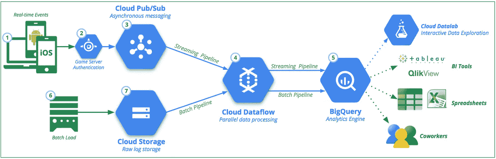
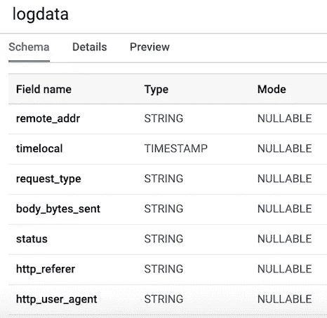
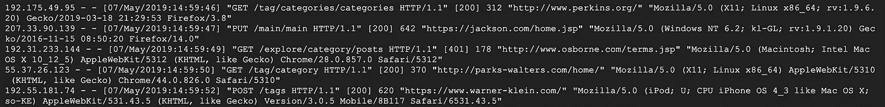
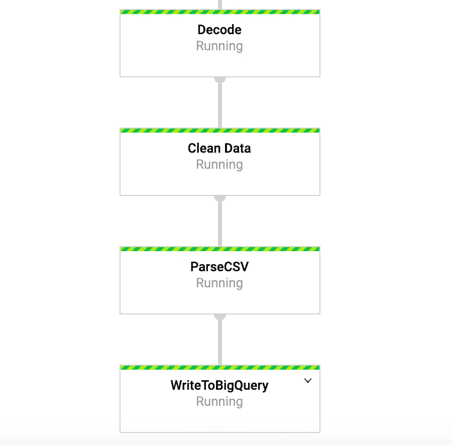
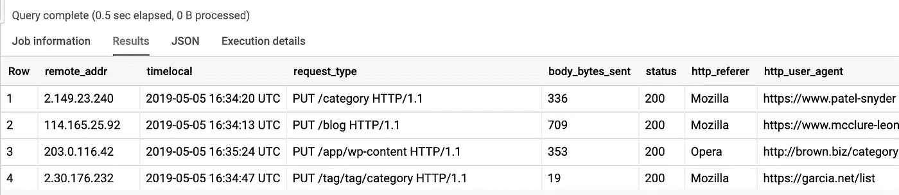

# 让我们建立一个流数据管道

> 原文：<https://towardsdatascience.com/lets-build-a-streaming-data-pipeline-e873d671fc57?source=collection_archive---------4----------------------->


## 用于实时数据管道的 Apache Beam 和数据流

今天的帖子是基于我最近在工作中做的一个项目。我真的很兴奋能实现它，并把它写成一篇博文，因为它给了我一个机会去做一些数据工程，也做了一些对我的团队非常有价值的事情。不久前，我发现我们的系统中存储了大量与我们的一个数据产品相关的用户日志数据。事实证明，没有人真正使用这些数据，所以我立即对我们开始定期分析这些数据能够学到什么产生了兴趣。然而，有几个问题。第一个问题是，数据存储在许多不同的文本文件中，不能立即用于分析。第二个问题是它存储在一个锁定的系统中，所以我不能使用任何我喜欢的工具来分析数据。

我考虑过如何让我们更容易获取这些数据，并通过将这些数据构建到我们的一些用户参与工作中来真正创造一些价值。思考了一会儿之后，我决定建立一个管道，将这些数据输入云数据库，这样我和更广泛的团队就可以访问这些数据，并开始产生一些见解。在最近完成了 Coursera 上的 [GCP 数据工程专业之后，我热衷于使用课程中的一些工具开始一个项目。](https://click.linksynergy.com/link?id=z2stMJEP3T4&offerid=759505.10508402250&type=2&murl=https%3A%2F%2Fwww.coursera.org%2Fspecializations%2Fgcp-data-machine-learning)

对，所以将数据放入云数据库似乎是处理我的第一个问题的合理方式，但是我能对第二个问题做些什么呢？幸运的是，有一种方法可以将这些数据转移到我可以访问 Python 和谷歌云平台(GCP)等工具的环境中。然而，这将是一个漫长的过程，所以我需要做一些事情，让我在等待数据传输的同时进行开发。我想到的解决方案是使用 Python 中的 **Faker** 库创建一些假数据。我以前从未使用过这个图书馆，但很快意识到它是多么有用。采用这种方法允许我在没有实际数据的情况下开始编写代码和测试管道。

也就是说，在这篇文章中，我将介绍我是如何使用 GCP 的一些技术来构建上述管道的。特别是，我将使用 **Apache Beam (python 版本)、Dataflow、Pub/Sub 和 Big Query** 来收集用户日志、转换数据并将其输入数据库进行进一步分析。对于我的用例，我只需要 beam 的批处理功能，因为我的数据不是实时到达的，所以不需要发布/订阅。然而，我将把重点放在流版本上，因为这是您在实践中可能经常遇到的。

# GCP 和阿帕奇波束简介

谷歌云平台为大数据处理提供了一堆真正有用的工具。我将使用的一些工具包括:

*   [**Pub/Sub**](https://cloud.google.com/pubsub/) 是一种使用发布者-订阅者模型的消息服务，允许我们实时获取数据。
*   [**data flow**](https://cloud.google.com/dataflow/)**是一项简化创建数据管道并自动处理诸如扩展基础设施之类的事情的服务，这意味着我们可以专注于为我们的管道编写代码。**
*   **[**big query**](https://cloud.google.com/bigquery/)**是云数据仓库。如果您熟悉其他 SQL 风格的数据库，那么 BigQuery 应该非常简单。****
*   ****最后，我们将使用 [**Apache Beam**](https://beam.apache.org/) ，特别是，我们将关注 Python 版本来创建我们的管道。这个工具将允许我们创建一个与 GCP 集成的流或批处理管道。它对并行处理特别有用，适合于**提取、转换和加载(ETL)** 类型的任务，因此如果我们需要在执行转换或计算时将数据从一个地方移动到另一个地方，Beam 是一个不错的选择。****

****GCP 上有各种各样的可用工具，因此很难掌握它们的全部以及它们的用途，但这里的[是对它们的总结，以供参考。](https://cloud.google.com/terms/services)****

## ****可视化我们的管道****

****让我们使用图 1 来可视化管道的组件。在高层次上，我们想要做的是实时收集用户生成的数据，对其进行处理并将其输入 BigQuery。这些日志是在用户与产品交互时生成的，用户向服务器发送请求，然后被记录下来。这些数据对于理解用户如何使用我们的产品以及事情是否正常运行非常有用。一般来说，管道将有以下步骤:****

1.  ****我们的用户日志数据被发布到一个发布/订阅主题。****
2.  *****我们将连接到发布/订阅，并使用 Python 和 Beam 将数据转换成适当的格式(图 1 中的步骤 3 和 4)。*****
3.  *****在转换数据之后，Beam 将连接到 BigQuery 并将数据追加到我们的表中(图 1 中的步骤 4 和 5)。*****
4.  ****为了进行分析，我们可以使用各种工具(如 Tableau 和 Python)连接到 BigQuery。****

****Beam 使这个过程变得非常容易，无论我们有一个流数据源，还是我们有一个 CSV 文件并想进行批处理。稍后您将会看到，在这两者之间进行切换只需要对代码进行很小的修改。这是使用 Beam 的优点之一。****

********

****Figure 1: General Data Pipeline: Source:****

# ****使用 Faker 创建伪数据****

****正如我之前提到的，由于对数据的访问有限，我决定创建与实际数据格式相同的假数据。这是一个非常有用的练习，因为我可以在等待数据的同时开发代码和测试管道。如果你想知道图书馆还能提供什么，我建议你看一下 Faker 的文档。我们的用户数据通常类似于下面的例子。基于这种格式，我们可以逐行生成数据来模拟实时数据。这些日志为我们提供诸如日期、请求类型、服务器响应、IP 地址等信息。****

```
**192.52.197.161 - - [30/Apr/2019:21:11:42] "PUT /tag/category/tag HTTP/1.1" [401] 155 "https://harris-lopez.com/categories/about/" "Mozilla/5.0 (Macintosh; PPC Mac OS X 10_11_2) AppleWebKit/5312 (KHTML, like Gecko) Chrome/34.0.855.0 Safari/5312"**
```

****基于上面的行，我们想使用下面花括号中的 7 个变量创建我们的**行**变量。稍后，我们也将在表模式中使用它们作为变量名。****

```
**LINE = """\
{remote_addr} - - [{time_local}] "{request_type} {request_path} HTTP/1.1" [{status}] {body_bytes_sent} "{http_referer}" "{http_user_agent}"\
"""**
```

****如果我们正在做一个批处理作业，代码会非常相似，尽管我们需要在某个时间范围内创建一堆样本。要使用 faker，我们只需创建一个对象并调用我们需要的方法。特别是，faker 对于生成 IP 地址和网站非常有用。我使用了以下方法:****

```
**fake.ipv4()
fake.uri_path()
fake.uri()
fake.user_agent()**
```

****stream_logs.py****

## ****设置谷歌云。****

*****注意:为了运行管道和发布用户日志数据，我使用了 google cloud shell，因为我在使用 Python 3 运行管道时遇到了问题。Google cloud shell 使用 Python 2，它在 Apache Beam 上表现得更好。*****

****为了能够运行管道，我们需要做一些设置。对于那些以前没有使用过 GCP 的人来说，你需要完成本页[中概述的 6 个步骤。](https://cloud.google.com/dataflow/docs/quickstarts/quickstart-python)****

****在此之后，我们将需要上传我们的脚本到谷歌云存储，并复制到我们的谷歌云外壳。上传到云存储非常简单，这里有[的解释](https://cloud.google.com/storage/docs/uploading-objects)。要复制我们的文件，我们可以通过点击下面图 2 中左边的第一个图标打开工具栏中的 Google Cloud shell。****

********

****Figure 2****

****下面列出了我们复制文件和安装必要的库所需的命令。****

```
**# Copy file from cloud storage
gsutil cp gs://<YOUR-BUCKET>/ * .sudo pip install apache-beam[gcp] oauth2client==3.0.0 
sudo pip install -U pip
sudo pip install Faker==1.0.2# Environment variables
BUCKET=<YOUR-BUCKET>
PROJECT=<YOUR-PROJECT>**
```

## ****创建我们的数据库和表****

****在我们完成了设置步骤之后，接下来我们需要做的是在 BigQuery 中创建一个数据集和一个表。有几种不同的方法可以做到这一点，但最简单的方法是使用谷歌云控制台，首先创建一个数据集。您可以按照下面的[链接](https://cloud.google.com/bigquery/docs/tables)中的步骤来创建一个表和一个模式。我们的表将有 ***7 列*** 对应于每个用户日志的组件。为方便起见，除了 timelocal 变量之外，我们将所有列定义为字符串，并根据我们之前生成的变量来命名它们。我们的表模式应该如图 3 所示。****

********

****Figure 3 Table Schema****

## ****发布我们的用户日志数据****

****发布/订阅是我们管道的重要组成部分，因为它允许多个独立的应用程序相互交互。特别是，它充当了中间人的角色，允许我们在应用程序之间发送和接收消息。我们要做的第一件事是创建一个主题。这很简单，只需在控制台中点击“发布/订阅”并点击“创建主题”即可。****

****下面的代码调用我们的脚本来生成上面定义的日志数据，然后连接并发送日志到 Pub/Sub。我们需要做的唯一事情是创建一个 **PublisherClient** 对象，使用 **topic_path** 方法添加主题的路径，并在传递 topic_path 和数据的同时调用 **publish** 函数。注意，我们正在从我们的 stream_logs 脚本中导入 **generate_log_line** ,所以要确保这些文件在同一个文件夹中，否则会出现导入错误。然后，我们可以在 google 控制台中使用以下命令来运行它:****

```
**python publish.py**
```

****文件运行后，我们应该能够看到日志数据打印到控制台，如下图所示。这个脚本会一直运行，直到我们用 ***CTRL+C*** 杀死它。****

********

****Figure 4: publish_logs.py output****

# ****为我们的管道编码****

****现在我们已经完成了初始设置，我们可以开始有趣的事情，使用 Beam 和 Python 编写我们的管道。为了创建一个波束管道，我们需要创建一个管道对象( **p** ) **。**一旦我们创建了管道对象，我们可以使用 ***管道(|)*** 操作符一个接一个地应用多个函数。通常，工作流程如下图所示。****

```
**[Final Output PCollection] **=** ([Initial Input PCollection] **|** [First Transform]
              **|** [Second Transform]
              **|** [Third Transform])**
```

****在我们的代码中，我们创建了两个自定义函数。 **regex_clean** 函数，使用 re.search 函数搜索数据并根据模式列表提取适当的字符串。该函数返回逗号分隔的字符串。如果你不是正则表达式专家，我推荐你看看这个教程[和笔记本来测试代码。之后，我们定义了一个名为 **Split** 的自定义 ParDo 函数，这是一种用于并行处理的波束变换。在 Python 中有一种特殊的方法，我们必须创建一个从 DoFn Beam 类继承的类。Split 函数从前面的函数中获取解析后的字符串，并返回一个字典列表，其中的键等于 BigQuery 表中的列名。关于这个函数，需要注意的一点是，我必须在函数中导入 datetime，它才能工作。我得到了一个错误，当我在文件的顶部导入时，这很奇怪。然后这个列表被传递给 **WriteToBigQuery** 函数，该函数只是将我们的数据追加到表中。下面提供了批处理数据流作业和流式数据流作业的代码。批处理代码和流代码之间的唯一区别是，在批处理作业中，我们使用 Beam 中的 **ReadFromText** 函数从 src_path 读取 CSV。](https://www.machinelearningplus.com/python/python-regex-tutorial-examples/)****

## ****批处理数据流作业****

****main_pipeline_batch.py****

## ****流式数据流作业****

****main_pipeline_streaming.py****

## ****运行管道****

****我们可以用几种不同的方式来执行管道。如果我们愿意，我们可以从终端本地运行它，前提是我们已经远程登录到 GCP。****

```
**python -m main_pipeline_stream.py \
  --input_topic "projects/user-logs-237110/topics/userlogs" \
  --streaming**
```

****然而，我们将使用数据流来运行它。我们可以使用下面的命令做到这一点，同时还可以设置下面的强制选项。****

*   ****`**project**` -你的 GCP 项目的 ID。****
*   ****`**runner**` -管道运行器，它将解析你的程序并构建你的管道。对于云执行，这必须是`DataflowRunner`。****
*   ****`**staging_location**` -云数据流的云存储路径，用于存放执行工作的工人所需的代码包。****
*   ****`**temp_location**` -云数据流的云存储路径，用于存放在管道执行期间创建的临时作业文件。****
*   ****`**streaming**`****

```
**python main_pipeline_stream.py \
--runner DataFlow \
--project $PROJECT \
--temp_location $BUCKET/tmp \
--staging_location $BUCKET/staging
--streaming**
```

****当这个命令运行时，我们可以在 google 控制台的 DataFlow 选项卡上查看我们的管道。当我们点击管道时，我们应该看到如图 4 所示的内容。出于调试的目的，进入日志，然后使用 Stackdriver 查看详细的日志会很有帮助。这帮助我在很多情况下解决了管道的问题。****

********

****Figure 4: Beam Pipeline****

## ****在 BigQuery 中访问我们的数据****

****没错，我们应该建立管道，让数据流入表中。为了证实这一点，我们可以转到 BigQuery 并查看数据。使用下面的命令后，您应该会看到数据集的前几行。现在我们已经将数据存储在 BigQuery 中，我们可以做进一步的分析，与同事共享数据，并开始回答和解决业务问题。****

```
**SELECT * FROM `user-logs-237110.userlogs.logdata` LIMIT 10;**
```

********

****Figure 5: BigQuery****

# ****外卖食品****

****希望这提供了一个创建流数据管道的有用示例，也提供了一个找到使数据更易访问的方法的有用示例。拥有这种格式的数据对我们有很多好处。我们现在可以开始回答一些有用的问题，比如有多少人使用我们的产品？用户群是否会随着时间的推移而增长？人们与产品的哪些方面互动最多？还有有没有不该发生的错误发生？这些是组织感兴趣的问题类型，基于这些见解，我们可以推动产品的改进并提高用户参与度。****

****Beam 对于这种类型的练习非常有用，并且还有许多其他有趣的用例。例如，您可能希望实时分析股票报价单位数据，并根据分析进行交易；您可能有来自车辆的传感器数据，并希望计算出流量水平。例如，你也可以是一家游戏公司，收集用户数据，并利用这些数据创建跟踪关键指标的仪表板。好了，伙计们，这就是另一个帖子，感谢阅读，对于那些想看完整代码的人，下面是我的 GitHub 的链接。****

*****推荐课程:*[*【GCP】上的数据工程、大数据、机器学习*](http://Data Engineering, Big Data, and Machine Learning on GCP)****

****[](https://github.com/DFoly/User_log_pipeline) [## d poly/用户日志管道

### 在 Google Cloud Platform 中为用户日志数据创建流管道-d poly/User _ log _ Pipeline

github.com](https://github.com/DFoly/User_log_pipeline) 

*注意，这篇文章中的一些链接是附属链接。*****