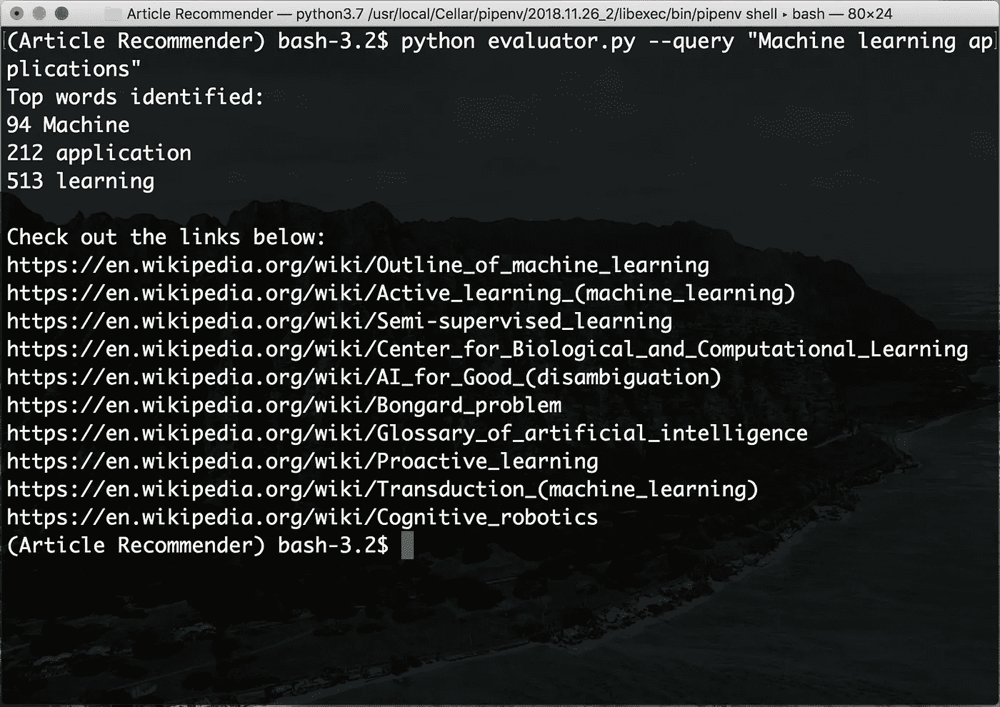

# 使用 LDA 构建文章推荐器

> 原文：<https://towardsdatascience.com/lets-build-an-article-recommender-using-lda-f22d71b7143e?source=collection_archive---------12----------------------->


Photo by [Ian Schneider](https://unsplash.com/@goian?utm_source=medium&utm_medium=referral) on [Unsplash](https://unsplash.com?utm_source=medium&utm_medium=referral)

由于对学习新主题的浓厚兴趣，我决定从事一个项目，其中一个**潜在狄利克雷分配(LDA)** 模型可以根据搜索短语推荐维基百科文章。

本文解释了我用 Python 构建项目的方法。请查看下面 GitHub 上的项目。

[](https://github.com/kb22/Article-Recommender) [## kb22/文章推荐者

### 使用 LDA，该项目基于搜索查询推荐维基百科文章。-kb22/文章推荐者

github.com](https://github.com/kb22/Article-Recommender) 

# 结构


Photo by [Ricardo Cruz](https://unsplash.com/@mavrick?utm_source=medium&utm_medium=referral) on [Unsplash](https://unsplash.com?utm_source=medium&utm_medium=referral)

我使用类在 Python 中开发了完整的项目，并没有像我通常做的那样使用 Jupyter 笔记本来理解类以及如何开发一般的 Python 项目。模块、*维基百科浏览器*、*清理器*和*内容*被定义为`Modules`文件夹中的类。 *config* 文件包含了配置。*收集数据*、*生成器*和*评估器*用于开发和运行模型。

```
**Modules
  |- __init__.py
  |- WikipediaCrawler.py
  |- Cleaner.py
  |- Content.py****config.yml
collectData.py
generateDLA.py
evaluator.py****sample_images
  |- recommendations.png****.gitignore
LICENSE
Pipfile.lock
README.md
requirements.txt**
```

当您尝试运行项目时，您可以使用`Pipfile.lock`或`requirements.txt`来安装所有的依赖项。

# 配置


Photo by [Tim Mossholder](https://unsplash.com/@timmossholder?utm_source=medium&utm_medium=referral) on [Unsplash](https://unsplash.com?utm_source=medium&utm_medium=referral)

将项目的任何配置包含在一个公共文件中总是一个好的做法。虽然这个项目中没有太多的信息，但是我定义了在`config.yml`文件中存储数据库、LDA 模型、字典和语料库的路径。我决定把这些都放在`data`文件夹里。

配置文件基于 YAML，这是业内常用的数据序列化方法，用于存储人类可读的配置。需要`pyyaml`包来读取 Python 中的 YAML 文件。

# 模块


Photo by [Louis Reed](https://unsplash.com/@_louisreed?utm_source=medium&utm_medium=referral) on [Unsplash](https://unsplash.com?utm_source=medium&utm_medium=referral)

我开发和设计了三个模块(作为类),用于从维基百科抓取数据，并处理这些数据。

## 维基百科爬虫

类`WikipediaCrawler`让我们根据某个类别抓取维基百科的文章。在初始化这个类时，它创建一个`sqlite3`连接，然后添加一个表`wikiData`，存储页面`id`、`category`、`url`和`content`。`collect_data`方法使用`wptools`包提取页面并将它们存储在表中。`wptools`是一个 Python 包，允许我们根据给定的类别抓取维基百科的文章。

我添加了两个额外的方法，`get_ids`获取所有的页面 id，`get_urls`获取所有的 URL，如果需要的话。

## 清洁工

该模块接收文档文本并对其进行预处理。我只需要使用函数`clean_text`，因为它代表我们调用所有其他函数并返回最终结果。它执行以下操作:

1.  删除不必要的新行字符`\n`
2.  删除标点符号
3.  删除数字
4.  删除停用字词(过于常见且不适合作为搜索关键字的字词)
5.  应用词条化(将每个单词转换为其词条单词，如 *ran，running* 转换为 *run*

## 内容

这个模块连接到`sqlite3`数据库，帮助我们迭代页面，并使用`Cleaner`模块清理它们的内容。我添加了其他方法来通过 id 获取*页面*和 *url* 。

# 应用


Photo by [Jason Leung](https://unsplash.com/@ninjason?utm_source=medium&utm_medium=referral) on [Unsplash](https://unsplash.com?utm_source=medium&utm_medium=referral)

一旦我设置好模块，我就开始搜集数据，训练 LDA 模型并推荐文章。

## 收集数据

首先，我运行文件`collectData.py`,它期望两个参数开始从 Wikipedia 中提取数据并将其存储在数据库中。

1.  **类别:**我们要为其开发文章推荐系统的类别
2.  **深度:**对于给定的类别，我们想要提取网页到什么深度。例如，当从深度 2 开始浏览一篇文章时，它将以深度 1 更深入一步(即其相关文章)，但将在下一深度结束，因为它将是 0。

如果目录`data`不存在，它将创建该目录。使用`WikipediaCrawler`，它提取页面并存储到`wikiData.db`供其他文件使用。完成后，它输出消息:*数据库已经生成*

## 生成 LDA

下一步是使用我们创建的数据库，从它构建一个 ld a 模型，并将其存储在 data 文件夹中。

首先，我读取数据库并创建一个字典。我删除所有出现在少于 5 个文档中的单词和出现在超过 80%文档中的单词。我尝试了多个值，并通过反复试验得出了这些数字。然后，使用`doc2bow`，我创建一个单词包，作为关键字列表。最后，我生成了 LDA 模型，并保存了模型、词典和语料库。

## 求值程序

最后，一切准备就绪。我们调用`evaluator.py`并传入一个查询字符串，基于该字符串我们识别关键字并列出匹配搜索标准的前 10 篇文章。

我阅读查询并从中识别关键字。然后，通过调用`get_similarity`方法，我计算了相似度矩阵，并按照降序对它们进行排序，这样最大相似度的文档就在顶部。

接下来，我迭代这些结果，并呈现代表推荐文章的前 10 个 URL。

# 真实的例子

## 用例

我用深度 *2* 和类别*机器学习*创建了数据库。它生成了文件，`wikiData.db`。接下来，使用`generateLDA.py`，我创建了 LDA 模型。

## 使用

我使用搜索查询作为`Machine learning applications`，并被推荐了如下图所示的文章:



Recommended articles for ‘Machine learning applications’

# 结论

在本文中，我讲述了如何开发一个 LDA 模型，根据搜索查询向用户推荐文章。我使用 Python 类设计了一个完整的应用程序。

如果你喜欢这篇文章，看看我的其他文章:

[](/working-with-apis-using-flask-flask-restplus-and-swagger-ui-7cf447deda7f) [## 使用 Flask、Flask RESTPlus 和 Swagger UI 处理 API

### Flask 和 Flask-RESTPlus 简介

towardsdatascience.com](/working-with-apis-using-flask-flask-restplus-and-swagger-ui-7cf447deda7f) [](/predicting-presence-of-heart-diseases-using-machine-learning-36f00f3edb2c) [## 使用机器学习预测心脏病的存在

### 机器学习在医疗保健中的应用

towardsdatascience.com](/predicting-presence-of-heart-diseases-using-machine-learning-36f00f3edb2c) [](/machine-learning-classifier-evaluation-using-roc-and-cap-curves-7db60fe6b716) [## 使用 ROC 和 CAP 曲线的机器学习分类器评估

### 了解 ROC 和 CAP 曲线及其在 Python 中的实现

towardsdatascience.com](/machine-learning-classifier-evaluation-using-roc-and-cap-curves-7db60fe6b716) 

一如既往，请随时分享您的想法和想法。如果你在一个项目或一个想法上需要帮助，在 LinkedIn 上 ping 我。你可以在这里找到我。