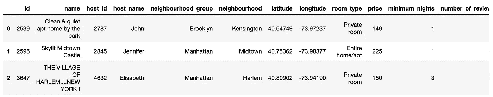

# 让我们计算一下纽约 Airbnb 价格的 Z 值

> 原文：<https://towardsdatascience.com/lets-calculate-z-scores-for-airbnb-prices-in-new-york-8da9964c49b0?source=collection_archive---------22----------------------->

## 通过编码示例了解 z 分数


z 分数，也叫*标准分数，根据[维基百科](https://en.wikipedia.org/wiki/Standard_score)的说法是*。

> 在[统计](https://en.wikipedia.org/wiki/Statistics)中，**标准分数**是[标准差](https://en.wikipedia.org/wiki/Standard_deviation)的有符号分数，通过该分数，观察值或[数据](https://en.wikipedia.org/wiki/Data)点的值高于被观察或测量的[平均值](https://en.wikipedia.org/wiki/Mean)。

**翻译:**衡量一个值与其总体平均值的差距。

我们来看看公式。


**μ = mean, σ = std, x = value**

这很简单。从被评估的值中减去数据集的平均值，然后除以标准差。

我们来玩一些数据。

首先，从 [Kaggle](https://www.kaggle.com/dgomonov/new-york-city-airbnb-open-data) 下载数据集，并将其保存在与您的 jupyter 笔记本相同的目录中(您的文件名可能与我的不同)。然后对前几条记录进行采样，看看数据看起来如何。

```
import pandas as pd
ny = pd.read_csv('airbnb-new-york/AB_NYC_2019.csv')
ny.head(3)
```



Scipy 有一个很好的方法来计算数据集中每个值的 z 值。见下文。

```
from scipy import stats
stats.zscore(ny.price)#=> array([-0.01549307,  0.30097355, -0.01132904, ..., -0.15707024,
       -0.4069123 , -0.2611711 ])
```

但是我们将编写自己的函数，因为我们只想检查几个值。

```
import numpy as npmean = np.mean(ny.price)
std = np.std(ny.price)def z_score(value, mean, std):
    return (value - mean) / std
```

现在从数据集中随机选择 5 个价格。

```
import randomvalues = []# randomly select 5 values from price
for i in list(range(0,5)):
    value = random.choice(ny.price)
    values.append(value)print(values)
#=> [78, 169, 53, 375, 80]
```

并计算这些值的 z 分数。

```
for val in values:
    z = z_score(val, mean, std)
    print(z)#=> -0.3111395124662796
#=> 0.06778761869937604
#=> -0.41524037267662456
#=> 0.9255787068326184
#=> -0.302811443649452
```

嘣。这到底意味着什么？

第一个示例比平均值低 0.31 个标准偏差。
第二个是平均值以上 0.07 个标准差。
3 号比平均值低 0.42 个标准差。你明白了。

所有的例子都在平均值的 1 个标准偏差内。这在任何服从正态分布的人群中都不是闻所未闻的(其中约 68%的值落在平均值的 1 个标准差之内)。

但是什么是正态分布呢？它有时被称为钟形曲线(尽管其他分布也遵循钟形)。


It’s the red line here. Thank you [wikipedia](https://en.wikipedia.org/wiki/Normal_distribution).

是上面的红线。在自然科学和社会科学中，人口中的许多值都遵循这种分布。例如，大多数人的身高接近所有人的平均身高。而且很少有人超级高或者超级矮。这在直觉上是有道理的。

但并非一切都遵循正态分布。我怀疑我们的 Airbnb 价格。让我们建立一个直方图来找出答案。

```
import matplotlib.pyplot as plt
%matplotlib inlineplt.rcParams.update({'figure.figsize':(7,5), 'figure.dpi':100})plt.hist(ny.price, bins=100, range=(0, 1000))
```


差远了。

出于好奇，我们的均值和标准差是多少。

```
print(mean)
print(std)#=> 152.7206871868289
#=> 240.15171391941718
```

因此，虽然平均值是 153 美元，但标准差却高达 240 美元。这就是说价格变化很大。这就是为什么$78 的值和$375 的值都可以在平均值的 1 个标准偏差之内。

将我们的分布与标准偏差为 1 的正态分布进行对比！

为什么所有这些都很重要？在一个沉迷于快速统计数据和平均值的世界里。重要的是要记住，人口的平均值只是故事的一小部分。