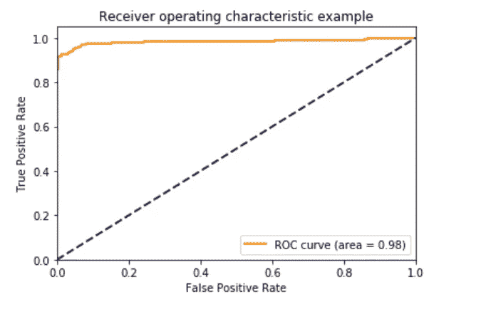
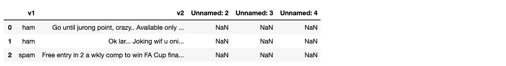
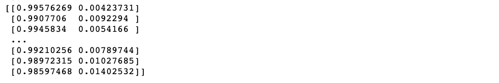
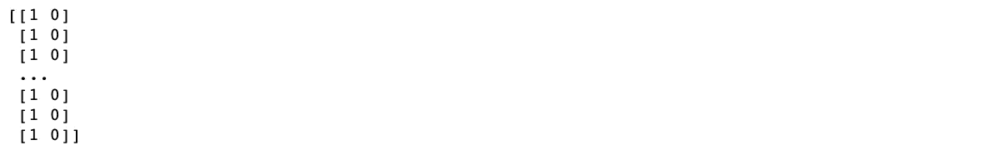
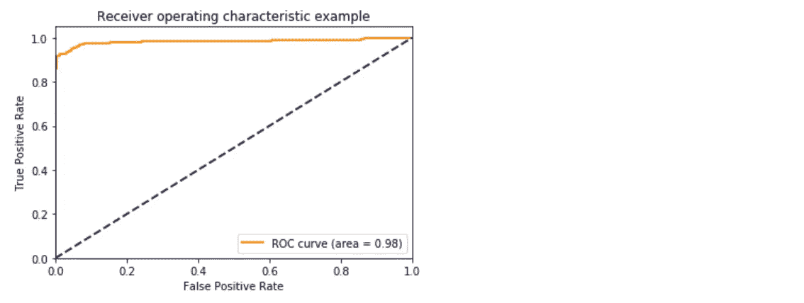
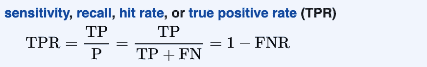
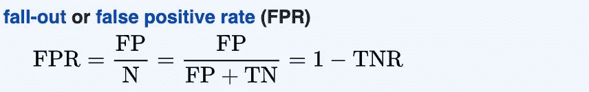

# 让我们通过预测垃圾邮件来了解 ROC AUC 曲线

> 原文：<https://towardsdatascience.com/lets-learn-about-the-roc-auc-curve-by-predicting-spam-d8007746a6f9?source=collection_archive---------24----------------------->



ROC AUC 曲线比较分类器不同分类阈值的 TPR 和 FPR。

ROC AUC 曲线通过评估模型区分不同类别的能力，帮助我们选择工作的最佳模型。

**图例:**
ROC =受试者操作曲线
AUC =曲线下面积
TPR =真阳性率
FPR =假阳性率

在深入了解这一切意味着什么之前，让我们为一个真实的例子绘制一条曲线。

# **举例:预测哪些短信是垃圾短信**

首先，从 [Kaggle](https://www.kaggle.com/uciml/sms-spam-collection-dataset) 下载数据集。

在熊猫数据框中打开它。

```
import pandas as pddf = pd.read_csv('~/Downloads/spam.csv', encoding='ISO-8859-1')
df.head(3)
```



它看起来像是格式化不良的数据。数据通常就是这样——我们会解决它。

将`v1`转换成你的标签`y`，将`v2`转换成你的特征`X`。标签需要是整数才能输入到模型中，所以`if spam`设置为`1`，而`if ham`设置为`0`。不知道的话，`ham`表示不是`spam`。

```
import numpy as npy = np.array([(1 if i=='spam' else 0) for i in df.v1.tolist()])
X = np.array(df.v2.tolist())
```

`X`现在是字符串数组，`y`是`1's`和`0's`的数组。

将数据分成测试集和训练集。请注意，数据尚未矢量化。

```
from sklearn.model_selection import StratifiedShuffleSplitsplitter = StratifiedShuffleSplit(
    n_splits=1, test_size=0.3, random_state=0
)for train_index, test_index in splitter.split(X, y):
    X_train_pre_vectorize, X_test_pre_vectorize = X[train_index], X[test_index]
    y_train, y_test = y[train_index], y[test_index]
```

安装矢量器并转换测试和训练集。

```
from sklearn.feature_extraction.text import CountVectorizervectorizer = CountVectorizer()X_train = vectorizer.fit_transform(X_train_pre_vectorize)
X_test = vectorizer.transform(X_test_pre_vectorize)
```

选择一个分类器并将其安装在训练集上。我任意选择了`LogisticRegression`。

```
from sklearn.linear_model import LogisticRegressionclassifier = LogisticRegression()
classifier.fit(X_train, y_train)
```

通常这是我们预测测试集的类的地方，但是因为我们只是对构建 ROC AUC 曲线感兴趣，跳过它。

让我们预测类的概率，并将结果转换成一个数组。

```
y_score = classifier.predict_proba(X_test)
y_score = np.array(y_score)
print(y_score)
```



The 1st index of each inner array is the probability the example’s class is 0\. The 2nd index is the probability that example’s class is 1.

下面的代码可能有点混乱。对 3 个(或更多)类使用`label_binarize()`会将单个`y`值`[2]`转换为`[0 0 1]`，或者将`[0]`转换为`[1 0 0]`，但是对仅有的 2 个类就不一样了。所以我们调用 numpy 的`hstack`来重新格式化输出。

```
from sklearn.preprocessing import label_binarizey_test_bin = label_binarize(y_test, neg_label=0, pos_label=1, classes=[0,1])y_test_bin = np.hstack((1 - y_test_bin, y_test_bin))
print(y_test_bin)
```



Our label binarized output.

生成曲线。

```
from sklearn.metrics import roc_curve, auc
import matplotlib.pyplot as pltfpr = dict()
tpr = dict()
roc_auc = dict()for i in [0,1]:
    # collect labels and scores for the current index
    labels = y_test_bin[:, i]
    scores = y_score[:, i]

    # calculates FPR and TPR for a number of thresholds
    fpr[i], tpr[i], thresholds = roc_curve(labels, scores)

    # given points on a curve, this calculates the area under it
    roc_auc[i] = auc(fpr[i], tpr[i])
```

此时，我们可以分别计算 0 类和 1 类的 ROC 曲线。但是为了简单起见，我们将把它们结合起来，生成一条曲线。

**免责声明:**这在类平衡时更有意义，否则它可能会掩盖一个事实，即模型在一个类中表现很差，而在另一个类中表现很好。但是我们还是会在这里学习如何做。

我们将使用“微平均”并对两个类别的 TPR 进行拉平，对 FPR 也是如此。会为我们做这件事。例如，`[[1,0],[0,1]]`变成了`[1,0,0,1]`

```
fpr["micro"], tpr["micro"], _ = roc_curve(y_test_bin.ravel(), y_score.ravel())
roc_auc['micro'] = auc(fpr["micro"], tpr["micro"])
```

现在画出曲线。

```
plt.figure()
lw = 2
plt.plot(fpr[1], tpr[1], color='darkorange',
         lw=lw, label='ROC curve (area = %0.2f)' % roc_auc[1])
plt.plot([0, 1], [0, 1], color='navy', lw=lw, linestyle='--')
plt.xlim([0.0, 1.0])
plt.ylim([0.0, 1.05])
plt.xlabel('False Positive Rate')
plt.ylabel('True Positive Rate')
plt.title('Receiver operating characteristic example')
plt.legend(loc="lower right")
plt.show()
```



My code for plotting was inspired by [sklearn docs](https://scikit-learn.org/stable/auto_examples/model_selection/plot_roc.html).

不错！这是一个非常棒的曲线。

橙色曲线下的面积越大，模型就能更好地区分类别。从另一个角度来看，曲线越靠近左上角越好。

# **我们所说的“不同的分类阈值”是什么意思？**

如果你习惯使用现成的 sklearn 分类器，你会知道`.predict`输出预测的类。但是您可能不知道这是基于默认的 50%分类阈值。

大多数分类器，像`LogisticRegression`都有一个叫做`predict_proba()`的方法来预测一个例子落入每个类别的概率，而不是调用`.predict()`。

使用这个你可以使用你指定的任何阈值重新计算输出的类。

# **高曲线好背后的直觉是什么？**

一个正确分类大多数例子，并且输出接近`0.0`(不是这个类)或者`1.0`(是这个类)的预测概率的模型，会有一条类似上面的曲线。

它告诉我们，改变分类阈值不会对模型的分类输出产生太大影响，因为模型非常确信每个例子要么是一个`1`要么是一个`0`。

例如，如果模型输出 SMS 消息是垃圾消息的预测概率为`0.9`，则将阈值从`0.5`改变为`0.6`对输出的类别没有影响。该模型对其输出的类非常有信心。

相反，如果模型在`0.3`到`0.7`范围内输出大多数预测概率，那么将阈值从`0.5`移动到`0.6`将改变输出的类别。你可以说像这样的模型对自己预测的分类不自信。

# **为什么是 ROC 和 AUC？**

该曲线是“ROC 曲线”,其描绘了不同阈值下的 TPR 和 FPR。

AUC 只是曲线下面积的计算。这是一种不用看曲线就可以量化模型准确性的方法，或者是在目测曲线下的区域不能给出明确的赢家时，比较两个模型之间的曲线。

# 什么是 TPR？

真实阳性率。



TPR 是 TP 数除以 TP 和 FN 之和。

**示例 1:** 预测图像是否是狗的模型。
**TP** :正确预测了一个狗的形象就是狗。
**FN:** 错误预测一个狗的形象是猫。

**例 2** :预测消息是否为垃圾邮件的模型。
**TP** :正确预测出一条垃圾短信是垃圾短信。
**FN** :错误预测垃圾短信是 HAM。

# 什么是 FPR？

假阳性率。



FPR 是 FP 的数除以 FP 和 TN 的和。

**例 1:** 一个预测图片是否是狗的模型。
**FP** :错误预测一只猫的形象是一只狗。
**TN:** 正确预测一个形象不是狗。

**例 2:** 预测消息是否为垃圾邮件的模型。
**FP** :错误地预测到一条 HAM 消息是垃圾消息。
**TN** :正确预测一条火腿消息是火腿。

# **ROC AUC 曲线做得不好的地方**

ROC 曲线不是不平衡数据集的最佳选择。当两个阶层的人数持平时，他们是最好的。否则，模型在对特定类别进行分类时表现良好，可能会掩盖模型在预测其他类别时表现不佳的事实。

# **外卖**

*   ROC AUC 曲线可以让我们深入了解模型在区分类别方面的预测能力。
*   AUC 较高的型号通常比 AUC 较低的型号性能更好。
*   ROC AUC 不是严重不平衡数据集的最佳选择。